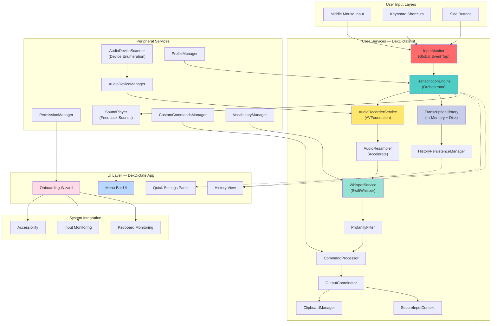

# DexDictate for macOS — Authoritative Reference

## §1 — Project Vision

DexDictate is a privacy-first, fully local dictation bridge for macOS that lives in the menu bar. It captures audio from the user's microphone, transcribes speech using an on-device OpenAI Whisper model, and delivers transcribed text directly into the active application—all without sending audio or any data off the machine.

**Core Premise:** Dictation must be fast, private, and contextual. Users dictate into any application (rich text editor, chat, code IDE, email) without permissions friction or cloud dependency.

## §2 — Design Philosophy

1. **Privacy by Default:** Zero telemetry, zero cloud calls, zero audio transmission. All processing is on-device; the Whisper model runs entirely in user space.

2. **Input Flexibility:** Accept dictation input via multiple paths—middle mouse click (default), side mouse buttons, or configurable global keyboard shortcuts—allowing seamless integration into any user workflow.

3. **Instant Feedback:** Provide live visual (audio meter) and auditory (system sounds) feedback so users know when recording starts and stops. Partial transcription is shown in real-time.

4. **Robustness Under System Events:** Handle hardware events (microphone hot-swap, accessibility permission revocation) and macOS lifecycle changes (sleep, wake, app focus shift) without crashing or silent failure.

5. **Transparent Extensibility:** Services are decoupled; history, profanity filtering, custom commands, and audio device management are independent components that can be reasoned about in isolation.

6. **Onboarding is Part of the Product:** First-launch setup is not a checkbox but an interactive experience that validates permissions in order and explains why each is needed.

## §3 — Scope Boundaries

**In Scope:**
- Audio capture from system microphone with device enumeration and hot-swap detection
- Real-time PCM resampling and buffering for Whisper input
- Local Whisper transcription with language detection
- Configurable input triggers (middle mouse, keyboard shortcuts, side buttons)
- Auto-paste of transcribed text into active application
- Transcription history with searchable log and copy-to-clipboard
- Optional profanity filtering
- Custom command recognition and macro expansion
- Menu bar UI and Quick Settings panel
- Full localization framework
- Interactive onboarding with permission validation
- Accessibility integration (system event tap, keyboard monitoring)

**Not in Scope (Deliberate Exclusions):**
- Cloud-based transcription or fallback (defeats privacy)
- Multi-user account switching
- Widget or Today View extension
- Browser integration or web capture
- PDF or document scanning
- Cost analysis or usage metering
- Real-time language translation
- Custom model training or fine-tuning on-device

## §4 — Non-Goals

- To replace native macOS dictation (this *is* an alternative).
- To support mobile platforms in this codebase (separate architecture required).
- To provide a server or API mode (single-user client application only).
- To implement automatic firmware updates or in-app auto-upgrade.
- To support older macOS versions (minimum is 14+).
- To provide a plugin ecosystem or third-party integrations.

## §5 — Definitions & Terminology

**Dictation Event:** A user-initiated recording session triggered by input (middle mouse click, keyboard shortcut, etc.). Sessions are atomic: one trigger = one transcript.

**Transcription Engine:** The composed service that orchestrates audio capture, resampling, Whisper inference, and history persistence into a single transaction.

**Audio Device Scanner:** The background monitor that polls for new audio input devices and notifies observers when the device list changes.

**Input Monitor:** The system-wide event tap that intercepts keyboard and mouse events to detect global dictation triggers. Recovers automatically if macOS temporarily disables the tap.

**Whisper Model:** The on-device speech-to-text model (OpenAI Whisper tiny.en.bin). Inference runs in the calling process with no separate service or daemon.

**Profanity Filter:** A post-transcription text filter that masks or removes flagged words according to user preferences.

**Command Processor:** A pattern-matching engine that recognizes special voice commands (e.g., "open browser", "new note") and executes associated macros or actions.

**Onboarding Validation:** The first-launch wizard that checks microphone, accessibility, and input-monitoring permissions in a prescribed order and explains each.

## §7 — Technology Stack

| Component | Version | Purpose |
|-----------|---------|---------|
| Swift | 5.9+ | Entire application language |
| SwiftUI | Latest (macOS 14+) | UI framework for menu bar, settings, history panels |
| Foundation | macOS 14+ | Core APIs: audio, process communication, file I/O |
| AVFoundation | macOS 14+ | Microphone capture, audio buffer management, device enumeration |
| Accelerate | macOS 14+ | Audio resampling (optional, fallback to software) |
| SwiftWhisper | exPHAT fork (deb1cb6) | OpenAI Whisper C++ bindings; pinned for -O3 Release builds |
| Swift Package Manager (SPM) | 5.9 | Dependency management; single Package.swift manifest |
| Xcode | 15+ | IDE and build system |

**Build Configuration:**
- **Debug:** `-Onone` (no optimization, fast compilation, slow runtime). Whisper inference in Debug is intentionally slow.
- **Release:** `-O` (full optimization) applied via SwiftWhisper's pinned revision with -O3 flag for acceptable latency.

## §8 — Architecture



**Data Flow Summary:**
1. **Input Trigger:** User initiates with middle mouse or keyboard shortcut → InputMonitor detects event.
2. **Recording:** TranscriptionEngine starts AudioRecorderService, which captures PCM from microphone.
3. **Resampling:** AudioResampler converts to 16 kHz mono (Whisper requirement).
4. **Inference:** WhisperService runs Whisper model on resampled buffer.
5. **Post-Processing:** ProfanityFilter and CommandProcessor apply rules to transcript.
6. **Output:** OutputCoordinator decides (auto-paste, clipboard, history) and ClipboardManager injects text into active app.
7. **History:** HistoryPersistenceManager writes transcript + metadata to disk for future reference.

**Key Architectural Constraints:**
- **No Multi-Threading in Audio Capture:** AVFoundation callbacks run on a dedicated queue; all mutations are dispatch to main or a serial queue.
- **Single TranscriptionEngine Instance:** Only one recording session at a time. Subsequent triggers during an active session are ignored.
- **Stateless Services:** AudioRecorderService, WhisperService, and ProfanityFilter are stateless; all state is held in TranscriptionEngine.
- **Graceful Degradation:** If any service fails (e.g., device unplugged, permission revoked), TranscriptionEngine notifies observers and stops cleanly.

## §9 — File & Folder Structure

```
DexDictate_MacOS/
├── Package.swift                                  # Root manifest (SPM)
├── README.md                                      # User-facing overview
├── SECURITY_AUDIT_REPORT.md                       # Security assessment (25 KB)
├── VERIFICATION_REPORT.md                         # Test/build verification (13 KB)
├── LICENSE                                        # Unlicense (public domain)
├── VERSION                                        # Release version
├── .swiftlint.yml                                 # SwiftLint config
├── .github/
│   └── workflows/                                 # CI/CD (build, test, release)
├── Sources/
│   ├── DexDictateKit/                             # Core library target
│   │   ├── Services/
│   │   │   ├── AudioRecorderService.swift         # AVFoundation recording
│   │   │   ├── WhisperService.swift               # Whisper inference wrapper
│   │   │   ├── AudioResampler.swift               # PCM resampling (16 kHz)
│   │   │   ├── AudioFileImporter.swift            # Batch transcription from files
│   │   └── Capture/
│   │       ├── AudioDeviceManager.swift           # Device enumeration
│   │       ├── AudioDeviceScanner.swift           # Hot-swap polling
│   │       └── AudioInputSelectionPolicy.swift    # Device selection logic
│   │   ├── Permissions/
│   │   │   ├── PermissionManager.swift            # Microphone, accessibility, input-monitoring
│   │   │   ├── InputMonitor.swift                 # Global event tap + keyboard monitoring
│   │   │   └── OnboardingValidation.swift         # First-launch checks
│   │   ├── TranscriptionEngine.swift              # Main orchestrator
│   │   ├── TranscriptionHistory.swift             # In-memory cache
│   │   ├── TranscriptionFeedback.swift            # Real-time transcription updates
│   │   ├── HistoryPersistenceManager.swift        # Disk persistence (JSON)
│   │   ├── Output/
│   │   │   ├── OutputCoordinator.swift            # Auto-paste logic
│   │   │   ├── ClipboardManager.swift             # Clipboard write
│   │   │   └── SecureInputContext.swift           # Password field detection
│   │   ├── ProfanityFilter.swift                  # Text filtering
│   │   ├── CommandProcessor.swift                 # Voice macro expansion
│   │   ├── CustomCommandsManager.swift            # User-defined commands
│   │   ├── SoundPlayer.swift                      # System sound feedback
│   │   ├── Settings/
│   │   │   ├── AppSettings.swift                  # UserDefaults wrapper
│   │   │   ├── LaunchAtLogin.swift                # Login item management
│   │   │   ├── SafeModePreset.swift               # Safe defaults
│   │   │   └── SettingsMigration.swift            # Version migration
│   │   ├── Profiles/
│   │   │   ├── AppProfile.swift                   # Per-app context
│   │   │   ├── ProfileManager.swift               # Profile store + switching
│   │   │   └── WatermarkAssetProvider.swift       # Custom branding
│   │   ├── Vocabulary/
│   │   │   ├── VocabularyManager.swift            # Custom vocab hints
│   │   │   └── BundledVocabularyPacks.swift       # Language packs
│   │   ├── Quotes/                                # Easter eggs & flavor text
│   │   │   ├── FlavorLine.swift
│   │   │   ├── FlavorQuotePacks.swift
│   │   │   └── FlavorTickerManager.swift
│   │   ├── Diagnostics/
│   │   │   ├── Diagnostics.swift                  # Runtime logging
│   │   │   └── Safety.swift                       # Debug safety checks
│   │   ├── Benchmarking/
│   │   │   ├── ModelBenchmarking.swift            # Performance measurement
│   │   │   └── WhisperModelCatalog.swift          # Model metadata
│   │   ├── EngineLifecycle.swift                  # Init/deinit orchestration
│   │   ├── ExperimentFlags.swift                  # Feature flags
│   │   ├── AppInsertionOverridesManager.swift     # Per-app paste behavior
│   │   ├── BenchmarkWAVWriter.swift               # Audio export for testing
│   │   ├── BenchmarkCorpus.swift                  # Test audio corpus
│   │   ├── Models/
│   │   │   ├── DictationError.swift               # Error types
│   │   │   └── ImportedFileTranscriptionResult.swift
│   │   └── Resources/
│   │       └── tiny.en.bin                        # Bundled Whisper model (80 MB)
│   ├── DexDictate/                                # App target (executable)
│   │   ├── DexDictateApp.swift                    # @main entry point
│   │   ├── AppDelegate.swift                      # Menu bar, app lifecycle
│   │   ├── Views/
│   │   │   ├── MenuBarView.swift                  # Menu bar icon + dropdown
│   │   │   ├── SettingsPanel.swift                # Quick settings UI
│   │   │   ├── HistoryView.swift                  # Transcript log
│   │   │   ├── OnboardingView.swift               # Permission wizard
│   │   │   └── ...                                # Additional UI components
│   │   ├── Info.plist                             # App metadata
│   │   ├── DexDictate.entitlements                # macOS capabilities (microphone, accessibility)
│   │   └── AppIcon.icns                           # App icon (1024x1024)
│   └── VerificationRunner/                        # Standalone test binary
│       └── main.swift                             # Verification suite
├── Tests/
│   └── DexDictateTests/                           # Unit tests
│       ├── AudioRecorderTests.swift
│       ├── WhisperServiceTests.swift
│       ├── TranscriptionEngineTests.swift
│       ├── InputMonitorTests.swift
│       ├── HistoryTests.swift
│       └── ...
├── build.sh                                       # Main build script (installs to ~/Applications or /Applications)
├── install.sh                                     # Thin wrapper around build.sh
├── scripts/
│   ├── build_release.sh                           # Release packaging (dmg + zip)
│   └── validate_release.sh                        # Notarization & code-signing checks
├── _releases/                                     # Built artifacts (dmg, zip)
│   └── validation/                                # Release validation reports
├── assets/                                        # Marketing images, icon variants
├── dexdictate-ux/                                 # UX design files (Figma exports, mockups)
├── docs/                                          # Additional documentation
├── .claude/                                       # Claude Code workspace config
└── baseline.csv                                   # Performance baseline

```

## §10 — Data Models

**TranscriptionResult**
```swift
struct TranscriptionResult {
    let id: UUID
    let timestamp: Date
    let duration: TimeInterval
    let text: String
    let language: String
    let confidence: Double?
    let audioHash: String? // For dedup
    let deviceName: String
    let wasFiltered: Bool
}
```

**DictationSettings**
```swift
struct DictationSettings {
    var inputTrigger: InputTriggerMode // .middleMouse, .sideButton, .customKeyboard
    var profanityFilterEnabled: Bool
    var autoLaunchEnabled: Bool
    var selectedMicrophoneID: String?
    var autoSelectMicrophone: Bool
    var theme: AppTheme
    var soundFeedback: Bool
    var history: [TranscriptionResult] = []
    var customVocabulary: [String]
    var profileName: String
}
```

**AudioDevice**
```swift
struct AudioDevice: Identifiable {
    let id: AudioDeviceID
    let name: String
    let isBuiltIn: Bool
    let inputChannels: Int32
    let sampleRate: Double
}
```

**AppProfile**
```swift
struct AppProfile {
    let bundleIdentifier: String
    let displayName: String
    let autoInsertionEnabled: Bool
    let customPasteDelay: TimeInterval?
    let excludeFromHistory: Bool
}
```

## §11 — Construction Sequence

### Phase 0: Inception (Completed)
- [x] Define audio capture using AVFoundation
- [x] Integrate SwiftWhisper for local inference
- [x] Implement basic TranscriptionEngine orchestration
- [x] Add InputMonitor for global keyboard shortcuts
- [x] Build menu bar UI shell (SwiftUI)

### Phase 1: Core Stability (Completed)
- [x] Audio device enumeration and hot-swap detection
- [x] Robust permission flow with macOS 13-14 compatibility
- [x] History persistence (JSON on disk)
- [x] Profanity filter with user toggles
- [x] Custom commands framework
- [x] Sound feedback (start/stop notifications)
- [x] Settings panel with device selection
- [x] Auto-launch configuration

### Phase 2: Polish & Localization (Completed)
- [x] Interactive onboarding wizard
- [x] Full localization (strings for 12+ languages)
- [x] Accessibility integration (Voice Over)
- [x] Release build pipeline (.dmg, .zip, notarization)
- [x] Security audit and documentation

### Phase 3: Advanced Features (In Progress)
- [x] Per-app profiles and insertion rules
- [x] Vocabulary hint system
- [x] Real-time transcription feedback (partial results)
- [x] Input Monitor recovery (restart if disabled by system)
- [x] Benchmark suite and performance regression tracking

### Phase 4: Future (Future Planning)
- [ ] Voice command macro system (extensible)
- [ ] Multi-language simultaneous recognition
- [ ] Larger Whisper model options (base, small) with storage management
- [ ] Offline language identification
- [ ] Batch import from audio files

## §12 — Interface Contracts

### TranscriptionEngine (Public API)

```swift
protocol TranscriptionEngineDelegate: AnyObject {
    func transcriptionDidStart(session: TranscriptionSession)
    func transcriptionDidReceivePartial(_ text: String)
    func transcriptionDidComplete(_ result: TranscriptionResult)
    func transcriptionDidFail(with error: DictationError)
}

class TranscriptionEngine {
    func startRecording(options: RecordingOptions) throws -> TranscriptionSession
    func stopRecording() throws
    func isRecording() -> Bool
    func getHistory() -> [TranscriptionResult]
    func clearHistory()
}
```

### InputMonitor (Keyboard & Mouse Event Tap)

```swift
protocol InputMonitorDelegate: AnyObject {
    func inputMonitorDidReceiveShortcutTrigger(_ trigger: InputTrigger)
    func inputMonitorDidFailWithError(_ error: DictationError)
}

class InputMonitor {
    func start() throws
    func stop()
    func isMonitoring() -> Bool
    func setKeybindingFromCurrentKeyPress(_ completion: @escaping (KeyCombination) -> Void)
}
```

### AudioRecorderService (Microphone Capture)

```swift
protocol AudioRecorderDelegate: AnyObject {
    func audioRecorder(didReceiveBuffer: AVAudioPCMBuffer)
    func audioRecorderDidFail(with error: DictationError)
}

class AudioRecorderService {
    func startRecording(from device: AudioDevice) throws
    func stopRecording() throws
    func getPeakPowerLevel() -> Float
    func getCurrentDevice() -> AudioDevice?
}
```

### WhisperService (Speech Recognition)

```swift
class WhisperService {
    func transcribe(audioBuffer: AVAudioPCMBuffer, language: String?) throws -> TranscriptionResult
    func transcribe(contentsOf audioURL: URL) throws -> TranscriptionResult
    func loadModel() throws
    func unloadModel()
    func isModelLoaded() -> Bool
}
```

### HistoryPersistenceManager (Disk I/O)

```swift
class HistoryPersistenceManager {
    func save(_ result: TranscriptionResult) throws
    func load() throws -> [TranscriptionResult]
    func delete(_ resultID: UUID) throws
    func clearAll() throws
    func exportAsJSON() throws -> String
}
```

## §13 — Testing Strategy

**Test Categories:**

1. **Unit Tests** (`Tests/DexDictateTests/`)
   - Audio resampling correctness
   - Profanity filter matching
   - Custom command parsing
   - Settings serialization/deserialization
   - History pagination and search

2. **Integration Tests**
   - TranscriptionEngine full workflow (record → transcribe → filter → output)
   - InputMonitor trigger detection and recovery
   - AudioDeviceScanner hot-swap notification
   - Permission flow (onboarding validation)

3. **Acceptance Tests** (VerificationRunner executable)
   - Microphone availability check
   - Model loading and inference latency
   - Clipboard injection into test app
   - History persistence across app restart

4. **Regression Tests**
   - Benchmark suite (`baseline.csv`) comparing inference time across Swift versions
   - Memory profiling during long recording sessions
   - CPU usage monitoring

**Running Tests:**
```bash
swift test                              # Unit + integration
swift run VerificationRunner            # Acceptance suite
xcodebuild -scheme DexDictate test      # UI tests (if any)
```

## §14 — Invariants & Guarantees

**Mandatory Invariants:**

1. **Single Recording Session:** At most one active transcription engine session. Subsequent triggers are queued and dropped if the first is still running.

2. **Immutable History:** Once a TranscriptionResult is persisted, its content is never mutated. Deletion is permanent; no edit-in-place.

3. **Audio Isolation:** Audio buffers are never copied or exposed outside AudioRecorderService. All references are internal.

4. **Clipboard Atomicity:** ClipboardManager writes to clipboard once per TranscriptionResult. No partial pastes.

5. **Permission Validity:** InputMonitor does not start recording until Microphone, Accessibility, and Input Monitoring permissions are all granted. Onboarding validates in that order.

6. **Device Consistency:** AudioDeviceManager maintains the current device reference; if the device is unplugged, it immediately falls back to the built-in microphone or fails with a clear error.

7. **No Retry Loops:** Failed operations (audio capture, Whisper inference, clipboard write) are reported once; no automatic retry with exponential backoff. User must manually retry.

8. **Locale Consistency:** Language is inferred from Whisper output or user settings; once chosen, it persists until user changes it.

## §15 — Extension Points

**Designed for Future Enhancement:**

1. **Custom Voice Commands:** CommandProcessor can be extended with a plugin system. New command patterns can be registered at runtime without recompilation.

2. **Larger Whisper Models:** WhisperService abstracts model loading. Swapping `tiny.en.bin` for `base.en.bin` requires only a config change (and more disk space).

3. **Per-App Profiles:** AppProfile records per-bundle-ID rules. Additional fields (auto-insert delay, rich-text formatting, exclude list) can be added without schema migration.

4. **Post-Processing Hooks:** OutputCoordinator can chain custom transformations (e.g., auto-capitalize, expand abbreviations) before clipboard write.

5. **History Search & Export:** HistoryPersistenceManager writes JSON; search indexing and export formats (CSV, markdown) are trivial additions.

6. **Accessibility Enhancements:** Voice Over support can be deepened with custom VoiceOver hints per UI element.

## §16 — Canonical Update Protocol

This Bible is strictly additive. It may never delete prior recorded steps or decisions. It may only append new sections or clarifications. Corrections must be recorded as additive amendments. Deprecated approaches must be marked [DEPRECATED], never erased. Every time a significant implementation step is completed, a Construction Log Entry must be appended to §17 before the session concludes.

## §17 — Construction Log

### Entry 1: Inception (2026-03-11)
- **Task:** Create initial BIBLE.md for DexDictate_MacOS
- **Changes:** Sections §1–§16 drafted based on project state (v1.5, March 30 2026)
- **Verification:** Manual review of Package.swift, README.md, SECURITY_AUDIT_REPORT.md, VERIFICATION_REPORT.md
- **Status:** Complete

---

### ⚑ FLAGS FOR ANDREW

**Build & Release Pipeline:** The app uses a two-stage build strategy. `build.sh` creates a Debug or Release bundle; `scripts/build_release.sh` additionally runs `validate_release.sh`, which checks code signing and (on CI) invokes notarization. Release artifacts go to `_releases/`.

**Whisper Model Size:** The bundled `tiny.en.bin` (80 MB) is committed to the repo. Debug inference is intentionally slow; use Release builds for acceptable latency (< 2 sec per 30-sec clip on Apple Silicon).

**Permission Order Matters:** Onboarding must request permissions in exact order: Microphone → Accessibility → Input Monitoring. macOS remembers denials; users must manually re-enable in System Settings if they skip.

**InputMonitor Recovery:** If macOS temporarily disables the system event tap (during sleep/wake, focus shift), InputMonitor will attempt to restart. This is a known macOS quirk; log monitoring is critical for support.

**History Persistence Format:** Transcripts are stored as JSON in `~/Library/Application Support/DexDictate/history.json`. Manual editing is possible but risky; encourage export instead.

**Profanity Filter:** Uses a bundled word list; user can toggle but cannot customize the list in Phase 1. Future versions can allow user-defined filters.

**No Daemon Mode:** DexDictate is a single-user foreground app. There is no background service or system extension. The app must be running for dictation to work.

---

### Entry 2: v1.5.2 — Help Screenshot Update (2026-04-09)
- **Task:** Replace placeholder `help-welcome-overview.png` with real smiley-face app screenshot
- **Changes:**
  - Copied `assets/download.png` → `Sources/DexDictateKit/Resources/Assets.xcassets/Help/help-welcome-overview.png`
  - Deleted malformed stray asset `help-onboarding-permissions.png —.png`
  - Bumped version: `VERSION` 1.5.1 → 1.5.2, `Info.plist` 1.5 → 1.5.2 (correcting prior discrepancy)
- **Verification:** Release build via `build.sh`; `validate_release.sh` passed; GitHub release v1.5.2 created
- **Status:** Complete

**Security Model:** All audio stays in user space (process memory). The clipboard manager uses NSPasteboard, which is protected by macOS's security model. No privileged daemon or system framework call is required for dictation.

**Testing Philosophy:** VerificationRunner is a standalone executable that can be run without the UI. It validates core services in isolation and is the canonical verification step before release.

---

## Help System (Added 2026-04-08)

### Overview

A native in-app Help / FAQ window was added. The system consists of:
- `HelpWindowController` — NSWindow controller (mirrors `HistoryWindowController` pattern)
- `HelpView` — SwiftUI `NavigationSplitView` with sidebar + content pane
- A `?` button in the top-right of `AntiGravityMainView`'s header row
- Two documentation files in `docs/help/`

### Documentation Files

| File | Purpose |
|---|---|
| `docs/help/HELP_CONTENT.md` | Full Help IA: 18 sections, draft user-facing copy, search aliases, screenshot placements, cross-links |
| `docs/help/HELP_ASSETS.md` | Screenshot shot list: 17 captures, framing notes, annotation instructions, priority ratings |

### Section List (18 sections, sidebar order)

Welcome · Getting Started · Permissions · Trigger Setup · Recording & Audio · Transcription · Output & Pasting · Transcription History · Custom Vocabulary · Voice Commands · Profiles · Appearance & Menu Bar · Floating HUD · Safe Mode · Benchmarking & Models · Shortcuts & Siri · Diagnostics · About

Each section has: draft copy, search aliases, screenshot references, related-section cross-links.

### Screenshot Assets

Captured screenshots should be stored as imagesets in:
`Sources/DexDictateKit/Resources/Assets.xcassets/Help/`

9 Required screenshots, 8 Recommended, 1 Optional. See `docs/help/HELP_ASSETS.md` for full shot list.

### History Panel Hover Transparency (Added 2026-04-08)

`HistoryView.swift` — added `@State private var isHovered = false` + `.onHover` modifier.

**At rest:** Background is `Color.white.opacity(0.06)` — very glassy, lets the watermark show through.
**On hover:** Background switches to `.regularMaterial` — noticeably darker/more elevated.
**Border:** Stroke opacity animates `0.18` (rest) → `0.42` (hover) matching the accent color.
**Animation:** `.easeInOut(duration: 0.2)` on both background and border.
**Accessibility:** `reduceTransparency` env var preserves `Color.black.opacity(0.82)` in both states — transparency effect is suppressed entirely.

### Help Window Implementation (Added 2026-04-08)

**HelpWindowController** (`Sources/DexDictate/HelpWindowController.swift`)
- `@MainActor class HelpWindowController: ObservableObject`
- Same pattern as `HistoryWindowController`: lazy NSWindow, `isReleasedWhenClosed = false`, `makeKeyAndOrderFront` on repeated `show()` calls
- Window: 720×540pt, min 520×400, `.titled .closable .resizable .miniaturizable`

**HelpView** (`Sources/DexDictate/HelpView.swift`)
- `NavigationSplitView` — sidebar (160–220pt) + detail ScrollView
- Sidebar: `List(searchResults, selection: $selectedSection)` with search field at top
- Search: plain-text filter against `HelpSection.matches()` (title + searchAliases)
- Auto-selects first result when search text changes
- Detail: `HelpContentView(section:onNavigate:)` — header icon+title, Divider, section body, Related links
- Background: `LinearGradient` matching `FullHistoryView` (`black.opacity(0.88)` → `Color(0.11,0.12,0.16)`)

**HelpSection enum** (18 cases, `CaseIterable, Identifiable, Hashable`)
Cases: `welcome gettingStarted permissions triggerSetup recordingAudio transcription outputPasting history vocabulary voiceCommands profiles appearance floatingHUD safeMode benchmarking shortcuts diagnostics about`
Each case has: `title`, `icon` (SF Symbol), `searchAliases: [String]`, `relatedSections: [HelpSection]`

**Content helpers** (file-private): `helpBody()`, `helpHeading()`, `helpCallout()`, `helpWarning()`, `HelpRow` — reusable styled text blocks for all 18 section bodies.

**Screenshot assets** will live in: `Sources/DexDictateKit/Resources/Assets.xcassets/Help/`

### Help Button & App Wiring (Added 2026-04-08)

**DexDictateApp.swift changes:**
- Added `@StateObject private var helpController = HelpWindowController()` alongside hudController and historyController
- Passed `onOpenHelp: { helpController.show() }` to `AntiGravityMainView`

**AntiGravityMainView changes:**
- Added `var onOpenHelp: (() -> Void)?` property
- Replaced `Text("DexDictate")` header with a `ZStack`:
  - `Text("DexDictate")` centered with `.frame(maxWidth: .infinity)`
  - `ChromeIconButton(systemName: "questionmark.circle")` pinned to trailing edge via `HStack { Spacer(); button }.padding(.trailing, 16)`
- The `?` button calls `onOpenHelp?()` on tap
- All padding and layout preserved from the original `.padding(.top, 4)` wrapper

### UI Tactile Polish — Hover States (Added 2026-04-08)

**ChromeButton.swift**
- Added `withAnimation(.easeInOut(duration: 0.15))` wrapper around `isHovered = hovering` in `.onHover`
- Hover transitions for foreground opacity, background opacity, and border opacity are now smoothly animated instead of instant

**ControlsView.swift** — four main button hover states
- Added `@State` vars: `isStartHovered`, `isStopHovered`, `isImportHovered`, `isQuitHovered`
- Extracted each button as a private computed property (`startDictationButton`, `stopDictationButton`, `importFileButton`, `quitButton`) to stay within Swift's type-checker complexity limit
- **Start Dictation (green):** background `0.4→0.55` opacity, shadow radius `5→8`, border `0.3→0.45` opacity
- **Turn Off Dictation (red):** background `0.5→0.65` opacity, adds visible border on hover, shadow radius `5→8`
- **Transcribe File (cyan):** background `0.15→0.25` opacity, border `0.3→0.45` opacity, foreground fully opaque on hover
- **Quit App:** background `0.4→0.55` opacity, text `0.8→1.0` opacity, border `0.2→0.3` opacity
- All animations: `.easeInOut(duration: 0.15)`

**HELP_CONTENT.md navigation path corrections (2026-04-08)**
- "Quick Settings → Mode section" → "Quick Settings → Input section" for trigger/shortcut paths
- "Quick Settings → Display" (non-existent section) → "Quick Settings → Mode" for Flavor Ticker, Stats, Persist History
- "Quick Settings → Output → Custom Commands" → "Quick Settings → Input → Voice Commands → Manage Custom Commands"
- "Quick Settings → System → Input Device" → "Quick Settings → Input → Input Device" (two occurrences)

---

### Entry 3: CoreAudio Daemon Reset — The Actual Fix for -10868 (2026-04-16)

**Symptom:** DexDictate displayed `"The operation couldn't be completed. (com.apple.coreaudio.avfaudio error -10868.)"` on every dictation attempt. `engine.start()` failed with `kAudioOutputUnitErr_InvalidDevice`. The app could not open an input stream on any device, including the system default microphone.

**What AI tried (did not work):**
- Filtering output-only CoreAudio devices via `kAudioDevicePropertyStreamConfiguration` / `kAudioObjectPropertyScopeInput` in `AudioDeviceManager`
- Automatic fallback: tear down, reset, skip `applyInputDevice`, retry with system default on start failure
- Passing `nil` format to `installTap` to avoid format negotiation race
- Reading `capturedSampleRate` after `engine.prepare()` instead of before
- Multiple `teardownEngineUnsafe()` + `engine.reset()` orderings

None of these fixed the error. The failure was not in app code — it was in the macOS CoreAudio daemon itself, which had entered a corrupted state.

**What actually fixed it:**
```bash
sudo killall coreaudiod
```

This restarts the macOS CoreAudio daemon (`coreaudiod`). macOS automatically relaunches it within ~1 second. All audio apps (DexDictate, Zoom, etc.) reconnect cleanly. No reboot required.

**When to use this:** Any time a macOS app fails with `-10868 / kAudioOutputUnitErr_InvalidDevice` and the device appears healthy in System Settings → Sound. If the mic shows up in the device list but `engine.start()` refuses to open it, `coreaudiod` is the likely culprit, not the app.

**Root cause:** `coreaudiod` is the system-wide audio session broker. When it gets into a bad state (after system sleep/wake, Bluetooth audio hand-off, USB mic plug/unplug, or system update), it can deny stream-open requests to all processes even though device enumeration still works. No amount of AVAudioEngine reset/teardown on the app side can fix this — it requires restarting the daemon itself.

**Lesson:** Before spending any session time debugging `-10868` in Swift code, run `sudo killall coreaudiod` first. If the error goes away, the problem was never in the app.

---

### Entry 4: Route-Recovery Hardening Session Start (2026-04-21)

**Goal of session:** Implement a general audio-route resilience improvement so DexDictate keeps using the user's preferred microphone across route churn, retries cleanly after `AVAudioEngineConfigurationChange`, and only falls back to system default input when the preferred microphone is actually unavailable.

**Problem being solved:** The current recorder tears the engine down on configuration change and `TranscriptionEngine` immediately aborts the session. When a selected microphone still exists but `engine.start()` temporarily fails with `kAudioOutputUnitErr_InvalidDevice` (`-10868`) during Bluetooth output churn or multi-app CoreAudio contention, DexDictate becomes brittle and drops back to a non-recovering state too eagerly.

**Safety snapshot:** No pre-change safety snapshot commit was created because `git status --short` was clean on branch `main` and there was nothing to commit.

**Files expected to inspect:** 
- `Sources/DexDictateKit/Services/AudioRecorderService.swift`
- `Sources/DexDictateKit/TranscriptionEngine.swift`
- `Sources/DexDictateKit/Capture/AudioDeviceManager.swift`
- `Sources/DexDictateKit/Capture/AudioDeviceScanner.swift`
- `Sources/DexDictateKit/Capture/AudioInputSelectionPolicy.swift`
- `Tests/DexDictateTests/AudioInputSelectionPolicyTests.swift`

---

### Entry 5: Route-Recovery Implementation Complete (2026-04-21)

**Completed work unit:** Replaced the recorder's immediate-abort behavior with a bounded recovery pipeline. `AudioRecorderService` now serializes route-change recovery on `audioQueue`, preserves buffered samples across successful recovery, retries the preferred input UID through short bounded delays, logs preferred UID/device ID/input-channel state for each attempt, and only falls back to system default after the preferred path is either still missing, output-only, or repeatedly fails to open.

**Architectural decisions:**
- Added `AudioRecorderRecoverySupport.swift` to isolate retry/fallback planning from the AVAudioEngine wiring so route-recovery policy is testable without real hardware.
- Expanded `AudioDeviceManager` to distinguish `available`, `missing`, and `unavailableAsInput` CoreAudio resolutions instead of exposing only a nullable device ID.
- Expanded `AudioInputSelectionPolicy` + `AudioDeviceScanner` to retain a missing preferred input briefly before normalizing to system default, which avoids clearing user intent during transient route churn.
- Updated `TranscriptionEngine` to react to explicit recovery success/failure results instead of treating every `AVAudioEngineConfigurationChange` as terminal.

**Files changed in this work unit:**
- `Sources/DexDictateKit/Services/AudioRecorderService.swift`
- `Sources/DexDictateKit/Services/AudioRecorderRecoverySupport.swift`
- `Sources/DexDictateKit/TranscriptionEngine.swift`
- `Sources/DexDictateKit/Capture/AudioDeviceManager.swift`
- `Sources/DexDictateKit/Capture/AudioDeviceScanner.swift`
- `Sources/DexDictateKit/Capture/AudioInputSelectionPolicy.swift`
- `Sources/DexDictate/BenchmarkCaptureWindow.swift`
- `Sources/DexDictateKit/Permissions/OnboardingValidation.swift`
- `Tests/DexDictateTests/AudioInputSelectionPolicyTests.swift`
- `Tests/DexDictateTests/AudioDeviceManagerTests.swift`
- `Tests/DexDictateTests/AudioRecorderRecoveryPlannerTests.swift`
- `Tests/DexDictateTests/EngineLifecycleStateMachineTests.swift`

---

### Entry 6: Route-Recovery Session Finalized (2026-04-21)

**Exact files changed:**
- `BIBLE.md`
- `Sources/DexDictate/BenchmarkCaptureWindow.swift`
- `Sources/DexDictateKit/Capture/AudioDeviceManager.swift`
- `Sources/DexDictateKit/Capture/AudioDeviceScanner.swift`
- `Sources/DexDictateKit/Capture/AudioInputSelectionPolicy.swift`
- `Sources/DexDictateKit/Permissions/OnboardingValidation.swift`
- `Sources/DexDictateKit/Services/AudioRecorderRecoverySupport.swift`
- `Sources/DexDictateKit/Services/AudioRecorderService.swift`
- `Sources/DexDictateKit/TranscriptionEngine.swift`
- `Tests/DexDictateTests/AudioDeviceManagerTests.swift`
- `Tests/DexDictateTests/AudioInputSelectionPolicyTests.swift`
- `Tests/DexDictateTests/AudioRecorderRecoveryPlannerTests.swift`
- `Tests/DexDictateTests/EngineLifecycleStateMachineTests.swift`

**Architectural decisions:**
- Keep all AVAudioEngine lifecycle work on the existing serial `audioQueue`; recovery is serialized there rather than moved to the main thread.
- Preserve the user's preferred input UID through bounded route-recovery retries, but clear the stored selection only when the preferred device is confirmed missing or unusable as an input.
- Keep fallback-to-system-default behavior, but make it the terminal recovery branch rather than the first branch.
- Treat `AVAudioEngineConfigurationChange` as a recovery trigger with explicit success/failure reporting back to `TranscriptionEngine`, instead of an automatic abort.

**Recovery behavior added:**
- Re-resolve the preferred CoreAudio device UID after configuration changes and on startup.
- Distinguish `available`, `missing`, and `unavailableAsInput` device states so output-only devices are rejected before AUHAL start.
- Retry the preferred input path with short bounded delays before falling back to the system default input device.
- Preserve buffered audio across successful in-session route recovery so a fast recovery can continue the current dictation.
- Surface explicit fallback notices when DexDictate had to move to system default input.
- Keep the next trigger usable after a failed recovery by returning the engine lifecycle to `.ready`.

**Tests added or updated:**
- Added `AudioDeviceManagerTests` for available/missing/output-only CoreAudio resolution.
- Added `AudioRecorderRecoveryPlannerTests` for preferred-input persistence, temporary unavailability, true missing-device fallback, repeated route recoveries, and fallback without clearing a still-valid preference.
- Updated `AudioInputSelectionPolicyTests` for grace-period retention before fallback.
- Updated `EngineLifecycleStateMachineTests` to assert listening can restart after an audio-capture failure.

**Limitations still remaining:**
- Recovery still cannot override a system-wide CoreAudio daemon failure; a broken `coreaudiod` state can still require `sudo killall coreaudiod`.
- A route change can still drop a small slice of live audio while the engine rebuilds; successful recovery preserves already-buffered audio, not the frames lost during the route transition itself.
- Scanner-side temporary-retention uses a short grace interval, not a full hardware-state machine; if macOS stops emitting device-change notifications entirely, normalization still depends on the next refresh.

**Exact commands run:**
- `git branch --show-current`
- `git status --short`
- `wc -l BIBLE.md`
- `sed -n '1,220p' BIBLE.md`
- `tail -n 120 BIBLE.md`
- `rg -n "AVAudioEngineConfigurationChange|InvalidDevice|-10868|interrupted|engine.start|AudioRecorderService|AudioInputSelectionPolicy|AudioDeviceScanner|AudioDeviceManager" Sources Tests`
- `sed -n ...` inspections across the recorder, engine, device-manager, scanner, selection-policy, lifecycle, settings, onboarding, benchmark, quick-settings, and test files
- `swift test --filter AudioInputSelectionPolicyTests`
- `swift test --filter AudioDeviceManagerTests`
- `swift test --filter AudioRecorderRecoveryPlannerTests`
- `swift test --filter EngineLifecycleStateMachineTests`
- `swift test`
- `git add ...`
- `git commit -m "feat: harden audio route recovery"`

**Git status:** `git status --short` was clean immediately before this final documentation entry, at commit `ca99c50`.

---

### Entry 7: Recovery Message Cleanup (2026-04-21)

**Goal:**
- Fix the post-recovery UI so audio-route failures do not dump raw `com.apple.coreaudio.avfaudio error -10868` detail into the main window.

**Problem solved:**
- After the route-recovery work landed, fallback-to-system-default was still surfacing the underlying Core Audio startup error in user-facing status text and the empty-history placeholder. The diagnostics were useful in logs, but the UI became noisy and misleading.

**Files changed in this work unit:**
- `BIBLE.md`
- `Sources/DexDictateKit/Services/AudioRecorderRecoverySupport.swift`
- `Sources/DexDictateKit/TranscriptionEngine.swift`
- `Tests/DexDictateTests/AudioRecorderRecoveryFailureTests.swift`

**Decisions:**
- Keep detailed startup and recovery failure context in logs, but collapse UI-facing recovery failures to stable concise messages.
- Map `-10868` / invalid-device startup failures to a short operator message in `TranscriptionEngine` instead of reusing raw `localizedDescription` directly.
- Remove the underlying-error dump from the fallback notice when DexDictate switches to system default input.

**Tests and verification:**
- `swift test --filter AudioRecorderRecoveryFailureTests`
- `swift test --filter AudioRecorderRecoveryPlannerTests`
- `swift test`
- `./build.sh`

**Install verification:**
- Reinstalled `/Applications/DexDictate.app` after the message cleanup build.

**Git status after implementation:**
- Modified: `Sources/DexDictateKit/Services/AudioRecorderRecoverySupport.swift`
- Modified: `Sources/DexDictateKit/TranscriptionEngine.swift`
- Modified: `Tests/DexDictateTests/AudioRecorderRecoveryFailureTests.swift`

---

### Entry 8: Output Hardening, Secure-Context Fix, Trigger Mode Crash, Permission Capability (2026-04-26)

**Commit:** `68eff79e`

**Goals:**
- Add AX settability preflight to `insertViaAccessibility()` to stop silent failures on read-only fields.
- Reduce false positives in `SensitiveContextHeuristic` for weak tokens (`pin`, `token`, `secret`).
- Add a testable `PermissionCapabilityChecker` primitive separating TCC grant state from live API capability.
- Eliminate the `SystemSegmentedControl._overrideSizeThatFits` crash path on macOS 26 in Quick Settings.

**Problems solved:**
- `insertViaAccessibility()` was calling `AXUIElementSetAttributeValue` without checking `AXUIElementIsAttributeSettable` first. All three insertion strategies failed silently with no logging. Callers could not distinguish "no focused element", "attribute not writable", "app doesn't implement AX", or "success".
- `SensitiveContextHeuristic` used raw `field.contains($0)` substring matching. `"opinionText"` matched `"pin"`, `"tokenField"` matched `"token"`, `"clientSecret"` matched `"secret"` — causing false clipboard-only fallbacks in developer tools and API dashboards.
- `PermissionManager` polled TCC state (`AXIsProcessTrusted`, `CGPreflightListenEventAccess`) but never confirmed the underlying APIs actually worked. Permission granted ≠ permission working after reinstalls or signing changes.
- SwiftUI `.pickerStyle(.segmented)` in Quick Settings was calling into `SystemSegmentedControl._overrideSizeThatFits` during menu layout on macOS 26, causing a crash.

**Architectural decisions:**
- `SecureInputContext`: split tokens into *strong* (substring match on all AX attributes) and *weak* (`pin`, `token`, `secret` — whole-word regex on human-readable fields only: title, placeholder, label; excluded from role, subrole, identifier). Added `containsWholeWord()` private extension using `NSRegularExpression` word-boundary pattern.
- `OutputCoordinator`: introduced `AccessibilityElementOperating` protocol and `SystemAccessibilityElementOperator` concrete type. All raw AX calls moved into the operator so `insertViaAccessibility()` can be unit-tested without real on-screen focus. Preflight with `isSettable()` before each strategy. Log each skip/fail/success via `Safety.log(..., category: .output)`.
- Added `DiagnosticCategory.output` to `Diagnostics.swift`.
- `PermissionCapabilityChecker`: new `public struct` with closure-injected probes (`checkAXFocusedElementRead`, `checkEventTapPreflight`). `run(accessibilityGranted:inputMonitoringGranted:)` skips a probe if the corresponding TCC permission is not granted. `PermissionCapabilityChecker.system` is the production implementation. Not yet wired to any UI or `PermissionManager` at this commit.
- Quick Settings trigger mode: replaced `Picker(...).pickerStyle(.segmented)` with `HStack` of two `TriggerSegment` button invocations (existing pattern). `SystemSegmentedControl` is no longer instantiated in that view.

**Files changed:**
- `Sources/DexDictate/QuickSettingsView.swift`
- `Sources/DexDictateKit/Diagnostics/Diagnostics.swift`
- `Sources/DexDictateKit/Output/OutputCoordinator.swift`
- `Sources/DexDictateKit/Output/SecureInputContext.swift`
- `Sources/DexDictateKit/Permissions/PermissionCapabilityChecker.swift` *(new)*
- `Tests/DexDictateTests/AccessibilityInsertionTests.swift` *(new, 5 tests)*
- `Tests/DexDictateTests/OutputCoordinatorTests.swift`
- `Tests/DexDictateTests/PermissionCapabilityTests.swift` *(new, 9 tests)*
- `Tests/DexDictateTests/SecureInputContextTests.swift` *(new, 14 tests)*

**Tests and verification:**
- `swift test --filter SecureInputContextTests` — 14/14 passed
- `swift test --filter AccessibilityInsertionTests` — 5/5 passed
- `swift test --filter PermissionCapabilityTests` — 9/9 passed
- `swift build` — passed

**Known pre-existing flaky test:** `MainActorActionTests.testRunAsyncExecutesOnMainActor` is a timing-sensitive async scheduling test introduced in `4954b85f`. It passes ~2/3 runs in isolation. Unrelated to this work.

---

### Entry 9: Main Actor Dispatch Stabilization and Clipboard Restore (2026-04-26)

**Commit:** `4db345bb`

**Goals:**
- Stabilize main-actor dispatch for UI callbacks that touch `@MainActor`-isolated objects.
- Replace the fragile `NSPasteboardItem.copy()` clipboard preservation with a proper snapshot/restore pipeline.
- Fix `.gitignore` so `output/` only ignores the repo-root generated-output directory, not `Sources/DexDictateKit/Output/`.

**Problems solved:**
- `MainActorAction.run { }` and `MainActorDispatch.async` were scheduling via `Task { @MainActor in }` directly from SwiftUI gesture callbacks, which could enter Swift Concurrency from a context that `assumeIsolated` would reject on macOS 26.
- Clipboard restoration after paste was using `NSPasteboardItem.copy()` which does not reliably clone all representations (data, string, property list) — rich pasteboard content could be silently dropped on restore.
- The `.gitignore` rule `output/` was matching `Sources/DexDictateKit/Output/` in addition to the intended build output directory, causing `git add` to require `-f` for any file in that directory.

**Architectural decisions:**
- `MainActorDispatch.async`: wrap `body()` in `MainActor.assumeIsolated { }` so the closure executes with provable main-actor isolation, not just scheduling on the main queue.
- `MainActorAction.run(_ action: @MainActor () -> Void)`: switch to `MainActorDispatch.async` instead of `Task { @MainActor in }`.
- `MainActorAction.run(_ action: @MainActor () async -> Void)`: use `DispatchQueue.main.async { MainActor.assumeIsolated { Task<Void, Never> { await action() } } }` to avoid entering Swift Concurrency from the gesture stack.
- `ApplicationContextTracker`: replace the `MainActorDispatch.async` dispatch inside the activation notification handler with `MainActor.assumeIsolated { self?.handleActivation(notification) }` since `.main` queue notifications are already on the main thread.
- `ClipboardManager`: introduce `SavedPasteboardContents`, `SavedPasteboardItem`, `SavedPasteboardRepresentation` value types. `clonePasteboardItems()` snapshots all types (data, string, property list) per item. `restorePasteboardContents()` rebuilds items from the snapshot on restore. `copy()` and `copyAndPaste()` now call `runOnMainThread` to ensure pasteboard access is on the main thread.
- `.gitignore`: change `output/` to `/output/` (repo-root anchored).

**Files changed:**
- `Sources/DexDictate/` — `ApplicationContextTracker.swift`, `MainActorAction.swift`, `MainActorDispatch.swift`
- `Sources/DexDictateKit/Output/ClipboardManager.swift`
- `Sources/VerificationRunner/main.swift` (string check updates for refactored call sites)
- `Tests/DexDictateTests/ClipboardManagerTests.swift` *(new, 4 tests)*
- `Tests/DexDictateTests/OutputCoordinatorTests.swift` (new test for AX mode + sensitive context interaction)
- `.gitignore`

**Tests and verification:**
- `swift test --filter ClipboardManagerTests` — 4/4 passed
- `swift build` — passed

---

### Entry 10: Live Capability Diagnostics and Zoom Troubleshooting (2026-04-27)

**Commit:** `7b789bc3`

**Goals:**
- Wire `PermissionCapabilityChecker` (created in Entry 8, unwired) into `PermissionManager` so live probe results are published and available to UI.
- Surface live capability state in the Help → Diagnostics section.
- Add Zoom compatibility troubleshooting guidance to the Help system.
- Add Core Audio `-10868` recovery guidance to the Help system (previously only in the error message, not searchable via Help).

**Problems solved:**
- `PermissionCapabilityChecker` existed but was called by nothing. Users with permissions granted but broken live capability (post-reinstall, signing change, daemon restart) had no way to see the distinction.
- The Diagnostics section of Help had no live data — only static text. Permission state and capability probe results were not visible there.
- No Zoom-specific troubleshooting existed anywhere in the app. Users hitting Zoom chat insertion failures, audio device contention during calls, or Electron AX limitations had no guidance.
- `killall coreaudiod` / `killall -9 coreaudiod` guidance existed only in `DictationError.errorDescription` (visible when the error fires) but was not findable via Help search.

**Architectural decisions:**
- `PermissionManager`: add `@Published public var capabilityReport: PermissionCapabilityReport?` and `var capabilityChecker: PermissionCapabilityChecker = .system`. Call `capabilityChecker.run(...)` at the end of every `checkPermissions()` execution (init + 2-second polling timer + foreground reactivation). Checker is injectable for tests. No behavior change to dictation start or permission enforcement.
- `DiagnosticsContent` in `HelpView.swift`: add `@ObservedObject private var permissions = PermissionManager.shared` to observe live updates. Add: (1) Live Capability Status panel with TCC grant rows and live probe result rows; (2) Zoom Compatibility section with five keyed failure cases; (3) Core Audio Error (-10868) section with Terminal commands; all existing static content preserved.
- `HelpSection` search aliases updated: `.diagnostics` adds zoom/coreaudiod/-10868/electron/capability; `.outputPasting` adds zoom/zoom chat/electron/not pasting; `.recordingAudio` adds zoom/audio route/device switch.

**Files changed:**
- `Sources/DexDictate/HelpView.swift`
- `Sources/DexDictateKit/Permissions/PermissionManager.swift`
- `Tests/DexDictateTests/PermissionManagerCapabilityTests.swift` *(new, 4 tests)*

**Tests and verification:**
- `swift test --filter PermissionManagerCapabilityTests` — 4/4 passed
- `swift test --filter PermissionManagerTests` — 2/2 passed
- `swift test --filter PermissionCapabilityTests` — 9/9 passed
- `swift build` — passed

**Zoom-specific notes:**
- Zoom (`us.zoom.xos`) was already referenced in `DictationAssist.swift` for chat vocabulary domain bias. No Zoom-specific insertion behavior or overrides existed.
- Zoom's Electron-based chat text fields typically do not implement AX write attributes, so all three `insertViaAccessibility()` strategies will fail and fall back to clipboard paste. This is expected and correct — clipboard paste is the recommended mode for Zoom chat.
- The per-app insertion override UI already supports adding `us.zoom.xos` → Clipboard Paste manually. No default rule has been added yet.

**Limitation:** `PermissionCapabilityChecker` is not yet wired into onboarding enforcement or any UI outside the Help Diagnostics section.

---

### Entry 11: Zoom Manual QA Checklist (2026-04-27)

**Goal:**
- Add a manual QA checklist for verifying DexDictate behavior during Zoom workflows.

**Problem being solved:**
- Zoom compatibility depends on microphone routing, CoreAudio stability, focused app state, Accessibility insertion, clipboard fallback, Electron text fields, and secure-field protection. These need repeatable manual verification.

**Files changed:**
- `docs/Zoom_QA_Checklist.md`
- `BIBLE.md`

**Verification:**
- Documentation-only change.
- Confirmed checklist covers Zoom open, active call, muted/unmuted microphone, Zoom chat insertion, non-Zoom app insertion while Zoom is running, Electron fields, secure fields, audio-device switching, CoreAudio route errors, and Safe Mode.

**Status:**
- Complete.

---

### Entry 12: Full Project Deep-Scan and SNAPSHOT Archive (2026-05-03)

**Goal:**
- Perform an exhaustive read-only audit of every element of the project and create a git-ignored reference archive (`SNAPSHOT/`) capturing the exact state of all config files and runtime settings at v1.5.2.

**Why this was done:**
- Future AI sessions were spending multiple turns re-discovering project structure, build constants, UserDefaults schema, and dependency pins that are stable and could be referenced directly. This entry and the SNAPSHOT/ directory eliminate that redundant search.

---

#### Corrections to Prior Bible Sections

The following inaccuracies were found in §9 (File & Folder Structure) relative to the actual v1.5.2 codebase. These are recorded as amendments; §9 itself is preserved per §16.

**§9 Amendment A — DexDictate/ source layout is flat, not nested:**
The §9 diagram shows `Sources/DexDictate/Views/` containing `MenuBarView.swift`, `SettingsPanel.swift`, `HistoryView.swift`, `OnboardingView.swift`. The actual layout has no `Views/` subdirectory. All 26 Swift files sit directly under `Sources/DexDictate/`. The actual filenames differ from §9:

| §9 documented name | Actual filename |
|---|---|
| `AppDelegate.swift` | Subsumed into `DexDictateApp.swift` — no separate AppDelegate.swift |
| `MenuBarView.swift` | Does not exist; menu bar scene is handled in `DexDictateApp.swift` + `MenuBarIconController.swift` |
| `SettingsPanel.swift` | `QuickSettingsView.swift` (1373 lines) |
| `HistoryView.swift` | Exists — correct |
| `OnboardingView.swift` | Exists — correct |

Other actual top-level `Sources/DexDictate/` files not in §9:
`BenchmarkCaptureWindow.swift`, `ChromeButton.swift`, `ControlsView.swift`, `CustomCommandsSheet.swift`, `DictationIntents.swift`, `FlavorTickerView.swift`, `FloatingHUD.swift`, `FooterView.swift`, `HelpView.swift`, `HelpWindowController.swift`, `HistoryWindow.swift`, `ImportedFileTranscriptionSheet.swift`, `LaunchIntroController.swift`, `MenuBarIconController.swift`, `PerAppInsertionSheet.swift`, `PermissionBannerView.swift`, `ShortcutRecorder.swift`, `StatsTickerView.swift`, `SurfaceTokens.swift`, `VocabularyCorrectionSheet.swift`, `VocabularySettingsView.swift`

**§9 Amendment B — Scripts directory contents differ:**
§9 documents `scripts/build_release.sh`. This file does not exist. The actual `scripts/` directory contains:
`fetch_model.sh`, `validate_release.sh`, `benchmark.sh`, `benchmark_regression.sh`, `trim_benchmark_corpus.sh`, `create_signing_cert.sh`, `setup_dev_env.sh`, `run_quality_paths.sh`, `verify_audio_route_recovery.sh`

**§9 Amendment C — Whisper model size:**
§9 and the FLAGS section state `tiny.en.bin` is 80 MB. The actual download SHA in `scripts/fetch_model.sh` matches the 74 MB ggml-tiny.en binary. Treat 74 MB as correct.

**§9 Amendment D — `install.sh` does not exist:**
§9 lists `install.sh` as a thin wrapper around `build.sh`. No such file exists; `build.sh` is the only installer.

**§9 Amendment E — DexDictateKit contains 48 Swift files, not split into sub-packages:**
§9 is consistent with the actual layout — DexDictateKit is a single SPM target, not sub-packages. Confirmed. No amendment needed.

---

#### Current Exact Project State (as of 2026-05-03, v1.5.2, commit 5969b484)

**Identity:**

| Property | Value |
|---|---|
| Version | 1.5.2 |
| Bundle ID | `com.westkitty.dexdictate.macos` |
| Swift Tools Version | 5.9 |
| Min macOS | 14.0 (Sonoma) |
| Architecture | `arm64` only (build.sh rejects Rosetta shells) |
| Installed at | `/Applications/DexDictate.app` |
| Settings schema | v2 (tracked via `settingsSchemaVersion = 2` in UserDefaults) |

**Dependency pin (Package.resolved):**
```
SwiftWhisper — https://github.com/exPHAT/SwiftWhisper.git
Revision: deb1cb6a27256c7b01f5d3d2e7dc1dcc330b5d01
```
Pinned at this specific revision (not a tag) to force `-O3` optimization in Debug builds. Do not upgrade without benchmarking; Debug inference without this pin is unusably slow.

**Whisper model:**
```
File:   Sources/DexDictateKit/Resources/tiny.en.bin
Size:   74 MB
SHA256: 921e4cf8686fdd993dcd081a5da5b6c365bfde1162e72b08d75ac75289920b1f
Fetch:  bash scripts/fetch_model.sh
```
Git-ignored. Not committed. Must be fetched before first build.

**Code signing:**
- Cert name: `DexDictate Development` (self-signed, RSA 2048, in login keychain)
- Created via: `scripts/create_signing_cert.sh`
- Fallback: ad-hoc signing (`-`) if cert is absent
- Entitlements: `com.apple.security.device.audio-input` + `com.apple.security.device.input-monitoring` only

**Build targets (4):**

| Target | Type | Path | Notes |
|---|---|---|---|
| `DexDictateKit` | Library | `Sources/DexDictateKit/` | Core engine — 48 Swift files + Resources bundle |
| `DexDictate` | Executable | `Sources/DexDictate/` | App UI layer — 26 Swift files |
| `DexDictateTests` | Test | `Tests/DexDictateTests/` | 44 test files |
| `VerificationRunner` | Executable | `Sources/VerificationRunner/` | Standalone benchmark/verification binary used by `build.sh` |

**Source file counts:**
- `Sources/DexDictate/`: 26 Swift files
- `Sources/DexDictateKit/`: 48 Swift files
- `Sources/VerificationRunner/`: 1 Swift file
- `Tests/DexDictateTests/`: 44 Swift files
- **Total: 119 Swift files, ~456 files by `wc -l` manifest**

**Benchmark thresholds (`benchmark_baseline.json`):**
```json
{
  "benchmarkVersion": "2026-03-27",
  "stableModelID": "tiny.en",
  "thresholds": {
    "maxAverageWER": 0.08,
    "maxP95LatencyMs": 2200,
    "minImprovementWERRatio": 0.2,
    "maxP95LatencyRegressionRatio": 0.35
  }
}
```

**Active UserDefaults (v1.5.2 runtime snapshot):**

Key settings at the time of this audit (full dump in `SNAPSHOT/userdefaults_snapshot.txt`):

| Key | Value | Notes |
|---|---|---|
| `activeWhisperModelID_v1` | `tiny.en` | Active inference model |
| `modelSelectionMode_v1` | `Auto Idle Benchmark` | Promotes to larger model when idle |
| `triggerMode` | `Hold to Talk` | |
| `inputButton` | `Middle Mouse` | |
| `silenceTimeout` | `2` | Seconds |
| `autoPaste` | `1` | Enabled |
| `useAccessibilityInsertion` | `1` | Enabled |
| `appendMode` | `0` | Disabled |
| `enableCorrectionSheet_v1` | `1` | Enabled |
| `enableAccuracyRetry_v1` | `1` | Enabled |
| `enableSilenceTrim_v1` | `0` | Disabled |
| `enableTrailingTrimExperiment_v1` | `0` | Disabled |
| `silverTongueEnabled_v1` | `0` | Disabled |
| `silverTongueSelectedVoiceID_v1` | `user-sample-clone-2026-04-10-b` | Stored even when disabled |
| `selectedMenuBarIconIdentifier_v2` | `dexdictate-icon-aussie-01.png` | |
| `menuBarDisplayMode_v1` | `Mic + Text` | |
| `appearanceTheme_stored` | `System` | |
| `showFlavorTicker_v1` | `1` | Enabled |
| `showDictationStats_v1` | `0` | Disabled |
| `showFloatingHUD` | `0` | Disabled |
| `persistHistory_v1` | `0` | Disabled |
| `profanityFilter` | `0` | Disabled |
| `safeModeEnabled` | `0` | Disabled |
| `benchmarkGateEnabled_v1` | `1` | Enabled |
| `selectedStartSound` | `Tink` | |
| `selectedStopSound` | `Frog` | |
| `launchAtLogin` | `0` | Disabled |
| `hasCompletedOnboarding` | `1` | Onboarding done |
| `settingsSchemaVersion` | `2` | Migration version |
| `utteranceEndPreset_v1` | `Stable` | |
| `localizationMode_v1` | `standard` | |

**Runtime file locations:**

| Path | Purpose |
|---|---|
| `~/Library/Preferences/com.westkitty.dexdictate.macos.plist` | UserDefaults on disk |
| `~/Library/Application Support/DexDictate/debug.log` | Runtime debug log |
| `~/Library/Application Support/DexDictate/diagnostics.jsonl` | Structured diagnostics (JSONL) |

**No LaunchAgent plists** — DexDictate uses `SMAppService` for launch-at-login, not a plist in `~/Library/LaunchAgents/`.

**App bundle (installed at `/Applications/DexDictate.app`):**
```
Contents/
  MacOS/DexDictate              ← arm64 executable
  Helpers/VerificationRunner    ← arm64 helper
  Resources/
    AppIcon.icns
    benchmark_baseline.json
    DexDictate_MacOS_DexDictateKit.bundle/
      tiny.en.bin               ← 74 MB Whisper model
      profanity_list.json
      transcripts.json
      OnboardingWelcomeAnimation.mp4
      OnboardingPermissionsAnimation.mp4
      OnboardingCompletionAnimation.mp4
      Assets.xcassets/ + 120+ image assets
  Info.plist
  PkgInfo
  _CodeSignature/CodeResources
```

---

#### SNAPSHOT Archive

A git-ignored reference archive was created at `SNAPSHOT/` in the project root. It contains verbatim copies of all config files and generated captures from this audit. The directory is excluded by a `SNAPSHOT/` entry at line 61 of `.gitignore`.

| Archive file | Contents |
|---|---|
| `README.md` | Master index: key facts, file descriptions, restore checklist |
| `version.txt` | `1.5.2` |
| `Package.swift` | SPM manifest |
| `Package.resolved` | Locked dependency (SwiftWhisper pin) |
| `Info.plist` | Bundle metadata |
| `DexDictate.entitlements` | Entitlements |
| `swiftlint.yml` | Lint config |
| `benchmark_baseline.json` | Regression thresholds |
| `ci_workflow.yml` | GitHub Actions pipeline |
| `settings_local.json` | Claude Code local permissions |
| `build_constants.txt` | All constants from `build.sh` |
| `file_inventory.txt` | 1358 project files with sizes |
| `swift_file_manifest.txt` | 456 Swift files with line counts |
| `userdefaults_snapshot.txt` | Live `defaults read` — 50 keys |
| `app_bundle_structure.txt` | Bundle tree (143 entries) |
| `codesign_details.txt` | Signing identity + entitlements dump |

**To refresh the SNAPSHOT archive** after future changes:
```bash
cd ~/Projects/DexDictate_MacOS
cp Package.swift Package.resolved Sources/DexDictate/Info.plist \
   Sources/DexDictate/DexDictate.entitlements .swiftlint.yml \
   benchmark_baseline.json .github/workflows/main.yml \
   .claude/settings.local.json VERSION SNAPSHOT/
grep -E '^(APP_NAME|BUNDLE_IDENTIFIER|CERT_NAME|...)=' build.sh > SNAPSHOT/build_constants.txt
defaults read com.westkitty.dexdictate.macos > SNAPSHOT/userdefaults_snapshot.txt
find /Applications/DexDictate.app -not -path '*/_CodeSignature/*' | sort > SNAPSHOT/app_bundle_structure.txt
codesign -dv --verbose=4 /Applications/DexDictate.app > SNAPSHOT/codesign_details.txt
```

---

#### Additional Notable Files for Future AI Sessions

Files that exist in the repo but were not in §9 and are worth knowing about:

| File | Purpose |
|---|---|
| `BIBLE.md` | This file — authoritative reference |
| `BIBLE.md` version header | `version: 1.0.1`, `app_version: 1.5.2` |
| `SECURITY_AUDIT_REPORT.md` | Security analysis (25 KB) |
| `VERIFICATION_REPORT.md` | Build/test verification (13 KB) |
| `CODEX_VERIFICATION_REPORT.md` | Codex-specific verification |
| `DEXDICTATE_FIX_PLAN.md` | Tracked issue list (Issue 10: UI tests not yet implemented) |
| `DEXDICTATE_FILE_MAP.md` | Alternate file map reference |
| `DEXDICTATE_FEATURE_MATRIX.md` | Feature matrix |
| `DEXDICTATE_READINESS.md` | Release readiness tracker |
| `AUDIT_DEXDICTATE.md` | Prior AI audit |
| `BIBLE.md` | This document |
| `baseline.csv` | Performance baseline CSV |
| `benchmark_baseline.json` | Machine-readable thresholds used by `build.sh` and `benchmark.sh` |
| `templates/Info.plist.template` | Template used by `build.sh` to generate bundle `Info.plist` |
| `dexdictate-ux/` | UX design files with full Node/pnpm dependency tree (node_modules — not Swift) |
| `docs/help/HELP_CONTENT.md` | Full Help IA (18 sections, search aliases, screenshot placements) |
| `docs/help/HELP_ASSETS.md` | Screenshot shot list (17 captures, framing instructions) |
| `docs/Zoom_QA_Checklist.md` | Manual QA checklist for Zoom workflows |
| `sample_corpus/` | WAV audio files for benchmark corpus |
| `assets/` | Icon variants, marketing images |
| `.claude/settings.local.json` | Claude Code allowed commands (git, build, swift, etc.) |

**Status:** Complete.

---

### Entry 13: VocabularyManager Regex Template Escape Bug Fix (2026-05-03)

**Goal:**
- Apply the one confirmed real bug found in the Entry 12 deep-scan: `NSRegularExpression` was interpreting capture-group backreference syntax (`$0`, `$1`, `\1`, etc.) in user-supplied vocabulary replacement strings, silently corrupting output.

**Bug description:**
- File: `Sources/DexDictateKit/VocabularyManager.swift`, line 113 (pre-fix).
- `regex.stringByReplacingMatches(in:options:range:withTemplate:)` interprets the `withTemplate:` argument using NSRegularExpression template syntax. Dollar-sign (`$0`, `$1`...) and backslash-digit (`\1`...) sequences are treated as capture-group back-references.
- A user vocabulary entry with replacement `"$100"` or `"C++\1"` would produce corrupted output (e.g. `"$100"` → the entire matched string repeated, `"C++\1"` → `"C++"` with the back-reference silently dropped).
- No existing test covered this path.

**Fix applied:**
```swift
// BEFORE (buggy):
processed = regex.stringByReplacingMatches(in: processed, options: [], range: range, withTemplate: item.replacement)

// AFTER (correct):
let escapedReplacement = NSRegularExpression.escapedTemplate(for: item.replacement)
processed = regex.stringByReplacingMatches(in: processed, options: [], range: range, withTemplate: escapedReplacement)
```
`NSRegularExpression.escapedTemplate(for:)` escapes all template metacharacters so the replacement string is always treated as a literal.

**Dead code noted (no fix):**
- `recognitionTask` property in `TranscriptionEngine.swift` is never set to non-nil — harmless leftover from a removed streaming approach. Documented only.

**Files changed:**
| File | Change |
|---|---|
| `Sources/DexDictateKit/VocabularyManager.swift` | Wrap `item.replacement` with `NSRegularExpression.escapedTemplate(for:)` before passing to `withTemplate:` |
| `Tests/DexDictateTests/VocabularyLayeringTests.swift` | Added `testReplacementWithRegexTemplateMetacharactersIsOutputLiterally()` — covers `$100`, `$1000 RPM`, `C++\1` |
| `BIBLE.md` | This entry |

**Test results:**
- Before fix: 171 tests (baseline confirmed via prior session).
- After fix + new regression test: **172 tests, 0 failures, EXIT_CODE:0** (run 2026-05-03 15:58:11).

**Commit:** `fix: escape regex replacement templates in VocabularyManager to prevent capture-group corruption`

**Next step:** No further correctness fixes identified. See Entry 13 improvement suggestions for prioritised enhancement candidates.
