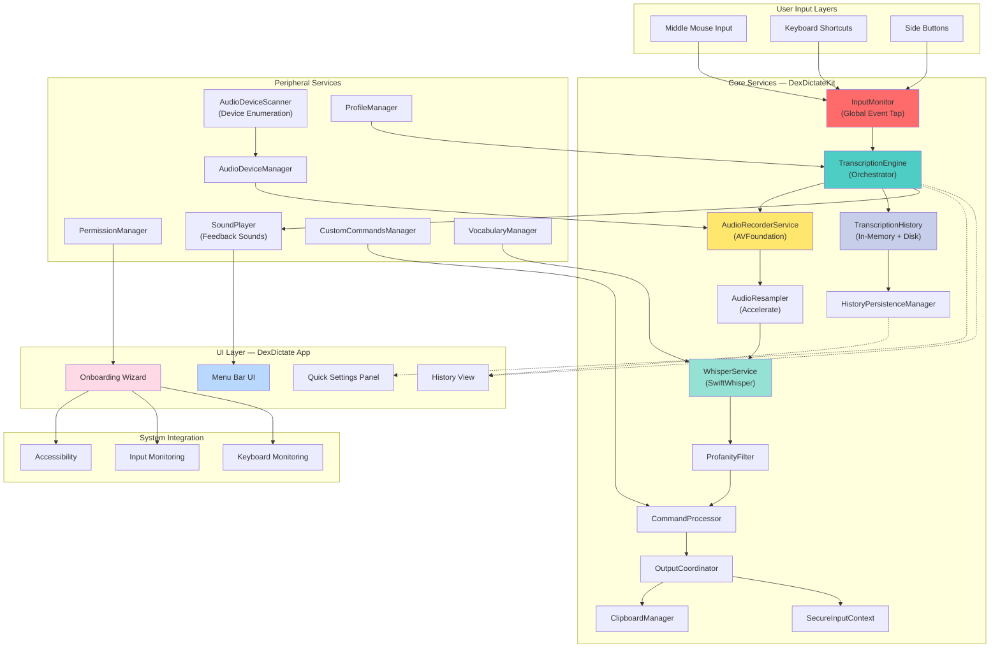

# DexDictate for macOS — Authoritative Reference

## §1 — Project Vision

DexDictate is a privacy-first, fully local dictation bridge for macOS that lives in the menu bar. It captures audio from the user's microphone, transcribes speech using an on-device OpenAI Whisper model, and delivers transcribed text directly into the active application—all without sending audio or any data off the machine.

**Core Premise:** Dictation must be fast, private, and contextual. Users dictate into any application (rich text editor, chat, code IDE, email) without permissions friction or cloud dependency.

## §2 — Design Philosophy

1. **Privacy by Default:** Zero telemetry, zero cloud calls, zero audio transmission. All processing is on-device; the Whisper model runs entirely in user space.

2. **Input Flexibility:** Accept dictation input via multiple paths—middle mouse click (default), side mouse buttons, or configurable global keyboard shortcuts—allowing seamless integration into any user workflow.

3. **Instant Feedback:** Provide live visual (audio meter) and auditory (system sounds) feedback so users know when recording starts and stops. Partial transcription is shown in real-time.

4. **Robustness Under System Events:** Handle hardware events (microphone hot-swap, accessibility permission revocation) and macOS lifecycle changes (sleep, wake, app focus shift) without crashing or silent failure.

5. **Transparent Extensibility:** Services are decoupled; history, profanity filtering, custom commands, and audio device management are independent components that can be reasoned about in isolation.

6. **Onboarding is Part of the Product:** First-launch setup is not a checkbox but an interactive experience that validates permissions in order and explains why each is needed.

## §3 — Scope Boundaries

**In Scope:**
- Audio capture from system microphone with device enumeration and hot-swap detection
- Real-time PCM resampling and buffering for Whisper input
- Local Whisper transcription with language detection
- Configurable input triggers (middle mouse, keyboard shortcuts, side buttons)
- Auto-paste of transcribed text into active application
- Transcription history with searchable log and copy-to-clipboard
- Optional profanity filtering
- Custom command recognition and macro expansion
- Menu bar UI and Quick Settings panel
- Full localization framework
- Interactive onboarding with permission validation
- Accessibility integration (system event tap, keyboard monitoring)

**Not in Scope (Deliberate Exclusions):**
- Cloud-based transcription or fallback (defeats privacy)
- Multi-user account switching
- Widget or Today View extension
- Browser integration or web capture
- PDF or document scanning
- Cost analysis or usage metering
- Real-time language translation
- Custom model training or fine-tuning on-device

## §4 — Non-Goals

- To replace native macOS dictation (this *is* an alternative).
- To support mobile platforms in this codebase (separate architecture required).
- To provide a server or API mode (single-user client application only).
- To implement automatic firmware updates or in-app auto-upgrade.
- To support older macOS versions (minimum is 14+).
- To provide a plugin ecosystem or third-party integrations.

## §5 — Definitions & Terminology

**Dictation Event:** A user-initiated recording session triggered by input (middle mouse click, keyboard shortcut, etc.). Sessions are atomic: one trigger = one transcript.

**Transcription Engine:** The composed service that orchestrates audio capture, resampling, Whisper inference, and history persistence into a single transaction.

**Audio Device Scanner:** The background monitor that polls for new audio input devices and notifies observers when the device list changes.

**Input Monitor:** The system-wide event tap that intercepts keyboard and mouse events to detect global dictation triggers. Recovers automatically if macOS temporarily disables the tap.

**Whisper Model:** The on-device speech-to-text model (OpenAI Whisper tiny.en.bin). Inference runs in the calling process with no separate service or daemon.

**Profanity Filter:** A post-transcription text filter that masks or removes flagged words according to user preferences.

**Command Processor:** A pattern-matching engine that recognizes special voice commands (e.g., "open browser", "new note") and executes associated macros or actions.

**Onboarding Validation:** The first-launch wizard that checks microphone, accessibility, and input-monitoring permissions in a prescribed order and explains each.

## §7 — Technology Stack

| Component | Version | Purpose |
|-----------|---------|---------|
| Swift | 5.9+ | Entire application language |
| SwiftUI | Latest (macOS 14+) | UI framework for menu bar, settings, history panels |
| Foundation | macOS 14+ | Core APIs: audio, process communication, file I/O |
| AVFoundation | macOS 14+ | Microphone capture, audio buffer management, device enumeration |
| Accelerate | macOS 14+ | Audio resampling (optional, fallback to software) |
| SwiftWhisper | exPHAT fork (deb1cb6) | OpenAI Whisper C++ bindings; pinned for -O3 Release builds |
| Swift Package Manager (SPM) | 5.9 | Dependency management; single Package.swift manifest |
| Xcode | 15+ | IDE and build system |

**Build Configuration:**
- **Debug:** `-Onone` (no optimization, fast compilation, slow runtime). Whisper inference in Debug is intentionally slow.
- **Release:** `-O` (full optimization) applied via SwiftWhisper's pinned revision with -O3 flag for acceptable latency.

## §8 — Architecture



**Data Flow Summary:**
1. **Input Trigger:** User initiates with middle mouse or keyboard shortcut → InputMonitor detects event.
2. **Recording:** TranscriptionEngine starts AudioRecorderService, which captures PCM from microphone.
3. **Resampling:** AudioResampler converts to 16 kHz mono (Whisper requirement).
4. **Inference:** WhisperService runs Whisper model on resampled buffer.
5. **Post-Processing:** ProfanityFilter and CommandProcessor apply rules to transcript.
6. **Output:** OutputCoordinator decides (auto-paste, clipboard, history) and ClipboardManager injects text into active app.
7. **History:** HistoryPersistenceManager writes transcript + metadata to disk for future reference.

**Key Architectural Constraints:**
- **No Multi-Threading in Audio Capture:** AVFoundation callbacks run on a dedicated queue; all mutations are dispatch to main or a serial queue.
- **Single TranscriptionEngine Instance:** Only one recording session at a time. Subsequent triggers during an active session are ignored.
- **Stateless Services:** AudioRecorderService, WhisperService, and ProfanityFilter are stateless; all state is held in TranscriptionEngine.
- **Graceful Degradation:** If any service fails (e.g., device unplugged, permission revoked), TranscriptionEngine notifies observers and stops cleanly.

## §9 — File & Folder Structure

```
DexDictate_MacOS/
├── Package.swift                                  # Root manifest (SPM)
├── README.md                                      # User-facing overview
├── SECURITY_AUDIT_REPORT.md                       # Security assessment (25 KB)
├── VERIFICATION_REPORT.md                         # Test/build verification (13 KB)
├── LICENSE                                        # Unlicense (public domain)
├── VERSION                                        # Release version
├── .swiftlint.yml                                 # SwiftLint config
├── .github/
│   └── workflows/                                 # CI/CD (build, test, release)
├── Sources/
│   ├── DexDictateKit/                             # Core library target
│   │   ├── Services/
│   │   │   ├── AudioRecorderService.swift         # AVFoundation recording
│   │   │   ├── WhisperService.swift               # Whisper inference wrapper
│   │   │   ├── AudioResampler.swift               # PCM resampling (16 kHz)
│   │   │   ├── AudioFileImporter.swift            # Batch transcription from files
│   │   └── Capture/
│   │       ├── AudioDeviceManager.swift           # Device enumeration
│   │       ├── AudioDeviceScanner.swift           # Hot-swap polling
│   │       └── AudioInputSelectionPolicy.swift    # Device selection logic
│   │   ├── Permissions/
│   │   │   ├── PermissionManager.swift            # Microphone, accessibility, input-monitoring
│   │   │   ├── InputMonitor.swift                 # Global event tap + keyboard monitoring
│   │   │   └── OnboardingValidation.swift         # First-launch checks
│   │   ├── TranscriptionEngine.swift              # Main orchestrator
│   │   ├── TranscriptionHistory.swift             # In-memory cache
│   │   ├── TranscriptionFeedback.swift            # Real-time transcription updates
│   │   ├── HistoryPersistenceManager.swift        # Disk persistence (JSON)
│   │   ├── Output/
│   │   │   ├── OutputCoordinator.swift            # Auto-paste logic
│   │   │   ├── ClipboardManager.swift             # Clipboard write
│   │   │   └── SecureInputContext.swift           # Password field detection
│   │   ├── ProfanityFilter.swift                  # Text filtering
│   │   ├── CommandProcessor.swift                 # Voice macro expansion
│   │   ├── CustomCommandsManager.swift            # User-defined commands
│   │   ├── SoundPlayer.swift                      # System sound feedback
│   │   ├── Settings/
│   │   │   ├── AppSettings.swift                  # UserDefaults wrapper
│   │   │   ├── LaunchAtLogin.swift                # Login item management
│   │   │   ├── SafeModePreset.swift               # Safe defaults
│   │   │   └── SettingsMigration.swift            # Version migration
│   │   ├── Profiles/
│   │   │   ├── AppProfile.swift                   # Per-app context
│   │   │   ├── ProfileManager.swift               # Profile store + switching
│   │   │   └── WatermarkAssetProvider.swift       # Custom branding
│   │   ├── Vocabulary/
│   │   │   ├── VocabularyManager.swift            # Custom vocab hints
│   │   │   └── BundledVocabularyPacks.swift       # Language packs
│   │   ├── Quotes/                                # Easter eggs & flavor text
│   │   │   ├── FlavorLine.swift
│   │   │   ├── FlavorQuotePacks.swift
│   │   │   └── FlavorTickerManager.swift
│   │   ├── Diagnostics/
│   │   │   ├── Diagnostics.swift                  # Runtime logging
│   │   │   └── Safety.swift                       # Debug safety checks
│   │   ├── Benchmarking/
│   │   │   ├── ModelBenchmarking.swift            # Performance measurement
│   │   │   └── WhisperModelCatalog.swift          # Model metadata
│   │   ├── EngineLifecycle.swift                  # Init/deinit orchestration
│   │   ├── ExperimentFlags.swift                  # Feature flags
│   │   ├── AppInsertionOverridesManager.swift     # Per-app paste behavior
│   │   ├── BenchmarkWAVWriter.swift               # Audio export for testing
│   │   ├── BenchmarkCorpus.swift                  # Test audio corpus
│   │   ├── Models/
│   │   │   ├── DictationError.swift               # Error types
│   │   │   └── ImportedFileTranscriptionResult.swift
│   │   └── Resources/
│   │       └── tiny.en.bin                        # Bundled Whisper model (80 MB)
│   ├── DexDictate/                                # App target (executable)
│   │   ├── DexDictateApp.swift                    # @main entry point
│   │   ├── AppDelegate.swift                      # Menu bar, app lifecycle
│   │   ├── Views/
│   │   │   ├── MenuBarView.swift                  # Menu bar icon + dropdown
│   │   │   ├── SettingsPanel.swift                # Quick settings UI
│   │   │   ├── HistoryView.swift                  # Transcript log
│   │   │   ├── OnboardingView.swift               # Permission wizard
│   │   │   └── ...                                # Additional UI components
│   │   ├── Info.plist                             # App metadata
│   │   ├── DexDictate.entitlements                # macOS capabilities (microphone, accessibility)
│   │   └── AppIcon.icns                           # App icon (1024x1024)
│   └── VerificationRunner/                        # Standalone test binary
│       └── main.swift                             # Verification suite
├── Tests/
│   └── DexDictateTests/                           # Unit tests
│       ├── AudioRecorderTests.swift
│       ├── WhisperServiceTests.swift
│       ├── TranscriptionEngineTests.swift
│       ├── InputMonitorTests.swift
│       ├── HistoryTests.swift
│       └── ...
├── build.sh                                       # Main build script (installs to ~/Applications or /Applications)
├── install.sh                                     # Thin wrapper around build.sh
├── scripts/
│   ├── build_release.sh                           # Release packaging (dmg + zip)
│   └── validate_release.sh                        # Notarization & code-signing checks
├── _releases/                                     # Built artifacts (dmg, zip)
│   └── validation/                                # Release validation reports
├── assets/                                        # Marketing images, icon variants
├── dexdictate-ux/                                 # UX design files (Figma exports, mockups)
├── docs/                                          # Additional documentation
├── .claude/                                       # Claude Code workspace config
└── baseline.csv                                   # Performance baseline

```

## §10 — Data Models

**TranscriptionResult**
```swift
struct TranscriptionResult {
    let id: UUID
    let timestamp: Date
    let duration: TimeInterval
    let text: String
    let language: String
    let confidence: Double?
    let audioHash: String? // For dedup
    let deviceName: String
    let wasFiltered: Bool
}
```

**DictationSettings**
```swift
struct DictationSettings {
    var inputTrigger: InputTriggerMode // .middleMouse, .sideButton, .customKeyboard
    var profanityFilterEnabled: Bool
    var autoLaunchEnabled: Bool
    var selectedMicrophoneID: String?
    var autoSelectMicrophone: Bool
    var theme: AppTheme
    var soundFeedback: Bool
    var history: [TranscriptionResult] = []
    var customVocabulary: [String]
    var profileName: String
}
```

**AudioDevice**
```swift
struct AudioDevice: Identifiable {
    let id: AudioDeviceID
    let name: String
    let isBuiltIn: Bool
    let inputChannels: Int32
    let sampleRate: Double
}
```

**AppProfile**
```swift
struct AppProfile {
    let bundleIdentifier: String
    let displayName: String
    let autoInsertionEnabled: Bool
    let customPasteDelay: TimeInterval?
    let excludeFromHistory: Bool
}
```

## §11 — Construction Sequence

### Phase 0: Inception (Completed)
- [x] Define audio capture using AVFoundation
- [x] Integrate SwiftWhisper for local inference
- [x] Implement basic TranscriptionEngine orchestration
- [x] Add InputMonitor for global keyboard shortcuts
- [x] Build menu bar UI shell (SwiftUI)

### Phase 1: Core Stability (Completed)
- [x] Audio device enumeration and hot-swap detection
- [x] Robust permission flow with macOS 13-14 compatibility
- [x] History persistence (JSON on disk)
- [x] Profanity filter with user toggles
- [x] Custom commands framework
- [x] Sound feedback (start/stop notifications)
- [x] Settings panel with device selection
- [x] Auto-launch configuration

### Phase 2: Polish & Localization (Completed)
- [x] Interactive onboarding wizard
- [x] Full localization (strings for 12+ languages)
- [x] Accessibility integration (Voice Over)
- [x] Release build pipeline (.dmg, .zip, notarization)
- [x] Security audit and documentation

### Phase 3: Advanced Features (In Progress)
- [x] Per-app profiles and insertion rules
- [x] Vocabulary hint system
- [x] Real-time transcription feedback (partial results)
- [x] Input Monitor recovery (restart if disabled by system)
- [x] Benchmark suite and performance regression tracking

### Phase 4: Future (Future Planning)
- [ ] Voice command macro system (extensible)
- [ ] Multi-language simultaneous recognition
- [ ] Larger Whisper model options (base, small) with storage management
- [ ] Offline language identification
- [ ] Batch import from audio files

## §12 — Interface Contracts

### TranscriptionEngine (Public API)

```swift
protocol TranscriptionEngineDelegate: AnyObject {
    func transcriptionDidStart(session: TranscriptionSession)
    func transcriptionDidReceivePartial(_ text: String)
    func transcriptionDidComplete(_ result: TranscriptionResult)
    func transcriptionDidFail(with error: DictationError)
}

class TranscriptionEngine {
    func startRecording(options: RecordingOptions) throws -> TranscriptionSession
    func stopRecording() throws
    func isRecording() -> Bool
    func getHistory() -> [TranscriptionResult]
    func clearHistory()
}
```

### InputMonitor (Keyboard & Mouse Event Tap)

```swift
protocol InputMonitorDelegate: AnyObject {
    func inputMonitorDidReceiveShortcutTrigger(_ trigger: InputTrigger)
    func inputMonitorDidFailWithError(_ error: DictationError)
}

class InputMonitor {
    func start() throws
    func stop()
    func isMonitoring() -> Bool
    func setKeybindingFromCurrentKeyPress(_ completion: @escaping (KeyCombination) -> Void)
}
```

### AudioRecorderService (Microphone Capture)

```swift
protocol AudioRecorderDelegate: AnyObject {
    func audioRecorder(didReceiveBuffer: AVAudioPCMBuffer)
    func audioRecorderDidFail(with error: DictationError)
}

class AudioRecorderService {
    func startRecording(from device: AudioDevice) throws
    func stopRecording() throws
    func getPeakPowerLevel() -> Float
    func getCurrentDevice() -> AudioDevice?
}
```

### WhisperService (Speech Recognition)

```swift
class WhisperService {
    func transcribe(audioBuffer: AVAudioPCMBuffer, language: String?) throws -> TranscriptionResult
    func transcribe(contentsOf audioURL: URL) throws -> TranscriptionResult
    func loadModel() throws
    func unloadModel()
    func isModelLoaded() -> Bool
}
```

### HistoryPersistenceManager (Disk I/O)

```swift
class HistoryPersistenceManager {
    func save(_ result: TranscriptionResult) throws
    func load() throws -> [TranscriptionResult]
    func delete(_ resultID: UUID) throws
    func clearAll() throws
    func exportAsJSON() throws -> String
}
```

## §13 — Testing Strategy

**Test Categories:**

1. **Unit Tests** (`Tests/DexDictateTests/`)
   - Audio resampling correctness
   - Profanity filter matching
   - Custom command parsing
   - Settings serialization/deserialization
   - History pagination and search

2. **Integration Tests**
   - TranscriptionEngine full workflow (record → transcribe → filter → output)
   - InputMonitor trigger detection and recovery
   - AudioDeviceScanner hot-swap notification
   - Permission flow (onboarding validation)

3. **Acceptance Tests** (VerificationRunner executable)
   - Microphone availability check
   - Model loading and inference latency
   - Clipboard injection into test app
   - History persistence across app restart

4. **Regression Tests**
   - Benchmark suite (`baseline.csv`) comparing inference time across Swift versions
   - Memory profiling during long recording sessions
   - CPU usage monitoring

**Running Tests:**
```bash
swift test                              # Unit + integration
swift run VerificationRunner            # Acceptance suite
xcodebuild -scheme DexDictate test      # UI tests (if any)
```

## §14 — Invariants & Guarantees

**Mandatory Invariants:**

1. **Single Recording Session:** At most one active transcription engine session. Subsequent triggers are queued and dropped if the first is still running.

2. **Immutable History:** Once a TranscriptionResult is persisted, its content is never mutated. Deletion is permanent; no edit-in-place.

3. **Audio Isolation:** Audio buffers are never copied or exposed outside AudioRecorderService. All references are internal.

4. **Clipboard Atomicity:** ClipboardManager writes to clipboard once per TranscriptionResult. No partial pastes.

5. **Permission Validity:** InputMonitor does not start recording until Microphone, Accessibility, and Input Monitoring permissions are all granted. Onboarding validates in that order.

6. **Device Consistency:** AudioDeviceManager maintains the current device reference; if the device is unplugged, it immediately falls back to the built-in microphone or fails with a clear error.

7. **No Retry Loops:** Failed operations (audio capture, Whisper inference, clipboard write) are reported once; no automatic retry with exponential backoff. User must manually retry.

8. **Locale Consistency:** Language is inferred from Whisper output or user settings; once chosen, it persists until user changes it.

## §15 — Extension Points

**Designed for Future Enhancement:**

1. **Custom Voice Commands:** CommandProcessor can be extended with a plugin system. New command patterns can be registered at runtime without recompilation.

2. **Larger Whisper Models:** WhisperService abstracts model loading. Swapping `tiny.en.bin` for `base.en.bin` requires only a config change (and more disk space).

3. **Per-App Profiles:** AppProfile records per-bundle-ID rules. Additional fields (auto-insert delay, rich-text formatting, exclude list) can be added without schema migration.

4. **Post-Processing Hooks:** OutputCoordinator can chain custom transformations (e.g., auto-capitalize, expand abbreviations) before clipboard write.

5. **History Search & Export:** HistoryPersistenceManager writes JSON; search indexing and export formats (CSV, markdown) are trivial additions.

6. **Accessibility Enhancements:** Voice Over support can be deepened with custom VoiceOver hints per UI element.

## §16 — Canonical Update Protocol

This Bible is strictly additive. It may never delete prior recorded steps or decisions. It may only append new sections or clarifications. Corrections must be recorded as additive amendments. Deprecated approaches must be marked [DEPRECATED], never erased. Every time a significant implementation step is completed, a Construction Log Entry must be appended to §17 before the session concludes.

## §17 — Construction Log

### Entry 1: Inception (2026-03-11)
- **Task:** Create initial BIBLE.md for DexDictate_MacOS
- **Changes:** Sections §1–§16 drafted based on project state (v1.5, March 30 2026)
- **Verification:** Manual review of Package.swift, README.md, SECURITY_AUDIT_REPORT.md, VERIFICATION_REPORT.md
- **Status:** Complete

---

### ⚑ FLAGS FOR ANDREW

**Build & Release Pipeline:** The app uses a two-stage build strategy. `build.sh` creates a Debug or Release bundle; `scripts/build_release.sh` additionally runs `validate_release.sh`, which checks code signing and (on CI) invokes notarization. Release artifacts go to `_releases/`.

**Whisper Model Size:** The bundled `tiny.en.bin` (80 MB) is committed to the repo. Debug inference is intentionally slow; use Release builds for acceptable latency (< 2 sec per 30-sec clip on Apple Silicon).

**Permission Order Matters:** Onboarding must request permissions in exact order: Microphone → Accessibility → Input Monitoring. macOS remembers denials; users must manually re-enable in System Settings if they skip.

**InputMonitor Recovery:** If macOS temporarily disables the system event tap (during sleep/wake, focus shift), InputMonitor will attempt to restart. This is a known macOS quirk; log monitoring is critical for support.

**History Persistence Format:** Transcripts are stored as JSON in `~/Library/Application Support/DexDictate/history.json`. Manual editing is possible but risky; encourage export instead.

**Profanity Filter:** Uses a bundled word list; user can toggle but cannot customize the list in Phase 1. Future versions can allow user-defined filters.

**No Daemon Mode:** DexDictate is a single-user foreground app. There is no background service or system extension. The app must be running for dictation to work.

---

### Entry 2: v1.5.2 — Help Screenshot Update (2026-04-09)
- **Task:** Replace placeholder `help-welcome-overview.png` with real smiley-face app screenshot
- **Changes:**
  - Copied `assets/download.png` → `Sources/DexDictateKit/Resources/Assets.xcassets/Help/help-welcome-overview.png`
  - Deleted malformed stray asset `help-onboarding-permissions.png —.png`
  - Bumped version: `VERSION` 1.5.1 → 1.5.2, `Info.plist` 1.5 → 1.5.2 (correcting prior discrepancy)
- **Verification:** Release build via `build.sh`; `validate_release.sh` passed; GitHub release v1.5.2 created
- **Status:** Complete

**Security Model:** All audio stays in user space (process memory). The clipboard manager uses NSPasteboard, which is protected by macOS's security model. No privileged daemon or system framework call is required for dictation.

**Testing Philosophy:** VerificationRunner is a standalone executable that can be run without the UI. It validates core services in isolation and is the canonical verification step before release.

---

## Help System (Added 2026-04-08)

### Overview

A native in-app Help / FAQ window was added. The system consists of:
- `HelpWindowController` — NSWindow controller (mirrors `HistoryWindowController` pattern)
- `HelpView` — SwiftUI `NavigationSplitView` with sidebar + content pane
- A `?` button in the top-right of `AntiGravityMainView`'s header row
- Two documentation files in `docs/help/`

### Documentation Files

| File | Purpose |
|---|---|
| `docs/help/HELP_CONTENT.md` | Full Help IA: 18 sections, draft user-facing copy, search aliases, screenshot placements, cross-links |
| `docs/help/HELP_ASSETS.md` | Screenshot shot list: 17 captures, framing notes, annotation instructions, priority ratings |

### Section List (18 sections, sidebar order)

Welcome · Getting Started · Permissions · Trigger Setup · Recording & Audio · Transcription · Output & Pasting · Transcription History · Custom Vocabulary · Voice Commands · Profiles · Appearance & Menu Bar · Floating HUD · Safe Mode · Benchmarking & Models · Shortcuts & Siri · Diagnostics · About

Each section has: draft copy, search aliases, screenshot references, related-section cross-links.

### Screenshot Assets

Captured screenshots should be stored as imagesets in:
`Sources/DexDictateKit/Resources/Assets.xcassets/Help/`

9 Required screenshots, 8 Recommended, 1 Optional. See `docs/help/HELP_ASSETS.md` for full shot list.

### History Panel Hover Transparency (Added 2026-04-08)

`HistoryView.swift` — added `@State private var isHovered = false` + `.onHover` modifier.

**At rest:** Background is `Color.white.opacity(0.06)` — very glassy, lets the watermark show through.
**On hover:** Background switches to `.regularMaterial` — noticeably darker/more elevated.
**Border:** Stroke opacity animates `0.18` (rest) → `0.42` (hover) matching the accent color.
**Animation:** `.easeInOut(duration: 0.2)` on both background and border.
**Accessibility:** `reduceTransparency` env var preserves `Color.black.opacity(0.82)` in both states — transparency effect is suppressed entirely.

### Help Window Implementation (Added 2026-04-08)

**HelpWindowController** (`Sources/DexDictate/HelpWindowController.swift`)
- `@MainActor class HelpWindowController: ObservableObject`
- Same pattern as `HistoryWindowController`: lazy NSWindow, `isReleasedWhenClosed = false`, `makeKeyAndOrderFront` on repeated `show()` calls
- Window: 720×540pt, min 520×400, `.titled .closable .resizable .miniaturizable`

**HelpView** (`Sources/DexDictate/HelpView.swift`)
- `NavigationSplitView` — sidebar (160–220pt) + detail ScrollView
- Sidebar: `List(searchResults, selection: $selectedSection)` with search field at top
- Search: plain-text filter against `HelpSection.matches()` (title + searchAliases)
- Auto-selects first result when search text changes
- Detail: `HelpContentView(section:onNavigate:)` — header icon+title, Divider, section body, Related links
- Background: `LinearGradient` matching `FullHistoryView` (`black.opacity(0.88)` → `Color(0.11,0.12,0.16)`)

**HelpSection enum** (18 cases, `CaseIterable, Identifiable, Hashable`)
Cases: `welcome gettingStarted permissions triggerSetup recordingAudio transcription outputPasting history vocabulary voiceCommands profiles appearance floatingHUD safeMode benchmarking shortcuts diagnostics about`
Each case has: `title`, `icon` (SF Symbol), `searchAliases: [String]`, `relatedSections: [HelpSection]`

**Content helpers** (file-private): `helpBody()`, `helpHeading()`, `helpCallout()`, `helpWarning()`, `HelpRow` — reusable styled text blocks for all 18 section bodies.

**Screenshot assets** will live in: `Sources/DexDictateKit/Resources/Assets.xcassets/Help/`

### Help Button & App Wiring (Added 2026-04-08)

**DexDictateApp.swift changes:**
- Added `@StateObject private var helpController = HelpWindowController()` alongside hudController and historyController
- Passed `onOpenHelp: { helpController.show() }` to `AntiGravityMainView`

**AntiGravityMainView changes:**
- Added `var onOpenHelp: (() -> Void)?` property
- Replaced `Text("DexDictate")` header with a `ZStack`:
  - `Text("DexDictate")` centered with `.frame(maxWidth: .infinity)`
  - `ChromeIconButton(systemName: "questionmark.circle")` pinned to trailing edge via `HStack { Spacer(); button }.padding(.trailing, 16)`
- The `?` button calls `onOpenHelp?()` on tap
- All padding and layout preserved from the original `.padding(.top, 4)` wrapper

### UI Tactile Polish — Hover States (Added 2026-04-08)

**ChromeButton.swift**
- Added `withAnimation(.easeInOut(duration: 0.15))` wrapper around `isHovered = hovering` in `.onHover`
- Hover transitions for foreground opacity, background opacity, and border opacity are now smoothly animated instead of instant

**ControlsView.swift** — four main button hover states
- Added `@State` vars: `isStartHovered`, `isStopHovered`, `isImportHovered`, `isQuitHovered`
- Extracted each button as a private computed property (`startDictationButton`, `stopDictationButton`, `importFileButton`, `quitButton`) to stay within Swift's type-checker complexity limit
- **Start Dictation (green):** background `0.4→0.55` opacity, shadow radius `5→8`, border `0.3→0.45` opacity
- **Turn Off Dictation (red):** background `0.5→0.65` opacity, adds visible border on hover, shadow radius `5→8`
- **Transcribe File (cyan):** background `0.15→0.25` opacity, border `0.3→0.45` opacity, foreground fully opaque on hover
- **Quit App:** background `0.4→0.55` opacity, text `0.8→1.0` opacity, border `0.2→0.3` opacity
- All animations: `.easeInOut(duration: 0.15)`

**HELP_CONTENT.md navigation path corrections (2026-04-08)**
- "Quick Settings → Mode section" → "Quick Settings → Input section" for trigger/shortcut paths
- "Quick Settings → Display" (non-existent section) → "Quick Settings → Mode" for Flavor Ticker, Stats, Persist History
- "Quick Settings → Output → Custom Commands" → "Quick Settings → Input → Voice Commands → Manage Custom Commands"
- "Quick Settings → System → Input Device" → "Quick Settings → Input → Input Device" (two occurrences)

---

### Entry 3: CoreAudio Daemon Reset — The Actual Fix for -10868 (2026-04-16)

**Symptom:** DexDictate displayed `"The operation couldn't be completed. (com.apple.coreaudio.avfaudio error -10868.)"` on every dictation attempt. `engine.start()` failed with `kAudioOutputUnitErr_InvalidDevice`. The app could not open an input stream on any device, including the system default microphone.

**What AI tried (did not work):**
- Filtering output-only CoreAudio devices via `kAudioDevicePropertyStreamConfiguration` / `kAudioObjectPropertyScopeInput` in `AudioDeviceManager`
- Automatic fallback: tear down, reset, skip `applyInputDevice`, retry with system default on start failure
- Passing `nil` format to `installTap` to avoid format negotiation race
- Reading `capturedSampleRate` after `engine.prepare()` instead of before
- Multiple `teardownEngineUnsafe()` + `engine.reset()` orderings

None of these fixed the error. The failure was not in app code — it was in the macOS CoreAudio daemon itself, which had entered a corrupted state.

**What actually fixed it:**
```bash
sudo killall coreaudiod
```

This restarts the macOS CoreAudio daemon (`coreaudiod`). macOS automatically relaunches it within ~1 second. All audio apps (DexDictate, Zoom, etc.) reconnect cleanly. No reboot required.

**When to use this:** Any time a macOS app fails with `-10868 / kAudioOutputUnitErr_InvalidDevice` and the device appears healthy in System Settings → Sound. If the mic shows up in the device list but `engine.start()` refuses to open it, `coreaudiod` is the likely culprit, not the app.

**Root cause:** `coreaudiod` is the system-wide audio session broker. When it gets into a bad state (after system sleep/wake, Bluetooth audio hand-off, USB mic plug/unplug, or system update), it can deny stream-open requests to all processes even though device enumeration still works. No amount of AVAudioEngine reset/teardown on the app side can fix this — it requires restarting the daemon itself.

**Lesson:** Before spending any session time debugging `-10868` in Swift code, run `sudo killall coreaudiod` first. If the error goes away, the problem was never in the app.
