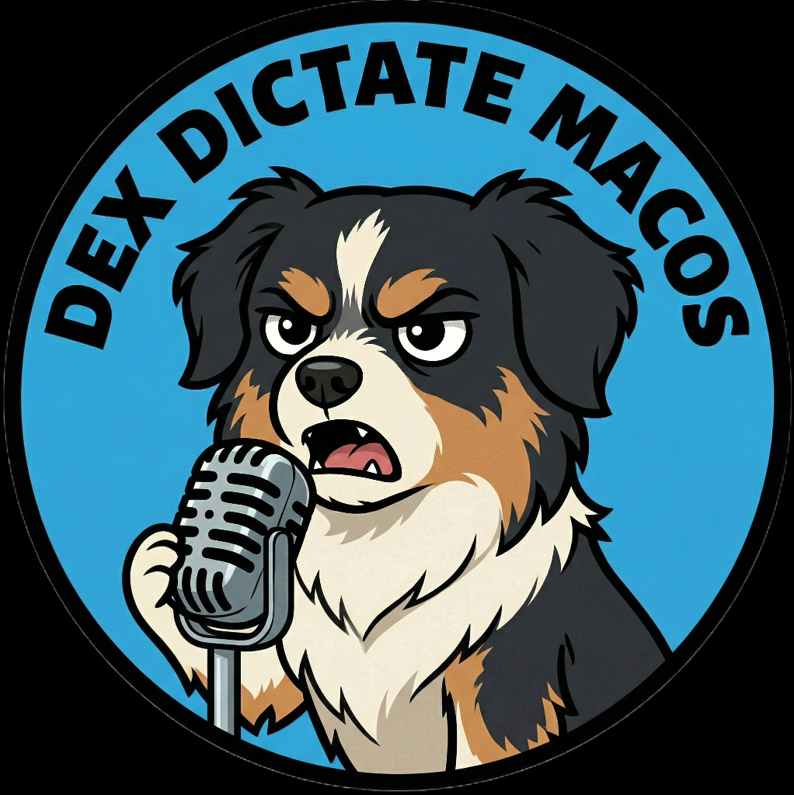

<p align="center">
	
</p>

# DexDictate macOS

**Native, offline dictation for macOS.**

DexDictate is a lightweight menu bar app that provides push-to-talk dictation using Apple’s native `SFSpeechRecognizer` framework.

## Overview



- Menu bar app with a glassmorphism-style SwiftUI interface.
- Push-to-talk by holding the **Middle Mouse** button (or toggle mode).
- On-device speech recognition with no external dependencies.
- Status feed and quick settings panel in the main window.

## Requirements
- macOS 14.0 (Sonoma)+
- Microphone
- Apple Silicon (arm64) (build script targets arm64)

## Quick Start
Copy and paste this into your terminal:

```bash
git clone https://github.com/WestKitty/DexDictate_MacOS.git && cd DexDictate_MacOS && ./scripts/setup_dev_env.sh && ./build.sh
```

**Or verify manually:**
1. Clone the repo.
2. Run `./scripts/setup_dev_env.sh` (once) to set up certs.
3. Run `./build.sh`.
4. Launch the app from `~/Applications/DexDictate_V2.app`.
5. Grant **Microphone**, **Speech Recognition**, **Accessibility**, and **Input Monitoring** permissions when prompted.

## Usage
1. Click **Start Dictation**.
2. **Hold Middle Mouse Button** to dictate (or switch to toggle mode in Settings).
3. Release to transcribe and (optionally) auto‑paste.

## Permissions
DexDictate requires:
- **Microphone** for audio capture.
- **Speech Recognition** for transcription.
- **Accessibility** and **Input Monitoring** for global mouse button detection and paste automation.

## Scripts
- `build.sh` builds, codesigns, and installs the app into `~/Applications`.
- `reset_tcc_permissions.sh` resets macOS privacy permissions for the bundle ID.

## Project Layout
- `Sources/DexDictate/` Swift source for the menu bar app.
- `Sources/DexDictate/Resources/Assets.xcassets/` app icons and artwork.

## Troubleshooting
- If the app cannot detect mouse input, run `./reset_tcc_permissions.sh`, rebuild, and re‑grant permissions.
- If transcription does not start, ensure **Speech Recognition** permission is granted and try restarting the app.
