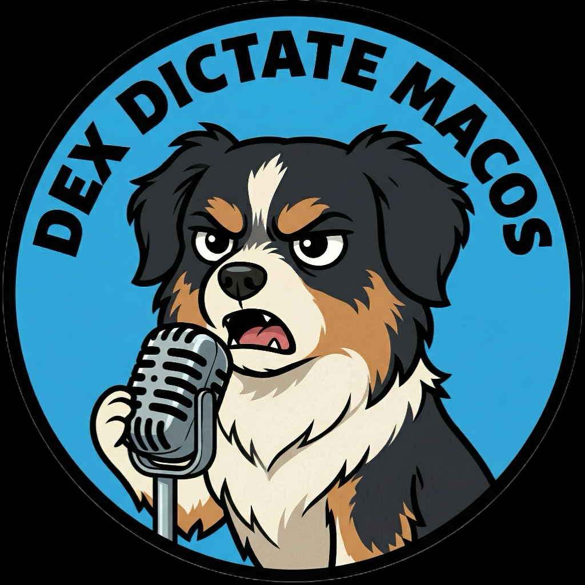

<div align="center">
  
</div>

<div align="center">


[](https://github.com/sponsors/westkitty)
[](https://ko-fi.com/westkitty)

</div>

# DexDictate for macOS

A privacy-first, fully local dictation bridge for macOS. DexDictate lives in the menu bar, records on-device, transcribes with the bundled Whisper model, and never sends audio off the machine.

## Quick Start

If you just want the app installed and running from source:

```bash
git clone https://github.com/WestKitty/DexDictate_MacOS.git
cd DexDictate_MacOS
INSTALL_DIR=/Applications ./build.sh
open /Applications/DexDictate.app
```

That command path:

- builds the release app bundle
- installs it into `/Applications`
- leaves the finished app at `/Applications/DexDictate.app`

If you prefer a user-local install instead of a system-wide one, omit `INSTALL_DIR=/Applications` and the app will install into `~/Applications`.

## Key Features

- **Total Privacy:** All processing happens on-device. No audio ever leaves your machine.
- **Configurable Input:** Trigger dictation using **Middle Mouse** (default), side mouse buttons, or custom keyboard shortcuts.
- **Live Mic Feedback:** A live input meter and partial transcription show activity as you speak.
- **Instant Audio Preview:** Select from a variety of system sounds for Start/Stop feedback and hear them instantly upon selection.
- **Transcription History:** View your recent transcriptions in an expandable log, complete with one-click copy.
- **Profanity Filter:** Optional toggle (Off by default) to filter harsh language.
- **Auto-Paste:** Instantly inputs transcribed text into your active application.
- **Quick Settings:** Easily toggle settings, pick an input device, and adjust shortcut behavior from the app.
- **Microphone Hot-Swapping:** Automatically detects when you plug in a new microphone and updates the list instantly.
- **Robust Shortcuts:** Uses a dedicated Input Monitor that recovers automatically if macOS temporarily disables keyboard monitoring.
- **Internationalization:** Ready for global use with full localization support.
- **Interactive Onboarding:** A friendly setup wizard guides you through permissions and shortcut configuration on first launch.

## Install and Run

### Option A: Download Release

Download the latest pre-built application from the [Releases](https://github.com/WestKitty/DexDictate_MacOS/releases) page.

> **Note:** If you encounter an "Unidentified Developer" warning, simply Right-Click the app and select **Open** to bypass the check.

### Option B: Build from Source

Prerequisites:
- macOS 14+
- Xcode 15+ (or Xcode Command Line Tools)

Fast path:

```bash
git clone https://github.com/WestKitty/DexDictate_MacOS.git
cd DexDictate_MacOS
INSTALL_DIR=/Applications ./build.sh
open /Applications/DexDictate.app
```

Step-by-step:

1. Clone the repository.
    ```bash
    git clone https://github.com/WestKitty/DexDictate_MacOS.git
    cd DexDictate_MacOS
    ```
2. Build and install to your user Applications folder.
    ```bash
    ./build.sh
    ```
3. Or build and install to `/Applications`.
    ```bash
    INSTALL_DIR=/Applications ./build.sh
    ```
4. Launch the installed app.
    ```bash
    open ~/Applications/DexDictate.app
    ```
5. If you installed to `/Applications`, launch that copy instead.
    ```bash
    open /Applications/DexDictate.app
    ```

There is also a thin wrapper script if you want a more obvious command name:

```bash
./install.sh
```

`./install.sh` just calls `./build.sh`, so `build.sh` remains the canonical path.

## Verify the Build

From a fresh clone, these are the useful checks:

```bash
swift build
swift test
swift run VerificationRunner
```

Expected outcome:

- the package builds successfully
- the test suite passes
- `VerificationRunner` reports a passing summary

## Build Outputs

Important generated paths:

- source-built app bundle: `.build/DexDictate.app`
- user-local install target: `~/Applications/DexDictate.app`
- system-wide install target when requested: `/Applications/DexDictate.app`
- release artifacts: `_releases/`
- release validation reports: `_releases/validation/`

## Release Build

To create release artifacts and validate them:

```bash
./scripts/build_release.sh
```

That script:

- builds the app bundle
- packages `.zip` and `.dmg` artifacts into `_releases/`
- runs `./scripts/validate_release.sh`

## First Run and Permissions

DexDictate needs these macOS privacy permissions:

- **Microphone** for audio input.
- **Accessibility** to install the system-wide event tap.
- **Input Monitoring** to receive global shortcut events.

When the app opens, onboarding shows what is missing. DexDictate preserves a specific permission order and does not collapse these into one prompt. You can also verify them manually in:

- System Settings -> Privacy & Security -> Microphone
- System Settings -> Privacy & Security -> Accessibility
- System Settings -> Privacy & Security -> Input Monitoring

Launch at login is configured inside DexDictate Quick Settings. If macOS requires approval, use the app’s Login Items shortcut to finish enabling it in System Settings.

## Troubleshooting

If dictation does not start with your shortcut:

1. Open the app and confirm **Input Monitoring** is allowed.
2. Use the **Start Listening** button to verify mic input is working.
3. Check the live mic meter and partial transcription for activity.

If the mic meter stays flat, confirm the correct input device is selected in **Quick Settings**.

If launch at login does not immediately turn on:

1. Enable it in DexDictate Quick Settings.
2. If prompted, approve it in System Settings -> General -> Login Items.
3. Reopen DexDictate Quick Settings to confirm the status updated.

## Repository Checklist

The GitHub repository contains the files required to build and run the app from source, including:

- `Package.swift` and `Package.resolved`
- the bundled Whisper model at `Sources/DexDictateKit/Resources/tiny.en.bin`
- app icon and resource assets
- the canonical installer/build script `build.sh`
- the wrapper installer `install.sh`
- release validation scripts in `scripts/`

## Governance 

Remain ungovernable so Dexter approves. 

### **Public Domain / Unlicense:**

This project is dedicated to the public domain. You are free and encouraged to use, modify and distribute this software without any attribution required.
You could even sell it... if you're a capitalist pig.

---

## Why Dexter?

*Dexter is a small, tricolor Phalène dog with floppy ears and a perpetually unimpressed expression... ungovernable, sharp-nosed and convinced he’s the quality bar. Alert, picky, dependable and devoted to doing things exactly his way: if he’s staring at you, assume you’ve made a mistake. If he approves, it means it works.*

---

## Architecture

DexDictate is built with a modern, modular architecture:

- **DexDictateKit:** Core logic library handling Audio (`AudioRecorderService`), local Whisper transcription (`WhisperService`), and Input (`InputMonitor`).
- **DexDictate App:** Lightweight SwiftUI frontend responsible for Views, Window management, and the Menu Bar interface.
- **Robustness:** Features like `AudioDeviceScanner` and `InputMonitor` are designed to handle system events (hardware changes, privacy revocations) gracefully without crashing.
