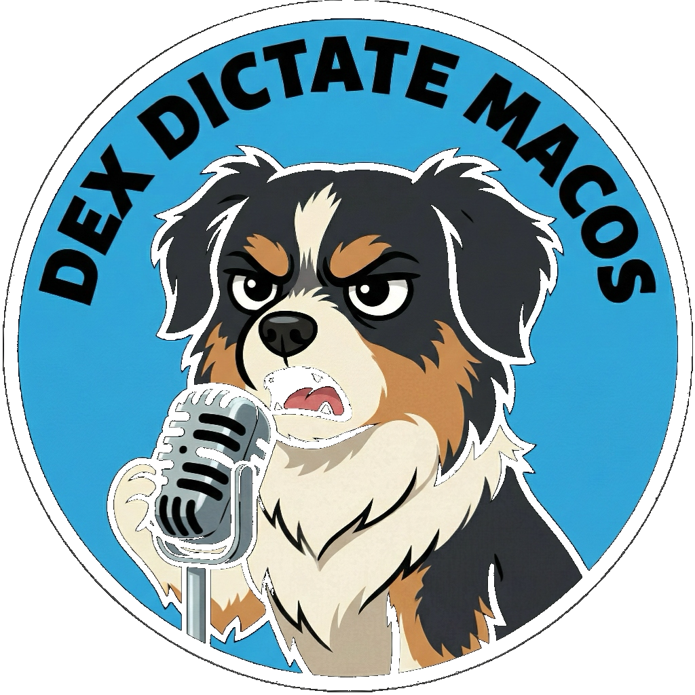
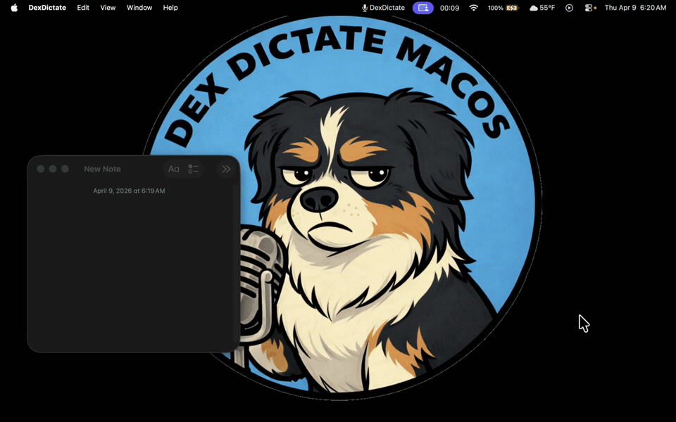

 ## DexDictate (macOS)

[](https://github.com/westkitty/DexDictate_MacOS)


<p align="center">
  Local, privacy-first voice dictation for macOS.
</p>
<p align="center">
  No cloud. No telemetry. No nonsense.
</p>

<p align="center">
  Dexter approves.<br>Barely.
</p>


<div align="center">


[](https://github.com/sponsors/westkitty)
[](https://ko-fi.com/westkitty)

</div>

<div align="center">  </div>

---

## What This Is

DexDictate is a local-first macOS menu-bar dictation app for Apple Silicon Macs. It records from your microphone, transcribes on-device with Whisper, applies local post-processing such as voice commands and vocabulary correction, and then saves or inserts the result according to your output settings.

This is not a cloud wrapper. It does not "phone home."

---

<p align="center">
  
</p>

## Install (Preferred for New Users)

### Option 1: Install the latest packaged release (recommended)

Use the newest release artifact first. Current latest release: **v1.5.2**  
Release page: [v1.5.2](https://github.com/westkitty/DexDictate_MacOS/releases/tag/v1.5.2)

Download one of these Apple Silicon artifacts:

- `DexDictate-1.5.2-macos-arm64.dmg`
- `DexDictate-1.5.2-macos-arm64.zip`
- `DexDictate-1.5.2-macos-arm64-SHA256SUMS.txt`

Standard `.dmg` flow:

1. Open the disk image.
2. Drag `DexDictate.app` into `/Applications`.
3. Launch the app and complete onboarding.

### Option 2: Build from source

```bash
git clone https://github.com/westkitty/DexDictate_MacOS.git
cd DexDictate_MacOS
./build.sh
```

`./build.sh` will:

- fetch and verify the bundled Whisper model if it is missing
- build the app and the `VerificationRunner` helper
- sign the bundle
- install into `/Applications` when writable, otherwise `~/Applications`

Useful variants:

```bash
./build.sh --user
./build.sh --system
INSTALL_DIR=/Applications ./build.sh
```

## Requirements

- macOS 14 or later
- Apple Silicon (`arm64`)
- Xcode 15 or Command Line Tools (for source builds)

Intel Macs are not supported. The build script rejects x86_64 environments.

## First Launch (macOS Permissions)

On first run, macOS will ask for:

1. Microphone
2. Accessibility
3. Input Monitoring

Grant them.

If you skip them, it won't work.  
This is macOS, not a suggestion.

---

## Full Feature List

### Dictation and capture

- Menu-bar utility with four-step onboarding flow
- Local Whisper transcription via [SwiftWhisper](https://github.com/exPHAT/SwiftWhisper)
- Bundled default model: `tiny.en`
- Global trigger capture from keyboard shortcuts or mouse buttons
- Trigger modes: `Hold to Talk` and `Click to Toggle`
- Input device selection with system-default fallback
- Live microphone level feedback
- Silence timeout and utterance-end tuning controls
- Optional floating HUD while recording/transcribing
- Optional sound cues

### Output and insertion controls

- Auto-paste output into the active app
- Clipboard-only fallback for likely secure fields
- Optional Accessibility API insertion path
- Per-app insertion overrides by bundle identifier
- Save-only behavior mode
- Launch-at-login support through `SMAppService`

### Language and cleanup

- Built-in voice commands for editing and formatting
- Bundled vocabulary packs
- User vocabulary layering and correction rules
- Custom `Dex <keyword>` commands
- Optional profanity filtering

### Safety and privacy

- Local-only runtime transcription (no cloud path)
- Safe handling for likely password/secure fields
- `Safe Mode` preset for stricter behavior
- No telemetry and no speech analytics pipeline

### History and UX

- Detachable transcription history window
- Quick settings popover
- Help content backed by repository-owned assets

### Developer and release tooling

- `VerificationRunner` executable for verification checks
- Benchmark scripts and sample corpus
- Release packaging for `.zip` and `.dmg`
- Release validation for bundle integrity, architecture, signing, entitlements, and hashes
- GitHub Actions CI for `swift build` and `swift test` on `main` pushes and pull requests

---

## Basic Usage

1. Launch the app
2. Trigger dictation via shortcut (default configured in-app)
3. Speak
4. Text appears where your cursor is

That's the entire point.

---

## Security & Privacy

- All audio is processed locally
- No network calls for transcription
- No analytics, tracking, or logging of user speech
- No hidden services

If something leaves your machine it's because you explicitly added it.

---

## Development Workflow

```bash
./scripts/fetch_model.sh
swift build
swift test
swift run VerificationRunner
./build.sh
```

Useful commands:

- `./build.sh [--user|--system] [--release]`
- `./scripts/setup_dev_env.sh`
- `./scripts/fetch_model.sh`
- `./scripts/run_quality_paths.sh`
- `./scripts/benchmark.sh --audio <wav>`
- `python3 scripts/benchmark.py --corpus-dir <dir>`
- `./scripts/benchmark_regression.sh <wav> [baseline_ms]`
- `./scripts/trim_benchmark_corpus.sh <input_dir> [output_dir]`
- `./scripts/validate_release.sh [path_to_app_bundle]`

## Repository Layout

```text
.
├── Sources/
│   ├── DexDictate/         # menu-bar app target
│   ├── DexDictateKit/      # transcription, settings, permissions, output, resources
│   └── VerificationRunner/ # verification and benchmark helper executable
├── Tests/DexDictateTests/  # unit and integration tests
├── scripts/                # build, benchmark, setup, and validation tooling
├── docs/                   # feature inventory, help content, and long-form project docs
├── assets/                 # artwork, marketing images, icons, and source visuals
├── sample_corpus/          # benchmark sample audio and transcripts
├── templates/              # Info.plist template used during bundle assembly
├── build.sh                # canonical build, install, and release entry point
└── Package.swift           # Swift Package Manager manifest
```

## Additional Documentation

- [Feature inventory](docs/FEATURE_INVENTORY.md)
- [Security audit](SECURITY_AUDIT_REPORT.md)
- [Verification report](VERIFICATION_REPORT.md)
- [Contributing guidance](CONTRIBUTING.md)
- [Moral architecture](BIBLE.md)

## Contributing

Issues and pull requests are welcome, but review and merge are not guaranteed. Keep changes specific, test-backed and realistic about current project scope.

---

DexDictate is not trying to be everything.

It is:

- Local
- Fast
- Private
- Minimal

If you want cloud AI orchestration this is the wrong tool.

---

## License

This repository is released under the Unlicense as public domain.
You could use it in a mutual aid project.
You could use it as a custom accessibility tool like I do.
Or you could even sell it if you felt like embarrassing yourself in public.
You can do whatever you want with it and you are encouraged to do so.

Remain ungovernable so Dexter approves.

See [LICENSE](LICENSE).

---

## Final Note

Dexter does not celebrate features.  
Dexter tolerates correctness.

This passes.

## Why Dexter?

*Dexter is a small, tricolor Phalène dog with floppy ears and a perpetually unimpressed expression... ungovernable, sharp-nosed and convinced he is the quality bar. Alert, picky, dependable, and devoted to doing things exactly his way: if he is staring at you, assume you made a mistake. If he approves, it works.*


(Thanks to the Whisper team for developing such a useful tool.)
