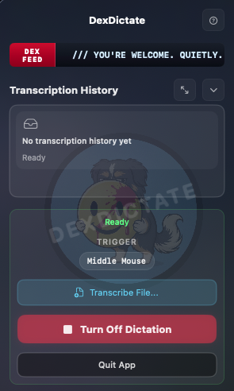
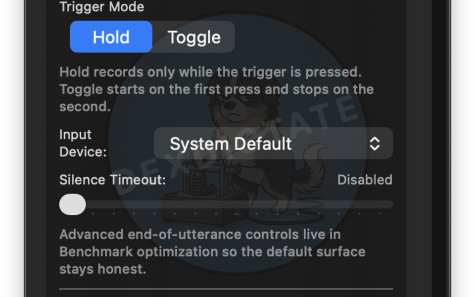
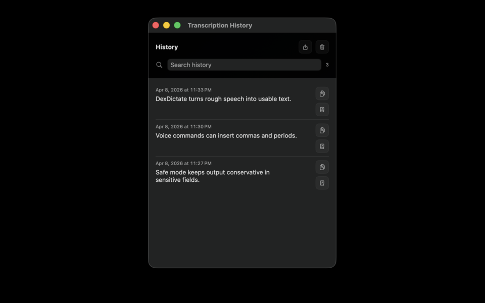
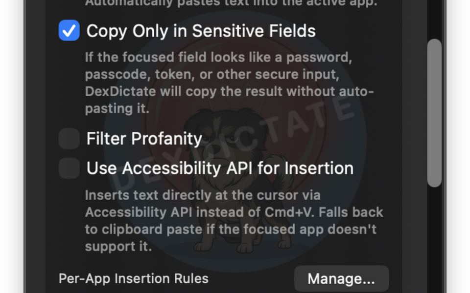

<div align="center">
  
</div>

<div align="center">


[](https://github.com/sponsors/westkitty)
[](https://ko-fi.com/westkitty)

</div>

# DexDictate for macOS

DexDictate is a macOS menu-bar dictation app for Apple Silicon Macs. It captures audio from your microphone, transcribes locally with Whisper, applies local post-processing such as voice commands and vocabulary replacements, and then saves or inserts the result according to your output settings.

The repository ships the app, the shared runtime library, a verification helper, benchmark tooling, release packaging scripts, and the help/documentation assets used by the product itself.

## At a glance

- Platform: macOS 14+ on Apple Silicon (`arm64`)
- Runtime: Swift Package Manager, SwiftUI, AppKit, AVFoundation, ApplicationServices
- Transcription: local Whisper via [SwiftWhisper](https://github.com/exPHAT/SwiftWhisper)
- Default model: bundled `tiny.en`
- Distribution: source build via `./build.sh`, plus optional packaged releases
- Project status: published as-is; active development is no longer guaranteed

## Screenshots

These images are reused from the repository's existing help asset set.

| Main popover | Trigger setup |
| --- | --- |
|  |  |
| History window | Output controls |
|  |  |

## What DexDictate does

- Runs as a menu-bar utility with first-run onboarding, quick settings, help, and a detachable history window.
- Records from the selected microphone device and shows live input activity while dictation is active.
- Captures a global trigger from a keyboard shortcut or mouse button, with `Hold` and `Toggle` trigger modes.
- Transcribes locally with Whisper and keeps runtime transcription off the network.
- Applies built-in voice commands, bundled vocabulary packs, and user-defined vocabulary or command overrides.
- Delivers output using save-only, clipboard paste, Accessibility API insertion, or app-specific insertion rules.
- Falls back to copy-only behavior for likely secure fields and offers a broader `Safe Mode` preset.
- Supports launch at login, floating HUD display, sound cues, optional history persistence, and imported audio-file transcription.
- Includes benchmarking, corpus capture, model comparison, release validation, and verification tooling in the repository.

## Requirements

- macOS 14 or later
- Apple Silicon (`arm64`)
- Xcode 15 or Command Line Tools for source builds
- Internet access once if `tiny.en.bin` needs to be downloaded by the setup scripts

## Install

### Option 1: Use a packaged release

If the repository has published release artifacts, download the latest `arm64` `.dmg` or `.zip` from [Releases](https://github.com/WestKitty/DexDictate_MacOS/releases).

Typical release artifact names follow this pattern:

- `DexDictate-<version>-macos-arm64.dmg`
- `DexDictate-<version>-macos-arm64.zip`

For the `.dmg` flow:

1. Open the disk image.
2. Drag `DexDictate.app` into `/Applications`.
3. Launch the app and complete onboarding.

### Option 2: Build from source

```bash
git clone https://github.com/WestKitty/DexDictate_MacOS.git
cd DexDictate_MacOS
./build.sh
```

`./build.sh` will:

- fetch and verify the bundled Whisper model if it is missing
- build the app and the `VerificationRunner` helper in release mode
- sign the bundle with the named development certificate when available, otherwise ad-hoc sign it
- install the app into `/Applications` when writable, otherwise `~/Applications`

Useful install variants:

```bash
./build.sh --user
./build.sh --system
INSTALL_DIR=/Applications ./build.sh
```

## First launch

DexDictate's onboarding walks through the three permissions it needs for normal use:

- Accessibility
- Input Monitoring
- Microphone

After onboarding:

1. Open the menu-bar item.
2. Confirm or change the trigger shortcut in Quick Settings.
3. Use the default middle-mouse trigger or your custom trigger to start dictation.
4. Review output behavior, history persistence, floating HUD, and per-app insertion rules if needed.

## Feature details

### Dictation and capture

- Global trigger capture with keyboard shortcuts or mouse buttons
- `Hold to Talk` and `Click to Toggle` trigger modes
- Input device selection with system-default fallback
- Live microphone level feedback
- Silence timeout and utterance-end tuning controls

### Output and safety controls

- Auto-paste output into the active app
- Clipboard-only fallback for likely secure fields
- Optional Accessibility API insertion
- Per-app insertion overrides by bundle identifier
- `Safe Mode` preset that turns off auto-paste, sound cues, and toggle-style triggering

### Language and correction tools

- Bundled vocabulary packs layered with user vocabulary
- Built-in voice commands such as casing, deletion, and line breaks
- Custom `Dex <keyword>` commands
- Optional profanity filtering

### History, onboarding, and UI

- Four-step onboarding flow
- Detached transcription history window
- Help window backed by repository-owned screenshot assets
- Floating HUD and menu-bar icon variants
- Launch-at-login support through `SMAppService`

### Repository tooling

- `VerificationRunner` executable for invariant checks
- Benchmark scripts and corpus assets
- Release packaging into `.zip` and `.dmg`
- Release validation covering bundle integrity, architecture, signing, entitlements, and hashes
- GitHub Actions workflow that runs `swift build` and `swift test` on `main` pushes and pull requests

## Development workflow

```bash
./scripts/fetch_model.sh
swift build
swift test
swift run VerificationRunner
./build.sh
```

Useful repository commands:

- `./build.sh [--user|--system] [--release]`
- `./scripts/setup_dev_env.sh`
- `./scripts/fetch_model.sh`
- `./scripts/run_quality_paths.sh`
- `./scripts/benchmark.sh --audio <wav>`
- `python3 scripts/benchmark.py --corpus-dir <dir>`
- `./scripts/benchmark_regression.sh <wav> [baseline_ms]`
- `./scripts/trim_benchmark_corpus.sh <input_dir> [output_dir]`
- `./scripts/validate_release.sh [path_to_app_bundle]`

## Repository layout

```text
.
├── Sources/
│   ├── DexDictate/         # menu-bar app target
│   ├── DexDictateKit/      # transcription, settings, permissions, output, resources
│   └── VerificationRunner/ # verification and benchmark helper executable
├── Tests/DexDictateTests/  # unit and integration tests
├── scripts/                # build, benchmark, setup, and validation tooling
├── docs/                   # feature inventory, help content, and long-form project docs
├── assets/                 # artwork, marketing images, icons, and source visuals
├── sample_corpus/          # benchmark sample audio and transcripts
├── templates/              # Info.plist template used during bundle assembly
├── build.sh                # canonical build, install, and release entry point
└── Package.swift           # Swift Package Manager manifest
```

## Limitations and scope

- Apple Silicon only. The build script rejects Rosetta and Intel shells.
- The bundled model is `tiny.en`, and the repository is currently centered on English-language local transcription.
- Full functionality depends on Accessibility, Input Monitoring, and Microphone permissions.
- The project is distributed as-is. The codebase is usable, but active roadmap work is not promised.

## Additional documentation

- [Feature inventory](docs/FEATURE_INVENTORY.md)
- [Help content draft](docs/help/HELP_CONTENT.md)
- [Help asset shot list](docs/help/HELP_ASSETS.md)
- [Contributing guidance](CONTRIBUTING.md)

## Contributing

Issues and pull requests are welcome, but review and merge are not guaranteed. See [CONTRIBUTING.md](CONTRIBUTING.md) for the current project status and the recommended validation steps before opening a change.

## License

This repository is released under the [Unlicense](LICENSE).

## Why Dexter?

*Dexter is a small, tricolor Phalène dog with floppy ears and a perpetually unimpressed expression... ungovernable, sharp-nosed and convinced he’s the quality bar. Alert, picky, dependable and devoted to doing things exactly his way: if he’s staring at you, assume you’ve made a mistake. If he approves, it means it works.*
