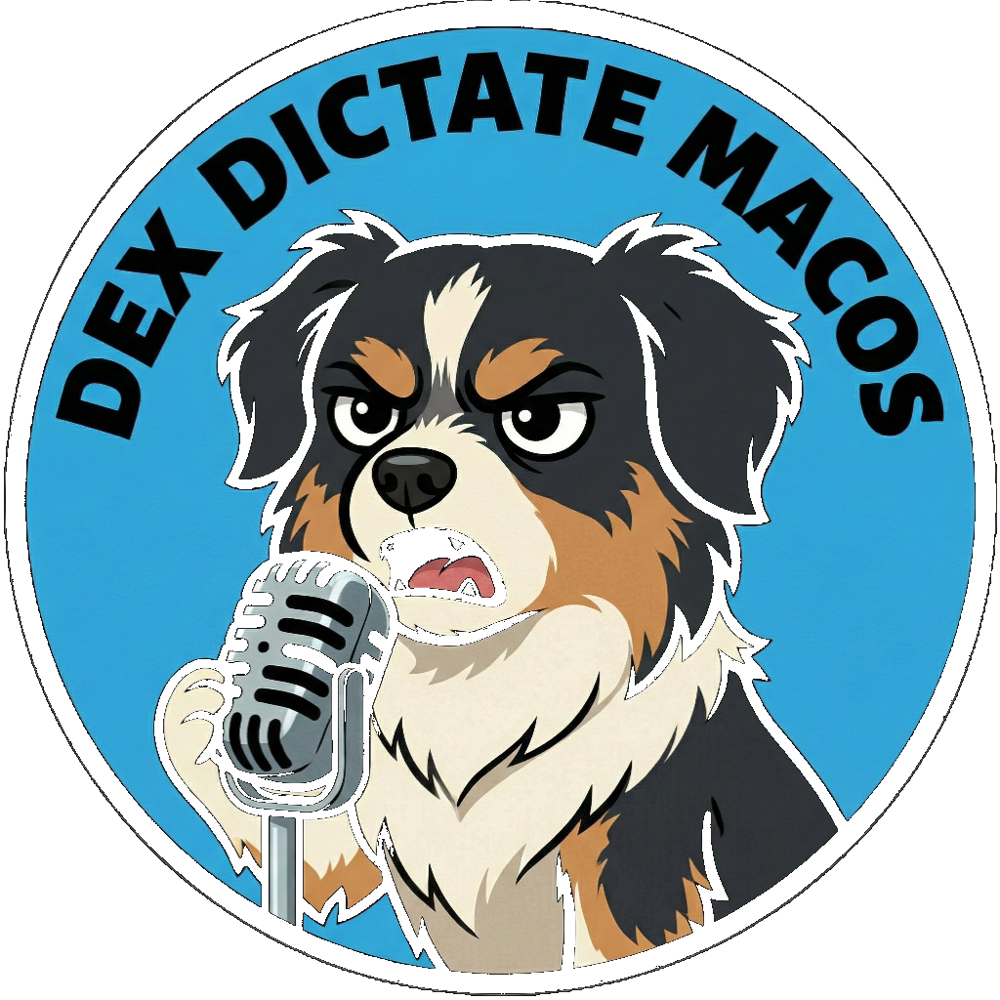
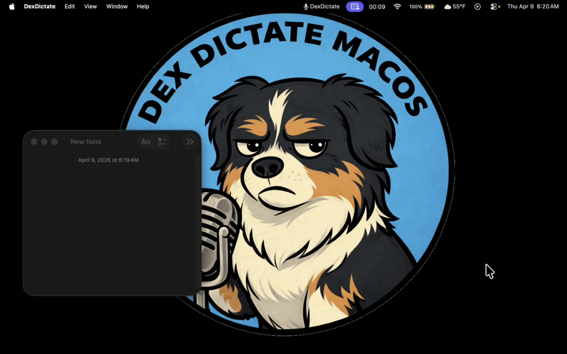

---
[](https://github.com/westkitty/DexDictate_MacOS)

---

<div align="center">


[](https://github.com/sponsors/westkitty)
[](https://ko-fi.com/westkitty)

</div>

<p align="center">
Local, privacy-first voice dictation for macOS.
</p>
<p align="center">
No cloud. No telemetry. No nonsense.
</p>

<div align="center">  </div>

<p align="center">
Dexter approves.</p> 
<p align="center">
Barely.</p>


---

<h2 align="center">DexDictate_MacOS</h2>

---

## What This Is

DexDictate is a local-first macOS menu-bar dictation app for Apple Silicon Macs. It records from your microphone, transcribes on-device with Whisper, applies local post-processing such as voice commands and vocabulary correction, and then saves or inserts the result according to your output settings.

This is not a cloud wrapper.

It does not "phone home."

---

<p align="center">
  
</p>

## Install (Preferred for New Users)

### Option 1: Install the latest packaged release (recommended)

Use the newest release artifact first. Current latest release: **v1.8.0**  
Release page: [v1.8.0](https://github.com/westkitty/DexDictate_MacOS/releases/tag/v1.8.0)

Download one of these Apple Silicon artifacts:

- `DexDictate-1.8.0-macos-arm64.dmg`
- `DexDictate-1.8.0-macos-arm64.zip`
- `DexDictate-1.8.0-macos-arm64-SHA256SUMS.txt`

Standard `.dmg` flow:

1. Open the disk image.
2. Drag `DexDictate.app` into `/Applications`.
3. Launch the app and complete onboarding.

### Option 2: Build from source

```bash
git clone https://github.com/westkitty/DexDictate_MacOS.git
cd DexDictate_MacOS
./build.sh
```

`./build.sh` will:

- fetch and verify the bundled Whisper model if it is missing
- build the app and the `VerificationRunner` helper
- sign the bundle
- install into `/Applications` when writable, otherwise `~/Applications`

Useful variants:

```bash
./build.sh --user
./build.sh --system
INSTALL_DIR=/Applications ./build.sh
```

## Requirements

- macOS 14 or later
- Apple Silicon (`arm64`)
- Xcode 15 or Command Line Tools (for source builds)

Intel Macs are not supported. The build script rejects x86_64 environments.

## First Launch (macOS Permissions)

On first run, macOS will ask for:

1. Microphone
2. Accessibility
3. Input Monitoring

Grant them.

If you skip them, it won't work.  
This is macOS, not a suggestion.

---

## Full Feature List

### Dictation and capture

- Menu-bar utility with four-step onboarding flow
- Local Whisper transcription via [SwiftWhisper](https://github.com/exPHAT/SwiftWhisper)
- Bundled default model: `tiny.en`
- Global trigger capture from keyboard shortcuts or mouse buttons
- Trigger modes: `Hold to Talk` and `Click to Toggle`
- Input device selection with system-default fallback
- Live microphone level feedback
- Silence timeout and utterance-end tuning controls
- Optional floating HUD while recording/transcribing
- Optional sound cues

### Output and insertion controls

- System-wide dictation into whatever app currently holds focus
- **Auto-paste toggle in the menu-bar dropdown** — click the `Auto-paste` pill to switch it on or off; the change persists and applies to the next dictation
- **Auto-paste off inserts nothing and leaves your clipboard untouched** — the result is still transcribed and kept in history
- **Selected text is replaced** — select `red` in `The red fox`, dictate `blue`, get `The blue fox`
- Direct Accessibility insertion where the target supports it, with clipboard paste as the fallback
- Clipboard-only fallback for likely secure fields
- Per-app insertion overrides by bundle identifier
- Replace-field mode (Cmd+A then paste) for single-input targets such as address bars and search fields — not for documents or multi-line fields
- Focused-element identity matching before paste delivery to prevent wrong-target insertion
- Editable-element validation before paste (role-aware; fails open for ambiguous AX contexts)
- Original clipboard contents are restored after an auto-paste
- Launch-at-login support through `SMAppService`

### Undo Last Dictation

- Sits **beside the Auto-paste pill** in the menu-bar dropdown, and is also bound to `⌃⌥⌘Z`
- Enabled only once DexDictate has confirmed what actually landed — either a verified Accessibility write, or a clipboard paste whose result it re-read on the saved field. This covers TextEdit and supported browser composers
- Removes only the text that dictation inserted, restoring what was there before — including text that was replaced from a selection
- **Refuses safely if you edited the text afterwards**, rather than overwriting your edit; the control stays visible and states the reason
- Always visible, with the reason shown in place when it is unavailable — no hover required

### Browser fields

- **Placeholder protection**: an empty web composer reports its prompt text through the Accessibility API as if it were real content. DexDictate never treats that as editable text, never inserts it, and never writes it back on undo — the field receives only what you dictated
- Undoing a dictation in an empty composer restores it to empty, letting the app render its own placeholder again
- DexDictate asks the target application to enable its accessibility tree, which is what makes verified insertion and undo possible in Chromium-based browsers

### Language and cleanup

- Built-in voice commands for editing and formatting
- Bundled vocabulary packs
- User vocabulary layering and correction rules
- Custom `Dex <keyword>` commands
- Optional profanity filtering
- Optional focused-field context injection to prime transcription accuracy for proper nouns and continuing sentences

### Safety and privacy

- Local-only runtime transcription (no cloud path)
- Safe handling for likely password/secure fields
- `Safe Mode` preset for stricter behavior
- No telemetry and no speech analytics pipeline

### History and UX

- Detachable transcription history window
- Quick settings popover that expands wider (not taller) with a spring animation
- Randomized launch animation drawn from a pool of original short films
- Help content backed by repository-owned assets

### Developer and release tooling

- `VerificationRunner` executable for verification checks
- Benchmark scripts and sample corpus
- Release packaging for `.zip` and `.dmg` with the local `DexDictate Development` signing identity
- Release validation for bundle integrity, architecture, signing, entitlements, and hashes
- GitHub Actions CI for `swift build` and `swift test` on `main` pushes and pull requests, with required status checks gating merges into `main`

---

## Basic Usage

1. Launch the app
2. Trigger dictation via shortcut (default configured in-app)
3. Speak
4. Text appears where your cursor is — replacing your selection if you had one

That's the entire point.

To keep a result without touching the focused app, turn `Auto-paste` off in the
menu-bar dropdown: the transcription is still saved to history, and your clipboard
is left exactly as you had it. To take an insertion back, use `Undo Last Dictation`
next to the same pill, or press `⌃⌥⌘Z`.

---

## Limitations

- Undo is not offered for every delivery. It is armed only when DexDictate can prove
  exactly what changed, and it says why when it cannot.
- A paste landing at the very start or very end of existing text produces the same
  result as a placeholder that survived alongside it. Those two cannot be told apart,
  so such deliveries are left unverified and undo stays disabled rather than risk
  restoring the wrong text.
- Verified browser undo depends on the browser exposing its accessibility tree.
  DexDictate requests this, but an app that declines will fall back to an unverified
  paste with undo unavailable.
- Replace-field mode is for single-input targets only; it will clear a document or
  multi-line field.
- Apple Silicon only. Intel Macs are not supported.

---

## Security & Privacy

- All audio is processed locally
- No network calls for transcription
- No analytics, tracking, or logging of user speech
- No hidden services

If something leaves your machine it's because you explicitly added it.

---

## Development Workflow

```bash
./scripts/fetch_model.sh
swift build
swift test
swift run VerificationRunner
./build.sh
```

Useful commands:

- `make check` (lint + build + test) — local quality gate; run `make help` to list all targets
- `./build.sh [--user|--system] [--release]` (`--release` requires the `DexDictate Development` signing identity; local non-release builds may use ad-hoc signing)
- `./scripts/setup_dev_env.sh`
- `./scripts/fetch_model.sh`
- `./scripts/run_quality_paths.sh`
- `./scripts/verify_audio_route_recovery.sh`
- `./scripts/benchmark.sh --audio <wav>`
- `python3 scripts/benchmark.py --corpus-dir <dir>`
- `./scripts/benchmark_speech_matrix.sh --corpus-dir sample_corpus`
- `./scripts/benchmark_regression.sh <wav> [baseline_ms]`
- `./scripts/trim_benchmark_corpus.sh <input_dir> [output_dir]`
- `./scripts/validate_release.sh [path_to_app_bundle]`

## Repository Layout

```text
.
├── Sources/
│   ├── DexDictate/         # menu-bar app target
│   ├── DexDictateKit/      # transcription, settings, permissions, output, resources
│   └── VerificationRunner/ # verification and benchmark helper executable
├── Tests/DexDictateTests/  # unit and integration tests
├── scripts/                # build, benchmark, setup, and validation tooling
├── docs/                   # feature inventory, help content, and long-form project docs
├── assets/                 # artwork, marketing images, icons, and source visuals
├── sample_corpus/          # benchmark sample audio and transcripts
├── templates/              # Info.plist template used during bundle assembly
├── build.sh                # canonical build, install, and release entry point
└── Package.swift           # Swift Package Manager manifest
```

## Additional Documentation

- [Feature inventory](docs/FEATURE_INVENTORY.md)
- [Security audit](docs/archive/SECURITY_AUDIT_REPORT.md)
- [Verification report](docs/archive/VERIFICATION_REPORT.md)
- [Contributing guidance](CONTRIBUTING.md)
- [Speech engine exploration](docs/speech_engine_exploration/README.md)
- [Moral architecture](BIBLE.md)

## Contributing

Issues and pull requests are welcome, but review and merge are not guaranteed. Keep changes specific, test-backed and realistic about current project scope.

---

DexDictate is not trying to be everything.

It is:

- Local
- Fast
- Private
- Minimal

If you want cloud AI orchestration this is the wrong tool.

---

## License

This repository is released under the Unlicense as public domain.
You could use it in a mutual aid project.
You could use it as a custom accessibility tool like I do.
Or you could even sell it if you felt like embarrassing yourself in public.
You can do whatever you want with it and you are encouraged to do so.

Remain ungovernable so Dexter approves.

See [LICENSE](LICENSE).

---

## Final Note

Dexter does not celebrate features.  
Dexter tolerates correctness.

This passes.

## Why Dexter?

*Dexter is a small, tricolor Phalène dog with floppy ears and a perpetually unimpressed expression... ungovernable, sharp-nosed and convinced he is the quality bar. Alert, picky, dependable, and devoted to doing things exactly his way: if he is staring at you, assume you made a mistake. If he approves, it works.*


---
---
---

Thanks to the Whisper team for developing such a useful tool.

---
