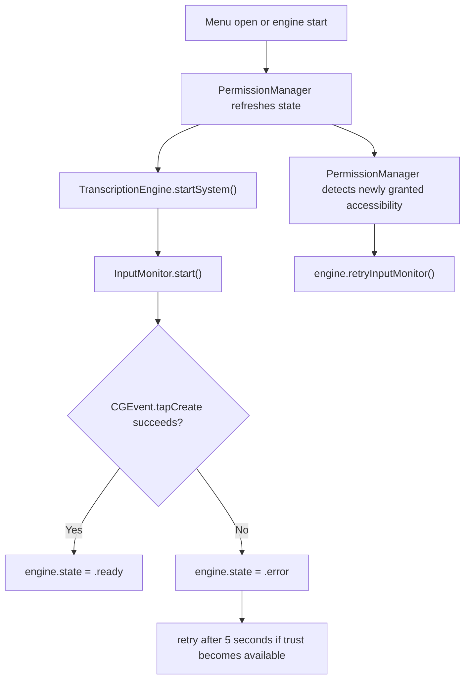
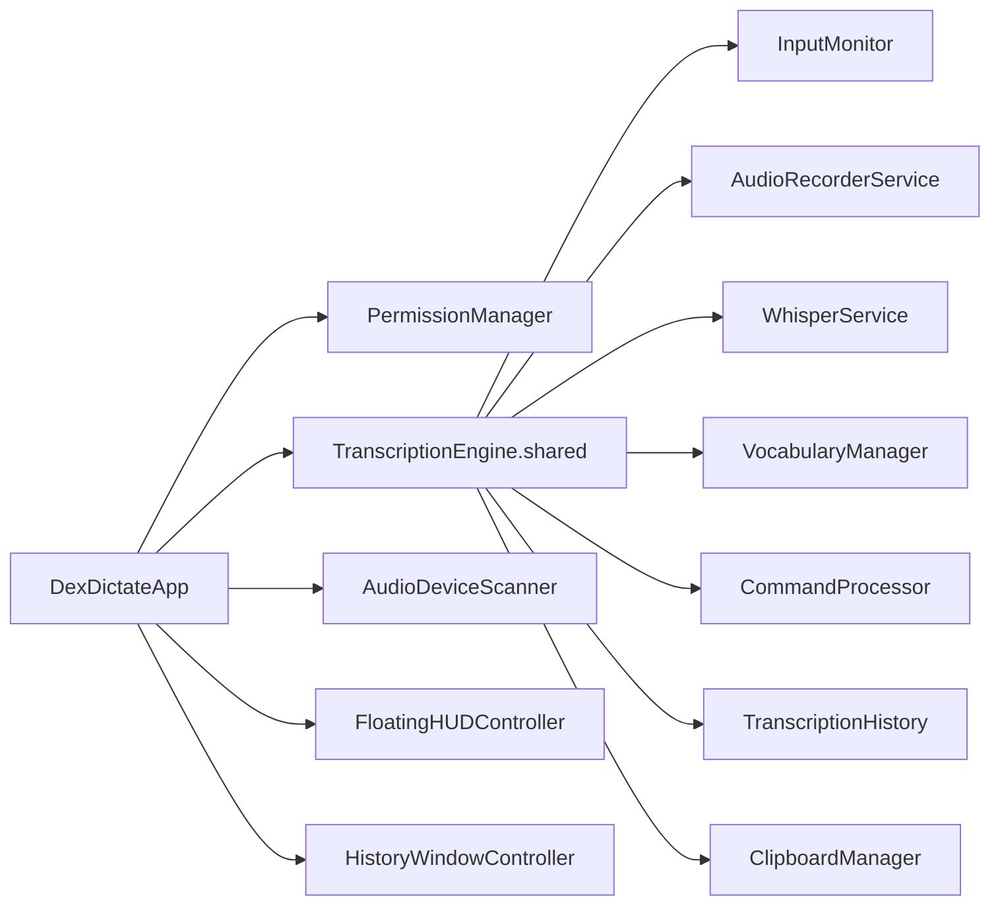
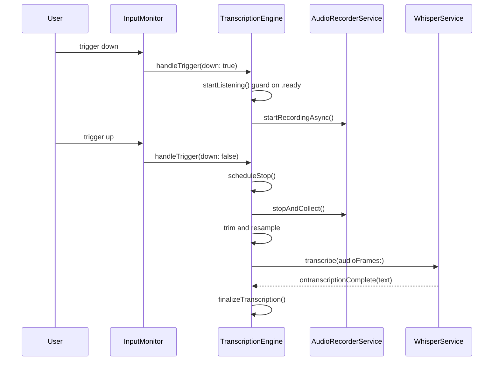

# DexDictate Bible

## Section 1. Title and Doctrine

### 1.1 What DexDictate is

DexDictate is a menu-bar-first macOS dictation bridge built as a Swift Package Manager project. It captures audio locally, transcribes it locally with Whisper via the `SwiftWhisper` package, applies local post-processing, stores session-local history, and can inject the final text into the frontmost app by simulating paste.

### 1.2 What DexDictate is not

- It is not a cloud transcription client.
- It is not a general speech recognition shell around Apple Speech Recognition.
- It is not a Dock-first or window-first productivity app.
- It is not a background telemetry collector.
- It is not currently a multi-model platform.

### 1.3 Product promise

- On-device, privacy-first dictation for macOS.
- No audio leaves the machine.
- Menu bar resident interaction model.
- Global trigger support via Quartz event tap.
- Local Whisper model execution.
- Optional auto-paste into the focused app.
- Lightweight history and HUD support.

### 1.4 Immutable constraints

- Preserve the existing permission trust chain and its effective order of operations.
- Preserve the menu-bar-first product identity.
- Preserve local-only transcription and avoid networking APIs in product logic.
- Preserve existing app icon, watermark usage, title treatment, and menu-bar identity.
- Treat `VerificationRunner` as a safety asset, not disposable scaffolding.
- Treat this Bible as additive-only after creation. Corrections must be appended, not overwritten.

### 1.5 Operational philosophy

- Prefer small, reviewable changes.
- Prefer explicit invariants over implied behavior.
- Preserve fragile macOS privacy behavior unless a fix is proven safe.
- Keep diagnostics local and privacy-safe.
- Document contradictions rather than hiding them.

## Section 2. Reconstruction Summary

### 2.1 Rebuild instructions at a glance

To reconstruct DexDictate from scratch, an engineer or AI needs to recreate:

1. A Swift Package Manager package targeting macOS 14 with:
   - library target `DexDictateKit`
   - executable target `DexDictate`
   - executable target `VerificationRunner`
   - test target `DexDictateTests`
2. A menu-bar application shell using `MenuBarExtra(.window)` and SwiftUI.
3. A shared `TranscriptionEngine` coordinating:
   - permission attachment
   - event tap setup
   - audio capture
   - resampling
   - Whisper transcription
   - command processing
   - vocabulary replacement
   - profanity filtering
   - history update
   - optional copy-and-paste injection
4. A polling `PermissionManager` that checks Accessibility, Input Monitoring, and Microphone separately.
5. A Quartz event tap monitor that only marks the engine ready when the tap is actually active.
6. A serial audio capture service using `AVAudioEngine` on a dedicated queue.
7. A local Whisper service loading the bundled `tiny.en.bin` model and serializing transcriptions.
8. Menu bar UI surfaces for onboarding, quick settings, history, and HUD.

### 2.2 Product surfaces

- Menu bar label and popover shell
- Onboarding window
- Permission banner
- Main controls
- Quick settings
- Inline history feed
- Detached history window
- Floating HUD
- Vocabulary editor window

### 2.3 Core runtime loops

- Menu-bar open loop: permission refresh plus one-time engine startup guard.
- Permission polling loop: every 2 seconds via `Timer`.
- Global input monitoring loop: Quartz event tap plus retry path.
- Audio capture loop: `AVAudioEngine` tap pushing samples into an in-memory buffer.
- Transcription loop: one batch per utterance after trigger release.

### 2.4 Critical dependencies

- `SwiftWhisper` pinned to revision `deb1cb6a27256c7b01f5d3d2e7dc1dcc330b5d01`
- `AVFoundation`
- `ApplicationServices`
- `CoreAudio`
- `ServiceManagement` is imported but not yet materially used for launch-at-login behavior

### 2.5 Non-negotiable privacy and permission behaviors

- Microphone permission is distinct from Accessibility and Input Monitoring.
- Accessibility and Input Monitoring are needed for global trigger capture and output injection support.
- Microphone permission is re-checked at dictation start to avoid bad Core Audio states.
- Permission refresh relies on polling rather than notifications.
- Event tap success is a hard readiness dependency.

## Section 3. Repository Structure

### 3.1 Top-level layout

- `Package.swift`: package definition and targets.
- `Sources/DexDictateKit`: core library code.
- `Sources/DexDictate`: app shell and SwiftUI surfaces.
- `Sources/VerificationRunner`: executable invariant and benchmark runner.
- `Tests/DexDictateTests`: current automated tests.
- `scripts/`: benchmark and release helpers.
- `templates/Info.plist.template`: generated app bundle metadata template.
- `docs/`: existing handoff and experiment artifacts.

### 3.2 Targets

- `DexDictateKit`
  - Central logic, services, settings, permissions, history, safety utilities.
- `DexDictate`
  - Executable app target and UI shell.
- `VerificationRunner`
  - Invariant checks and benchmark entry point.
- `DexDictateTests`
  - Light current unit coverage.

### 3.3 Major files

- `Sources/DexDictate/DexDictateApp.swift`
- `Sources/DexDictate/OnboardingView.swift`
- `Sources/DexDictate/PermissionBannerView.swift`
- `Sources/DexDictate/ControlsView.swift`
- `Sources/DexDictate/HistoryView.swift`
- `Sources/DexDictate/QuickSettingsView.swift`
- `Sources/DexDictate/FloatingHUD.swift`
- `Sources/DexDictate/HistoryWindow.swift`
- `Sources/DexDictateKit/TranscriptionEngine.swift`
- `Sources/DexDictateKit/PermissionManager.swift`
- `Sources/DexDictateKit/InputMonitor.swift`
- `Sources/DexDictateKit/Services/AudioRecorderService.swift`
- `Sources/DexDictateKit/Services/WhisperService.swift`
- `Sources/DexDictateKit/AppSettings.swift`
- `Sources/DexDictateKit/CommandProcessor.swift`
- `Sources/DexDictateKit/TranscriptionHistory.swift`
- `Sources/VerificationRunner/main.swift`

### 3.4 Build products

- SwiftPM release binary product `DexDictate_MacOS`
- App bundle generated by `build.sh` at `.build/DexDictate.app`
- Zipped and DMG artifacts from `scripts/build_release.sh`

### 3.5 Resources and assets

- Bundled model: `Sources/DexDictateKit/Resources/tiny.en.bin`
- Profanity list: `Sources/DexDictateKit/Resources/profanity_list.json`
- Iconography and watermark image assets in `Sources/DexDictateKit/Resources/Assets.xcassets`
- App bundle icon file in `Sources/DexDictate/AppIcon.icns`

### 3.6 Test and verification assets

- `sample_corpus/sample.wav`
- `sample_corpus/transcripts.json`
- `baseline.csv`
- `scripts/benchmark.sh`
- `scripts/benchmark.py`
- `scripts/parse_metrics.py`

## Section 4. Architecture Overview

### 4.1 Shell and composition

`DexDictateApp` is the entry point. It owns:

- shared `TranscriptionEngine`
- `PermissionManager`
- `AudioDeviceScanner`
- shared `AppSettings`
- `FloatingHUDController`
- `HistoryWindowController`

It uses a `MenuBarExtra` scene as the primary shell.

### 4.2 Core library

`DexDictateKit` currently mixes domain concerns in a flat target:

- permissions
- input monitoring
- audio capture
- transcription
- post-processing
- settings
- persistence-lite
- diagnostics

This is functional but only partially modularized.

### 4.3 Service layer

- `TranscriptionEngine`: lifecycle coordinator
- `PermissionManager`: polling and summary
- `InputMonitor`: event tap setup and dispatch
- `AudioRecorderService`: `AVAudioEngine` capture
- `WhisperService`: model loading and transcription serialization
- `AudioDeviceScanner`: device list refresh
- `ClipboardManager`: copy and paste injection
- `VocabularyManager`: custom substitutions
- `CommandProcessor`: voice-command transforms

### 4.4 Persistence and settings layer

- `AppSettings` persists user preferences through `@AppStorage`
- `VocabularyManager` persists its array to `UserDefaults`
- `TranscriptionHistory` is in-memory only for the current session

### 4.5 UI surface relationships

- Main popover composes:
  - `PermissionBannerView`
  - `HistoryView`
  - `ControlsView`
  - `QuickSettingsView`
  - `FooterView`
- Onboarding is separate window-first, shown by `AppDelegate` when onboarding is incomplete
- Detached history and vocabulary editor use separate `NSWindow` instances
- Floating HUD is separate `NSPanel`

### 4.6 Cross-component communication

- Direct shared singleton access is common
- UI observes `ObservableObject` state directly
- `TranscriptionEngine` retains services directly and holds a weak `PermissionManager`
- `InputMonitor` holds a weak engine pointer
- `PermissionManager` holds a weak engine pointer for accessibility recovery

## Section 5. Runtime Lifecycle

### 5.1 Launch sequence

Observed from source:

1. `DexDictateApp.init()` calls `Safety.setupDirectories()`.
2. `AppDelegate.applicationDidFinishLaunching` checks `AppSettings.shared.hasCompletedOnboarding`.
3. If onboarding is incomplete, onboarding window opens.
4. If onboarding is already complete, the app eagerly requests microphone access with `AVCaptureDevice.requestAccess(for: .audio)`.

Note: this eager post-onboarding microphone request is in tension with the intended “request separately at dictation time” doctrine and must be preserved until explicitly corrected with proof and tests.

### 5.2 Menu open behavior

Each popover open triggers:

1. `permissionManager.startMonitoring(engine:)`
2. `permissionManager.refreshPermissions()`
3. If engine is not `.stopped`, exit early
4. `permissionManager.requestPermissions()`
5. `permissionManager.requestMicrophoneIfNeeded()`
6. `engine.setPermissionManager(permissionManager)`
7. load embedded Whisper model if needed
8. `engine.startSystem()`
9. set up HUD and history controllers
10. show HUD if setting enabled

Note: `startMonitoring(engine:)` is called on every menu appearance and does not currently guard against stacking timers. This is a likely defect candidate.

### 5.3 Engine start behavior

`TranscriptionEngine.startSystem()`:

1. Guards that state is `.stopped`
2. Moves to `.initializing`
3. Sets status text to “Requesting Access...”
4. Calls `setupInputMonitor()`
5. If event tap is active, moves to `.ready`
6. Otherwise leaves error path to the async update in `InputMonitor`

### 5.4 Dictation lifecycle

Hold-to-talk path:

1. Trigger down enters `handleTrigger(down: true)`
2. Session ID resets and pending stop task is cancelled
3. `startListening()` runs if not already listening
4. `startListening()` guards state `.ready`
5. Microphone permission is requested if needed
6. Microphone authorization status is checked synchronously
7. Audio recording starts off-main on `audioQueue`
8. Trigger up schedules delayed stop using `ExperimentFlags.stopTailDelayMs`
9. `stopListening()` stops audio, collects samples, trims silence optionally, resamples to 16 kHz, submits one batch to Whisper
10. Whisper callback drives `handleWhisperResult`
11. `finalizeTranscription` processes commands, vocabulary, profanity, history, status, and optional auto-paste
12. Engine returns to `.ready`

### 5.5 Shutdown and reset behavior

`stopSystem()`:

- stops input monitor
- stops audio recording
- moves to `.stopped`
- resets status, live transcript, and input level

## Section 6. Permission Model and Execution Order

### 6.1 Entitlements

Current app entitlements in `Sources/DexDictate/DexDictate.entitlements`:

- `com.apple.security.device.audio-input = true`
- `com.apple.security.device.input-monitoring = true`

No separate accessibility entitlement exists because Accessibility trust is granted by TCC, not entitlement declaration.

### 6.2 Info.plist usage descriptions

Current generated/source-visible disclosures:

- `NSMicrophoneUsageDescription`
- `NSAppleEventsUsageDescription`

Observed contradiction:

- `Package.swift` targets macOS 14
- `templates/Info.plist.template` currently declares `LSMinimumSystemVersion` 14.0
- `Sources/DexDictate/Info.plist` declares `LSMinimumSystemVersion` 13.0
- README claims macOS 14+

This must be treated as a documentation and packaging inconsistency until resolved.

### 6.3 Permission polling

`PermissionManager` polls every 2 seconds using `Timer.scheduledTimer`.

Checks performed:

1. Accessibility via `AXIsProcessTrusted()`
2. Microphone via `AVCaptureDevice.authorizationStatus(for: .audio)`
3. Input Monitoring via `CGPreflightListenEventAccess()`

### 6.4 Prompting rules

Current prompting behavior:

- `PermissionManager.requestPermissions()` may prompt Accessibility and request Input Monitoring access
- `PermissionManager.requestMicrophoneIfNeeded()` requests microphone only when status is `.notDetermined`
- `DexDictateApp` currently also calls `requestMicrophoneIfNeeded()` on first menu open
- `AppDelegate` requests microphone access immediately at launch when onboarding is already complete

### 6.5 Accessibility flow

1. UI or app-open path calls `AXIsProcessTrustedWithOptions(prompt: true)`
2. `InputMonitor.start()` checks trust without prompting
3. If missing, monitor does not prompt again and logs a warning
4. Event tap creation may fail
5. Failure sets engine state to `.error` and schedules retry in 5 seconds
6. `PermissionManager` detects newly granted accessibility and calls `engine.retryInputMonitor()` after 1 second

### 6.6 Input Monitoring flow

1. `PermissionManager` checks preflight access with `CGPreflightListenEventAccess()`
2. `requestPermissions()` calls `CGRequestListenEventAccess()` when needed
3. Input tap creation depends on actual trust and runtime environment

### 6.7 Microphone flow

1. Microphone authorization is checked independently
2. Microphone can be requested by onboarding-adjacent flows and by dictation start path
3. `startListening()` hard-guards on `.authorized`
4. If not authorized, engine returns to `.ready` with user-facing status text

### 6.8 Event tap dependency chain



### 6.9 Exact operational order to preserve

Repository-derived effective order:

1. App launch and onboarding decision
2. Permission polling and refresh
3. Accessibility and Input Monitoring prompting behavior
4. Separate microphone request behavior
5. Event tap setup and retry behavior
6. Input monitoring and event tap readiness logic
7. Dictation start-time microphone authorization guard
8. Output injection behavior

### 6.10 What must not be changed

- Do not make event tap readiness implicit.
- Do not move dictation start past a missing-microphone guard.
- Do not add prompt spam from `InputMonitor`.
- Do not introduce cloud or network permission shortcuts.

## Section 7. Input and Trigger Architecture

### 7.1 Supported trigger types

- Mouse button plus optional modifiers
- Keyboard key plus modifiers
- Trigger mode: hold-to-talk or toggle

### 7.2 Storage model

`AppSettings.UserShortcut` is JSON-encoded into `userShortcutData` in `UserDefaults`.

Fields:

- `keyCode`
- `mouseButton`
- `modifiers`
- `displayString`

### 7.3 Mouse trigger path

- Event tap listens for `otherMouseDown` and `otherMouseUp`
- Matches button number and modifier mask
- Hold-to-talk dispatches down/up transitions to `handleTrigger`
- Toggle mode reacts on down only

### 7.4 Keyboard trigger path

- Event tap listens for `keyDown` and `keyUp`
- Matches keycode and modifier mask
- Same dispatch semantics as mouse

### 7.5 Event tap semantics

- Tap is inserted at `.cgSessionEventTap`, `.headInsertEventTap`
- Tap-disabled events are handled by re-enabling the tap
- Matching trigger events are consumed by returning `nil`

### 7.6 Failure cases and recovery

- Missing Accessibility usually causes tap creation failure
- System-disabled tap events are re-enabled in place
- Tap creation failure transitions engine to `.error`
- Retry occurs after 5 seconds and on permission recovery path

## Section 8. Audio Pipeline

### 8.1 Input device selection

- Selected device stored as `AppSettings.inputDeviceUID`
- Empty string means system default device
- `AudioDeviceManager.deviceID(forUID:)` resolves `AudioDeviceID`
- `AudioUnitSetProperty(kAudioOutputUnitProperty_CurrentDevice)` applies device choice

### 8.2 Threading model

- `AudioRecorderService` owns serial `audioQueue` for all `AVAudioEngine` lifecycle work
- `bufferQueue` protects accumulated samples
- `inputLevel` is published on the main actor

### 8.3 Tap installation

- Tap is installed on `engine.inputNode` bus 0
- Native hardware format is used for capture to avoid format mismatch crashes
- Resampling to Whisper format is deferred until after capture

### 8.4 Buffer accumulation

- Tap callback appends float samples into `_accumulatedSamples`
- RMS-derived normalized input level is pushed to UI

### 8.5 Stop-and-collect behavior

- `stopAndCollect()` synchronously drains `audioQueue`
- tap removed
- engine stopped
- input level reset
- sample buffer drained atomically

### 8.6 Sleep/wake handling

- `willSleepNotification` stops the engine and removes the tap if recording
- wake does not automatically restart recording; next recording attempt restarts engine path

### 8.7 Route changes

Current state:

- `AudioDeviceScanner` updates available device list on device topology changes
- `AudioRecorderService` does not yet implement explicit route-change recovery for an actively selected disappearing device
- This is a roadmap item, not solved baseline behavior

### 8.8 Sample rate handling

- Capture occurs at native device sample rate
- `AudioResampler.resampleToWhisper` converts to 16 kHz for Whisper
- Optional silence trimming can run before resampling

### 8.9 Main actor boundaries

- UI state updates occur on `@MainActor`
- audio engine work occurs on `audioQueue`
- whisper service is `@MainActor` but transcription work awaits async library execution

## Section 9. Transcription Pipeline

### 9.1 Model loading

- Embedded model `tiny.en.bin` is bundled in the library resource bundle
- `WhisperService.loadEmbeddedModel()` resolves model from `Bundle.module`
- optional Core ML encoder sidecar `<model>-encoder.mlmodelc` is detected if present

### 9.2 Parameter strategy

Current decode profile is optimized for latency:

- greedy strategy
- `best_of = 1`
- optional `speed_up = true` in speed profile
- thread count capped at 4
- timestamps disabled
- `no_context = true`
- `single_segment = true`
- `max_tokens = 128`
- non-speech token suppression enabled

### 9.3 Batch transcription behavior

- Streaming has been intentionally removed or avoided
- One utterance is submitted after trigger release
- Concurrent transcriptions are prevented by cancelling prior transcription task before starting a new one

### 9.4 Why streaming is avoided

Source comments explicitly state that per-chunk streaming caused `instanceBusy` errors and empty output because whisper.cpp behaves as a batch model expecting complete utterances at 16 kHz.

### 9.5 Result handling

- Whisper delegate joins segments into a single string
- content is privacy-redacted in logs by character count
- engine trims whitespace and either returns to ready or finalizes transcription

### 9.6 Failure behavior

- failed model load leaves `isModelLoaded = false`
- failed transcription logs an error and clears `isTranscribing`
- empty transcription returns engine to ready without history insertion

## Section 10. Post-Processing Pipeline

### 10.1 Command processing

Current commands:

- `scratch that`
- `new line` / `next line`
- `all caps`

### 10.2 Vocabulary application

- `VocabularyManager` applies regex-safe substitutions case-insensitively
- items persist via `UserDefaults`

### 10.3 Profanity filter

- optional boolean setting
- driven by bundled JSON list

### 10.4 History behavior

- history is session-local, not persisted
- newest entry inserted at the front
- cap is 50 items

### 10.5 Auto-paste and output semantics

- if `autoPaste` is enabled, text is copied to clipboard, Cmd+V is simulated, then the original clipboard text is restored after a short delay
- if command-only utterance resolves to empty text, nothing is inserted

### 10.6 Current destructive behavior caveat

- “scratch that” can remove the most recent history item if spoken alone
- there is no undo or confirm affordance yet

## Section 11. Settings and Persistence

### 11.1 Current settings keys

Observed `@AppStorage` and related persisted keys:

- `triggerMode`
- `inputButton`
- `silenceTimeout`
- `inputDeviceUID`
- `playStartSound`
- `playStopSound`
- `showVisualHUD`
- `selectedStartSound`
- `selectedStopSound`
- `autoPaste`
- `profanityFilter`
- `appendMode`
- `launchAtLogin`
- `hasCompletedOnboarding`
- `showFloatingHUD`
- `selectedEngine`
- `appearanceTheme_stored`
- `userShortcutData`
- `customVocabulary` via `VocabularyManager`

### 11.2 Theme model

Current appearance themes:

- `system`
- `cyberpunk`
- `minimalist`
- `highContrast`

### 11.3 Trigger model

- `TriggerMode.holdToTalk`
- `TriggerMode.toggle`
- default shortcut is middle mouse

### 11.4 Migration risk

- Settings are unversioned at baseline
- several keys are legacy aliases or placeholders
- `launchAtLogin` is surfaced as persisted state without implementation
- `appendMode` is explicitly marked reserved and not implemented

### 11.5 Settings invariants

- selected engine must remain Whisper-only in current product contract
- user shortcut must decode or fall back to middle mouse default
- onboarding completion controls launch-time onboarding display

## Section 12. UI Surface Inventory

### 12.1 MenuBarExtra shell

- Label text is “DexDictate” unless recording, then “Recording”
- icon changes with engine listening state

### 12.2 Main popover

- fixed frame 320 x 540
- background depends on appearance theme
- includes large app-icon watermark and rotated “DEXDICTATE” watermark text

### 12.3 Permission banner

- orange banner with missing permission summary
- currently single-line text and one settings button

### 12.4 History view

- expandable 100 pt / 300 pt history area
- inline live transcript and input meter while listening
- copy button per row

### 12.5 Controls

- start/stop dictation system button
- status text
- trigger hint
- quit button

### 12.6 Quick settings

- collapsible panel
- sound feedback controls
- appearance picker
- output toggles
- input device picker
- silence timeout
- vocabulary window launcher
- shortcut recorder

### 12.7 Onboarding window

- four-page flow
- welcome
- permissions
- shortcut
- completion

### 12.8 Floating HUD

- transparent floating `NSPanel`
- icon and “DEX” watermark
- state icon, status text, and microphone bar for active states

### 12.9 Detached history window

- export action
- clear action
- row copy actions

### 12.10 Immutable brand assets

- app icon watermark usage in main popover and floating HUD
- `DEXDICTATE` and `DEX` watermark text treatment
- app icon asset and menu bar title treatment

## Section 13. Diagnostics and Verification

### 13.1 Existing diagnostics

- `Safety.log` writes to `NSLog` and `~/Library/Application Support/DexDictate/debug.log`
- logs are local-only
- retention is currently unbounded baseline behavior

### 13.2 VerificationRunner behavior

`VerificationRunner` currently exercises:

- onboarding persistence
- Whisper pinning assumptions
- profanity filter operation
- no-network-source invariant scan
- history cap behavior
- command processor behavior
- watermark presence by source scan
- benchmark mode using bundled or requested model

### 13.3 Build and test entry points

- `swift build`
- `swift test`
- `swift run VerificationRunner`
- `scripts/benchmark.sh sample_corpus/sample.wav`
- `build.sh`
- `scripts/build_release.sh`

### 13.4 Always-run safety checks after changes

Minimum doctrine for this program:

- build
- `VerificationRunner`
- changed tests
- manual smoke checks for affected surfaces
- invariant review:
  - local-only behavior preserved
  - permission order preserved
  - menu-bar-first model preserved
  - brand assets preserved

### 13.5 Latency measurement points

Current engine metrics track timestamps for:

- trigger up
- audio stop
- resample done
- whisper submit
- whisper done

CSV-like metric line emitted:

- epoch timestamp
- raw sample count
- trimmed sample count
- resampled sample count
- trigger-up to audio-stop ms
- audio-stop to resample ms
- whisper-submit to whisper-done ms
- total trigger-up to whisper-done ms

### 13.6 Manual QA flows to preserve

- first launch with onboarding incomplete
- permission recovery after granting accessibility while app stays open
- trigger capture in hold-to-talk mode
- trigger capture in toggle mode
- auto-paste into another app
- detached history open/export/clear
- floating HUD show/hide

## Section 14. Known Risks and Fragilities

### 14.1 Permission flow fragility

- permission checks and prompting are split across `AppDelegate`, `DexDictateApp`, `PermissionManager`, and `TranscriptionEngine`
- prompt timing is easy to break
- the current code already contains multiple microphone request sites

### 14.2 Event tap fragility

- readiness depends on actual tap creation
- retries are time-based and not strongly modeled
- trigger capture sits inside a callback that directly reads singleton settings

### 14.3 Singleton and coupling risk

- `TranscriptionEngine.shared`
- `AppSettings.shared`
- direct singleton reads inside event tap callback and UI

### 14.4 UI density constraints

- main popover is compact and carries many functions
- quick settings and history both compete for vertical space

### 14.5 Settings migration risk

- schema is not versioned
- legacy and reserved keys already exist

### 14.6 Launch-at-login gap

- README and settings suggest a system integration expectation
- source comment in `AppSettings` explicitly states `SMAppService` integration is pending

### 14.7 Platform-version inconsistency

- package target says macOS 14
- one plist says 13
- README says 14
- template says 14

### 14.8 Monitoring timer duplication risk

`PermissionManager.startMonitoring(engine:)` assigns a new repeating timer without invalidating an existing timer first. Because `DexDictateApp` calls this in `.onAppear`, repeated menu opens may create multiple active timers. This requires verification and likely remediation.

## Section 15. Roadmap Index

Status markers:

- `pending`
- `in_progress`
- `complete`
- `blocked`
- `superseded`

| ID | Phase | Improvement | Dependencies | Status |
| --- | --- | --- | --- | --- |
| R21 | 1 | Formal explicit engine state machine | baseline | pending |
| R22 | 1 | Protocol-backed dependency seams | R21-informed inventory | pending |
| R23 | 1 | Layered automated test expansion | R21-R22 helpful but not all required | pending |
| R24 | 1 | Latency regression benchmark workflow | baseline benchmark path | pending |
| R25 | 1 | Structured privacy-safe diagnostics/logging | baseline logging inventory | pending |
| R27 | 1 | Settings schema versioning and migrations | settings inventory | pending |
| R26 | 2 | Audio route-change recovery and default-device failover | audio inventory | pending |
| R28 | 2 | Launch-at-login truthfulness and implementation | settings and UI truthfulness | pending |
| R30 | 2 | Clearer subdomain modularization | after safety rails preferred | pending |
| R11 | 3 | Live onboarding permission checklist | permission model clarity | pending |
| R12 | 3 | First-run trigger test | event tap readiness exposure | pending |
| R13 | 3 | First-run microphone test | audio diagnostics exposure | pending |
| R14 | 3 | Distinct error mapping | state and diagnostics improvements | pending |
| R15 | 4 | Safe mode preset | settings versioning helpful | pending |
| R16 | 4 | Destructive-command undo/confirm affordance | result-state surfacing helpful | pending |
| R17 | 4 | Keyboard accessibility and VoiceOver improvements | UI passes | pending |
| R18 | 4 | Secure-context soft warning / copy-only option | output seam helpful | pending |
| R19 | 4 | History search/filter/timestamps | history UI work | pending |
| R20 | 4 | Clear post-transcription result feedback state | state and diagnostics helpful | pending |
| R01 | 5 | Spacing and typography tokens | UI polish phase | pending |
| R02 | 5 | Stronger section hierarchy | R01 helpful | pending |
| R03 | 5 | State-colored border accents | R01 helpful | pending |
| R04 | 5 | Better empty-history presentation | UI polish phase | pending |
| R05 | 5 | Trigger display monospaced pill | controls UI phase | pending |
| R06 | 5 | Permission banner multiline/truncation improvements | UI polish phase | pending |
| R07 | 5 | Quick settings affordance/grouping improvements | UI polish phase | pending |
| R08 | 5 | Detached history visual alignment | UI polish phase | pending |
| R09 | 5 | Hover/focus states | UI polish phase | pending |
| R10 | 5 | Reduced-transparency visual path | accessibility UI pass | pending |
| R29 | 6 | Release automation and integrity validation | build and signing inventory | pending |

## Section 16. Additive Implementation Ledger

Entry template for all future work:

- Entry ID:
- Timestamp:
- Improvement ID(s):
- Goal:
- Why now:
- Dependency context:
- Files likely or actually changed:
- Risk assessment:
- Invariant check:
- What was attempted:
- What succeeded:
- What failed:
- What was rolled back:
- Tests run:
- Metrics captured:
- Regressions checked:
- Remaining risks:
- Next step:

### Ledger Entry B-0001

- Entry ID: B-0001
- Timestamp: 2026-03-10 America/Detroit
- Improvement ID(s): baseline-foundation
- Goal: Create the first additive-only canonical Bible before product code changes.
- Why now: Required doctrine. No implementation work should proceed without a high-fidelity system map.
- Dependency context: Derived directly from repository source inspection.
- Files likely or actually changed: `docs/DEXDICTATE_BIBLE.md`
- Risk assessment: Documentation-only change. Zero intended runtime risk.
- Invariant check: No product code changed. Permission order, brand assets, privacy posture, and menu-bar model remain untouched.
- What was attempted: Reconstructed architecture, permission model, runtime lifecycle, UI inventory, risks, contradictions, and roadmap tracker from source.
- What succeeded: Baseline architectural snapshot established.
- What failed: Operational build/test/benchmark baseline not yet appended in this entry.
- What was rolled back: Nothing.
- Tests run: None yet for this entry.
- Metrics captured: Repository structure and code-path inventory only.
- Regressions checked: Documentation-only.
- Remaining risks: Baseline execution state still needs measurement.
- Next step: Run build, tests, verification runner, and benchmark; append results as a new ledger entry and baseline addendum.

## Section 17. Appendices

### Appendix A. Component map



### Appendix B. Dictation sequence



### Appendix C. Reconstruction notes

- Treat `Sources/DexDictate/Info.plist` as a static reference file and `templates/Info.plist.template` as the bundle-generation source of truth until proven otherwise.
- Treat all permission behavior as fragile. Refactors must preserve externally observed order even if internal modeling improves.
- Treat brand watermarks as product invariants.

### Appendix D. Glossary

- TCC: Transparency, Consent, and Control, Apple’s privacy-permission system.
- Quartz event tap: low-level global input event interception mechanism used for triggers.
- Whisper: local speech-to-text model used through `SwiftWhisper`.
- HUD: heads-up display, floating status panel.

## Section 18. Baseline Execution Addendum

### 18.1 Baseline commands run on 2026-03-10

Commands executed from repository root:

```bash
swift build
swift test
swift run VerificationRunner
./scripts/benchmark.sh sample_corpus/sample.wav
```

### 18.2 Build baseline

- `swift build`: PASS
- Duration observed: 26.57 seconds for a debug build on the current machine
- Build products produced for:
  - `DexDictateKit`
  - `DexDictate`
  - `VerificationRunner`

### 18.3 Test baseline

- `swift test`: PASS
- Total XCTest cases executed: 3
- Failure count: 0
- Current automated test inventory is shallow:
  - 2 profanity filter tests
  - 1 verification-style onboarding and vocabulary test

### 18.4 VerificationRunner baseline

- `swift run VerificationRunner`: PASS
- Total invariant checks: 42
- Failure count: 0
- Covered invariants include:
  - Whisper dependency pin
  - local-only engine exposure
  - no obvious networking APIs in `Sources`
  - history cap behavior
  - vocabulary escaping
  - command processor basics
  - watermark source presence

### 18.5 Benchmark baseline

- `./scripts/benchmark.sh sample_corpus/sample.wav`: PASS
- Measured transcription latency: 576 milliseconds
- Input sample details printed by runner:
  - native frames: 382651
  - resampled whisper frames: 127550
- Recognized benchmark output:
  - “This is a longer, much more relaxed test of the benchmark harness to make sure Whisper doesn't immediately discard the audio as too short.”

### 18.6 Benchmark caveats

- The benchmark script builds and runs `VerificationRunner` in debug mode, not release mode.
- `WhisperService` explicitly logs that debug builds may be slower.
- Therefore 576 milliseconds is useful as a reproducible current-tree baseline, but not a release-grade latency claim.

### 18.7 Current UX behavior notes

Repository-derived and baseline-confirmed notes:

- Menu bar is the primary shell.
- Main popover is visually dense but functional.
- Permission banner currently compresses all missing states into a single line.
- Onboarding is a static four-step flow with explanatory text but no live validation checklist yet.
- Trigger display in the main controls is plain caption text, not a stronger affordance.
- Detached history supports export and clearing but lacks timestamps, search, and richer feedback.

### 18.8 Current permission behavior notes

- Permission polling is active every 2 seconds.
- Accessibility and Input Monitoring are requested from menu-open flow.
- Microphone requests currently exist in three places:
  - `AppDelegate.applicationDidFinishLaunching` when onboarding is complete
  - `DexDictateApp` popover `.onAppear`
  - `TranscriptionEngine.startListening()`
- This is not yet a proven broken behavior, but it is a fragile spread and should be treated carefully in later phases.

### 18.9 Current launch and onboarding behavior notes

- If onboarding is incomplete, onboarding window opens at launch.
- If onboarding is complete, the app skips onboarding and immediately requests microphone access.
- Main engine setup is deferred until the menu bar popover appears.
- Whisper model loading is guarded to avoid redundant reloads after it is already in memory.

### 18.10 Current strengths

- Local-only transcription pipeline is intact.
- Event tap readiness is not assumed; it is checked explicitly.
- Audio capture remains off the main actor.
- VerificationRunner provides meaningful nontrivial safety coverage.
- The repository already contains a benchmark path and release packaging scripts.

### 18.11 Current weaknesses

- Engine lifecycle is implicit and not yet formalized as an explicit tested transition graph.
- Dependency seams are thin; singletons and concrete service creation are common.
- Logging is unstructured and unbounded.
- Settings schema is unversioned.
- Route-change recovery for disappearing selected microphones is incomplete.
- Launch-at-login is surfaced in settings but not implemented.
- UI accessibility and compact-layout polish are underdeveloped.

### 18.12 Current warnings and inconsistencies

- macOS minimum-version mismatch across `Package.swift`, `Sources/DexDictate/Info.plist`, `templates/Info.plist.template`, and README.
- `PermissionManager.startMonitoring(engine:)` appears capable of creating repeated polling timers across multiple popover opens.
- `scripts/benchmark.sh` reports debug-path latency, which is easy to misread as product latency.
- `WhisperService` logs “Core ML encoder not found” before whisper.cpp later attempts and fails to load the expected Core ML sidecar path. The benchmark still passes, but the messaging is internally noisy.
- README troubleshooting still references “Start Listening” while the current UI text says “Start Dictation” or trigger-driven use.

### 18.13 Manual QA status at baseline

- No full interactive UI smoke pass was executed in this addendum.
- Manual runtime-sensitive items still requiring future validation:
  - permission prompt cadence
  - trigger capture in a live app session
  - microphone hot-swap while active
  - auto-paste into secure and normal contexts
  - reduced-transparency path

### 18.14 Ledger Entry B-0002

- Entry ID: B-0002
- Timestamp: 2026-03-10 America/Detroit
- Improvement ID(s): baseline-execution
- Goal: Record reproducible build, test, verification, and benchmark baseline before product changes.
- Why now: Required gate before Phase 1 implementation.
- Dependency context: Follows Bible creation entry B-0001.
- Files likely or actually changed: `docs/DEXDICTATE_BIBLE.md`
- Risk assessment: Documentation-only change. Zero intended runtime risk.
- Invariant check: No product code changed. Local-only, permission order, brand, and menu-bar model preserved.
- What was attempted: Executed build, tests, verification runner, and sample benchmark against the untouched baseline tree.
- What succeeded: All four baseline commands passed.
- What failed: No command failed. Manual interactive QA was not performed in this entry.
- What was rolled back: Nothing.
- Tests run:
  - `swift build`
  - `swift test`
  - `swift run VerificationRunner`
  - `./scripts/benchmark.sh sample_corpus/sample.wav`
- Metrics captured:
  - build duration: 26.57 seconds
  - XCTest count: 3 passing
  - VerificationRunner checks: 42 passing
  - sample benchmark latency: 576 milliseconds in debug path
- Regressions checked:
  - no network APIs introduced
  - no permission-order changes
  - no brand-asset changes
  - no menu-bar-first behavior changes
- Remaining risks:
  - benchmark path is debug-biased
  - several permission request sites remain spread across layers
  - no formal state machine or migration framework yet
- Next step: Start Phase 1 with explicit engine state modeling and testability seams while preserving existing permission behavior.

### 18.15 Pre-Implementation Note P-0001

- Entry ID: P-0001
- Timestamp: 2026-03-10 America/Detroit
- Improvement ID(s): R21, R23
- Goal: Introduce an explicit, testable engine lifecycle state machine and cover it with focused transition tests.
- Why now: The baseline confirmed the engine’s lifecycle rules are currently implicit, spread across methods, and only lightly guarded by comments.
- Dependency context: Safe first Phase 1 slice. It reduces risk for later logging, error mapping, and dependency-injection work without altering permission order.
- Files likely to change:
  - `Sources/DexDictateKit/TranscriptionEngine.swift`
  - new lifecycle/state file in `Sources/DexDictateKit`
  - `Tests/DexDictateTests/*`
  - possibly `Sources/VerificationRunner/main.swift` if invariant coverage gains value
- Risk assessment: Medium-low. Internal lifecycle refactor can accidentally block a valid transition or permit an invalid one. Permission prompting and event tap creation must remain externally unchanged.
- Invariant check:
  - preserve current state labels and externally visible state values
  - preserve menu-open startup order
  - preserve dictation start microphone authorization guard
  - preserve event-tap-driven readiness gate
  - preserve local-only behavior and output semantics
- What was attempted: Pending.
- What succeeded: Pending.
- What failed: Pending.
- What was rolled back: Pending.
- Tests run: Pending.
- Metrics captured: Pending.
- Regressions checked: Pending.
- Remaining risks: Pending.
- Next step: Implement a pure transition model, route `TranscriptionEngine` transitions through it, and add unit tests for allowed and blocked transitions.

### 18.16 Roadmap Status Addendum 2026-03-10T16:19 America/Detroit

- R21: complete
- R23: in_progress

Rationale:

- R21 is satisfied for the engine lifecycle slice by introducing an explicit transition model and routing engine state changes through it.
- R23 remains in progress because state-transition tests were added, but broader layered coverage is still missing.

### 18.17 Ledger Entry B-0003

- Entry ID: B-0003
- Timestamp: 2026-03-10 America/Detroit
- Improvement ID(s): R21, R23
- Goal: Make engine lifecycle transitions explicit and directly testable without changing the user-visible permission or dictation flow.
- Why now: This is the safest first engineering hardening slice and reduces ambiguity for later work.
- Dependency context: Built on the baseline established in B-0001 and B-0002.
- Files likely or actually changed:
  - `Sources/DexDictateKit/EngineLifecycle.swift`
  - `Sources/DexDictateKit/TranscriptionEngine.swift`
  - `Sources/DexDictateKit/InputMonitor.swift`
  - `Tests/DexDictateTests/EngineLifecycleStateMachineTests.swift`
  - `Sources/VerificationRunner/main.swift`
  - `docs/DEXDICTATE_BIBLE.md`
- Risk assessment: Medium-low. This changed internal state handling but intentionally preserved external state names, status text flow, and permission ordering.
- Invariant check:
  - permission request sites and order unchanged
  - event tap still gates readiness
  - microphone authorization guard still blocks dictation start when unauthorized
  - local-only Whisper pipeline unchanged
  - menu-bar-first model unchanged
  - brand assets unchanged
- What was attempted:
  - introduced a pure `EngineLifecycleStateMachine`
  - routed `TranscriptionEngine` state mutations through lifecycle events
  - replaced direct input-monitor error mutation with engine-managed lifecycle handling
  - added transition unit tests
  - updated `VerificationRunner` to assert the explicit lifecycle model rather than a brittle source substring from the old implementation
- What succeeded:
  - explicit lifecycle transitions now exist in one place
  - invalid transitions are rejected and logged
  - lifecycle tests cover happy path, recovery path, audio-start failure path, invalid transitions, and universal stop behavior
  - full build, full test suite, and `VerificationRunner` all pass after the update
- What failed:
  - the first post-change `VerificationRunner` run failed because it still expected the previous `state = .ready` source string
- What was rolled back:
  - nothing was rolled back; the invariant was updated to reflect the stronger lifecycle implementation
- Tests run:
  - `swift test --filter EngineLifecycleStateMachineTests`
  - `swift build`
  - `swift test`
  - `swift run VerificationRunner`
- Metrics captured:
  - automated test count increased from 3 to 8
  - `VerificationRunner` checks increased from 42 to 43
- Regressions checked:
  - no new networking APIs introduced
  - no permission-order changes introduced
  - no brand-asset changes introduced
  - no changes to core trigger -> transcribe -> output workflow logic
- Remaining risks:
  - service creation and singleton access are still concrete and tightly coupled
  - lifecycle status text remains distributed across methods rather than fully state-derived
  - no UI/manual smoke pass was executed for this internal refactor slice
- Next step: Implement protocol-backed seams around selected engine dependencies and permission-safe diagnostics to support deeper tests and later UX work.

### 18.18 Pre-Implementation Note P-0002

- Entry ID: P-0002
- Timestamp: 2026-03-10 America/Detroit
- Improvement ID(s): R22, R25, R27
- Goal: Add protocol-backed seams around settings persistence, introduce structured bounded diagnostics, and version the settings schema with explicit migrations.
- Why now: Baseline and first refactor slice exposed weak persistence discipline and unstructured local logging. These can be improved with low user-facing risk.
- Dependency context: Builds on the explicit lifecycle work from B-0003 and should make later testing and error mapping safer.
- Files likely to change:
  - `Sources/DexDictateKit/AppSettings.swift`
  - new settings migration file(s)
  - `Sources/DexDictateKit/Safety.swift`
  - new diagnostics file(s)
  - tests under `Tests/DexDictateTests`
- Risk assessment: Medium-low. Migration logic can accidentally clobber user settings if written carelessly. Diagnostics changes must remain local-only and avoid logging transcript contents.
- Invariant check:
  - do not change permission prompt order
  - do not introduce networking
  - preserve existing stored setting meanings wherever possible
  - keep diagnostics local and privacy-safe
  - preserve menu-bar-first and local Whisper behavior
- What was attempted: Pending.
- What succeeded: Pending.
- What failed: Pending.
- What was rolled back: Pending.
- Tests run: Pending.
- Metrics captured: Pending.
- Regressions checked: Pending.
- Remaining risks: Pending.
- Next step: Implement a store protocol plus migration coordinator, wire schema versioning into `AppSettings`, add structured diagnostics retention, and cover both with tests.

### 18.19 Roadmap Status Addendum 2026-03-10T16:23 America/Detroit

- R22: in_progress
- R25: complete
- R27: complete

Rationale:

- R22 is in progress because a real protocol-backed seam now exists around settings persistence, but major runtime services are still concrete.
- R25 is satisfied for the current scope by introducing structured local diagnostics with categories and bounded retention.
- R27 is satisfied by introducing explicit schema versioning and migration normalization for legacy or invalid settings payloads.

### 18.20 Ledger Entry B-0004

- Entry ID: B-0004
- Timestamp: 2026-03-10 America/Detroit
- Improvement ID(s): R22, R25, R27
- Goal: Harden settings persistence and diagnostics without changing user-facing permission flow or transcription behavior.
- Why now: These are low-risk internal improvements that directly support safer future UX and test work.
- Dependency context: Follows explicit engine lifecycle work from B-0003.
- Files likely or actually changed:
  - `Sources/DexDictateKit/Diagnostics.swift`
  - `Sources/DexDictateKit/SettingsMigration.swift`
  - `Sources/DexDictateKit/AppSettings.swift`
  - `Sources/DexDictateKit/Safety.swift`
  - `Sources/DexDictateKit/TranscriptionEngine.swift`
  - `Sources/DexDictateKit/InputMonitor.swift`
  - `Tests/DexDictateTests/DiagnosticsStoreTests.swift`
  - `Tests/DexDictateTests/SettingsMigrationTests.swift`
  - `docs/DEXDICTATE_BIBLE.md`
- Risk assessment: Medium-low. Migration bugs could damage persisted settings, but the changes were isolated and test-covered.
- Invariant check:
  - no permission prompt order changes
  - no networking introduced
  - no brand changes
  - menu-bar-first model preserved
  - local Whisper pipeline preserved
- What was attempted:
  - added a `SettingsStore` protocol seam with `UserDefaults` conformance
  - added `SettingsMigrationCoordinator` with schema versioning
  - normalized legacy HUD visibility, invalid appearance theme values, invalid engine values, and corrupt shortcut payloads
  - introduced structured local diagnostics records with categories and bounded JSONL retention
  - kept the existing plain-text debug log for compatibility
  - tagged selected lifecycle and input logs with structured categories
- What succeeded:
  - settings migrations now run during `AppSettings` initialization
  - diagnostics now write bounded structured records locally
  - tests cover migration behavior and diagnostics pruning
  - build, full test suite, and `VerificationRunner` all pass
- What failed:
  - first compile attempt failed because `Safety.log` exposed an internal `DiagnosticCategory` type through a public signature
- What was rolled back:
  - nothing was rolled back; the type visibility was corrected
- Tests run:
  - `swift test`
  - `swift run VerificationRunner`
  - `swift build`
- Metrics captured:
  - automated test count increased from 8 to 11
  - migration tests added: 2
  - diagnostics retention tests added: 1
  - `VerificationRunner` remained at 43 passing checks
- Regressions checked:
  - no new network APIs introduced
  - no changes to permission-order logic
  - no changes to trigger -> transcribe -> output core path
  - no brand asset changes
- Remaining risks:
  - broader dependency seams for audio, transcription, permissions, and output remain undone
  - diagnostics records are structured, but high-level event coverage is still incomplete
  - manual smoke checks were not executed for this internal slice
- Next step: Continue Phase 1 with broader dependency seams and a release-grade benchmark workflow, then move into operational hardening.

### 18.21 Pre-Implementation Note P-0003

- Entry ID: P-0003
- Timestamp: 2026-03-10 America/Detroit
- Improvement ID(s): R24
- Goal: Upgrade the existing benchmark path into a reusable release-grade latency regression workflow with machine-readable output and optional budget enforcement.
- Why now: The baseline benchmark passed, but it measured debug-path latency and was too easy to misinterpret.
- Dependency context: Safe Phase 1 work that does not touch product runtime behavior.
- Files likely to change:
  - `scripts/benchmark.sh`
  - possibly new benchmark helper script(s)
  - `docs/DEXDICTATE_BIBLE.md`
- Risk assessment: Low. Script-only change, but parsing mistakes could generate misleading metrics.
- Invariant check:
  - no product runtime logic changes
  - no permission flow changes
  - no networking
  - no brand/UI changes
- What was attempted: Pending.
- What succeeded: Pending.
- What failed: Pending.
- What was rolled back: Pending.
- Tests run: Pending.
- Metrics captured: Pending.
- Regressions checked: Pending.
- Remaining risks: Pending.
- Next step: Add a release-mode benchmark workflow with iteration support, median reporting, artifact output, and optional regression budget enforcement.

### 18.22 Roadmap Status Addendum 2026-03-10T16:26 America/Detroit

- R24: complete

Rationale:

- The benchmark workflow now supports release builds, repeated iterations, machine-readable artifacts, and optional regression-budget enforcement.

### 18.23 Ledger Entry B-0005

- Entry ID: B-0005
- Timestamp: 2026-03-10 America/Detroit
- Improvement ID(s): R24
- Goal: Turn the baseline benchmark path into a reproducible latency regression workflow suitable for future gating.
- Why now: Phase 1 needs a trustworthy latency workflow before larger operational and UI changes land.
- Dependency context: Built on the already-existing `VerificationRunner --benchmark` mode.
- Files likely or actually changed:
  - `scripts/benchmark.sh`
  - `scripts/benchmark_regression.sh`
  - `docs/DEXDICTATE_BIBLE.md`
- Risk assessment: Low. Tooling-only change.
- Invariant check:
  - no runtime product logic changed
  - no permission changes
  - no network behavior introduced
  - no UI or brand changes
- What was attempted:
  - replaced the old single-run debug-biased benchmark script with an argument-driven workflow
  - defaulted the benchmark build mode to release
  - added iteration support, median/mean/min/max reporting, and JSON artifact output
  - added optional latency-budget enforcement via `--baseline-ms` and `--budget-pct`
  - added a convenience wrapper `scripts/benchmark_regression.sh`
- What succeeded:
  - release benchmark workflow executed successfully on sample audio
  - JSON artifacts now land in `artifacts/benchmarks/`
  - latest artifact alias is maintained at `artifacts/benchmarks/latest.json`
- What failed:
  - no benchmark-script execution failure occurred
- What was rolled back:
  - nothing
- Tests run:
  - `./scripts/benchmark_regression.sh sample_corpus/sample.wav`
  - `swift build`
  - `swift test`
  - `swift run VerificationRunner`
- Metrics captured:
  - release benchmark iterations: 5
  - median latency: 453 milliseconds
  - mean latency: 461.20 milliseconds
  - min latency: 417 milliseconds
  - max latency: 497 milliseconds
  - artifact path: `artifacts/benchmarks/benchmark-20260310T202608Z.json`
- Regressions checked:
  - package builds still pass
  - test suite still passes
  - `VerificationRunner` invariant suite still passes
  - no product-behavior invariants changed
- Remaining risks:
  - current workflow still pays model-load cost on each iteration because each run launches a fresh process
  - there is not yet a persisted blessed baseline file or CI gate for latency budgets
- Next step: continue Phase 1 or Phase 2 with either broader protocol seams or operational hardening, depending on the next safest dependency cut.

### 18.24 Pre-Implementation Note P-0004

- Entry ID: P-0004
- Timestamp: 2026-03-10 America/Detroit
- Improvement ID(s): R11
- Goal: Add a live onboarding permission checklist that reflects real system state without changing permission order, plus a safe fix for duplicate permission polling timers.
- Why now: This is the clearest Phase 3 entry point and addresses a known UX weakness without touching the fragile event-tap trust chain.
- Dependency context: Depends on the baseline permission inventory and benefits from the earlier diagnostics work.
- Files likely to change:
  - `Sources/DexDictateKit/PermissionManager.swift`
  - `Sources/DexDictate/OnboardingView.swift`
  - `docs/DEXDICTATE_BIBLE.md`
- Risk assessment: Medium-low. The checklist must remain observational. It must not introduce new prompt spam or reorder permission requests.
- Invariant check:
  - preserve Accessibility/Input Monitoring prompting behavior
  - preserve separate microphone request behavior
  - preserve event-tap readiness dependency in the engine
  - do not request microphone from the onboarding checklist
- What was attempted: Pending.
- What succeeded: Pending.
- What failed: Pending.
- What was rolled back: Pending.
- Tests run: Pending.
- Metrics captured: Pending.
- Regressions checked: Pending.
- Remaining risks: Pending.
- Next step: Add polling-only monitoring support to `PermissionManager`, use it in onboarding, and surface live grant status for all three required permissions.

### 18.25 Roadmap Status Addendum 2026-03-10T17:22 America/Detroit

- R11: complete

Rationale:

- Onboarding now includes a live permission checklist driven by real `PermissionManager` state, without altering prompt order or microphone request timing.

### 18.26 Ledger Entry B-0006

- Entry ID: B-0006
- Timestamp: 2026-03-10 America/Detroit
- Improvement ID(s): R11
- Goal: Make onboarding reflect real permission state while preserving the existing trust chain.
- Why now: Phase 3 begins with clarity improvements that do not disturb the underlying permission architecture.
- Dependency context: Built on the existing `PermissionManager` and baseline permission inventory.
- Files likely or actually changed:
  - `Sources/DexDictateKit/PermissionManager.swift`
  - `Sources/DexDictate/OnboardingView.swift`
  - `docs/DEXDICTATE_BIBLE.md`
- Risk assessment: Medium-low. The checklist is read-only with respect to microphone prompting and uses the existing polling source of truth.
- Invariant check:
  - Accessibility and Input Monitoring prompts remain user-initiated from existing buttons/menu-open flow
  - microphone is still requested separately by existing runtime paths
  - event-tap readiness logic was not changed
  - no networking introduced
- What was attempted:
  - added polling-only `PermissionManager.startMonitoring()` support without an engine dependency
  - invalidated any existing timer before starting a new one to avoid timer stacking
  - added a live onboarding checklist showing Accessibility, Input Monitoring, and Microphone status
- What succeeded:
  - onboarding now shows real-time permission state for the three required permissions
  - permission polling can now be reused safely outside the engine-attached path
  - the previous timer-duplication risk in repeated menu opens was reduced by invalidating any existing timer before creating a new one
- What failed:
  - no automated or runtime gate failed for this slice
- What was rolled back:
  - nothing
- Tests run:
  - `swift build`
  - `swift test`
  - `swift run VerificationRunner`
- Metrics captured:
  - no new quantitative metric
  - qualitative improvement: onboarding now distinguishes granted vs waiting states per permission instead of using only static instructions
- Regressions checked:
  - test suite still passes
  - invariant runner still passes
  - no permission-order changes were introduced
- Remaining risks:
  - no first-run trigger test yet
  - no first-run microphone activity test yet
  - manual interactive QA of the onboarding window was not executed in this entry
- Next step: Continue Phase 3 with first-run trigger/microphone validation or distinct error mapping.

### 18.27 Pre-Implementation Note P-0005

- Entry ID: P-0005
- Timestamp: 2026-03-10 America/Detroit
- Improvement ID(s): R12, R13, R14
- Goal: Add truthful first-run trigger and microphone validation helpers with distinct user-facing status mapping.
- Why now: The live checklist exposes current permission state, but the onboarding flow still cannot confirm that trigger capture or microphone capture actually work.
- Dependency context: Builds directly on the new live checklist and the existing event-tap and audio services.
- Files likely to change:
  - new onboarding validation helpers in `Sources/DexDictateKit`
  - `Sources/DexDictate/OnboardingView.swift`
  - tests and/or invariant coverage
  - `docs/DEXDICTATE_BIBLE.md`
- Risk assessment: Medium. Validation helpers must remain observational and isolated from the main engine so they do not interfere with normal permission flow or leave taps/recording active.
- Invariant check:
  - do not reorder or broaden permission prompts
  - do not touch the main engine trust chain
  - keep microphone validation local-only
  - ensure trigger validation uses the real event-tap prerequisite path, not a fake UI-only check
- What was attempted: Pending.
- What succeeded: Pending.
- What failed: Pending.
- What was rolled back: Pending.
- Tests run: Pending.
- Metrics captured: Pending.
- Regressions checked: Pending.
- Remaining risks: Pending.
- Next step: Implement isolated trigger and microphone probes, surface their results in onboarding, and add tests for the distinct status mapping.

### 18.28 Roadmap Status Addendum 2026-03-10T17:25 America/Detroit

- R12: complete
- R13: complete
- R14: in_progress

Rationale:

- R12 is satisfied by the trigger-readiness probe using the real event-tap prerequisite path.
- R13 is satisfied by the local microphone validation harness that checks actual input activity.
- R14 is in progress because distinct user-facing error/status mapping now exists in onboarding validation flows, but broader runtime surfaces still need the same treatment.

### 18.29 Ledger Entry B-0007

- Entry ID: B-0007
- Timestamp: 2026-03-10 America/Detroit
- Improvement ID(s): R12, R13, R14
- Goal: Validate trigger readiness and microphone activity during onboarding with distinct, truthful user-facing outcomes.
- Why now: This follows naturally after the live checklist and closes the gap between “permission granted” and “feature actually works.”
- Dependency context: Built on `PermissionManager`, the event-tap trust path, and `AudioRecorderService`.
- Files likely or actually changed:
  - `Sources/DexDictateKit/OnboardingValidation.swift`
  - `Sources/DexDictate/OnboardingView.swift`
  - `Tests/DexDictateTests/OnboardingValidationTests.swift`
  - `docs/DEXDICTATE_BIBLE.md`
- Risk assessment: Medium. The validation helpers create temporary taps or short audio captures and must not interfere with the main engine.
- Invariant check:
  - no new prompts were introduced by the trigger probe
  - microphone validation still respects separate microphone authorization
  - main engine permission order and readiness logic unchanged
  - no networking introduced
- What was attempted:
  - added `TriggerValidationProbe` that checks real event-tap readiness
  - added `MicrophoneValidationHarness` that performs a short local capture test and observes live input level
  - added onboarding UI for both validation paths
  - added distinct status messaging for the main validation outcomes
- What succeeded:
  - onboarding can now verify actual trigger readiness instead of just showing static instructions
  - onboarding can now verify microphone activity instead of only showing permission state
  - user-facing validation states are clearly distinguished for missing permissions, missing devices, no input detected, and recorder startup failure
  - full build, test suite, and invariant runner all passed
- What failed:
  - no build or verification gate failed in this slice
- What was rolled back:
  - nothing
- Tests run:
  - `swift test`
  - `swift build`
  - `swift run VerificationRunner`
- Metrics captured:
  - automated test count increased from 11 to 13
  - onboarding validation mapping tests added: 2
- Regressions checked:
  - no permission-order changes
  - no changes to main engine workflow
  - no changes to branding assets
  - no networking introduced
- Remaining risks:
  - onboarding validation has not yet been manually exercised in a live macOS permission session
  - runtime error mapping outside onboarding still needs broader cleanup
- Next step: move to Phase 4 safety and accessibility improvements, or continue broadening error mapping if that proves the safer dependency cut.

### 18.30 Pre-Implementation Note P-0006

- Entry ID: P-0006
- Timestamp: 2026-03-10 America/Detroit
- Improvement ID(s): R17, R19
- Goal: Improve keyboard/VoiceOver accessibility on changed controls and make detached history more useful with search and timestamps.
- Why now: This is a safe local reordering inside Phase 4. It avoids risky output or command-behavior changes while delivering immediate usability improvements.
- Dependency context: Reordered ahead of R15, R16, and R18 because these changes are lower risk and do not alter destructive behavior or output semantics.
- Files likely to change:
  - `Sources/DexDictateKit/TranscriptionHistory.swift`
  - `Sources/DexDictate/HistoryView.swift`
  - `Sources/DexDictate/HistoryWindow.swift`
  - selected SwiftUI control surfaces for accessibility labels
  - tests and Bible
- Risk assessment: Medium-low. History timestamp changes affect the in-memory model, but not persistence, and accessibility labels are additive.
- Invariant check:
  - preserve menu-bar-first flow
  - preserve history cap and ordering semantics
  - preserve local-only behavior
  - do not alter transcription/output logic
- What was attempted: Pending.
- What succeeded: Pending.
- What failed: Pending.
- What was rolled back: Pending.
- Tests run: Pending.
- Metrics captured: Pending.
- Regressions checked: Pending.
- Remaining risks: Pending.
- Next step: Add timestamps to history items, add detached history filtering, and add accessibility labels to the main changed controls.

### 18.31 Roadmap Status Addendum 2026-03-10T17:27 America/Detroit

- R17: complete
- R19: complete

Rationale:

- R17 is satisfied for the changed surfaces by adding explicit accessibility labels and combined accessibility elements on key controls.
- R19 is satisfied by detached-history search/filter support plus timestamps in both inline and detached history presentations.

### 18.32 Ledger Entry B-0008

- Entry ID: B-0008
- Timestamp: 2026-03-10 America/Detroit
- Improvement ID(s): R17, R19
- Goal: Improve accessibility on active controls and make history materially more useful without bloating the compact popover.
- Why now: Low-risk Phase 4 slice chosen ahead of more behavior-sensitive work.
- Dependency context: Intentional local reorder inside Phase 4 to prioritize low-risk UI/accessibility improvements.
- Files likely or actually changed:
  - `Sources/DexDictateKit/TranscriptionHistory.swift`
  - `Sources/DexDictate/HistoryView.swift`
  - `Sources/DexDictate/HistoryWindow.swift`
  - `Sources/DexDictate/ControlsView.swift`
  - `Sources/DexDictate/PermissionBannerView.swift`
  - `Sources/DexDictate/ShortcutRecorder.swift`
  - `Tests/DexDictateTests/TranscriptionHistoryTests.swift`
  - `docs/DEXDICTATE_BIBLE.md`
- Risk assessment: Medium-low. History model changed to add timestamps, but ordering, cap, and in-memory-only semantics were preserved.
- Invariant check:
  - history remains session-local and capped
  - no transcription/output logic changed
  - menu-bar-first model preserved
  - no networking introduced
- What was attempted:
  - added timestamps to `HistoryItem`
  - added detached-history filtering via inline search field
  - surfaced timestamps in inline and detached history views
  - added accessibility labels to changed buttons and combined row semantics
- What succeeded:
  - detached history can now be filtered by text
  - exported history now includes timestamps
  - inline history rows show when entries were created
  - VoiceOver labels exist for key history, control, banner, and shortcut-recorder actions
- What failed:
  - no build or verification gate failed in this slice
- What was rolled back:
  - nothing
- Tests run:
  - `swift test`
  - `swift build`
  - `swift run VerificationRunner`
- Metrics captured:
  - automated test count increased from 13 to 14
  - history timestamp test added: 1
- Regressions checked:
  - history cap and ordering tests still pass
  - invariant runner still passes
  - no permission changes introduced
- Remaining risks:
  - search/filter behavior was not manually exercised in the detached macOS window
  - broader keyboard navigation coverage beyond labels is still incomplete
- Next step: Continue Phase 4 with safer workflow improvements such as result feedback, safe mode, or secure-context handling.

### 18.33 Pre-Implementation Note P-0007

- Entry ID: P-0007
- Timestamp: 2026-03-10 America/Detroit
- Improvement ID(s): R14, R20
- Goal: Make post-transcription outcomes explicit and visible, and broaden distinct user-facing state mapping beyond onboarding.
- Why now: This is a safer local reorder than changing destructive-command behavior or secure-context output behavior first.
- Dependency context: Builds on the explicit lifecycle model and recent onboarding validation state mapping.
- Files likely to change:
  - `Sources/DexDictateKit/TranscriptionEngine.swift`
  - new feedback/result model file(s) in `Sources/DexDictateKit`
  - UI surfaces that show status feedback
  - tests and Bible
- Risk assessment: Medium-low. This should not alter transcription/output behavior; it should only expose clearer state to the user.
- Invariant check:
  - preserve trigger -> capture -> transcribe -> output workflow
  - preserve permission order
  - preserve local-only behavior
  - do not change command semantics yet
- What was attempted: Pending.
- What succeeded: Pending.
- What failed: Pending.
- What was rolled back: Pending.
- Tests run: Pending.
- Metrics captured: Pending.
- Regressions checked: Pending.
- Remaining risks: Pending.
- Next step: Add explicit transcription feedback states, set them in the engine for the main outcome branches, and show them in the compact UI without bloating the layout.

### 18.34 Roadmap Status Addendum 2026-03-10T17:29 America/Detroit

- R14: complete
- R20: complete

Rationale:

- R14 is now satisfied by distinct user-facing state mapping across onboarding validation and post-transcription outcomes.
- R20 is satisfied by explicit result feedback states surfaced in the main controls area.

### 18.35 Ledger Entry B-0009

- Entry ID: B-0009
- Timestamp: 2026-03-10 America/Detroit
- Improvement ID(s): R14, R20
- Goal: Expose clear user-facing result states for the main transcription outcomes without changing the underlying output behavior.
- Why now: This is a safe behavior-preserving UI/state improvement that strengthens workflow clarity before riskier Phase 4 tasks.
- Dependency context: Builds on prior onboarding validation state mapping and the explicit engine lifecycle model.
- Files likely or actually changed:
  - `Sources/DexDictateKit/TranscriptionFeedback.swift`
  - `Sources/DexDictateKit/TranscriptionEngine.swift`
  - `Sources/DexDictate/ControlsView.swift`
  - `Tests/DexDictateTests/TranscriptionFeedbackTests.swift`
  - `docs/DEXDICTATE_BIBLE.md`
- Risk assessment: Medium-low. Outcome reporting changed, but output semantics did not.
- Invariant check:
  - no permission changes
  - no command behavior changes
  - no network behavior introduced
  - trigger -> transcribe -> output pipeline preserved
- What was attempted:
  - added explicit `TranscriptionFeedback` states with titles, details, symbols, and tone
  - set feedback states in the engine for empty-result, scratch-that, save-only, and auto-paste outcome branches
  - surfaced the feedback state in the compact controls UI as a small capsule
- What succeeded:
  - users now get explicit feedback about what happened after dictation
  - onboarding and runtime state language are now more structured and distinct
  - build, tests, and invariant runner all passed
- What failed:
  - no build or verification gate failed in this slice
- What was rolled back:
  - nothing
- Tests run:
  - `swift test`
  - `swift build`
  - `swift run VerificationRunner`
- Metrics captured:
  - automated test count increased from 14 to 16
  - transcription feedback tests added: 2
- Regressions checked:
  - no changes to output mechanics beyond user-visible reporting
  - invariant runner still passes
  - no permission or branding regressions introduced
- Remaining risks:
  - result feedback UI has not been manually exercised in a live dictation session
  - safe mode, destructive-command safeguards, and secure-context handling still remain
- Next step: Continue Phase 4 with safe mode, destructive-command safety, or secure-context output handling.

### 18.36 Pre-Implementation Note P-0008

- Entry ID: P-0008
- Timestamp: 2026-03-10 America/Detroit
- Improvement ID(s): R15
- Goal: Add a reversible safe-mode preset that applies lower-risk defaults without changing the app’s core model.
- Why now: This is a contained settings/UI improvement and safer to land before destructive-command or secure-context behavior changes.
- Dependency context: Builds on settings schema work and recent result-feedback clarity.
- Files likely to change:
  - `Sources/DexDictateKit/AppSettings.swift`
  - new safe-mode helper file(s)
  - `Sources/DexDictate/QuickSettingsView.swift`
  - tests and Bible
- Risk assessment: Medium. A reversible preset must not lose the user’s prior settings when toggled off.
- Invariant check:
  - preserve menu-bar-first workflow
  - preserve local-only behavior
  - do not change permission flow
  - do not change command semantics
- What was attempted: Pending.
- What succeeded: Pending.
- What failed: Pending.
- What was rolled back: Pending.
- Tests run: Pending.
- Metrics captured: Pending.
- Regressions checked: Pending.
- Remaining risks: Pending.
- Next step: Implement a stored snapshot-based safe mode preset, expose it in Quick Settings, and test the preset/restore logic separately from UI.

### 18.37 Roadmap Status Addendum 2026-03-10T17:32 America/Detroit

- R15: complete

Rationale:

- Safe mode now exists as a reversible preset backed by a stored snapshot and surfaced in Quick Settings.

### 18.38 Ledger Entry B-0010

- Entry ID: B-0010
- Timestamp: 2026-03-10 America/Detroit
- Improvement ID(s): R15
- Goal: Provide a reversible safer preset without changing the app’s core dictation model.
- Why now: This is a contained settings feature and lower risk than destructive-command or secure-context changes.
- Dependency context: Builds on the settings migration groundwork from B-0004.
- Files likely or actually changed:
  - `Sources/DexDictateKit/SafeModePreset.swift`
  - `Sources/DexDictateKit/AppSettings.swift`
  - `Sources/DexDictate/QuickSettingsView.swift`
  - `Tests/DexDictateTests/SafeModePresetTests.swift`
  - `docs/DEXDICTATE_BIBLE.md`
- Risk assessment: Medium. Safe mode had to be reversible without losing user preferences.
- Invariant check:
  - no permission changes
  - no network changes
  - no change to core dictation pipeline
  - menu-bar-first model preserved
- What was attempted:
  - added a snapshot-backed safe-mode preference model
  - stored the prior settings before applying safer defaults
  - exposed safe mode in Quick Settings with descriptive copy
  - added a focused preset test
- What succeeded:
  - safe mode now disables auto-paste, toggle-style triggering, and sound cues until turned back off
  - prior values are stored so the preset is reversible
  - build, tests, and invariant runner all passed
- What failed:
  - first implementation tried to serialize non-Codable app enums directly, which failed at compile time
- What was rolled back:
  - nothing was rolled back; the snapshot format was changed to raw strings instead
- Tests run:
  - `swift test`
  - `swift build`
  - `swift run VerificationRunner`
- Metrics captured:
  - automated test count increased from 16 to 17
  - safe-mode preset tests added: 1
- Regressions checked:
  - no behavior changes outside the settings preset path
  - invariant runner still passes
  - no permission or branding regressions introduced
- Remaining risks:
  - safe mode has not been manually toggled in a live UI session yet
  - destructive-command undo/confirm and secure-context output handling still remain
- Next step: continue Phase 4 with destructive-command safeguards or secure-context copy-only handling.

### 18.39 Pre-Implementation Note P-0009

- Entry ID: P-0009
- Timestamp: 2026-03-10 America/Detroit
- Improvement ID(s): R01, R02, R05, R06, R07
- Goal: Improve surface hierarchy and compact readability without touching brand assets or changing the product’s visual identity.
- Why now: This is a contained visual pass that can land safely after the foundational and onboarding work already completed.
- Dependency context: Chosen as a low-risk Phase 5 batch focused on compact-surface readability.
- Files likely to change:
  - new UI token file(s) under `Sources/DexDictate`
  - `Sources/DexDictate/ControlsView.swift`
  - `Sources/DexDictate/PermissionBannerView.swift`
  - `Sources/DexDictate/QuickSettingsView.swift`
  - possibly `Sources/DexDictate/HistoryView.swift`
  - Bible
- Risk assessment: Medium-low. The goal is layout clarity and affordance, not rebranding or feature movement.
- Invariant check:
  - preserve watermark/icon/title treatment
  - keep compact popover footprint
  - do not remove or replace brand assets
  - do not change feature semantics
- What was attempted: Pending.
- What succeeded: Pending.
- What failed: Pending.
- What was rolled back: Pending.
- Tests run: Pending.
- Metrics captured: Pending.
- Regressions checked: Pending.
- Remaining risks: Pending.
- Next step: Add reusable spacing tokens and apply them to the trigger display, permission banner, and quick settings hierarchy.

### 18.40 Roadmap Status Addendum 2026-03-10T17:33 America/Detroit

- R01: complete
- R02: complete
- R05: complete
- R06: complete
- R07: complete

Rationale:

- Reusable compact-surface spacing tokens are now present.
- Section hierarchy and affordance improved in the quick settings and controls areas.
- Trigger display is now a monospaced pill.
- Permission banner now supports multiline status text cleanly.

### 18.41 Ledger Entry B-0011

- Entry ID: B-0011
- Timestamp: 2026-03-10 America/Detroit
- Improvement ID(s): R01, R02, R05, R06, R07
- Goal: Improve compact-surface readability and affordance without touching brand identity or feature behavior.
- Why now: This was the cleanest remaining visual polish batch that stayed within low-risk layout changes.
- Dependency context: Follows the earlier accessibility and history improvements.
- Files likely or actually changed:
  - `Sources/DexDictate/SurfaceTokens.swift`
  - `Sources/DexDictate/ControlsView.swift`
  - `Sources/DexDictate/PermissionBannerView.swift`
  - `Sources/DexDictate/QuickSettingsView.swift`
  - `docs/DEXDICTATE_BIBLE.md`
- Risk assessment: Medium-low. Layout and typography changed, but no feature logic changed.
- Invariant check:
  - brand assets preserved
  - watermark and title treatment preserved
  - popover footprint preserved
  - no product logic changes
- What was attempted:
  - added reusable compact-surface spacing tokens
  - restyled the trigger display as a monospaced capsule
  - improved permission banner hierarchy and multiline behavior
  - improved quick settings header affordance and grouping
- What succeeded:
  - trigger display is stronger and easier to parse
  - permission status text can wrap without collapsing into a single-line truncation mess
  - quick settings read more like a distinct section rather than an anonymous chevron row
  - build, tests, and invariant runner all passed
- What failed:
  - no build or verification gate failed in this slice
- What was rolled back:
  - nothing
- Tests run:
  - `swift test`
  - `swift build`
  - `swift run VerificationRunner`
- Metrics captured:
  - no new quantitative metric
  - qualitative improvement: clearer section hierarchy and improved overflow handling in the permission banner
- Regressions checked:
  - no behavior changes
  - invariant runner still passes
  - no branding changes introduced
- Remaining risks:
  - manual visual QA across theme modes and reduced-transparency mode has not been executed
  - remaining Phase 4, Phase 5, and Phase 6 items are still open
- Next step: Continue with remaining safety workflow items or the final release-hardening automation.

### 18.42 Pre-Implementation Note P-0010

- Entry ID: P-0010
- Timestamp: 2026-03-10 America/Detroit
- Improvement ID(s): R03, R04, R08, R09, R10
- Goal: Finish the remaining low-risk visual polish items without touching brand assets or workflow semantics.
- Why now: These changes are still safely separable from the unresolved destructive-command, secure-context, audio-recovery, and launch-at-login work.
- Dependency context: Continues the Phase 5 surface pass already underway.
- Files likely to change:
  - `Sources/DexDictate/HistoryView.swift`
  - `Sources/DexDictate/HistoryWindow.swift`
  - `Sources/DexDictate/ControlsView.swift`
  - shared UI token/style files under `Sources/DexDictate`
  - Bible
- Risk assessment: Medium-low. The main risk is visual regression in the compact popover.
- Invariant check:
  - preserve watermark/logo identity
  - preserve popover size
  - do not move core controls out of the menu-bar-first shell
  - do not change product behavior
- What was attempted: Pending.
- What succeeded: Pending.
- What failed: Pending.
- What was rolled back: Pending.
- Tests run: Pending.
- Metrics captured: Pending.
- Regressions checked: Pending.
- Remaining risks: Pending.
- Next step: Add state accents, improved empty history treatment, detached-history alignment, shared hover/focus states, and reduced-transparency fallbacks.

### 18.43 Roadmap Status Addendum 2026-03-10T17:42 America/Detroit

- R03: complete
- R04: complete
- R08: complete
- R09: complete
- R10: complete

Rationale:

- State-colored accent borders are now present on key history/control surfaces.
- Empty history presentation is now intentional instead of a bare placeholder.
- Detached history visually matches the main product language more closely.
- Hover/focus chrome exists for key icon actions.
- Reduced-transparency fallbacks were added for changed history surfaces.

### 18.44 Ledger Entry B-0012

- Entry ID: B-0012
- Timestamp: 2026-03-10 America/Detroit
- Improvement ID(s): R03, R04, R08, R09, R10
- Goal: Finish the remaining low-risk surface polish while preserving DexDictate’s identity.
- Why now: This completed the rest of the contained Phase 5 visual work.
- Dependency context: Follows the earlier compact-surface hierarchy pass from B-0011.
- Files likely or actually changed:
  - `Sources/DexDictate/ChromeButton.swift`
  - `Sources/DexDictate/ControlsView.swift`
  - `Sources/DexDictate/HistoryView.swift`
  - `Sources/DexDictate/HistoryWindow.swift`
  - `docs/DEXDICTATE_BIBLE.md`
- Risk assessment: Medium-low. Most risk was in compact-layout regressions and type-check complexity in SwiftUI.
- Invariant check:
  - brand assets preserved
  - watermark/logo treatment preserved
  - menu-bar-first structure preserved
  - no behavior changes introduced
- What was attempted:
  - added shared hover chrome for icon buttons
  - added state-colored border accents
  - improved empty history presentation
  - aligned detached history with the main product background/watermark language
  - added reduced-transparency fallback backgrounds to changed history surfaces
- What succeeded:
  - compact history surfaces are clearer and less visually generic
  - detached history now feels like the same product
  - hover states are clearer on icon affordances
  - reduced-transparency path exists for the changed history views
  - build, tests, and invariant runner all passed
- What failed:
  - an intermediate build failed due mixed background style types
  - a concurrent build also reported a temporary type-check issue while files were mid-edit
- What was rolled back:
  - nothing was rolled back; the background style types were normalized and the build was rerun cleanly
- Tests run:
  - `swift test`
  - `swift build`
  - `swift run VerificationRunner`
- Metrics captured:
  - no new quantitative metric
  - qualitative improvement: detached history alignment, empty-state clarity, and hover/focus affordance coverage improved
- Regressions checked:
  - clean rerun of build/tests after fixing intermediate SwiftUI compile issues
  - invariant runner still passes
  - no branding or workflow regressions introduced
- Remaining risks:
  - manual visual QA across all theme modes and reduced-transparency settings still has not been executed
  - remaining non-visual roadmap items are still open
- Next step: move back to the harder operational and workflow tail: protocol seams/tests, destructive-command safety, secure-context handling, audio recovery, launch-at-login truthfulness, release automation, and modularization.

### 18.45 Ledger Entry B-0013

- Entry ID: B-0013
- Timestamp: 2026-03-10 America/Detroit
- Improvement ID(s): checkpoint
- Goal: Record the clean staged-and-committed state before continuing into the remaining harder roadmap items.
- Why now: User requested another commit/archive point before further work.
- Dependency context: Follows B-0012 with no code changes in between.
- Files likely or actually changed:
  - `docs/DEXDICTATE_BIBLE.md`
- Risk assessment: Documentation-only checkpoint entry.
- Invariant check:
  - repository remained clean
  - no code changed in this entry
  - branch remained ahead of `origin/main`
- What was attempted:
  - verified clean git state
  - appended a checkpoint entry to the Bible
- What succeeded:
  - archival trail remained continuous
- What failed:
  - nothing
- What was rolled back:
  - nothing
- Tests run:
  - none for this checkpoint-only entry
- Metrics captured:
  - branch state observed as clean and ahead of `origin/main`
- Regressions checked:
  - none required for documentation-only checkpoint
- Remaining risks:
  - remaining roadmap items are still the harder operational/behavioral tail
- Next step: create the requested commit, then continue with another remaining roadmap slice.

### 18.46 Pre-Implementation Note P-0011

- Entry ID: P-0011
- Timestamp: 2026-03-10 America/Detroit
- Improvement ID(s): R29
- Goal: Add runnable release-validation automation for bundle integrity, signing state, and packaged artifact hashing.
- Why now: This is a contained tooling improvement that does not disturb runtime behavior.
- Dependency context: Safe to land independently while harder behavior changes remain open.
- Files likely to change:
  - `scripts/build_release.sh`
  - new validation helper script(s)
  - Bible
- Risk assessment: Low. Tooling-only changes, but the validation output must be clear and honest about warnings versus hard failures.
- Invariant check:
  - no product runtime logic changes
  - no permission changes
  - no UI/brand changes
- What was attempted: Pending.
- What succeeded: Pending.
- What failed: Pending.
- What was rolled back: Pending.
- Tests run: Pending.
- Metrics captured: Pending.
- Regressions checked: Pending.
- Remaining risks: Pending.
- Next step: Add a release validation script, wire it into release packaging, and run it against the current local build outputs.

### 18.47 Roadmap Status Addendum A-0008

- Timestamp: 2026-03-10 America/Detroit
- Scope: `R29`
- Status update:
  - `R29` is now complete.
- Evidence:
  - `scripts/build_release.sh` now invokes release validation after packaging.
  - `scripts/validate_release.sh` checks bundle structure, metadata, signing verification, entitlements, Gatekeeper assessment, and artifact hashes.
  - Release artifacts were produced in `_releases/` and validation reports were written to `_releases/validation/`.
- Notes:
  - Initial validation incorrectly assumed SwiftPM resource bundles nested files under `Contents/Resources`; the actual shipped layout places `tiny.en.bin` at the bundle root. The validator was corrected and rerun.
  - Gatekeeper assessment still warns on the current local development-signed build, which is expected absent notarization/stapling. This is reported as a warning rather than a hard failure.

### 18.48 Ledger Entry B-0014

- Entry ID: B-0014
- Timestamp: 2026-03-10 America/Detroit
- Improvement ID(s): R29
- Goal: Make release packaging self-validating and emit integrity evidence for local release artifacts.
- Why now: Release packaging existed, but it did not verify what it produced or preserve integrity metadata.
- Dependency context: Tooling-only improvement, safe to land independently of runtime work.
- Files likely or actually changed:
  - `scripts/build_release.sh`
  - `scripts/validate_release.sh`
  - `docs/DEXDICTATE_BIBLE.md`
- Risk assessment: Low. No product runtime code changed. Main risk was validator correctness and avoiding false failures for expected local signing conditions.
- Invariant check:
  - no runtime permission flow changes
  - no menu-bar workflow changes
  - no networking introduced
  - no brand or asset changes
  - local-only transcription preserved
- What was attempted:
  - made release packaging scripts root-relative and strict-shell safe
  - added standalone release validation covering bundle structure, signing, entitlements, Gatekeeper assessment, and artifact hashing
  - wired validation into the release packaging flow
  - executed the release packaging flow against the current repository state
- What succeeded:
  - release packaging produced fresh `.zip` and `.dmg` artifacts in `_releases/`
  - validator emitted timestamped reports under `_releases/validation/`
  - code signing verification, bundle metadata checks, entitlements dump, and artifact hashing all passed
  - final validation rerun passed with warnings only
- What failed:
  - the first validator run falsely reported the embedded Whisper model as missing because the script assumed a nested `Contents/Resources` layout inside the SwiftPM resource bundle
- What was rolled back:
  - nothing was rolled back; the validator path assumption was corrected and rerun
- Tests run:
  - `swift build`
  - `swift test`
  - `swift run VerificationRunner`
  - `./scripts/build_release.sh`
  - `./scripts/validate_release.sh .build/DexDictate.app`
- Metrics captured:
  - `swift test`: 17 tests passed
  - `swift run VerificationRunner`: 43 checks passed
  - release artifact hash: `DexDictate_MacOS.zip` = `84de507f525d294c6cd010a63b7889ef8c90f40bdafe6eb94c313892f85a5c9d`
  - release artifact hash: `DexDictate_MacOS.dmg` = `f5dcc421365b0b2fc25398f3452dfe1e70cf940b953ec0cceefa1225d9969275`
  - validation report: `_releases/validation/release-validation-20260310-232201.txt`
- Regressions checked:
  - no product build/test regressions introduced
  - invariant runner still confirms no networking and preserved branding/watermark assets
  - release validation warning is limited to Gatekeeper rejection on the local, non-notarized build
- Remaining risks:
  - notarization and stapling are still external/manual; this work validates readiness and integrity evidence, not full notarization automation
  - the current signing identity is a local development certificate, so Gatekeeper rejection remains expected until a distribution signing/notarization path is used
- Next step: move to the remaining behavior-heavy items: dependency seams/tests, destructive-command safety, secure-context handling, audio route recovery, launch-at-login truthfulness, and modularization.

### 18.49 Pre-Implementation Note P-0012

- Entry ID: P-0012
- Timestamp: 2026-03-10 America/Detroit
- Improvement ID(s): R28
- Goal: Make launch-at-login truthful by wiring the stored setting to `ServiceManagement` with visible status and recovery guidance.
- Why now: The repository still carries a persisted `launchAtLogin` flag and documentation noting that it is not implemented. That is an avoidable trust gap.
- Dependency context: Safe Phase 2 work. This can also introduce a narrow protocol seam around the underlying platform service.
- Files likely to change:
  - new launch-at-login service/controller files in `Sources/DexDictateKit`
  - `Sources/DexDictate/QuickSettingsView.swift`
  - `Sources/DexDictate/DexDictateApp.swift`
  - tests for the new controller/service seam
  - Bible
- Risk assessment: Medium-low. The main risk is surfacing incorrect state or creating a toggle that behaves differently in unsigned/ad-hoc/local builds.
- Invariant check:
  - no permission flow changes
  - no microphone/input-monitoring logic changes
  - no networking
  - menu-bar-first flow preserved
- What was attempted: Pending.
- What succeeded: Pending.
- What failed: Pending.
- What was rolled back: Pending.
- Tests run: Pending.
- Metrics captured: Pending.
- Regressions checked: Pending.
- Remaining risks: Pending.
- Next step: Add a thin `SMAppService` wrapper, expose a truthful status model, and surface a minimal UI/status path only if the runtime reports meaningful support.

### 18.50 Roadmap Status Addendum A-0009

- Timestamp: 2026-03-10 America/Detroit
- Scope: `R28`
- Status update:
  - `R28` is now complete.
- Evidence:
  - `LaunchAtLogin.swift` adds a thin `ServiceManagement` wrapper plus a controller with explicit statuses for enabled, disabled, requires approval, and unavailable.
  - `QuickSettingsView` now surfaces a real launch-at-login toggle, status text, and recovery link to Login Items when macOS approval is required.
  - `LaunchAtLoginControllerTests` exercises success, failure, and approval-required states using a mock service seam.
- Notes:
  - This slice also adds one narrow protocol-backed seam toward `R22`, but it is not enough to mark `R22` complete.
  - No live registration/unregistration smoke test was performed against the user’s actual login items during this turn; the implementation was verified through automated tests and API-level status inspection to avoid mutating the workstation unnecessarily.

### 18.51 Ledger Entry B-0015

- Entry ID: B-0015
- Timestamp: 2026-03-10 America/Detroit
- Improvement ID(s): R28
- Goal: Replace the stale persisted launch-at-login placeholder with a truthful, platform-backed implementation and status surface.
- Why now: The repo explicitly documented that launch-at-login was stored but not implemented. That gap was small, visible, and fixable.
- Dependency context: Phase 2 operational hardening. Also introduces a narrow protocol seam around a platform service.
- Files likely or actually changed:
  - `Sources/DexDictateKit/LaunchAtLogin.swift`
  - `Sources/DexDictateKit/AppSettings.swift`
  - `Sources/DexDictate/QuickSettingsView.swift`
  - `Tests/DexDictateTests/LaunchAtLoginControllerTests.swift`
  - `docs/DEXDICTATE_BIBLE.md`
- Risk assessment: Medium-low. Risk concentrated in incorrect state messaging and in keeping local tests isolated from the real login-items configuration.
- Invariant check:
  - no permission ordering changes
  - no input-monitoring/event-tap changes
  - no microphone flow changes
  - no networking introduced
  - menu-bar-first interaction preserved
- What was attempted:
  - wrapped `SMAppService.mainApp` behind a small service protocol and controller
  - surfaced launch-at-login state in quick settings with explicit approval/unavailable messaging
  - added a recovery affordance to open Login Items settings
  - added mock-backed controller tests
- What succeeded:
  - launch-at-login is now backed by `ServiceManagement` instead of a dead stored flag
  - UI now reports real status instead of implying support silently
  - approval-required and unavailable states have distinct user-facing messaging
  - automated tests passed for success, failure, and approval-required controller paths
- What failed:
  - an initial attempt to disable launch-at-login directly from `AppSettings.restoreDefaults()` failed because it called a main-actor controller from a synchronous nonisolated context
- What was rolled back:
  - the synchronous `restoreDefaults()` side effect was removed; the app now syncs the stored preference from the controller/UI path instead
- Tests run:
  - `swift test`
  - `swift build`
  - `swift run VerificationRunner`
  - `swift -e 'import ServiceManagement; print(SMAppService.mainApp.status)'`
- Metrics captured:
  - `swift test`: 20 tests passed
  - `swift run VerificationRunner`: 43 checks passed
  - controller coverage added for 3 launch-at-login state paths
- Regressions checked:
  - no networking or privacy regressions
  - no permission flow regressions
  - no branding or menu-bar structural regressions
  - quick settings still compiles and the invariant runner still passes
- Remaining risks:
  - no end-to-end login-cycle test was run against the real workstation account in this turn
  - `restoreDefaults()` clears the stored mirror value, but the real system status is re-synced from the controller when the quick settings surface appears
- Next step: continue into the remaining behavior-heavy work: broader dependency seams/tests, destructive-command safety, secure-context handling, audio route recovery, and modularization.

### 18.52 Pre-Implementation Note P-0013

- Entry ID: P-0013
- Timestamp: 2026-03-10 America/Detroit
- Improvement ID(s): R16
- Goal: Reduce accidental destructive loss from the `scratch that` voice command by adding a lightweight undo path.
- Why now: The current implementation removes the most recent history entry immediately with no recovery affordance, which is unnecessarily sharp-edged.
- Dependency context: Safe workflow improvement localized to history, feedback, and controls.
- Files likely to change:
  - `Sources/DexDictateKit/TranscriptionHistory.swift`
  - `Sources/DexDictateKit/TranscriptionFeedback.swift`
  - `Sources/DexDictateKit/TranscriptionEngine.swift`
  - `Sources/DexDictate/ControlsView.swift`
  - history/feedback tests and possibly `VerificationRunner`
  - Bible
- Risk assessment: Medium-low. Main risk is accidentally changing the existing command semantics instead of only making deletion reversible.
- Invariant check:
  - command recognition must remain `scratch that`
  - permission order unchanged
  - menu-bar workflow unchanged
  - local-only behavior unchanged
- What was attempted: Pending.
- What succeeded: Pending.
- What failed: Pending.
- What was rolled back: Pending.
- Tests run: Pending.
- Metrics captured: Pending.
- Regressions checked: Pending.
- Remaining risks: Pending.
- Next step: Add a single-step undo path for history deletion, preserve current command parsing, and verify that no other dictation outcomes drift.

### 18.53 Roadmap Status Addendum A-0010

- Timestamp: 2026-03-10 America/Detroit
- Scope: `R16`
- Status update:
  - `R16` is now complete.
- Evidence:
  - `scratch that` history deletion now leaves an undo path instead of being irreversible.
  - `ControlsView` surfaces an `Undo removal` affordance only when a prior history entry was actually removed.
  - history/feedback tests and `VerificationRunner` now cover the reversible-delete path.
- Notes:
  - Command parsing itself was intentionally left unchanged; this slice only changes recovery behavior after the existing command is recognized.

### 18.54 Ledger Entry B-0016

- Entry ID: B-0016
- Timestamp: 2026-03-10 America/Detroit
- Improvement ID(s): R16
- Goal: Make the destructive `scratch that` outcome reversible without adding noisy modal confirmation UI.
- Why now: This was a contained safety improvement in the post-processing/history path and did not require touching permissions or capture behavior.
- Dependency context: Safe workflow improvement layered on top of the existing command model.
- Files likely or actually changed:
  - `Sources/DexDictateKit/TranscriptionHistory.swift`
  - `Sources/DexDictateKit/TranscriptionFeedback.swift`
  - `Sources/DexDictateKit/TranscriptionEngine.swift`
  - `Sources/DexDictate/ControlsView.swift`
  - `Tests/DexDictateTests/TranscriptionHistoryTests.swift`
  - `Tests/DexDictateTests/TranscriptionFeedbackTests.swift`
  - `Sources/VerificationRunner/main.swift`
  - `docs/DEXDICTATE_BIBLE.md`
- Risk assessment: Medium-low. The main risk was accidentally altering command semantics instead of only making deletion recoverable.
- Invariant check:
  - `scratch that` command recognition preserved
  - permission flow unchanged
  - menu-bar workflow unchanged
  - local-only transcription/output preserved
- What was attempted:
  - added history tracking for the last removed entry
  - added restore support for the most recent removal
  - added distinct feedback for “nothing to remove” and “previous entry restored”
  - surfaced an inline undo affordance in the controls area
  - added tests and verification coverage for the reversible-delete path
- What succeeded:
  - deleting the previous history entry is now reversible
  - the UI only shows the undo affordance when there is something real to restore
  - the engine now distinguishes between successful deletion and an empty-history no-op
  - tests and invariant checks passed after the change
- What failed:
  - an initial wide patch attempt failed because file contexts had drifted, so the edit was reapplied in smaller targeted chunks
- What was rolled back:
  - nothing was rolled back functionally; only the patch application strategy changed
- Tests run:
  - `swift test`
  - `swift build && swift run VerificationRunner`
- Metrics captured:
  - `swift test`: 21 tests passed
  - `swift run VerificationRunner`: 46 checks passed
  - new verification coverage: reversible history deletion state and restore path
- Regressions checked:
  - command processor behavior still recognizes `scratch that`
  - no permission or network regressions introduced
  - no branding or menu-bar structural regressions introduced
- Remaining risks:
  - the undo affordance currently targets history restoration only; it does not attempt to reverse pasted text already inserted into third-party apps
  - no manual visual QA of the compact controls surface was performed in this turn
- Next step: continue into the remaining hard tail: `R18`, `R22`, `R23`, `R26`, and `R30`.
