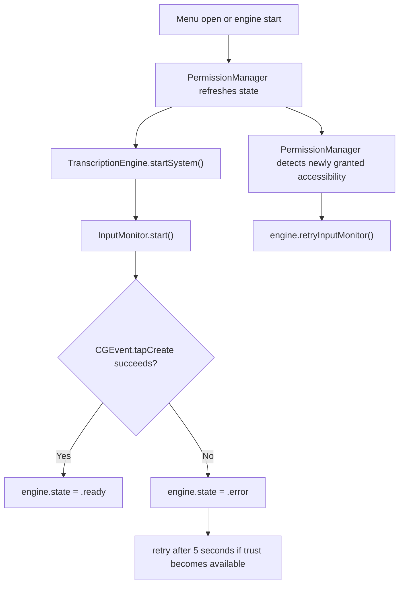
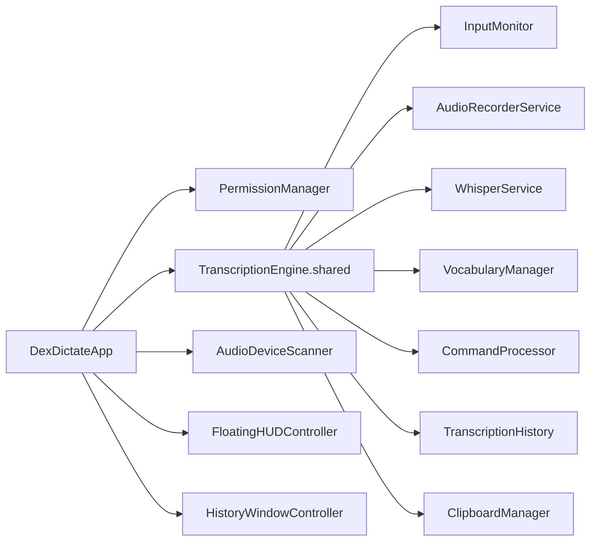
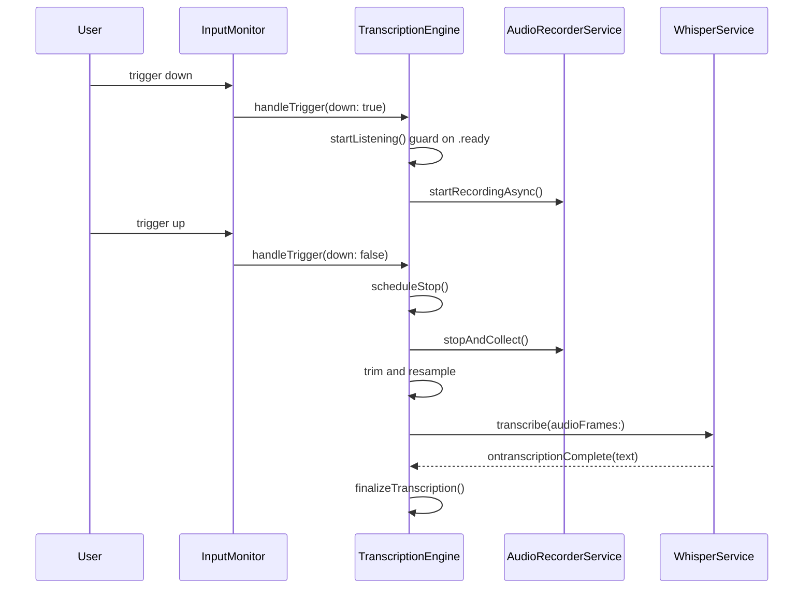

# DexDictate Bible

## Section 1. Title and Doctrine

### 1.1 What DexDictate is

DexDictate is a menu-bar-first macOS dictation bridge built as a Swift Package Manager project. It captures audio locally, transcribes it locally with Whisper via the `SwiftWhisper` package, applies local post-processing, stores session-local history, and can inject the final text into the frontmost app by simulating paste.

### 1.2 What DexDictate is not

- It is not a cloud transcription client.
- It is not a general speech recognition shell around Apple Speech Recognition.
- It is not a Dock-first or window-first productivity app.
- It is not a background telemetry collector.
- It is not currently a multi-model platform.

### 1.3 Product promise

- On-device, privacy-first dictation for macOS.
- No audio leaves the machine.
- Menu bar resident interaction model.
- Global trigger support via Quartz event tap.
- Local Whisper model execution.
- Optional auto-paste into the focused app.
- Lightweight history and HUD support.

### 1.4 Immutable constraints

- Preserve the existing permission trust chain and its effective order of operations.
- Preserve the menu-bar-first product identity.
- Preserve local-only transcription and avoid networking APIs in product logic.
- Preserve existing app icon, watermark usage, title treatment, and menu-bar identity.
- Treat `VerificationRunner` as a safety asset, not disposable scaffolding.
- Treat this Bible as additive-only after creation. Corrections must be appended, not overwritten.

### 1.5 Operational philosophy

- Prefer small, reviewable changes.
- Prefer explicit invariants over implied behavior.
- Preserve fragile macOS privacy behavior unless a fix is proven safe.
- Keep diagnostics local and privacy-safe.
- Document contradictions rather than hiding them.

## Section 2. Reconstruction Summary

### 2.1 Rebuild instructions at a glance

To reconstruct DexDictate from scratch, an engineer or AI needs to recreate:

1. A Swift Package Manager package targeting macOS 14 with:
   - library target `DexDictateKit`
   - executable target `DexDictate`
   - executable target `VerificationRunner`
   - test target `DexDictateTests`
2. A menu-bar application shell using `MenuBarExtra(.window)` and SwiftUI.
3. A shared `TranscriptionEngine` coordinating:
   - permission attachment
   - event tap setup
   - audio capture
   - resampling
   - Whisper transcription
   - command processing
   - vocabulary replacement
   - profanity filtering
   - history update
   - optional copy-and-paste injection
4. A polling `PermissionManager` that checks Accessibility, Input Monitoring, and Microphone separately.
5. A Quartz event tap monitor that only marks the engine ready when the tap is actually active.
6. A serial audio capture service using `AVAudioEngine` on a dedicated queue.
7. A local Whisper service loading the bundled `tiny.en.bin` model and serializing transcriptions.
8. Menu bar UI surfaces for onboarding, quick settings, history, and HUD.

### 2.2 Product surfaces

- Menu bar label and popover shell
- Onboarding window
- Permission banner
- Main controls
- Quick settings
- Inline history feed
- Detached history window
- Floating HUD
- Vocabulary editor window

### 2.3 Core runtime loops

- Menu-bar open loop: permission refresh plus one-time engine startup guard.
- Permission polling loop: every 2 seconds via `Timer`.
- Global input monitoring loop: Quartz event tap plus retry path.
- Audio capture loop: `AVAudioEngine` tap pushing samples into an in-memory buffer.
- Transcription loop: one batch per utterance after trigger release.

### 2.4 Critical dependencies

- `SwiftWhisper` pinned to revision `deb1cb6a27256c7b01f5d3d2e7dc1dcc330b5d01`
- `AVFoundation`
- `ApplicationServices`
- `CoreAudio`
- `ServiceManagement` is imported but not yet materially used for launch-at-login behavior

### 2.5 Non-negotiable privacy and permission behaviors

- Microphone permission is distinct from Accessibility and Input Monitoring.
- Accessibility and Input Monitoring are needed for global trigger capture and output injection support.
- Microphone permission is re-checked at dictation start to avoid bad Core Audio states.
- Permission refresh relies on polling rather than notifications.
- Event tap success is a hard readiness dependency.

## Section 3. Repository Structure

### 3.1 Top-level layout

- `Package.swift`: package definition and targets.
- `Sources/DexDictateKit`: core library code.
- `Sources/DexDictate`: app shell and SwiftUI surfaces.
- `Sources/VerificationRunner`: executable invariant and benchmark runner.
- `Tests/DexDictateTests`: current automated tests.
- `scripts/`: benchmark and release helpers.
- `templates/Info.plist.template`: generated app bundle metadata template.
- `docs/`: existing handoff and experiment artifacts.

### 3.2 Targets

- `DexDictateKit`
  - Central logic, services, settings, permissions, history, safety utilities.
- `DexDictate`
  - Executable app target and UI shell.
- `VerificationRunner`
  - Invariant checks and benchmark entry point.
- `DexDictateTests`
  - Light current unit coverage.

### 3.3 Major files

- `Sources/DexDictate/DexDictateApp.swift`
- `Sources/DexDictate/OnboardingView.swift`
- `Sources/DexDictate/PermissionBannerView.swift`
- `Sources/DexDictate/ControlsView.swift`
- `Sources/DexDictate/HistoryView.swift`
- `Sources/DexDictate/QuickSettingsView.swift`
- `Sources/DexDictate/FloatingHUD.swift`
- `Sources/DexDictate/HistoryWindow.swift`
- `Sources/DexDictateKit/TranscriptionEngine.swift`
- `Sources/DexDictateKit/PermissionManager.swift`
- `Sources/DexDictateKit/InputMonitor.swift`
- `Sources/DexDictateKit/Services/AudioRecorderService.swift`
- `Sources/DexDictateKit/Services/WhisperService.swift`
- `Sources/DexDictateKit/AppSettings.swift`
- `Sources/DexDictateKit/CommandProcessor.swift`
- `Sources/DexDictateKit/TranscriptionHistory.swift`
- `Sources/VerificationRunner/main.swift`

### 3.4 Build products

- SwiftPM release binary product `DexDictate_MacOS`
- App bundle generated by `build.sh` at `.build/DexDictate.app`
- Zipped and DMG artifacts from `scripts/build_release.sh`

### 3.5 Resources and assets

- Bundled model: `Sources/DexDictateKit/Resources/tiny.en.bin`
- Profanity list: `Sources/DexDictateKit/Resources/profanity_list.json`
- Iconography and watermark image assets in `Sources/DexDictateKit/Resources/Assets.xcassets`
- App bundle icon file in `Sources/DexDictate/AppIcon.icns`

### 3.6 Test and verification assets

- `sample_corpus/sample.wav`
- `sample_corpus/transcripts.json`
- `baseline.csv`
- `scripts/benchmark.sh`
- `scripts/benchmark.py`
- `scripts/parse_metrics.py`

## Section 4. Architecture Overview

### 4.1 Shell and composition

`DexDictateApp` is the entry point. It owns:

- shared `TranscriptionEngine`
- `PermissionManager`
- `AudioDeviceScanner`
- shared `AppSettings`
- `FloatingHUDController`
- `HistoryWindowController`

It uses a `MenuBarExtra` scene as the primary shell.

### 4.2 Core library

`DexDictateKit` currently mixes domain concerns in a flat target:

- permissions
- input monitoring
- audio capture
- transcription
- post-processing
- settings
- persistence-lite
- diagnostics

This is functional but only partially modularized.

### 4.3 Service layer

- `TranscriptionEngine`: lifecycle coordinator
- `PermissionManager`: polling and summary
- `InputMonitor`: event tap setup and dispatch
- `AudioRecorderService`: `AVAudioEngine` capture
- `WhisperService`: model loading and transcription serialization
- `AudioDeviceScanner`: device list refresh
- `ClipboardManager`: copy and paste injection
- `VocabularyManager`: custom substitutions
- `CommandProcessor`: voice-command transforms

### 4.4 Persistence and settings layer

- `AppSettings` persists user preferences through `@AppStorage`
- `VocabularyManager` persists its array to `UserDefaults`
- `TranscriptionHistory` is in-memory only for the current session

### 4.5 UI surface relationships

- Main popover composes:
  - `PermissionBannerView`
  - `HistoryView`
  - `ControlsView`
  - `QuickSettingsView`
  - `FooterView`
- Onboarding is separate window-first, shown by `AppDelegate` when onboarding is incomplete
- Detached history and vocabulary editor use separate `NSWindow` instances
- Floating HUD is separate `NSPanel`

### 4.6 Cross-component communication

- Direct shared singleton access is common
- UI observes `ObservableObject` state directly
- `TranscriptionEngine` retains services directly and holds a weak `PermissionManager`
- `InputMonitor` holds a weak engine pointer
- `PermissionManager` holds a weak engine pointer for accessibility recovery

## Section 5. Runtime Lifecycle

### 5.1 Launch sequence

Observed from source:

1. `DexDictateApp.init()` calls `Safety.setupDirectories()`.
2. `AppDelegate.applicationDidFinishLaunching` checks `AppSettings.shared.hasCompletedOnboarding`.
3. If onboarding is incomplete, onboarding window opens.
4. If onboarding is already complete, the app eagerly requests microphone access with `AVCaptureDevice.requestAccess(for: .audio)`.

Note: this eager post-onboarding microphone request is in tension with the intended “request separately at dictation time” doctrine and must be preserved until explicitly corrected with proof and tests.

### 5.2 Menu open behavior

Each popover open triggers:

1. `permissionManager.startMonitoring(engine:)`
2. `permissionManager.refreshPermissions()`
3. If engine is not `.stopped`, exit early
4. `permissionManager.requestPermissions()`
5. `permissionManager.requestMicrophoneIfNeeded()`
6. `engine.setPermissionManager(permissionManager)`
7. load embedded Whisper model if needed
8. `engine.startSystem()`
9. set up HUD and history controllers
10. show HUD if setting enabled

Note: `startMonitoring(engine:)` is called on every menu appearance and does not currently guard against stacking timers. This is a likely defect candidate.

### 5.3 Engine start behavior

`TranscriptionEngine.startSystem()`:

1. Guards that state is `.stopped`
2. Moves to `.initializing`
3. Sets status text to “Requesting Access...”
4. Calls `setupInputMonitor()`
5. If event tap is active, moves to `.ready`
6. Otherwise leaves error path to the async update in `InputMonitor`

### 5.4 Dictation lifecycle

Hold-to-talk path:

1. Trigger down enters `handleTrigger(down: true)`
2. Session ID resets and pending stop task is cancelled
3. `startListening()` runs if not already listening
4. `startListening()` guards state `.ready`
5. Microphone permission is requested if needed
6. Microphone authorization status is checked synchronously
7. Audio recording starts off-main on `audioQueue`
8. Trigger up schedules delayed stop using `ExperimentFlags.stopTailDelayMs`
9. `stopListening()` stops audio, collects samples, trims silence optionally, resamples to 16 kHz, submits one batch to Whisper
10. Whisper callback drives `handleWhisperResult`
11. `finalizeTranscription` processes commands, vocabulary, profanity, history, status, and optional auto-paste
12. Engine returns to `.ready`

### 5.5 Shutdown and reset behavior

`stopSystem()`:

- stops input monitor
- stops audio recording
- moves to `.stopped`
- resets status, live transcript, and input level

## Section 6. Permission Model and Execution Order

### 6.1 Entitlements

Current app entitlements in `Sources/DexDictate/DexDictate.entitlements`:

- `com.apple.security.device.audio-input = true`
- `com.apple.security.device.input-monitoring = true`

No separate accessibility entitlement exists because Accessibility trust is granted by TCC, not entitlement declaration.

### 6.2 Info.plist usage descriptions

Current generated/source-visible disclosures:

- `NSMicrophoneUsageDescription`
- `NSAppleEventsUsageDescription`

Observed contradiction:

- `Package.swift` targets macOS 14
- `templates/Info.plist.template` currently declares `LSMinimumSystemVersion` 14.0
- `Sources/DexDictate/Info.plist` declares `LSMinimumSystemVersion` 13.0
- README claims macOS 14+

This must be treated as a documentation and packaging inconsistency until resolved.

### 6.3 Permission polling

`PermissionManager` polls every 2 seconds using `Timer.scheduledTimer`.

Checks performed:

1. Accessibility via `AXIsProcessTrusted()`
2. Microphone via `AVCaptureDevice.authorizationStatus(for: .audio)`
3. Input Monitoring via `CGPreflightListenEventAccess()`

### 6.4 Prompting rules

Current prompting behavior:

- `PermissionManager.requestPermissions()` may prompt Accessibility and request Input Monitoring access
- `PermissionManager.requestMicrophoneIfNeeded()` requests microphone only when status is `.notDetermined`
- `DexDictateApp` currently also calls `requestMicrophoneIfNeeded()` on first menu open
- `AppDelegate` requests microphone access immediately at launch when onboarding is already complete

### 6.5 Accessibility flow

1. UI or app-open path calls `AXIsProcessTrustedWithOptions(prompt: true)`
2. `InputMonitor.start()` checks trust without prompting
3. If missing, monitor does not prompt again and logs a warning
4. Event tap creation may fail
5. Failure sets engine state to `.error` and schedules retry in 5 seconds
6. `PermissionManager` detects newly granted accessibility and calls `engine.retryInputMonitor()` after 1 second

### 6.6 Input Monitoring flow

1. `PermissionManager` checks preflight access with `CGPreflightListenEventAccess()`
2. `requestPermissions()` calls `CGRequestListenEventAccess()` when needed
3. Input tap creation depends on actual trust and runtime environment

### 6.7 Microphone flow

1. Microphone authorization is checked independently
2. Microphone can be requested by onboarding-adjacent flows and by dictation start path
3. `startListening()` hard-guards on `.authorized`
4. If not authorized, engine returns to `.ready` with user-facing status text

### 6.8 Event tap dependency chain



### 6.9 Exact operational order to preserve

Repository-derived effective order:

1. App launch and onboarding decision
2. Permission polling and refresh
3. Accessibility and Input Monitoring prompting behavior
4. Separate microphone request behavior
5. Event tap setup and retry behavior
6. Input monitoring and event tap readiness logic
7. Dictation start-time microphone authorization guard
8. Output injection behavior

### 6.10 What must not be changed

- Do not make event tap readiness implicit.
- Do not move dictation start past a missing-microphone guard.
- Do not add prompt spam from `InputMonitor`.
- Do not introduce cloud or network permission shortcuts.

## Section 7. Input and Trigger Architecture

### 7.1 Supported trigger types

- Mouse button plus optional modifiers
- Keyboard key plus modifiers
- Trigger mode: hold-to-talk or toggle

### 7.2 Storage model

`AppSettings.UserShortcut` is JSON-encoded into `userShortcutData` in `UserDefaults`.

Fields:

- `keyCode`
- `mouseButton`
- `modifiers`
- `displayString`

### 7.3 Mouse trigger path

- Event tap listens for `otherMouseDown` and `otherMouseUp`
- Matches button number and modifier mask
- Hold-to-talk dispatches down/up transitions to `handleTrigger`
- Toggle mode reacts on down only

### 7.4 Keyboard trigger path

- Event tap listens for `keyDown` and `keyUp`
- Matches keycode and modifier mask
- Same dispatch semantics as mouse

### 7.5 Event tap semantics

- Tap is inserted at `.cgSessionEventTap`, `.headInsertEventTap`
- Tap-disabled events are handled by re-enabling the tap
- Matching trigger events are consumed by returning `nil`

### 7.6 Failure cases and recovery

- Missing Accessibility usually causes tap creation failure
- System-disabled tap events are re-enabled in place
- Tap creation failure transitions engine to `.error`
- Retry occurs after 5 seconds and on permission recovery path

## Section 8. Audio Pipeline

### 8.1 Input device selection

- Selected device stored as `AppSettings.inputDeviceUID`
- Empty string means system default device
- `AudioDeviceManager.deviceID(forUID:)` resolves `AudioDeviceID`
- `AudioUnitSetProperty(kAudioOutputUnitProperty_CurrentDevice)` applies device choice

### 8.2 Threading model

- `AudioRecorderService` owns serial `audioQueue` for all `AVAudioEngine` lifecycle work
- `bufferQueue` protects accumulated samples
- `inputLevel` is published on the main actor

### 8.3 Tap installation

- Tap is installed on `engine.inputNode` bus 0
- Native hardware format is used for capture to avoid format mismatch crashes
- Resampling to Whisper format is deferred until after capture

### 8.4 Buffer accumulation

- Tap callback appends float samples into `_accumulatedSamples`
- RMS-derived normalized input level is pushed to UI

### 8.5 Stop-and-collect behavior

- `stopAndCollect()` synchronously drains `audioQueue`
- tap removed
- engine stopped
- input level reset
- sample buffer drained atomically

### 8.6 Sleep/wake handling

- `willSleepNotification` stops the engine and removes the tap if recording
- wake does not automatically restart recording; next recording attempt restarts engine path

### 8.7 Route changes

Current state:

- `AudioDeviceScanner` updates available device list on device topology changes
- `AudioRecorderService` does not yet implement explicit route-change recovery for an actively selected disappearing device
- This is a roadmap item, not solved baseline behavior

### 8.8 Sample rate handling

- Capture occurs at native device sample rate
- `AudioResampler.resampleToWhisper` converts to 16 kHz for Whisper
- Optional silence trimming can run before resampling

### 8.9 Main actor boundaries

- UI state updates occur on `@MainActor`
- audio engine work occurs on `audioQueue`
- whisper service is `@MainActor` but transcription work awaits async library execution

## Section 9. Transcription Pipeline

### 9.1 Model loading

- Embedded model `tiny.en.bin` is bundled in the library resource bundle
- `WhisperService.loadEmbeddedModel()` resolves model from `Bundle.module`
- optional Core ML encoder sidecar `<model>-encoder.mlmodelc` is detected if present

### 9.2 Parameter strategy

Current decode profile is optimized for latency:

- greedy strategy
- `best_of = 1`
- optional `speed_up = true` in speed profile
- thread count capped at 4
- timestamps disabled
- `no_context = true`
- `single_segment = true`
- `max_tokens = 128`
- non-speech token suppression enabled

### 9.3 Batch transcription behavior

- Streaming has been intentionally removed or avoided
- One utterance is submitted after trigger release
- Concurrent transcriptions are prevented by cancelling prior transcription task before starting a new one

### 9.4 Why streaming is avoided

Source comments explicitly state that per-chunk streaming caused `instanceBusy` errors and empty output because whisper.cpp behaves as a batch model expecting complete utterances at 16 kHz.

### 9.5 Result handling

- Whisper delegate joins segments into a single string
- content is privacy-redacted in logs by character count
- engine trims whitespace and either returns to ready or finalizes transcription

### 9.6 Failure behavior

- failed model load leaves `isModelLoaded = false`
- failed transcription logs an error and clears `isTranscribing`
- empty transcription returns engine to ready without history insertion

## Section 10. Post-Processing Pipeline

### 10.1 Command processing

Current commands:

- `scratch that`
- `new line` / `next line`
- `all caps`

### 10.2 Vocabulary application

- `VocabularyManager` applies regex-safe substitutions case-insensitively
- items persist via `UserDefaults`

### 10.3 Profanity filter

- optional boolean setting
- driven by bundled JSON list

### 10.4 History behavior

- history is session-local, not persisted
- newest entry inserted at the front
- cap is 50 items

### 10.5 Auto-paste and output semantics

- if `autoPaste` is enabled, text is copied to clipboard, Cmd+V is simulated, then the original clipboard text is restored after a short delay
- if command-only utterance resolves to empty text, nothing is inserted

### 10.6 Current destructive behavior caveat

- “scratch that” can remove the most recent history item if spoken alone
- there is no undo or confirm affordance yet

## Section 11. Settings and Persistence

### 11.1 Current settings keys

Observed `@AppStorage` and related persisted keys:

- `triggerMode`
- `inputButton`
- `silenceTimeout`
- `inputDeviceUID`
- `playStartSound`
- `playStopSound`
- `showVisualHUD`
- `selectedStartSound`
- `selectedStopSound`
- `autoPaste`
- `profanityFilter`
- `appendMode`
- `launchAtLogin`
- `hasCompletedOnboarding`
- `showFloatingHUD`
- `selectedEngine`
- `appearanceTheme_stored`
- `userShortcutData`
- `customVocabulary` via `VocabularyManager`

### 11.2 Theme model

Current appearance themes:

- `system`
- `cyberpunk`
- `minimalist`
- `highContrast`

### 11.3 Trigger model

- `TriggerMode.holdToTalk`
- `TriggerMode.toggle`
- default shortcut is middle mouse

### 11.4 Migration risk

- Settings are unversioned at baseline
- several keys are legacy aliases or placeholders
- `launchAtLogin` is surfaced as persisted state without implementation
- `appendMode` is explicitly marked reserved and not implemented

### 11.5 Settings invariants

- selected engine must remain Whisper-only in current product contract
- user shortcut must decode or fall back to middle mouse default
- onboarding completion controls launch-time onboarding display

## Section 12. UI Surface Inventory

### 12.1 MenuBarExtra shell

- Label text is “DexDictate” unless recording, then “Recording”
- icon changes with engine listening state

### 12.2 Main popover

- fixed frame 320 x 540
- background depends on appearance theme
- includes large app-icon watermark and rotated “DEXDICTATE” watermark text

### 12.3 Permission banner

- orange banner with missing permission summary
- currently single-line text and one settings button

### 12.4 History view

- expandable 100 pt / 300 pt history area
- inline live transcript and input meter while listening
- copy button per row

### 12.5 Controls

- start/stop dictation system button
- status text
- trigger hint
- quit button

### 12.6 Quick settings

- collapsible panel
- sound feedback controls
- appearance picker
- output toggles
- input device picker
- silence timeout
- vocabulary window launcher
- shortcut recorder

### 12.7 Onboarding window

- four-page flow
- welcome
- permissions
- shortcut
- completion

### 12.8 Floating HUD

- transparent floating `NSPanel`
- icon and “DEX” watermark
- state icon, status text, and microphone bar for active states

### 12.9 Detached history window

- export action
- clear action
- row copy actions

### 12.10 Immutable brand assets

- app icon watermark usage in main popover and floating HUD
- `DEXDICTATE` and `DEX` watermark text treatment
- app icon asset and menu bar title treatment

## Section 13. Diagnostics and Verification

### 13.1 Existing diagnostics

- `Safety.log` writes to `NSLog` and `~/Library/Application Support/DexDictate/debug.log`
- logs are local-only
- retention is currently unbounded baseline behavior

### 13.2 VerificationRunner behavior

`VerificationRunner` currently exercises:

- onboarding persistence
- Whisper pinning assumptions
- profanity filter operation
- no-network-source invariant scan
- history cap behavior
- command processor behavior
- watermark presence by source scan
- benchmark mode using bundled or requested model

### 13.3 Build and test entry points

- `swift build`
- `swift test`
- `swift run VerificationRunner`
- `scripts/benchmark.sh sample_corpus/sample.wav`
- `build.sh`
- `scripts/build_release.sh`

### 13.4 Always-run safety checks after changes

Minimum doctrine for this program:

- build
- `VerificationRunner`
- changed tests
- manual smoke checks for affected surfaces
- invariant review:
  - local-only behavior preserved
  - permission order preserved
  - menu-bar-first model preserved
  - brand assets preserved

### 13.5 Latency measurement points

Current engine metrics track timestamps for:

- trigger up
- audio stop
- resample done
- whisper submit
- whisper done

CSV-like metric line emitted:

- epoch timestamp
- raw sample count
- trimmed sample count
- resampled sample count
- trigger-up to audio-stop ms
- audio-stop to resample ms
- whisper-submit to whisper-done ms
- total trigger-up to whisper-done ms

### 13.6 Manual QA flows to preserve

- first launch with onboarding incomplete
- permission recovery after granting accessibility while app stays open
- trigger capture in hold-to-talk mode
- trigger capture in toggle mode
- auto-paste into another app
- detached history open/export/clear
- floating HUD show/hide

## Section 14. Known Risks and Fragilities

### 14.1 Permission flow fragility

- permission checks and prompting are split across `AppDelegate`, `DexDictateApp`, `PermissionManager`, and `TranscriptionEngine`
- prompt timing is easy to break
- the current code already contains multiple microphone request sites

### 14.2 Event tap fragility

- readiness depends on actual tap creation
- retries are time-based and not strongly modeled
- trigger capture sits inside a callback that directly reads singleton settings

### 14.3 Singleton and coupling risk

- `TranscriptionEngine.shared`
- `AppSettings.shared`
- direct singleton reads inside event tap callback and UI

### 14.4 UI density constraints

- main popover is compact and carries many functions
- quick settings and history both compete for vertical space

### 14.5 Settings migration risk

- schema is not versioned
- legacy and reserved keys already exist

### 14.6 Launch-at-login gap

- README and settings suggest a system integration expectation
- source comment in `AppSettings` explicitly states `SMAppService` integration is pending

### 14.7 Platform-version inconsistency

- package target says macOS 14
- one plist says 13
- README says 14
- template says 14

### 14.8 Monitoring timer duplication risk

`PermissionManager.startMonitoring(engine:)` assigns a new repeating timer without invalidating an existing timer first. Because `DexDictateApp` calls this in `.onAppear`, repeated menu opens may create multiple active timers. This requires verification and likely remediation.

## Section 15. Roadmap Index

Status markers:

- `pending`
- `in_progress`
- `complete`
- `blocked`
- `superseded`

| ID | Phase | Improvement | Dependencies | Status |
| --- | --- | --- | --- | --- |
| R21 | 1 | Formal explicit engine state machine | baseline | pending |
| R22 | 1 | Protocol-backed dependency seams | R21-informed inventory | pending |
| R23 | 1 | Layered automated test expansion | R21-R22 helpful but not all required | pending |
| R24 | 1 | Latency regression benchmark workflow | baseline benchmark path | pending |
| R25 | 1 | Structured privacy-safe diagnostics/logging | baseline logging inventory | pending |
| R27 | 1 | Settings schema versioning and migrations | settings inventory | pending |
| R26 | 2 | Audio route-change recovery and default-device failover | audio inventory | pending |
| R28 | 2 | Launch-at-login truthfulness and implementation | settings and UI truthfulness | pending |
| R30 | 2 | Clearer subdomain modularization | after safety rails preferred | pending |
| R11 | 3 | Live onboarding permission checklist | permission model clarity | pending |
| R12 | 3 | First-run trigger test | event tap readiness exposure | pending |
| R13 | 3 | First-run microphone test | audio diagnostics exposure | pending |
| R14 | 3 | Distinct error mapping | state and diagnostics improvements | pending |
| R15 | 4 | Safe mode preset | settings versioning helpful | pending |
| R16 | 4 | Destructive-command undo/confirm affordance | result-state surfacing helpful | pending |
| R17 | 4 | Keyboard accessibility and VoiceOver improvements | UI passes | pending |
| R18 | 4 | Secure-context soft warning / copy-only option | output seam helpful | pending |
| R19 | 4 | History search/filter/timestamps | history UI work | pending |
| R20 | 4 | Clear post-transcription result feedback state | state and diagnostics helpful | pending |
| R01 | 5 | Spacing and typography tokens | UI polish phase | pending |
| R02 | 5 | Stronger section hierarchy | R01 helpful | pending |
| R03 | 5 | State-colored border accents | R01 helpful | pending |
| R04 | 5 | Better empty-history presentation | UI polish phase | pending |
| R05 | 5 | Trigger display monospaced pill | controls UI phase | pending |
| R06 | 5 | Permission banner multiline/truncation improvements | UI polish phase | pending |
| R07 | 5 | Quick settings affordance/grouping improvements | UI polish phase | pending |
| R08 | 5 | Detached history visual alignment | UI polish phase | pending |
| R09 | 5 | Hover/focus states | UI polish phase | pending |
| R10 | 5 | Reduced-transparency visual path | accessibility UI pass | pending |
| R29 | 6 | Release automation and integrity validation | build and signing inventory | pending |

## Section 16. Additive Implementation Ledger

Entry template for all future work:

- Entry ID:
- Timestamp:
- Improvement ID(s):
- Goal:
- Why now:
- Dependency context:
- Files likely or actually changed:
- Risk assessment:
- Invariant check:
- What was attempted:
- What succeeded:
- What failed:
- What was rolled back:
- Tests run:
- Metrics captured:
- Regressions checked:
- Remaining risks:
- Next step:

### Ledger Entry B-0001

- Entry ID: B-0001
- Timestamp: 2026-03-10 America/Detroit
- Improvement ID(s): baseline-foundation
- Goal: Create the first additive-only canonical Bible before product code changes.
- Why now: Required doctrine. No implementation work should proceed without a high-fidelity system map.
- Dependency context: Derived directly from repository source inspection.
- Files likely or actually changed: `docs/DEXDICTATE_BIBLE.md`
- Risk assessment: Documentation-only change. Zero intended runtime risk.
- Invariant check: No product code changed. Permission order, brand assets, privacy posture, and menu-bar model remain untouched.
- What was attempted: Reconstructed architecture, permission model, runtime lifecycle, UI inventory, risks, contradictions, and roadmap tracker from source.
- What succeeded: Baseline architectural snapshot established.
- What failed: Operational build/test/benchmark baseline not yet appended in this entry.
- What was rolled back: Nothing.
- Tests run: None yet for this entry.
- Metrics captured: Repository structure and code-path inventory only.
- Regressions checked: Documentation-only.
- Remaining risks: Baseline execution state still needs measurement.
- Next step: Run build, tests, verification runner, and benchmark; append results as a new ledger entry and baseline addendum.

## Section 17. Appendices

### Appendix A. Component map



### Appendix B. Dictation sequence



### Appendix C. Reconstruction notes

- Treat `Sources/DexDictate/Info.plist` as a static reference file and `templates/Info.plist.template` as the bundle-generation source of truth until proven otherwise.
- Treat all permission behavior as fragile. Refactors must preserve externally observed order even if internal modeling improves.
- Treat brand watermarks as product invariants.

### Appendix D. Glossary

- TCC: Transparency, Consent, and Control, Apple’s privacy-permission system.
- Quartz event tap: low-level global input event interception mechanism used for triggers.
- Whisper: local speech-to-text model used through `SwiftWhisper`.
- HUD: heads-up display, floating status panel.

## Section 18. Baseline Execution Addendum

### 18.1 Baseline commands run on 2026-03-10

Commands executed from repository root:

```bash
swift build
swift test
swift run VerificationRunner
./scripts/benchmark.sh sample_corpus/sample.wav
```

### 18.2 Build baseline

- `swift build`: PASS
- Duration observed: 26.57 seconds for a debug build on the current machine
- Build products produced for:
  - `DexDictateKit`
  - `DexDictate`
  - `VerificationRunner`

### 18.3 Test baseline

- `swift test`: PASS
- Total XCTest cases executed: 3
- Failure count: 0
- Current automated test inventory is shallow:
  - 2 profanity filter tests
  - 1 verification-style onboarding and vocabulary test

### 18.4 VerificationRunner baseline

- `swift run VerificationRunner`: PASS
- Total invariant checks: 42
- Failure count: 0
- Covered invariants include:
  - Whisper dependency pin
  - local-only engine exposure
  - no obvious networking APIs in `Sources`
  - history cap behavior
  - vocabulary escaping
  - command processor basics
  - watermark source presence

### 18.5 Benchmark baseline

- `./scripts/benchmark.sh sample_corpus/sample.wav`: PASS
- Measured transcription latency: 576 milliseconds
- Input sample details printed by runner:
  - native frames: 382651
  - resampled whisper frames: 127550
- Recognized benchmark output:
  - “This is a longer, much more relaxed test of the benchmark harness to make sure Whisper doesn't immediately discard the audio as too short.”

### 18.6 Benchmark caveats

- The benchmark script builds and runs `VerificationRunner` in debug mode, not release mode.
- `WhisperService` explicitly logs that debug builds may be slower.
- Therefore 576 milliseconds is useful as a reproducible current-tree baseline, but not a release-grade latency claim.

### 18.7 Current UX behavior notes

Repository-derived and baseline-confirmed notes:

- Menu bar is the primary shell.
- Main popover is visually dense but functional.
- Permission banner currently compresses all missing states into a single line.
- Onboarding is a static four-step flow with explanatory text but no live validation checklist yet.
- Trigger display in the main controls is plain caption text, not a stronger affordance.
- Detached history supports export and clearing but lacks timestamps, search, and richer feedback.

### 18.8 Current permission behavior notes

- Permission polling is active every 2 seconds.
- Accessibility and Input Monitoring are requested from menu-open flow.
- Microphone requests currently exist in three places:
  - `AppDelegate.applicationDidFinishLaunching` when onboarding is complete
  - `DexDictateApp` popover `.onAppear`
  - `TranscriptionEngine.startListening()`
- This is not yet a proven broken behavior, but it is a fragile spread and should be treated carefully in later phases.

### 18.9 Current launch and onboarding behavior notes

- If onboarding is incomplete, onboarding window opens at launch.
- If onboarding is complete, the app skips onboarding and immediately requests microphone access.
- Main engine setup is deferred until the menu bar popover appears.
- Whisper model loading is guarded to avoid redundant reloads after it is already in memory.

### 18.10 Current strengths

- Local-only transcription pipeline is intact.
- Event tap readiness is not assumed; it is checked explicitly.
- Audio capture remains off the main actor.
- VerificationRunner provides meaningful nontrivial safety coverage.
- The repository already contains a benchmark path and release packaging scripts.

### 18.11 Current weaknesses

- Engine lifecycle is implicit and not yet formalized as an explicit tested transition graph.
- Dependency seams are thin; singletons and concrete service creation are common.
- Logging is unstructured and unbounded.
- Settings schema is unversioned.
- Route-change recovery for disappearing selected microphones is incomplete.
- Launch-at-login is surfaced in settings but not implemented.
- UI accessibility and compact-layout polish are underdeveloped.

### 18.12 Current warnings and inconsistencies

- macOS minimum-version mismatch across `Package.swift`, `Sources/DexDictate/Info.plist`, `templates/Info.plist.template`, and README.
- `PermissionManager.startMonitoring(engine:)` appears capable of creating repeated polling timers across multiple popover opens.
- `scripts/benchmark.sh` reports debug-path latency, which is easy to misread as product latency.
- `WhisperService` logs “Core ML encoder not found” before whisper.cpp later attempts and fails to load the expected Core ML sidecar path. The benchmark still passes, but the messaging is internally noisy.
- README troubleshooting still references “Start Listening” while the current UI text says “Start Dictation” or trigger-driven use.

### 18.13 Manual QA status at baseline

- No full interactive UI smoke pass was executed in this addendum.
- Manual runtime-sensitive items still requiring future validation:
  - permission prompt cadence
  - trigger capture in a live app session
  - microphone hot-swap while active
  - auto-paste into secure and normal contexts
  - reduced-transparency path

### 18.14 Ledger Entry B-0002

- Entry ID: B-0002
- Timestamp: 2026-03-10 America/Detroit
- Improvement ID(s): baseline-execution
- Goal: Record reproducible build, test, verification, and benchmark baseline before product changes.
- Why now: Required gate before Phase 1 implementation.
- Dependency context: Follows Bible creation entry B-0001.
- Files likely or actually changed: `docs/DEXDICTATE_BIBLE.md`
- Risk assessment: Documentation-only change. Zero intended runtime risk.
- Invariant check: No product code changed. Local-only, permission order, brand, and menu-bar model preserved.
- What was attempted: Executed build, tests, verification runner, and sample benchmark against the untouched baseline tree.
- What succeeded: All four baseline commands passed.
- What failed: No command failed. Manual interactive QA was not performed in this entry.
- What was rolled back: Nothing.
- Tests run:
  - `swift build`
  - `swift test`
  - `swift run VerificationRunner`
  - `./scripts/benchmark.sh sample_corpus/sample.wav`
- Metrics captured:
  - build duration: 26.57 seconds
  - XCTest count: 3 passing
  - VerificationRunner checks: 42 passing
  - sample benchmark latency: 576 milliseconds in debug path
- Regressions checked:
  - no network APIs introduced
  - no permission-order changes
  - no brand-asset changes
  - no menu-bar-first behavior changes
- Remaining risks:
  - benchmark path is debug-biased
  - several permission request sites remain spread across layers
  - no formal state machine or migration framework yet
- Next step: Start Phase 1 with explicit engine state modeling and testability seams while preserving existing permission behavior.

### 18.15 Pre-Implementation Note P-0001

- Entry ID: P-0001
- Timestamp: 2026-03-10 America/Detroit
- Improvement ID(s): R21, R23
- Goal: Introduce an explicit, testable engine lifecycle state machine and cover it with focused transition tests.
- Why now: The baseline confirmed the engine’s lifecycle rules are currently implicit, spread across methods, and only lightly guarded by comments.
- Dependency context: Safe first Phase 1 slice. It reduces risk for later logging, error mapping, and dependency-injection work without altering permission order.
- Files likely to change:
  - `Sources/DexDictateKit/TranscriptionEngine.swift`
  - new lifecycle/state file in `Sources/DexDictateKit`
  - `Tests/DexDictateTests/*`
  - possibly `Sources/VerificationRunner/main.swift` if invariant coverage gains value
- Risk assessment: Medium-low. Internal lifecycle refactor can accidentally block a valid transition or permit an invalid one. Permission prompting and event tap creation must remain externally unchanged.
- Invariant check:
  - preserve current state labels and externally visible state values
  - preserve menu-open startup order
  - preserve dictation start microphone authorization guard
  - preserve event-tap-driven readiness gate
  - preserve local-only behavior and output semantics
- What was attempted: Pending.
- What succeeded: Pending.
- What failed: Pending.
- What was rolled back: Pending.
- Tests run: Pending.
- Metrics captured: Pending.
- Regressions checked: Pending.
- Remaining risks: Pending.
- Next step: Implement a pure transition model, route `TranscriptionEngine` transitions through it, and add unit tests for allowed and blocked transitions.

### 18.16 Roadmap Status Addendum 2026-03-10T16:19 America/Detroit

- R21: complete
- R23: in_progress

Rationale:

- R21 is satisfied for the engine lifecycle slice by introducing an explicit transition model and routing engine state changes through it.
- R23 remains in progress because state-transition tests were added, but broader layered coverage is still missing.

### 18.17 Ledger Entry B-0003

- Entry ID: B-0003
- Timestamp: 2026-03-10 America/Detroit
- Improvement ID(s): R21, R23
- Goal: Make engine lifecycle transitions explicit and directly testable without changing the user-visible permission or dictation flow.
- Why now: This is the safest first engineering hardening slice and reduces ambiguity for later work.
- Dependency context: Built on the baseline established in B-0001 and B-0002.
- Files likely or actually changed:
  - `Sources/DexDictateKit/EngineLifecycle.swift`
  - `Sources/DexDictateKit/TranscriptionEngine.swift`
  - `Sources/DexDictateKit/InputMonitor.swift`
  - `Tests/DexDictateTests/EngineLifecycleStateMachineTests.swift`
  - `Sources/VerificationRunner/main.swift`
  - `docs/DEXDICTATE_BIBLE.md`
- Risk assessment: Medium-low. This changed internal state handling but intentionally preserved external state names, status text flow, and permission ordering.
- Invariant check:
  - permission request sites and order unchanged
  - event tap still gates readiness
  - microphone authorization guard still blocks dictation start when unauthorized
  - local-only Whisper pipeline unchanged
  - menu-bar-first model unchanged
  - brand assets unchanged
- What was attempted:
  - introduced a pure `EngineLifecycleStateMachine`
  - routed `TranscriptionEngine` state mutations through lifecycle events
  - replaced direct input-monitor error mutation with engine-managed lifecycle handling
  - added transition unit tests
  - updated `VerificationRunner` to assert the explicit lifecycle model rather than a brittle source substring from the old implementation
- What succeeded:
  - explicit lifecycle transitions now exist in one place
  - invalid transitions are rejected and logged
  - lifecycle tests cover happy path, recovery path, audio-start failure path, invalid transitions, and universal stop behavior
  - full build, full test suite, and `VerificationRunner` all pass after the update
- What failed:
  - the first post-change `VerificationRunner` run failed because it still expected the previous `state = .ready` source string
- What was rolled back:
  - nothing was rolled back; the invariant was updated to reflect the stronger lifecycle implementation
- Tests run:
  - `swift test --filter EngineLifecycleStateMachineTests`
  - `swift build`
  - `swift test`
  - `swift run VerificationRunner`
- Metrics captured:
  - automated test count increased from 3 to 8
  - `VerificationRunner` checks increased from 42 to 43
- Regressions checked:
  - no new networking APIs introduced
  - no permission-order changes introduced
  - no brand-asset changes introduced
  - no changes to core trigger -> transcribe -> output workflow logic
- Remaining risks:
  - service creation and singleton access are still concrete and tightly coupled
  - lifecycle status text remains distributed across methods rather than fully state-derived
  - no UI/manual smoke pass was executed for this internal refactor slice
- Next step: Implement protocol-backed seams around selected engine dependencies and permission-safe diagnostics to support deeper tests and later UX work.
