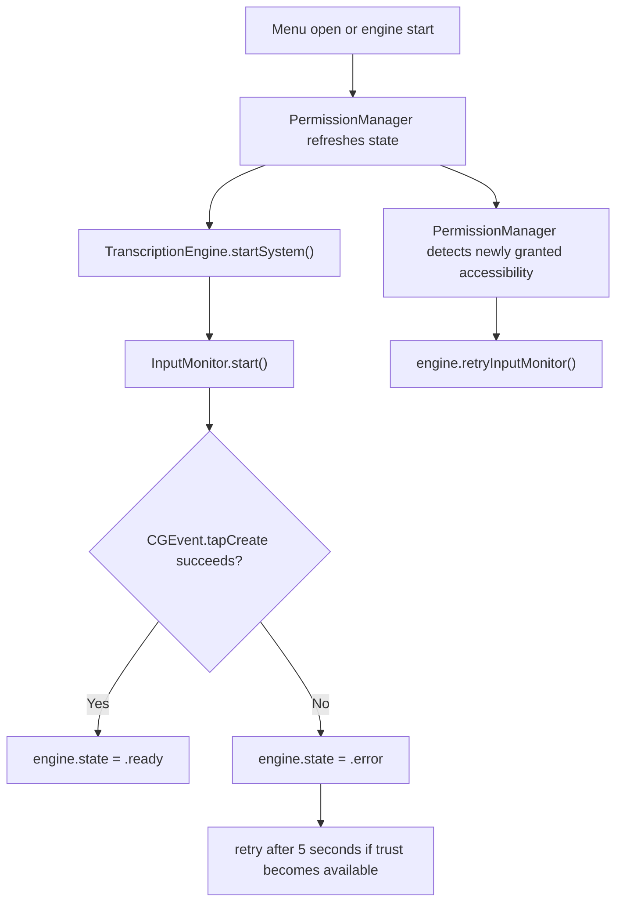
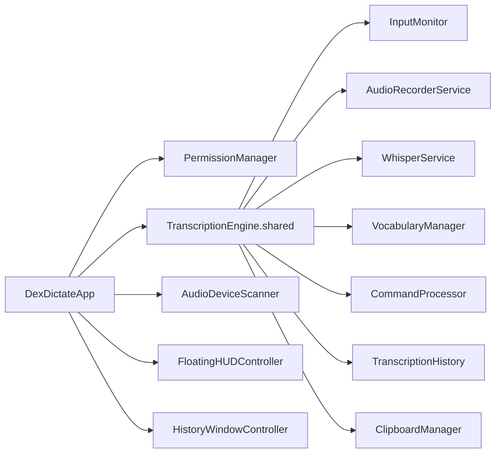
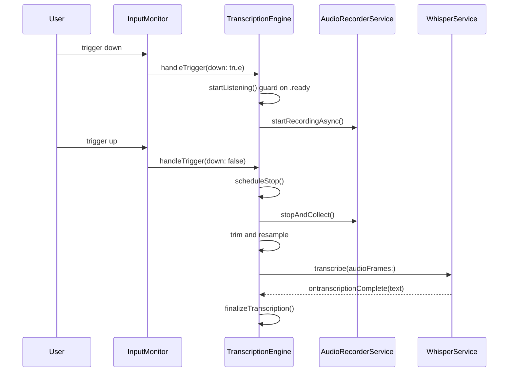

# DexDictate Bible

## Section 1. Title and Doctrine

### 1.1 What DexDictate is

DexDictate is a menu-bar-first macOS dictation bridge built as a Swift Package Manager project. It captures audio locally, transcribes it locally with Whisper via the `SwiftWhisper` package, applies local post-processing, stores session-local history, and can inject the final text into the frontmost app by simulating paste.

### 1.2 What DexDictate is not

- It is not a cloud transcription client.
- It is not a general speech recognition shell around Apple Speech Recognition.
- It is not a Dock-first or window-first productivity app.
- It is not a background telemetry collector.
- It is not currently a multi-model platform.

### 1.3 Product promise

- On-device, privacy-first dictation for macOS.
- No audio leaves the machine.
- Menu bar resident interaction model.
- Global trigger support via Quartz event tap.
- Local Whisper model execution.
- Optional auto-paste into the focused app.
- Lightweight history and HUD support.

### 1.4 Immutable constraints

- Preserve the existing permission trust chain and its effective order of operations.
- Preserve the menu-bar-first product identity.
- Preserve local-only transcription and avoid networking APIs in product logic.
- Preserve existing app icon, watermark usage, title treatment, and menu-bar identity.
- Treat `VerificationRunner` as a safety asset, not disposable scaffolding.
- Treat this Bible as additive-only after creation. Corrections must be appended, not overwritten.

### 1.5 Operational philosophy

- Prefer small, reviewable changes.
- Prefer explicit invariants over implied behavior.
- Preserve fragile macOS privacy behavior unless a fix is proven safe.
- Keep diagnostics local and privacy-safe.
- Document contradictions rather than hiding them.

## Section 2. Reconstruction Summary

### 2.1 Rebuild instructions at a glance

To reconstruct DexDictate from scratch, an engineer or AI needs to recreate:

1. A Swift Package Manager package targeting macOS 14 with:
   - library target `DexDictateKit`
   - executable target `DexDictate`
   - executable target `VerificationRunner`
   - test target `DexDictateTests`
2. A menu-bar application shell using `MenuBarExtra(.window)` and SwiftUI.
3. A shared `TranscriptionEngine` coordinating:
   - permission attachment
   - event tap setup
   - audio capture
   - resampling
   - Whisper transcription
   - command processing
   - vocabulary replacement
   - profanity filtering
   - history update
   - optional copy-and-paste injection
4. A polling `PermissionManager` that checks Accessibility, Input Monitoring, and Microphone separately.
5. A Quartz event tap monitor that only marks the engine ready when the tap is actually active.
6. A serial audio capture service using `AVAudioEngine` on a dedicated queue.
7. A local Whisper service loading the bundled `tiny.en.bin` model and serializing transcriptions.
8. Menu bar UI surfaces for onboarding, quick settings, history, and HUD.

### 2.2 Product surfaces

- Menu bar label and popover shell
- Onboarding window
- Permission banner
- Main controls
- Quick settings
- Inline history feed
- Detached history window
- Floating HUD
- Vocabulary editor window

### 2.3 Core runtime loops

- Menu-bar open loop: permission refresh plus one-time engine startup guard.
- Permission polling loop: every 2 seconds via `Timer`.
- Global input monitoring loop: Quartz event tap plus retry path.
- Audio capture loop: `AVAudioEngine` tap pushing samples into an in-memory buffer.
- Transcription loop: one batch per utterance after trigger release.

### 2.4 Critical dependencies

- `SwiftWhisper` pinned to revision `deb1cb6a27256c7b01f5d3d2e7dc1dcc330b5d01`
- `AVFoundation`
- `ApplicationServices`
- `CoreAudio`
- `ServiceManagement` is imported but not yet materially used for launch-at-login behavior

### 2.5 Non-negotiable privacy and permission behaviors

- Microphone permission is distinct from Accessibility and Input Monitoring.
- Accessibility and Input Monitoring are needed for global trigger capture and output injection support.
- Microphone permission is re-checked at dictation start to avoid bad Core Audio states.
- Permission refresh relies on polling rather than notifications.
- Event tap success is a hard readiness dependency.

## Section 3. Repository Structure

### 3.1 Top-level layout

- `Package.swift`: package definition and targets.
- `Sources/DexDictateKit`: core library code.
- `Sources/DexDictate`: app shell and SwiftUI surfaces.
- `Sources/VerificationRunner`: executable invariant and benchmark runner.
- `Tests/DexDictateTests`: current automated tests.
- `scripts/`: benchmark and release helpers.
- `templates/Info.plist.template`: generated app bundle metadata template.
- `docs/`: existing handoff and experiment artifacts.

### 3.2 Targets

- `DexDictateKit`
  - Central logic, services, settings, permissions, history, safety utilities.
- `DexDictate`
  - Executable app target and UI shell.
- `VerificationRunner`
  - Invariant checks and benchmark entry point.
- `DexDictateTests`
  - Light current unit coverage.

### 3.3 Major files

- `Sources/DexDictate/DexDictateApp.swift`
- `Sources/DexDictate/OnboardingView.swift`
- `Sources/DexDictate/PermissionBannerView.swift`
- `Sources/DexDictate/ControlsView.swift`
- `Sources/DexDictate/HistoryView.swift`
- `Sources/DexDictate/QuickSettingsView.swift`
- `Sources/DexDictate/FloatingHUD.swift`
- `Sources/DexDictate/HistoryWindow.swift`
- `Sources/DexDictateKit/TranscriptionEngine.swift`
- `Sources/DexDictateKit/PermissionManager.swift`
- `Sources/DexDictateKit/InputMonitor.swift`
- `Sources/DexDictateKit/Services/AudioRecorderService.swift`
- `Sources/DexDictateKit/Services/WhisperService.swift`
- `Sources/DexDictateKit/AppSettings.swift`
- `Sources/DexDictateKit/CommandProcessor.swift`
- `Sources/DexDictateKit/TranscriptionHistory.swift`
- `Sources/VerificationRunner/main.swift`

### 3.4 Build products

- SwiftPM release binary product `DexDictate_MacOS`
- App bundle generated by `build.sh` at `.build/DexDictate.app`
- Zipped and DMG artifacts from `build.sh --release`

### 3.5 Resources and assets

- Bootstrapped local model: `Sources/DexDictateKit/Resources/tiny.en.bin` via `scripts/fetch_model.sh`
- Profanity list: `Sources/DexDictateKit/Resources/profanity_list.json`
- Iconography and watermark image assets in `Sources/DexDictateKit/Resources/Assets.xcassets`
- App bundle icon file in `Sources/DexDictate/AppIcon.icns`

### 3.6 Test and verification assets

- `sample_corpus/sample.wav`
- `sample_corpus/transcripts.json`
- `baseline.csv`
- `scripts/benchmark.sh`
- `scripts/benchmark.py`
- `scripts/parse_metrics.py`

## Section 4. Architecture Overview

### 4.1 Shell and composition

`DexDictateApp` is the entry point. It owns:

- shared `TranscriptionEngine`
- `PermissionManager`
- `AudioDeviceScanner`
- shared `AppSettings`
- `FloatingHUDController`
- `HistoryWindowController`

It uses a `MenuBarExtra` scene as the primary shell.

### 4.2 Core library

`DexDictateKit` currently mixes domain concerns in a flat target:

- permissions
- input monitoring
- audio capture
- transcription
- post-processing
- settings
- persistence-lite
- diagnostics

This is functional but only partially modularized.

### 4.3 Service layer

- `TranscriptionEngine`: lifecycle coordinator
- `PermissionManager`: polling and summary
- `InputMonitor`: event tap setup and dispatch
- `AudioRecorderService`: `AVAudioEngine` capture
- `WhisperService`: model loading and transcription serialization
- `AudioDeviceScanner`: device list refresh
- `ClipboardManager`: copy and paste injection
- `VocabularyManager`: custom substitutions
- `CommandProcessor`: voice-command transforms

### 4.4 Persistence and settings layer

- `AppSettings` persists user preferences through `@AppStorage`
- `VocabularyManager` persists its array to `UserDefaults`
- `TranscriptionHistory` is in-memory only for the current session

### 4.5 UI surface relationships

- Main popover composes:
  - `PermissionBannerView`
  - `HistoryView`
  - `ControlsView`
  - `QuickSettingsView`
  - `FooterView`
- Onboarding is separate window-first, shown by `AppDelegate` when onboarding is incomplete
- Detached history and vocabulary editor use separate `NSWindow` instances
- Floating HUD is separate `NSPanel`

### 4.6 Cross-component communication

- Direct shared singleton access is common
- UI observes `ObservableObject` state directly
- `TranscriptionEngine` retains services directly and holds a weak `PermissionManager`
- `InputMonitor` holds a weak engine pointer
- `PermissionManager` holds a weak engine pointer for accessibility recovery

## Section 5. Runtime Lifecycle

### 5.1 Launch sequence

Observed from source:

1. `DexDictateApp.init()` calls `Safety.setupDirectories()`.
2. `AppDelegate.applicationDidFinishLaunching` checks `AppSettings.shared.hasCompletedOnboarding`.
3. If onboarding is incomplete, onboarding window opens.
4. If onboarding is already complete, the app eagerly requests microphone access with `AVCaptureDevice.requestAccess(for: .audio)`.

Note: this eager post-onboarding microphone request is in tension with the intended “request separately at dictation time” doctrine and must be preserved until explicitly corrected with proof and tests.

### 5.2 Menu open behavior

Each popover open triggers:

1. `permissionManager.startMonitoring(engine:)`
2. `permissionManager.refreshPermissions()`
3. If engine is not `.stopped`, exit early
4. `permissionManager.requestPermissions()`
5. `permissionManager.requestMicrophoneIfNeeded()`
6. `engine.setPermissionManager(permissionManager)`
7. load embedded Whisper model if needed
8. `engine.startSystem()`
9. set up HUD and history controllers
10. show HUD if setting enabled

Note: `startMonitoring(engine:)` is called on every menu appearance and does not currently guard against stacking timers. This is a likely defect candidate.

### 5.3 Engine start behavior

`TranscriptionEngine.startSystem()`:

1. Guards that state is `.stopped`
2. Moves to `.initializing`
3. Sets status text to “Requesting Access...”
4. Calls `setupInputMonitor()`
5. If event tap is active, moves to `.ready`
6. Otherwise leaves error path to the async update in `InputMonitor`

### 5.4 Dictation lifecycle

Hold-to-talk path:

1. Trigger down enters `handleTrigger(down: true)`
2. Session ID resets and pending stop task is cancelled
3. `startListening()` runs if not already listening
4. `startListening()` guards state `.ready`
5. Microphone permission is requested if needed
6. Microphone authorization status is checked synchronously
7. Audio recording starts off-main on `audioQueue`
8. Trigger up schedules delayed stop using `ExperimentFlags.stopTailDelayMs`
9. `stopListening()` stops audio, collects samples, trims silence optionally, resamples to 16 kHz, submits one batch to Whisper
10. Whisper callback drives `handleWhisperResult`
11. `finalizeTranscription` processes commands, vocabulary, profanity, history, status, and optional auto-paste
12. Engine returns to `.ready`

### 5.5 Shutdown and reset behavior

`stopSystem()`:

- stops input monitor
- stops audio recording
- moves to `.stopped`
- resets status, live transcript, and input level

## Section 6. Permission Model and Execution Order

### 6.1 Entitlements

Current app entitlements in `Sources/DexDictate/DexDictate.entitlements`:

- `com.apple.security.device.audio-input = true`
- `com.apple.security.device.input-monitoring = true`

No separate accessibility entitlement exists because Accessibility trust is granted by TCC, not entitlement declaration.

### 6.2 Info.plist usage descriptions

Current generated/source-visible disclosures:

- `NSMicrophoneUsageDescription`
- `NSAppleEventsUsageDescription`

Observed contradiction:

- `Package.swift` targets macOS 14
- `templates/Info.plist.template` currently declares `LSMinimumSystemVersion` 14.0
- `Sources/DexDictate/Info.plist` declares `LSMinimumSystemVersion` 13.0
- README claims macOS 14+

This must be treated as a documentation and packaging inconsistency until resolved.

### 6.3 Permission polling

`PermissionManager` polls every 2 seconds using `Timer.scheduledTimer`.

Checks performed:

1. Accessibility via `AXIsProcessTrusted()`
2. Microphone via `AVCaptureDevice.authorizationStatus(for: .audio)`
3. Input Monitoring via `CGPreflightListenEventAccess()`

### 6.4 Prompting rules

Current prompting behavior:

- `PermissionManager.requestPermissions()` may prompt Accessibility and request Input Monitoring access
- `PermissionManager.requestMicrophoneIfNeeded()` requests microphone only when status is `.notDetermined`
- `DexDictateApp` currently also calls `requestMicrophoneIfNeeded()` on first menu open
- `AppDelegate` requests microphone access immediately at launch when onboarding is already complete

### 6.5 Accessibility flow

1. UI or app-open path calls `AXIsProcessTrustedWithOptions(prompt: true)`
2. `InputMonitor.start()` checks trust without prompting
3. If missing, monitor does not prompt again and logs a warning
4. Event tap creation may fail
5. Failure sets engine state to `.error` and schedules retry in 5 seconds
6. `PermissionManager` detects newly granted accessibility and calls `engine.retryInputMonitor()` after 1 second

### 6.6 Input Monitoring flow

1. `PermissionManager` checks preflight access with `CGPreflightListenEventAccess()`
2. `requestPermissions()` calls `CGRequestListenEventAccess()` when needed
3. Input tap creation depends on actual trust and runtime environment

### 6.7 Microphone flow

1. Microphone authorization is checked independently
2. Microphone can be requested by onboarding-adjacent flows and by dictation start path
3. `startListening()` hard-guards on `.authorized`
4. If not authorized, engine returns to `.ready` with user-facing status text

### 6.8 Event tap dependency chain



### 6.9 Exact operational order to preserve

Repository-derived effective order:

1. App launch and onboarding decision
2. Permission polling and refresh
3. Accessibility and Input Monitoring prompting behavior
4. Separate microphone request behavior
5. Event tap setup and retry behavior
6. Input monitoring and event tap readiness logic
7. Dictation start-time microphone authorization guard
8. Output injection behavior

### 6.10 What must not be changed

- Do not make event tap readiness implicit.
- Do not move dictation start past a missing-microphone guard.
- Do not add prompt spam from `InputMonitor`.
- Do not introduce cloud or network permission shortcuts.

## Section 7. Input and Trigger Architecture

### 7.1 Supported trigger types

- Mouse button plus optional modifiers
- Keyboard key plus modifiers
- Trigger mode: hold-to-talk or toggle

### 7.2 Storage model

`AppSettings.UserShortcut` is JSON-encoded into `userShortcutData` in `UserDefaults`.

Fields:

- `keyCode`
- `mouseButton`
- `modifiers`
- `displayString`

### 7.3 Mouse trigger path

- Event tap listens for `otherMouseDown` and `otherMouseUp`
- Matches button number and modifier mask
- Hold-to-talk dispatches down/up transitions to `handleTrigger`
- Toggle mode reacts on down only

### 7.4 Keyboard trigger path

- Event tap listens for `keyDown` and `keyUp`
- Matches keycode and modifier mask
- Same dispatch semantics as mouse

### 7.5 Event tap semantics

- Tap is inserted at `.cgSessionEventTap`, `.headInsertEventTap`
- Tap-disabled events are handled by re-enabling the tap
- Matching trigger events are consumed by returning `nil`

### 7.6 Failure cases and recovery

- Missing Accessibility usually causes tap creation failure
- System-disabled tap events are re-enabled in place
- Tap creation failure transitions engine to `.error`
- Retry occurs after 5 seconds and on permission recovery path

## Section 8. Audio Pipeline

### 8.1 Input device selection

- Selected device stored as `AppSettings.inputDeviceUID`
- Empty string means system default device
- `AudioDeviceManager.deviceID(forUID:)` resolves `AudioDeviceID`
- `AudioUnitSetProperty(kAudioOutputUnitProperty_CurrentDevice)` applies device choice

### 8.2 Threading model

- `AudioRecorderService` owns serial `audioQueue` for all `AVAudioEngine` lifecycle work
- `bufferQueue` protects accumulated samples
- `inputLevel` is published on the main actor

### 8.3 Tap installation

- Tap is installed on `engine.inputNode` bus 0
- Native hardware format is used for capture to avoid format mismatch crashes
- Resampling to Whisper format is deferred until after capture

### 8.4 Buffer accumulation

- Tap callback appends float samples into `_accumulatedSamples`
- RMS-derived normalized input level is pushed to UI

### 8.5 Stop-and-collect behavior

- `stopAndCollect()` synchronously drains `audioQueue`
- tap removed
- engine stopped
- input level reset
- sample buffer drained atomically

### 8.6 Sleep/wake handling

- `willSleepNotification` stops the engine and removes the tap if recording
- wake does not automatically restart recording; next recording attempt restarts engine path

### 8.7 Route changes

Current state:

- `AudioDeviceScanner` updates available device list on device topology changes
- `AudioRecorderService` does not yet implement explicit route-change recovery for an actively selected disappearing device
- This is a roadmap item, not solved baseline behavior

### 8.8 Sample rate handling

- Capture occurs at native device sample rate
- `AudioResampler.resampleToWhisper` converts to 16 kHz for Whisper
- Optional silence trimming can run before resampling

### 8.9 Main actor boundaries

- UI state updates occur on `@MainActor`
- audio engine work occurs on `audioQueue`
- whisper service is `@MainActor` but transcription work awaits async library execution

## Section 9. Transcription Pipeline

### 9.1 Model loading

- Embedded model `tiny.en.bin` is bundled in the library resource bundle
- `WhisperService.loadEmbeddedModel()` resolves the model through `Safety.resourceBundle`, which scans packaged-app, test-bundle, and local-build layouts before falling back safely
- optional Core ML encoder sidecar `<model>-encoder.mlmodelc` is detected if present

### 9.2 Parameter strategy

Current decode profile is optimized for latency:

- greedy strategy
- `best_of = 1`
- optional `speed_up = true` in speed profile
- thread count capped at 4
- timestamps disabled
- `no_context = true`
- `single_segment = true`
- `max_tokens = 128`
- non-speech token suppression enabled

### 9.3 Batch transcription behavior

- Streaming has been intentionally removed or avoided
- One utterance is submitted after trigger release
- Concurrent transcriptions are prevented by cancelling prior transcription task before starting a new one

### 9.4 Why streaming is avoided

Source comments explicitly state that per-chunk streaming caused `instanceBusy` errors and empty output because whisper.cpp behaves as a batch model expecting complete utterances at 16 kHz.

### 9.5 Result handling

- Whisper delegate joins segments into a single string
- content is privacy-redacted in logs by character count
- engine trims whitespace and either returns to ready or finalizes transcription

### 9.6 Failure behavior

- failed model load leaves `isModelLoaded = false`
- failed transcription logs an error and clears `isTranscribing`
- empty transcription returns engine to ready without history insertion

## Section 10. Post-Processing Pipeline

### 10.1 Command processing

Current commands:

- `scratch that`
- `new line` / `next line`
- `all caps`

### 10.2 Vocabulary application

- `VocabularyManager` applies regex-safe substitutions case-insensitively
- items persist via `UserDefaults`

### 10.3 Profanity filter

- optional boolean setting
- driven by bundled JSON list

### 10.4 History behavior

- history is session-local, not persisted
- newest entry inserted at the front
- cap is 50 items

### 10.5 Auto-paste and output semantics

- if `autoPaste` is enabled, text is copied to clipboard, Cmd+V is simulated, then the original clipboard text is restored after a short delay
- if command-only utterance resolves to empty text, nothing is inserted

### 10.6 Current destructive behavior caveat

- “scratch that” can remove the most recent history item if spoken alone
- there is no undo or confirm affordance yet

## Section 11. Settings and Persistence

### 11.1 Current settings keys

Observed `@AppStorage` and related persisted keys:

- `triggerMode`
- `inputButton`
- `silenceTimeout`
- `inputDeviceUID`
- `playStartSound`
- `playStopSound`
- `showVisualHUD`
- `selectedStartSound`
- `selectedStopSound`
- `autoPaste`
- `profanityFilter`
- `appendMode`
- `launchAtLogin`
- `hasCompletedOnboarding`
- `showFloatingHUD`
- `selectedEngine`
- `appearanceTheme_stored`
- `userShortcutData`
- `customVocabulary` via `VocabularyManager`

### 11.2 Theme model

Current appearance themes:

- `system`
- `cyberpunk`
- `minimalist`
- `highContrast`

### 11.3 Trigger model

- `TriggerMode.holdToTalk`
- `TriggerMode.toggle`
- default shortcut is middle mouse

### 11.4 Migration risk

- Settings are unversioned at baseline
- several keys are legacy aliases or placeholders
- `launchAtLogin` is surfaced as persisted state without implementation
- `appendMode` is explicitly marked reserved and not implemented

### 11.5 Settings invariants

- selected engine must remain Whisper-only in current product contract
- user shortcut must decode or fall back to middle mouse default
- onboarding completion controls launch-time onboarding display

## Section 12. UI Surface Inventory

### 12.1 MenuBarExtra shell

- Label text is “DexDictate” unless recording, then “Recording”
- icon changes with engine listening state

### 12.2 Main popover

- fixed frame 320 x 540
- background depends on appearance theme
- includes large app-icon watermark and rotated “DEXDICTATE” watermark text

### 12.3 Permission banner

- orange banner with missing permission summary
- currently single-line text and one settings button

### 12.4 History view

- expandable 100 pt / 300 pt history area
- inline live transcript and input meter while listening
- copy button per row

### 12.5 Controls

- start/stop dictation system button
- status text
- trigger hint
- quit button

### 12.6 Quick settings

- collapsible panel
- sound feedback controls
- appearance picker
- output toggles
- input device picker
- silence timeout
- vocabulary window launcher
- shortcut recorder

### 12.7 Onboarding window

- four-page flow
- welcome
- permissions
- shortcut
- completion

### 12.8 Floating HUD

- transparent floating `NSPanel`
- icon and “DEX” watermark
- state icon, status text, and microphone bar for active states

### 12.9 Detached history window

- export action
- clear action
- row copy actions

### 12.10 Immutable brand assets

- app icon watermark usage in main popover and floating HUD
- `DEXDICTATE` and `DEX` watermark text treatment
- app icon asset and menu bar title treatment

## Section 13. Diagnostics and Verification

### 13.1 Existing diagnostics

- `Safety.log` writes to `NSLog` and `~/Library/Application Support/DexDictate/debug.log`
- logs are local-only
- retention is currently unbounded baseline behavior

### 13.2 VerificationRunner behavior

`VerificationRunner` currently exercises:

- onboarding persistence
- Whisper pinning assumptions
- profanity filter operation
- no-network-source invariant scan
- history cap behavior
- command processor behavior
- watermark presence by source scan
- benchmark mode using bundled or requested model

### 13.3 Build and test entry points

- `swift build`
- `scripts/fetch_model.sh`
- `swift test`
- `swift run VerificationRunner`
- `scripts/benchmark.sh sample_corpus/sample.wav`
- `build.sh`
- `build.sh --release`

### 13.4 Always-run safety checks after changes

Minimum doctrine for this program:

- build
- `VerificationRunner`
- changed tests
- manual smoke checks for affected surfaces
- invariant review:
  - local-only behavior preserved
  - permission order preserved
  - menu-bar-first model preserved
  - brand assets preserved

### 13.5 Latency measurement points

Current engine metrics track timestamps for:

- trigger up
- audio stop
- resample done
- whisper submit
- whisper done

CSV-like metric line emitted:

- epoch timestamp
- raw sample count
- trimmed sample count
- resampled sample count
- trigger-up to audio-stop ms
- audio-stop to resample ms
- whisper-submit to whisper-done ms
- total trigger-up to whisper-done ms

### 13.6 Manual QA flows to preserve

- first launch with onboarding incomplete
- permission recovery after granting accessibility while app stays open
- trigger capture in hold-to-talk mode
- trigger capture in toggle mode
- auto-paste into another app
- detached history open/export/clear
- floating HUD show/hide

## Section 14. Known Risks and Fragilities

### 14.1 Permission flow fragility

- permission checks and prompting are split across `AppDelegate`, `DexDictateApp`, `PermissionManager`, and `TranscriptionEngine`
- prompt timing is easy to break
- the current code already contains multiple microphone request sites

### 14.2 Event tap fragility

- readiness depends on actual tap creation
- retries are time-based and not strongly modeled
- trigger capture sits inside a callback that directly reads singleton settings

### 14.3 Singleton and coupling risk

- `TranscriptionEngine.shared`
- `AppSettings.shared`
- direct singleton reads inside event tap callback and UI

### 14.4 UI density constraints

- main popover is compact and carries many functions
- quick settings and history both compete for vertical space

### 14.5 Settings migration risk

- schema is not versioned
- legacy and reserved keys already exist

### 14.6 Launch-at-login gap

- README and settings suggest a system integration expectation
- source comment in `AppSettings` explicitly states `SMAppService` integration is pending

### 14.7 Platform-version inconsistency

- package target says macOS 14
- one plist says 13
- README says 14
- template says 14

### 14.8 Monitoring timer duplication risk

`PermissionManager.startMonitoring(engine:)` assigns a new repeating timer without invalidating an existing timer first. Because `DexDictateApp` calls this in `.onAppear`, repeated menu opens may create multiple active timers. This requires verification and likely remediation.

## Section 15. Roadmap Index

Status markers:

- `pending`
- `in_progress`
- `complete`
- `blocked`
- `superseded`

| ID | Phase | Improvement | Dependencies | Status |
| --- | --- | --- | --- | --- |
| R21 | 1 | Formal explicit engine state machine | baseline | pending |
| R22 | 1 | Protocol-backed dependency seams | R21-informed inventory | pending |
| R23 | 1 | Layered automated test expansion | R21-R22 helpful but not all required | pending |
| R24 | 1 | Latency regression benchmark workflow | baseline benchmark path | pending |
| R25 | 1 | Structured privacy-safe diagnostics/logging | baseline logging inventory | pending |
| R27 | 1 | Settings schema versioning and migrations | settings inventory | pending |
| R26 | 2 | Audio route-change recovery and default-device failover | audio inventory | pending |
| R28 | 2 | Launch-at-login truthfulness and implementation | settings and UI truthfulness | pending |
| R30 | 2 | Clearer subdomain modularization | after safety rails preferred | pending |
| R11 | 3 | Live onboarding permission checklist | permission model clarity | pending |
| R12 | 3 | First-run trigger test | event tap readiness exposure | pending |
| R13 | 3 | First-run microphone test | audio diagnostics exposure | pending |
| R14 | 3 | Distinct error mapping | state and diagnostics improvements | pending |
| R15 | 4 | Safe mode preset | settings versioning helpful | pending |
| R16 | 4 | Destructive-command undo/confirm affordance | result-state surfacing helpful | pending |
| R17 | 4 | Keyboard accessibility and VoiceOver improvements | UI passes | pending |
| R18 | 4 | Secure-context soft warning / copy-only option | output seam helpful | pending |
| R19 | 4 | History search/filter/timestamps | history UI work | pending |
| R20 | 4 | Clear post-transcription result feedback state | state and diagnostics helpful | pending |
| R01 | 5 | Spacing and typography tokens | UI polish phase | pending |
| R02 | 5 | Stronger section hierarchy | R01 helpful | pending |
| R03 | 5 | State-colored border accents | R01 helpful | pending |
| R04 | 5 | Better empty-history presentation | UI polish phase | pending |
| R05 | 5 | Trigger display monospaced pill | controls UI phase | pending |
| R06 | 5 | Permission banner multiline/truncation improvements | UI polish phase | pending |
| R07 | 5 | Quick settings affordance/grouping improvements | UI polish phase | pending |
| R08 | 5 | Detached history visual alignment | UI polish phase | pending |
| R09 | 5 | Hover/focus states | UI polish phase | pending |
| R10 | 5 | Reduced-transparency visual path | accessibility UI pass | pending |
| R29 | 6 | Release automation and integrity validation | build and signing inventory | pending |

## Section 16. Additive Implementation Ledger

Entry template for all future work:

- Entry ID:
- Timestamp:
- Improvement ID(s):
- Goal:
- Why now:
- Dependency context:
- Files likely or actually changed:
- Risk assessment:
- Invariant check:
- What was attempted:
- What succeeded:
- What failed:
- What was rolled back:
- Tests run:
- Metrics captured:
- Regressions checked:
- Remaining risks:
- Next step:

### Ledger Entry B-0001

- Entry ID: B-0001
- Timestamp: 2026-03-10 America/Detroit
- Improvement ID(s): baseline-foundation
- Goal: Create the first additive-only canonical Bible before product code changes.
- Why now: Required doctrine. No implementation work should proceed without a high-fidelity system map.
- Dependency context: Derived directly from repository source inspection.
- Files likely or actually changed: `docs/DEXDICTATE_BIBLE.md`
- Risk assessment: Documentation-only change. Zero intended runtime risk.
- Invariant check: No product code changed. Permission order, brand assets, privacy posture, and menu-bar model remain untouched.
- What was attempted: Reconstructed architecture, permission model, runtime lifecycle, UI inventory, risks, contradictions, and roadmap tracker from source.
- What succeeded: Baseline architectural snapshot established.
- What failed: Operational build/test/benchmark baseline not yet appended in this entry.
- What was rolled back: Nothing.
- Tests run: None yet for this entry.
- Metrics captured: Repository structure and code-path inventory only.
- Regressions checked: Documentation-only.
- Remaining risks: Baseline execution state still needs measurement.
- Next step: Run build, tests, verification runner, and benchmark; append results as a new ledger entry and baseline addendum.

## Section 17. Appendices

### Appendix A. Component map



### Appendix B. Dictation sequence



### Appendix C. Reconstruction notes

- Treat `Sources/DexDictate/Info.plist` as a static reference file and `templates/Info.plist.template` as the bundle-generation source of truth until proven otherwise.
- Treat all permission behavior as fragile. Refactors must preserve externally observed order even if internal modeling improves.
- Treat brand watermarks as product invariants.

### Appendix D. Glossary

- TCC: Transparency, Consent, and Control, Apple’s privacy-permission system.
- Quartz event tap: low-level global input event interception mechanism used for triggers.
- Whisper: local speech-to-text model used through `SwiftWhisper`.
- HUD: heads-up display, floating status panel.

## Section 18. Baseline Execution Addendum

### 18.1 Baseline commands run on 2026-03-10

Commands executed from repository root:

```bash
swift build
swift test
swift run VerificationRunner
./scripts/benchmark.sh sample_corpus/sample.wav
```

### 18.2 Build baseline

- `swift build`: PASS
- Duration observed: 26.57 seconds for a debug build on the current machine
- Build products produced for:
  - `DexDictateKit`
  - `DexDictate`
  - `VerificationRunner`

### 18.3 Test baseline

- `swift test`: PASS
- Total XCTest cases executed: 3
- Failure count: 0
- Current automated test inventory is shallow:
  - 2 profanity filter tests
  - 1 verification-style onboarding and vocabulary test

### 18.4 VerificationRunner baseline

- `swift run VerificationRunner`: PASS
- Total invariant checks: 42
- Failure count: 0
- Covered invariants include:
  - Whisper dependency pin
  - local-only engine exposure
  - no obvious networking APIs in `Sources`
  - history cap behavior
  - vocabulary escaping
  - command processor basics
  - watermark source presence

### 18.5 Benchmark baseline

- `./scripts/benchmark.sh sample_corpus/sample.wav`: PASS
- Measured transcription latency: 576 milliseconds
- Input sample details printed by runner:
  - native frames: 382651
  - resampled whisper frames: 127550
- Recognized benchmark output:
  - “This is a longer, much more relaxed test of the benchmark harness to make sure Whisper doesn't immediately discard the audio as too short.”

### 18.6 Benchmark caveats

- The benchmark script builds and runs `VerificationRunner` in debug mode, not release mode.
- `WhisperService` explicitly logs that debug builds may be slower.
- Therefore 576 milliseconds is useful as a reproducible current-tree baseline, but not a release-grade latency claim.

### 18.7 Current UX behavior notes

Repository-derived and baseline-confirmed notes:

- Menu bar is the primary shell.
- Main popover is visually dense but functional.
- Permission banner currently compresses all missing states into a single line.
- Onboarding is a static four-step flow with explanatory text but no live validation checklist yet.
- Trigger display in the main controls is plain caption text, not a stronger affordance.
- Detached history supports export and clearing but lacks timestamps, search, and richer feedback.

### 18.8 Current permission behavior notes

- Permission polling is active every 2 seconds.
- Accessibility and Input Monitoring are requested from menu-open flow.
- Microphone requests currently exist in three places:
  - `AppDelegate.applicationDidFinishLaunching` when onboarding is complete
  - `DexDictateApp` popover `.onAppear`
  - `TranscriptionEngine.startListening()`
- This is not yet a proven broken behavior, but it is a fragile spread and should be treated carefully in later phases.

### 18.9 Current launch and onboarding behavior notes

- If onboarding is incomplete, onboarding window opens at launch.
- If onboarding is complete, the app skips onboarding and immediately requests microphone access.
- Main engine setup is deferred until the menu bar popover appears.
- Whisper model loading is guarded to avoid redundant reloads after it is already in memory.

### 18.10 Current strengths

- Local-only transcription pipeline is intact.
- Event tap readiness is not assumed; it is checked explicitly.
- Audio capture remains off the main actor.
- VerificationRunner provides meaningful nontrivial safety coverage.
- The repository already contains a benchmark path and release packaging scripts.

### 18.11 Current weaknesses

- Engine lifecycle is implicit and not yet formalized as an explicit tested transition graph.
- Dependency seams are thin; singletons and concrete service creation are common.
- Logging is unstructured and unbounded.
- Settings schema is unversioned.
- Route-change recovery for disappearing selected microphones is incomplete.
- Launch-at-login is surfaced in settings but not implemented.
- UI accessibility and compact-layout polish are underdeveloped.

### 18.12 Current warnings and inconsistencies

- macOS minimum-version mismatch across `Package.swift`, `Sources/DexDictate/Info.plist`, `templates/Info.plist.template`, and README.
- `PermissionManager.startMonitoring(engine:)` appears capable of creating repeated polling timers across multiple popover opens.
- `scripts/benchmark.sh` reports debug-path latency, which is easy to misread as product latency.
- `WhisperService` logs “Core ML encoder not found” before whisper.cpp later attempts and fails to load the expected Core ML sidecar path. The benchmark still passes, but the messaging is internally noisy.
- README troubleshooting still references “Start Listening” while the current UI text says “Start Dictation” or trigger-driven use.

### 18.13 Manual QA status at baseline

- No full interactive UI smoke pass was executed in this addendum.
- Manual runtime-sensitive items still requiring future validation:
  - permission prompt cadence
  - trigger capture in a live app session
  - microphone hot-swap while active
  - auto-paste into secure and normal contexts
  - reduced-transparency path

### 18.14 Ledger Entry B-0002

- Entry ID: B-0002
- Timestamp: 2026-03-10 America/Detroit
- Improvement ID(s): baseline-execution
- Goal: Record reproducible build, test, verification, and benchmark baseline before product changes.
- Why now: Required gate before Phase 1 implementation.
- Dependency context: Follows Bible creation entry B-0001.
- Files likely or actually changed: `docs/DEXDICTATE_BIBLE.md`
- Risk assessment: Documentation-only change. Zero intended runtime risk.
- Invariant check: No product code changed. Local-only, permission order, brand, and menu-bar model preserved.
- What was attempted: Executed build, tests, verification runner, and sample benchmark against the untouched baseline tree.
- What succeeded: All four baseline commands passed.
- What failed: No command failed. Manual interactive QA was not performed in this entry.
- What was rolled back: Nothing.
- Tests run:
  - `swift build`
  - `swift test`
  - `swift run VerificationRunner`
  - `./scripts/benchmark.sh sample_corpus/sample.wav`
- Metrics captured:
  - build duration: 26.57 seconds
  - XCTest count: 3 passing
  - VerificationRunner checks: 42 passing
  - sample benchmark latency: 576 milliseconds in debug path
- Regressions checked:
  - no network APIs introduced
  - no permission-order changes
  - no brand-asset changes
  - no menu-bar-first behavior changes
- Remaining risks:
  - benchmark path is debug-biased
  - several permission request sites remain spread across layers
  - no formal state machine or migration framework yet
- Next step: Start Phase 1 with explicit engine state modeling and testability seams while preserving existing permission behavior.

### 18.15 Pre-Implementation Note P-0001

- Entry ID: P-0001
- Timestamp: 2026-03-10 America/Detroit
- Improvement ID(s): R21, R23
- Goal: Introduce an explicit, testable engine lifecycle state machine and cover it with focused transition tests.
- Why now: The baseline confirmed the engine’s lifecycle rules are currently implicit, spread across methods, and only lightly guarded by comments.
- Dependency context: Safe first Phase 1 slice. It reduces risk for later logging, error mapping, and dependency-injection work without altering permission order.
- Files likely to change:
  - `Sources/DexDictateKit/TranscriptionEngine.swift`
  - new lifecycle/state file in `Sources/DexDictateKit`
  - `Tests/DexDictateTests/*`
  - possibly `Sources/VerificationRunner/main.swift` if invariant coverage gains value
- Risk assessment: Medium-low. Internal lifecycle refactor can accidentally block a valid transition or permit an invalid one. Permission prompting and event tap creation must remain externally unchanged.
- Invariant check:
  - preserve current state labels and externally visible state values
  - preserve menu-open startup order
  - preserve dictation start microphone authorization guard
  - preserve event-tap-driven readiness gate
  - preserve local-only behavior and output semantics
- What was attempted: Pending.
- What succeeded: Pending.
- What failed: Pending.
- What was rolled back: Pending.
- Tests run: Pending.
- Metrics captured: Pending.
- Regressions checked: Pending.
- Remaining risks: Pending.
- Next step: Implement a pure transition model, route `TranscriptionEngine` transitions through it, and add unit tests for allowed and blocked transitions.

### 18.16 Roadmap Status Addendum 2026-03-10T16:19 America/Detroit

- R21: complete
- R23: in_progress

Rationale:

- R21 is satisfied for the engine lifecycle slice by introducing an explicit transition model and routing engine state changes through it.
- R23 remains in progress because state-transition tests were added, but broader layered coverage is still missing.

### 18.17 Ledger Entry B-0003

- Entry ID: B-0003
- Timestamp: 2026-03-10 America/Detroit
- Improvement ID(s): R21, R23
- Goal: Make engine lifecycle transitions explicit and directly testable without changing the user-visible permission or dictation flow.
- Why now: This is the safest first engineering hardening slice and reduces ambiguity for later work.
- Dependency context: Built on the baseline established in B-0001 and B-0002.
- Files likely or actually changed:
  - `Sources/DexDictateKit/EngineLifecycle.swift`
  - `Sources/DexDictateKit/TranscriptionEngine.swift`
  - `Sources/DexDictateKit/InputMonitor.swift`
  - `Tests/DexDictateTests/EngineLifecycleStateMachineTests.swift`
  - `Sources/VerificationRunner/main.swift`
  - `docs/DEXDICTATE_BIBLE.md`
- Risk assessment: Medium-low. This changed internal state handling but intentionally preserved external state names, status text flow, and permission ordering.
- Invariant check:
  - permission request sites and order unchanged
  - event tap still gates readiness
  - microphone authorization guard still blocks dictation start when unauthorized
  - local-only Whisper pipeline unchanged
  - menu-bar-first model unchanged
  - brand assets unchanged
- What was attempted:
  - introduced a pure `EngineLifecycleStateMachine`
  - routed `TranscriptionEngine` state mutations through lifecycle events
  - replaced direct input-monitor error mutation with engine-managed lifecycle handling
  - added transition unit tests
  - updated `VerificationRunner` to assert the explicit lifecycle model rather than a brittle source substring from the old implementation
- What succeeded:
  - explicit lifecycle transitions now exist in one place
  - invalid transitions are rejected and logged
  - lifecycle tests cover happy path, recovery path, audio-start failure path, invalid transitions, and universal stop behavior
  - full build, full test suite, and `VerificationRunner` all pass after the update
- What failed:
  - the first post-change `VerificationRunner` run failed because it still expected the previous `state = .ready` source string
- What was rolled back:
  - nothing was rolled back; the invariant was updated to reflect the stronger lifecycle implementation
- Tests run:
  - `swift test --filter EngineLifecycleStateMachineTests`
  - `swift build`
  - `swift test`
  - `swift run VerificationRunner`
- Metrics captured:
  - automated test count increased from 3 to 8
  - `VerificationRunner` checks increased from 42 to 43
- Regressions checked:
  - no new networking APIs introduced
  - no permission-order changes introduced
  - no brand-asset changes introduced
  - no changes to core trigger -> transcribe -> output workflow logic
- Remaining risks:
  - service creation and singleton access are still concrete and tightly coupled
  - lifecycle status text remains distributed across methods rather than fully state-derived
  - no UI/manual smoke pass was executed for this internal refactor slice
- Next step: Implement protocol-backed seams around selected engine dependencies and permission-safe diagnostics to support deeper tests and later UX work.

### 18.18 Pre-Implementation Note P-0002

- Entry ID: P-0002
- Timestamp: 2026-03-10 America/Detroit
- Improvement ID(s): R22, R25, R27
- Goal: Add protocol-backed seams around settings persistence, introduce structured bounded diagnostics, and version the settings schema with explicit migrations.
- Why now: Baseline and first refactor slice exposed weak persistence discipline and unstructured local logging. These can be improved with low user-facing risk.
- Dependency context: Builds on the explicit lifecycle work from B-0003 and should make later testing and error mapping safer.
- Files likely to change:
  - `Sources/DexDictateKit/AppSettings.swift`
  - new settings migration file(s)
  - `Sources/DexDictateKit/Safety.swift`
  - new diagnostics file(s)
  - tests under `Tests/DexDictateTests`
- Risk assessment: Medium-low. Migration logic can accidentally clobber user settings if written carelessly. Diagnostics changes must remain local-only and avoid logging transcript contents.
- Invariant check:
  - do not change permission prompt order
  - do not introduce networking
  - preserve existing stored setting meanings wherever possible
  - keep diagnostics local and privacy-safe
  - preserve menu-bar-first and local Whisper behavior
- What was attempted: Pending.
- What succeeded: Pending.
- What failed: Pending.
- What was rolled back: Pending.
- Tests run: Pending.
- Metrics captured: Pending.
- Regressions checked: Pending.
- Remaining risks: Pending.
- Next step: Implement a store protocol plus migration coordinator, wire schema versioning into `AppSettings`, add structured diagnostics retention, and cover both with tests.

### 18.19 Roadmap Status Addendum 2026-03-10T16:23 America/Detroit

- R22: in_progress
- R25: complete
- R27: complete

Rationale:

- R22 is in progress because a real protocol-backed seam now exists around settings persistence, but major runtime services are still concrete.
- R25 is satisfied for the current scope by introducing structured local diagnostics with categories and bounded retention.
- R27 is satisfied by introducing explicit schema versioning and migration normalization for legacy or invalid settings payloads.

### 18.20 Ledger Entry B-0004

- Entry ID: B-0004
- Timestamp: 2026-03-10 America/Detroit
- Improvement ID(s): R22, R25, R27
- Goal: Harden settings persistence and diagnostics without changing user-facing permission flow or transcription behavior.
- Why now: These are low-risk internal improvements that directly support safer future UX and test work.
- Dependency context: Follows explicit engine lifecycle work from B-0003.
- Files likely or actually changed:
  - `Sources/DexDictateKit/Diagnostics.swift`
  - `Sources/DexDictateKit/SettingsMigration.swift`
  - `Sources/DexDictateKit/AppSettings.swift`
  - `Sources/DexDictateKit/Safety.swift`
  - `Sources/DexDictateKit/TranscriptionEngine.swift`
  - `Sources/DexDictateKit/InputMonitor.swift`
  - `Tests/DexDictateTests/DiagnosticsStoreTests.swift`
  - `Tests/DexDictateTests/SettingsMigrationTests.swift`
  - `docs/DEXDICTATE_BIBLE.md`
- Risk assessment: Medium-low. Migration bugs could damage persisted settings, but the changes were isolated and test-covered.
- Invariant check:
  - no permission prompt order changes
  - no networking introduced
  - no brand changes
  - menu-bar-first model preserved
  - local Whisper pipeline preserved
- What was attempted:
  - added a `SettingsStore` protocol seam with `UserDefaults` conformance
  - added `SettingsMigrationCoordinator` with schema versioning
  - normalized legacy HUD visibility, invalid appearance theme values, invalid engine values, and corrupt shortcut payloads
  - introduced structured local diagnostics records with categories and bounded JSONL retention
  - kept the existing plain-text debug log for compatibility
  - tagged selected lifecycle and input logs with structured categories
- What succeeded:
  - settings migrations now run during `AppSettings` initialization
  - diagnostics now write bounded structured records locally
  - tests cover migration behavior and diagnostics pruning
  - build, full test suite, and `VerificationRunner` all pass
- What failed:
  - first compile attempt failed because `Safety.log` exposed an internal `DiagnosticCategory` type through a public signature
- What was rolled back:
  - nothing was rolled back; the type visibility was corrected
- Tests run:
  - `swift test`
  - `swift run VerificationRunner`
  - `swift build`
- Metrics captured:
  - automated test count increased from 8 to 11
  - migration tests added: 2
  - diagnostics retention tests added: 1
  - `VerificationRunner` remained at 43 passing checks
- Regressions checked:
  - no new network APIs introduced
  - no changes to permission-order logic
  - no changes to trigger -> transcribe -> output core path
  - no brand asset changes
- Remaining risks:
  - broader dependency seams for audio, transcription, permissions, and output remain undone
  - diagnostics records are structured, but high-level event coverage is still incomplete
  - manual smoke checks were not executed for this internal slice
- Next step: Continue Phase 1 with broader dependency seams and a release-grade benchmark workflow, then move into operational hardening.

### 18.21 Pre-Implementation Note P-0003

- Entry ID: P-0003
- Timestamp: 2026-03-10 America/Detroit
- Improvement ID(s): R24
- Goal: Upgrade the existing benchmark path into a reusable release-grade latency regression workflow with machine-readable output and optional budget enforcement.
- Why now: The baseline benchmark passed, but it measured debug-path latency and was too easy to misinterpret.
- Dependency context: Safe Phase 1 work that does not touch product runtime behavior.
- Files likely to change:
  - `scripts/benchmark.sh`
  - possibly new benchmark helper script(s)
  - `docs/DEXDICTATE_BIBLE.md`
- Risk assessment: Low. Script-only change, but parsing mistakes could generate misleading metrics.
- Invariant check:
  - no product runtime logic changes
  - no permission flow changes
  - no networking
  - no brand/UI changes
- What was attempted: Pending.
- What succeeded: Pending.
- What failed: Pending.
- What was rolled back: Pending.
- Tests run: Pending.
- Metrics captured: Pending.
- Regressions checked: Pending.
- Remaining risks: Pending.
- Next step: Add a release-mode benchmark workflow with iteration support, median reporting, artifact output, and optional regression budget enforcement.

### 18.22 Roadmap Status Addendum 2026-03-10T16:26 America/Detroit

- R24: complete

Rationale:

- The benchmark workflow now supports release builds, repeated iterations, machine-readable artifacts, and optional regression-budget enforcement.

### 18.23 Ledger Entry B-0005

- Entry ID: B-0005
- Timestamp: 2026-03-10 America/Detroit
- Improvement ID(s): R24
- Goal: Turn the baseline benchmark path into a reproducible latency regression workflow suitable for future gating.
- Why now: Phase 1 needs a trustworthy latency workflow before larger operational and UI changes land.
- Dependency context: Built on the already-existing `VerificationRunner --benchmark` mode.
- Files likely or actually changed:
  - `scripts/benchmark.sh`
  - `scripts/benchmark_regression.sh`
  - `docs/DEXDICTATE_BIBLE.md`
- Risk assessment: Low. Tooling-only change.
- Invariant check:
  - no runtime product logic changed
  - no permission changes
  - no network behavior introduced
  - no UI or brand changes
- What was attempted:
  - replaced the old single-run debug-biased benchmark script with an argument-driven workflow
  - defaulted the benchmark build mode to release
  - added iteration support, median/mean/min/max reporting, and JSON artifact output
  - added optional latency-budget enforcement via `--baseline-ms` and `--budget-pct`
  - added a convenience wrapper `scripts/benchmark_regression.sh`
- What succeeded:
  - release benchmark workflow executed successfully on sample audio
  - JSON artifacts now land in `artifacts/benchmarks/`
  - latest artifact alias is maintained at `artifacts/benchmarks/latest.json`
- What failed:
  - no benchmark-script execution failure occurred
- What was rolled back:
  - nothing
- Tests run:
  - `./scripts/benchmark_regression.sh sample_corpus/sample.wav`
  - `swift build`
  - `swift test`
  - `swift run VerificationRunner`
- Metrics captured:
  - release benchmark iterations: 5
  - median latency: 453 milliseconds
  - mean latency: 461.20 milliseconds
  - min latency: 417 milliseconds
  - max latency: 497 milliseconds
  - artifact path: `artifacts/benchmarks/benchmark-20260310T202608Z.json`
- Regressions checked:
  - package builds still pass
  - test suite still passes
  - `VerificationRunner` invariant suite still passes
  - no product-behavior invariants changed
- Remaining risks:
  - current workflow still pays model-load cost on each iteration because each run launches a fresh process
  - there is not yet a persisted blessed baseline file or CI gate for latency budgets
- Next step: continue Phase 1 or Phase 2 with either broader protocol seams or operational hardening, depending on the next safest dependency cut.

### 18.24 Pre-Implementation Note P-0004

- Entry ID: P-0004
- Timestamp: 2026-03-10 America/Detroit
- Improvement ID(s): R11
- Goal: Add a live onboarding permission checklist that reflects real system state without changing permission order, plus a safe fix for duplicate permission polling timers.
- Why now: This is the clearest Phase 3 entry point and addresses a known UX weakness without touching the fragile event-tap trust chain.
- Dependency context: Depends on the baseline permission inventory and benefits from the earlier diagnostics work.
- Files likely to change:
  - `Sources/DexDictateKit/PermissionManager.swift`
  - `Sources/DexDictate/OnboardingView.swift`
  - `docs/DEXDICTATE_BIBLE.md`
- Risk assessment: Medium-low. The checklist must remain observational. It must not introduce new prompt spam or reorder permission requests.
- Invariant check:
  - preserve Accessibility/Input Monitoring prompting behavior
  - preserve separate microphone request behavior
  - preserve event-tap readiness dependency in the engine
  - do not request microphone from the onboarding checklist
- What was attempted: Pending.
- What succeeded: Pending.
- What failed: Pending.
- What was rolled back: Pending.
- Tests run: Pending.
- Metrics captured: Pending.
- Regressions checked: Pending.
- Remaining risks: Pending.
- Next step: Add polling-only monitoring support to `PermissionManager`, use it in onboarding, and surface live grant status for all three required permissions.

### 18.25 Roadmap Status Addendum 2026-03-10T17:22 America/Detroit

- R11: complete

Rationale:

- Onboarding now includes a live permission checklist driven by real `PermissionManager` state, without altering prompt order or microphone request timing.

### 18.26 Ledger Entry B-0006

- Entry ID: B-0006
- Timestamp: 2026-03-10 America/Detroit
- Improvement ID(s): R11
- Goal: Make onboarding reflect real permission state while preserving the existing trust chain.
- Why now: Phase 3 begins with clarity improvements that do not disturb the underlying permission architecture.
- Dependency context: Built on the existing `PermissionManager` and baseline permission inventory.
- Files likely or actually changed:
  - `Sources/DexDictateKit/PermissionManager.swift`
  - `Sources/DexDictate/OnboardingView.swift`
  - `docs/DEXDICTATE_BIBLE.md`
- Risk assessment: Medium-low. The checklist is read-only with respect to microphone prompting and uses the existing polling source of truth.
- Invariant check:
  - Accessibility and Input Monitoring prompts remain user-initiated from existing buttons/menu-open flow
  - microphone is still requested separately by existing runtime paths
  - event-tap readiness logic was not changed
  - no networking introduced
- What was attempted:
  - added polling-only `PermissionManager.startMonitoring()` support without an engine dependency
  - invalidated any existing timer before starting a new one to avoid timer stacking
  - added a live onboarding checklist showing Accessibility, Input Monitoring, and Microphone status
- What succeeded:
  - onboarding now shows real-time permission state for the three required permissions
  - permission polling can now be reused safely outside the engine-attached path
  - the previous timer-duplication risk in repeated menu opens was reduced by invalidating any existing timer before creating a new one
- What failed:
  - no automated or runtime gate failed for this slice
- What was rolled back:
  - nothing
- Tests run:
  - `swift build`
  - `swift test`
  - `swift run VerificationRunner`
- Metrics captured:
  - no new quantitative metric
  - qualitative improvement: onboarding now distinguishes granted vs waiting states per permission instead of using only static instructions
- Regressions checked:
  - test suite still passes
  - invariant runner still passes
  - no permission-order changes were introduced
- Remaining risks:
  - no first-run trigger test yet
  - no first-run microphone activity test yet
  - manual interactive QA of the onboarding window was not executed in this entry
- Next step: Continue Phase 3 with first-run trigger/microphone validation or distinct error mapping.

### 18.27 Pre-Implementation Note P-0005

- Entry ID: P-0005
- Timestamp: 2026-03-10 America/Detroit
- Improvement ID(s): R12, R13, R14
- Goal: Add truthful first-run trigger and microphone validation helpers with distinct user-facing status mapping.
- Why now: The live checklist exposes current permission state, but the onboarding flow still cannot confirm that trigger capture or microphone capture actually work.
- Dependency context: Builds directly on the new live checklist and the existing event-tap and audio services.
- Files likely to change:
  - new onboarding validation helpers in `Sources/DexDictateKit`
  - `Sources/DexDictate/OnboardingView.swift`
  - tests and/or invariant coverage
  - `docs/DEXDICTATE_BIBLE.md`
- Risk assessment: Medium. Validation helpers must remain observational and isolated from the main engine so they do not interfere with normal permission flow or leave taps/recording active.
- Invariant check:
  - do not reorder or broaden permission prompts
  - do not touch the main engine trust chain
  - keep microphone validation local-only
  - ensure trigger validation uses the real event-tap prerequisite path, not a fake UI-only check
- What was attempted: Pending.
- What succeeded: Pending.
- What failed: Pending.
- What was rolled back: Pending.
- Tests run: Pending.
- Metrics captured: Pending.
- Regressions checked: Pending.
- Remaining risks: Pending.
- Next step: Implement isolated trigger and microphone probes, surface their results in onboarding, and add tests for the distinct status mapping.

### 18.28 Roadmap Status Addendum 2026-03-10T17:25 America/Detroit

- R12: complete
- R13: complete
- R14: in_progress

Rationale:

- R12 is satisfied by the trigger-readiness probe using the real event-tap prerequisite path.
- R13 is satisfied by the local microphone validation harness that checks actual input activity.
- R14 is in progress because distinct user-facing error/status mapping now exists in onboarding validation flows, but broader runtime surfaces still need the same treatment.

### 18.29 Ledger Entry B-0007

- Entry ID: B-0007
- Timestamp: 2026-03-10 America/Detroit
- Improvement ID(s): R12, R13, R14
- Goal: Validate trigger readiness and microphone activity during onboarding with distinct, truthful user-facing outcomes.
- Why now: This follows naturally after the live checklist and closes the gap between “permission granted” and “feature actually works.”
- Dependency context: Built on `PermissionManager`, the event-tap trust path, and `AudioRecorderService`.
- Files likely or actually changed:
  - `Sources/DexDictateKit/OnboardingValidation.swift`
  - `Sources/DexDictate/OnboardingView.swift`
  - `Tests/DexDictateTests/OnboardingValidationTests.swift`
  - `docs/DEXDICTATE_BIBLE.md`
- Risk assessment: Medium. The validation helpers create temporary taps or short audio captures and must not interfere with the main engine.
- Invariant check:
  - no new prompts were introduced by the trigger probe
  - microphone validation still respects separate microphone authorization
  - main engine permission order and readiness logic unchanged
  - no networking introduced
- What was attempted:
  - added `TriggerValidationProbe` that checks real event-tap readiness
  - added `MicrophoneValidationHarness` that performs a short local capture test and observes live input level
  - added onboarding UI for both validation paths
  - added distinct status messaging for the main validation outcomes
- What succeeded:
  - onboarding can now verify actual trigger readiness instead of just showing static instructions
  - onboarding can now verify microphone activity instead of only showing permission state
  - user-facing validation states are clearly distinguished for missing permissions, missing devices, no input detected, and recorder startup failure
  - full build, test suite, and invariant runner all passed
- What failed:
  - no build or verification gate failed in this slice
- What was rolled back:
  - nothing
- Tests run:
  - `swift test`
  - `swift build`
  - `swift run VerificationRunner`
- Metrics captured:
  - automated test count increased from 11 to 13
  - onboarding validation mapping tests added: 2
- Regressions checked:
  - no permission-order changes
  - no changes to main engine workflow
  - no changes to branding assets
  - no networking introduced
- Remaining risks:
  - onboarding validation has not yet been manually exercised in a live macOS permission session
  - runtime error mapping outside onboarding still needs broader cleanup
- Next step: move to Phase 4 safety and accessibility improvements, or continue broadening error mapping if that proves the safer dependency cut.

### 18.30 Pre-Implementation Note P-0006

- Entry ID: P-0006
- Timestamp: 2026-03-10 America/Detroit
- Improvement ID(s): R17, R19
- Goal: Improve keyboard/VoiceOver accessibility on changed controls and make detached history more useful with search and timestamps.
- Why now: This is a safe local reordering inside Phase 4. It avoids risky output or command-behavior changes while delivering immediate usability improvements.
- Dependency context: Reordered ahead of R15, R16, and R18 because these changes are lower risk and do not alter destructive behavior or output semantics.
- Files likely to change:
  - `Sources/DexDictateKit/TranscriptionHistory.swift`
  - `Sources/DexDictate/HistoryView.swift`
  - `Sources/DexDictate/HistoryWindow.swift`
  - selected SwiftUI control surfaces for accessibility labels
  - tests and Bible
- Risk assessment: Medium-low. History timestamp changes affect the in-memory model, but not persistence, and accessibility labels are additive.
- Invariant check:
  - preserve menu-bar-first flow
  - preserve history cap and ordering semantics
  - preserve local-only behavior
  - do not alter transcription/output logic
- What was attempted: Pending.
- What succeeded: Pending.
- What failed: Pending.
- What was rolled back: Pending.
- Tests run: Pending.
- Metrics captured: Pending.
- Regressions checked: Pending.
- Remaining risks: Pending.
- Next step: Add timestamps to history items, add detached history filtering, and add accessibility labels to the main changed controls.

### 18.31 Roadmap Status Addendum 2026-03-10T17:27 America/Detroit

- R17: complete
- R19: complete

Rationale:

- R17 is satisfied for the changed surfaces by adding explicit accessibility labels and combined accessibility elements on key controls.
- R19 is satisfied by detached-history search/filter support plus timestamps in both inline and detached history presentations.

### 18.32 Ledger Entry B-0008

- Entry ID: B-0008
- Timestamp: 2026-03-10 America/Detroit
- Improvement ID(s): R17, R19
- Goal: Improve accessibility on active controls and make history materially more useful without bloating the compact popover.
- Why now: Low-risk Phase 4 slice chosen ahead of more behavior-sensitive work.
- Dependency context: Intentional local reorder inside Phase 4 to prioritize low-risk UI/accessibility improvements.
- Files likely or actually changed:
  - `Sources/DexDictateKit/TranscriptionHistory.swift`
  - `Sources/DexDictate/HistoryView.swift`
  - `Sources/DexDictate/HistoryWindow.swift`
  - `Sources/DexDictate/ControlsView.swift`
  - `Sources/DexDictate/PermissionBannerView.swift`
  - `Sources/DexDictate/ShortcutRecorder.swift`
  - `Tests/DexDictateTests/TranscriptionHistoryTests.swift`
  - `docs/DEXDICTATE_BIBLE.md`
- Risk assessment: Medium-low. History model changed to add timestamps, but ordering, cap, and in-memory-only semantics were preserved.
- Invariant check:
  - history remains session-local and capped
  - no transcription/output logic changed
  - menu-bar-first model preserved
  - no networking introduced
- What was attempted:
  - added timestamps to `HistoryItem`
  - added detached-history filtering via inline search field
  - surfaced timestamps in inline and detached history views
  - added accessibility labels to changed buttons and combined row semantics
- What succeeded:
  - detached history can now be filtered by text
  - exported history now includes timestamps
  - inline history rows show when entries were created
  - VoiceOver labels exist for key history, control, banner, and shortcut-recorder actions
- What failed:
  - no build or verification gate failed in this slice
- What was rolled back:
  - nothing
- Tests run:
  - `swift test`
  - `swift build`
  - `swift run VerificationRunner`
- Metrics captured:
  - automated test count increased from 13 to 14
  - history timestamp test added: 1
- Regressions checked:
  - history cap and ordering tests still pass
  - invariant runner still passes
  - no permission changes introduced
- Remaining risks:
  - search/filter behavior was not manually exercised in the detached macOS window
  - broader keyboard navigation coverage beyond labels is still incomplete
- Next step: Continue Phase 4 with safer workflow improvements such as result feedback, safe mode, or secure-context handling.

### 18.33 Pre-Implementation Note P-0007

- Entry ID: P-0007
- Timestamp: 2026-03-10 America/Detroit
- Improvement ID(s): R14, R20
- Goal: Make post-transcription outcomes explicit and visible, and broaden distinct user-facing state mapping beyond onboarding.
- Why now: This is a safer local reorder than changing destructive-command behavior or secure-context output behavior first.
- Dependency context: Builds on the explicit lifecycle model and recent onboarding validation state mapping.
- Files likely to change:
  - `Sources/DexDictateKit/TranscriptionEngine.swift`
  - new feedback/result model file(s) in `Sources/DexDictateKit`
  - UI surfaces that show status feedback
  - tests and Bible
- Risk assessment: Medium-low. This should not alter transcription/output behavior; it should only expose clearer state to the user.
- Invariant check:
  - preserve trigger -> capture -> transcribe -> output workflow
  - preserve permission order
  - preserve local-only behavior
  - do not change command semantics yet
- What was attempted: Pending.
- What succeeded: Pending.
- What failed: Pending.
- What was rolled back: Pending.
- Tests run: Pending.
- Metrics captured: Pending.
- Regressions checked: Pending.
- Remaining risks: Pending.
- Next step: Add explicit transcription feedback states, set them in the engine for the main outcome branches, and show them in the compact UI without bloating the layout.

### 18.34 Roadmap Status Addendum 2026-03-10T17:29 America/Detroit

- R14: complete
- R20: complete

Rationale:

- R14 is now satisfied by distinct user-facing state mapping across onboarding validation and post-transcription outcomes.
- R20 is satisfied by explicit result feedback states surfaced in the main controls area.

### 18.35 Ledger Entry B-0009

- Entry ID: B-0009
- Timestamp: 2026-03-10 America/Detroit
- Improvement ID(s): R14, R20
- Goal: Expose clear user-facing result states for the main transcription outcomes without changing the underlying output behavior.
- Why now: This is a safe behavior-preserving UI/state improvement that strengthens workflow clarity before riskier Phase 4 tasks.
- Dependency context: Builds on prior onboarding validation state mapping and the explicit engine lifecycle model.
- Files likely or actually changed:
  - `Sources/DexDictateKit/TranscriptionFeedback.swift`
  - `Sources/DexDictateKit/TranscriptionEngine.swift`
  - `Sources/DexDictate/ControlsView.swift`
  - `Tests/DexDictateTests/TranscriptionFeedbackTests.swift`
  - `docs/DEXDICTATE_BIBLE.md`
- Risk assessment: Medium-low. Outcome reporting changed, but output semantics did not.
- Invariant check:
  - no permission changes
  - no command behavior changes
  - no network behavior introduced
  - trigger -> transcribe -> output pipeline preserved
- What was attempted:
  - added explicit `TranscriptionFeedback` states with titles, details, symbols, and tone
  - set feedback states in the engine for empty-result, scratch-that, save-only, and auto-paste outcome branches
  - surfaced the feedback state in the compact controls UI as a small capsule
- What succeeded:
  - users now get explicit feedback about what happened after dictation
  - onboarding and runtime state language are now more structured and distinct
  - build, tests, and invariant runner all passed
- What failed:
  - no build or verification gate failed in this slice
- What was rolled back:
  - nothing
- Tests run:
  - `swift test`
  - `swift build`
  - `swift run VerificationRunner`
- Metrics captured:
  - automated test count increased from 14 to 16
  - transcription feedback tests added: 2
- Regressions checked:
  - no changes to output mechanics beyond user-visible reporting
  - invariant runner still passes
  - no permission or branding regressions introduced
- Remaining risks:
  - result feedback UI has not been manually exercised in a live dictation session
  - safe mode, destructive-command safeguards, and secure-context handling still remain
- Next step: Continue Phase 4 with safe mode, destructive-command safety, or secure-context output handling.

### 18.36 Pre-Implementation Note P-0008

- Entry ID: P-0008
- Timestamp: 2026-03-10 America/Detroit
- Improvement ID(s): R15
- Goal: Add a reversible safe-mode preset that applies lower-risk defaults without changing the app’s core model.
- Why now: This is a contained settings/UI improvement and safer to land before destructive-command or secure-context behavior changes.
- Dependency context: Builds on settings schema work and recent result-feedback clarity.
- Files likely to change:
  - `Sources/DexDictateKit/AppSettings.swift`
  - new safe-mode helper file(s)
  - `Sources/DexDictate/QuickSettingsView.swift`
  - tests and Bible
- Risk assessment: Medium. A reversible preset must not lose the user’s prior settings when toggled off.
- Invariant check:
  - preserve menu-bar-first workflow
  - preserve local-only behavior
  - do not change permission flow
  - do not change command semantics
- What was attempted: Pending.
- What succeeded: Pending.
- What failed: Pending.
- What was rolled back: Pending.
- Tests run: Pending.
- Metrics captured: Pending.
- Regressions checked: Pending.
- Remaining risks: Pending.
- Next step: Implement a stored snapshot-based safe mode preset, expose it in Quick Settings, and test the preset/restore logic separately from UI.

### 18.37 Roadmap Status Addendum 2026-03-10T17:32 America/Detroit

- R15: complete

Rationale:

- Safe mode now exists as a reversible preset backed by a stored snapshot and surfaced in Quick Settings.

### 18.38 Ledger Entry B-0010

- Entry ID: B-0010
- Timestamp: 2026-03-10 America/Detroit
- Improvement ID(s): R15
- Goal: Provide a reversible safer preset without changing the app’s core dictation model.
- Why now: This is a contained settings feature and lower risk than destructive-command or secure-context changes.
- Dependency context: Builds on the settings migration groundwork from B-0004.
- Files likely or actually changed:
  - `Sources/DexDictateKit/SafeModePreset.swift`
  - `Sources/DexDictateKit/AppSettings.swift`
  - `Sources/DexDictate/QuickSettingsView.swift`
  - `Tests/DexDictateTests/SafeModePresetTests.swift`
  - `docs/DEXDICTATE_BIBLE.md`
- Risk assessment: Medium. Safe mode had to be reversible without losing user preferences.
- Invariant check:
  - no permission changes
  - no network changes
  - no change to core dictation pipeline
  - menu-bar-first model preserved
- What was attempted:
  - added a snapshot-backed safe-mode preference model
  - stored the prior settings before applying safer defaults
  - exposed safe mode in Quick Settings with descriptive copy
  - added a focused preset test
- What succeeded:
  - safe mode now disables auto-paste, toggle-style triggering, and sound cues until turned back off
  - prior values are stored so the preset is reversible
  - build, tests, and invariant runner all passed
- What failed:
  - first implementation tried to serialize non-Codable app enums directly, which failed at compile time
- What was rolled back:
  - nothing was rolled back; the snapshot format was changed to raw strings instead
- Tests run:
  - `swift test`
  - `swift build`
  - `swift run VerificationRunner`
- Metrics captured:
  - automated test count increased from 16 to 17
  - safe-mode preset tests added: 1
- Regressions checked:
  - no behavior changes outside the settings preset path
  - invariant runner still passes
  - no permission or branding regressions introduced
- Remaining risks:
  - safe mode has not been manually toggled in a live UI session yet
  - destructive-command undo/confirm and secure-context output handling still remain
- Next step: continue Phase 4 with destructive-command safeguards or secure-context copy-only handling.

### 18.39 Pre-Implementation Note P-0009

- Entry ID: P-0009
- Timestamp: 2026-03-10 America/Detroit
- Improvement ID(s): R01, R02, R05, R06, R07
- Goal: Improve surface hierarchy and compact readability without touching brand assets or changing the product’s visual identity.
- Why now: This is a contained visual pass that can land safely after the foundational and onboarding work already completed.
- Dependency context: Chosen as a low-risk Phase 5 batch focused on compact-surface readability.
- Files likely to change:
  - new UI token file(s) under `Sources/DexDictate`
  - `Sources/DexDictate/ControlsView.swift`
  - `Sources/DexDictate/PermissionBannerView.swift`
  - `Sources/DexDictate/QuickSettingsView.swift`
  - possibly `Sources/DexDictate/HistoryView.swift`
  - Bible
- Risk assessment: Medium-low. The goal is layout clarity and affordance, not rebranding or feature movement.
- Invariant check:
  - preserve watermark/icon/title treatment
  - keep compact popover footprint
  - do not remove or replace brand assets
  - do not change feature semantics
- What was attempted: Pending.
- What succeeded: Pending.
- What failed: Pending.
- What was rolled back: Pending.
- Tests run: Pending.
- Metrics captured: Pending.
- Regressions checked: Pending.
- Remaining risks: Pending.
- Next step: Add reusable spacing tokens and apply them to the trigger display, permission banner, and quick settings hierarchy.

### 18.40 Roadmap Status Addendum 2026-03-10T17:33 America/Detroit

- R01: complete
- R02: complete
- R05: complete
- R06: complete
- R07: complete

Rationale:

- Reusable compact-surface spacing tokens are now present.
- Section hierarchy and affordance improved in the quick settings and controls areas.
- Trigger display is now a monospaced pill.
- Permission banner now supports multiline status text cleanly.

### 18.41 Ledger Entry B-0011

- Entry ID: B-0011
- Timestamp: 2026-03-10 America/Detroit
- Improvement ID(s): R01, R02, R05, R06, R07
- Goal: Improve compact-surface readability and affordance without touching brand identity or feature behavior.
- Why now: This was the cleanest remaining visual polish batch that stayed within low-risk layout changes.
- Dependency context: Follows the earlier accessibility and history improvements.
- Files likely or actually changed:
  - `Sources/DexDictate/SurfaceTokens.swift`
  - `Sources/DexDictate/ControlsView.swift`
  - `Sources/DexDictate/PermissionBannerView.swift`
  - `Sources/DexDictate/QuickSettingsView.swift`
  - `docs/DEXDICTATE_BIBLE.md`
- Risk assessment: Medium-low. Layout and typography changed, but no feature logic changed.
- Invariant check:
  - brand assets preserved
  - watermark and title treatment preserved
  - popover footprint preserved
  - no product logic changes
- What was attempted:
  - added reusable compact-surface spacing tokens
  - restyled the trigger display as a monospaced capsule
  - improved permission banner hierarchy and multiline behavior
  - improved quick settings header affordance and grouping
- What succeeded:
  - trigger display is stronger and easier to parse
  - permission status text can wrap without collapsing into a single-line truncation mess
  - quick settings read more like a distinct section rather than an anonymous chevron row
  - build, tests, and invariant runner all passed
- What failed:
  - no build or verification gate failed in this slice
- What was rolled back:
  - nothing
- Tests run:
  - `swift test`
  - `swift build`
  - `swift run VerificationRunner`
- Metrics captured:
  - no new quantitative metric
  - qualitative improvement: clearer section hierarchy and improved overflow handling in the permission banner
- Regressions checked:
  - no behavior changes
  - invariant runner still passes
  - no branding changes introduced
- Remaining risks:
  - manual visual QA across theme modes and reduced-transparency mode has not been executed
  - remaining Phase 4, Phase 5, and Phase 6 items are still open
- Next step: Continue with remaining safety workflow items or the final release-hardening automation.

### 18.42 Pre-Implementation Note P-0010

- Entry ID: P-0010
- Timestamp: 2026-03-10 America/Detroit
- Improvement ID(s): R03, R04, R08, R09, R10
- Goal: Finish the remaining low-risk visual polish items without touching brand assets or workflow semantics.
- Why now: These changes are still safely separable from the unresolved destructive-command, secure-context, audio-recovery, and launch-at-login work.
- Dependency context: Continues the Phase 5 surface pass already underway.
- Files likely to change:
  - `Sources/DexDictate/HistoryView.swift`
  - `Sources/DexDictate/HistoryWindow.swift`
  - `Sources/DexDictate/ControlsView.swift`
  - shared UI token/style files under `Sources/DexDictate`
  - Bible
- Risk assessment: Medium-low. The main risk is visual regression in the compact popover.
- Invariant check:
  - preserve watermark/logo identity
  - preserve popover size
  - do not move core controls out of the menu-bar-first shell
  - do not change product behavior
- What was attempted: Pending.
- What succeeded: Pending.
- What failed: Pending.
- What was rolled back: Pending.
- Tests run: Pending.
- Metrics captured: Pending.
- Regressions checked: Pending.
- Remaining risks: Pending.
- Next step: Add state accents, improved empty history treatment, detached-history alignment, shared hover/focus states, and reduced-transparency fallbacks.

### 18.43 Roadmap Status Addendum 2026-03-10T17:42 America/Detroit

- R03: complete
- R04: complete
- R08: complete
- R09: complete
- R10: complete

Rationale:

- State-colored accent borders are now present on key history/control surfaces.
- Empty history presentation is now intentional instead of a bare placeholder.
- Detached history visually matches the main product language more closely.
- Hover/focus chrome exists for key icon actions.
- Reduced-transparency fallbacks were added for changed history surfaces.

### 18.44 Ledger Entry B-0012

- Entry ID: B-0012
- Timestamp: 2026-03-10 America/Detroit
- Improvement ID(s): R03, R04, R08, R09, R10
- Goal: Finish the remaining low-risk surface polish while preserving DexDictate’s identity.
- Why now: This completed the rest of the contained Phase 5 visual work.
- Dependency context: Follows the earlier compact-surface hierarchy pass from B-0011.
- Files likely or actually changed:
  - `Sources/DexDictate/ChromeButton.swift`
  - `Sources/DexDictate/ControlsView.swift`
  - `Sources/DexDictate/HistoryView.swift`
  - `Sources/DexDictate/HistoryWindow.swift`
  - `docs/DEXDICTATE_BIBLE.md`
- Risk assessment: Medium-low. Most risk was in compact-layout regressions and type-check complexity in SwiftUI.
- Invariant check:
  - brand assets preserved
  - watermark/logo treatment preserved
  - menu-bar-first structure preserved
  - no behavior changes introduced
- What was attempted:
  - added shared hover chrome for icon buttons
  - added state-colored border accents
  - improved empty history presentation
  - aligned detached history with the main product background/watermark language
  - added reduced-transparency fallback backgrounds to changed history surfaces
- What succeeded:
  - compact history surfaces are clearer and less visually generic
  - detached history now feels like the same product
  - hover states are clearer on icon affordances
  - reduced-transparency path exists for the changed history views
  - build, tests, and invariant runner all passed
- What failed:
  - an intermediate build failed due mixed background style types
  - a concurrent build also reported a temporary type-check issue while files were mid-edit
- What was rolled back:
  - nothing was rolled back; the background style types were normalized and the build was rerun cleanly
- Tests run:
  - `swift test`
  - `swift build`
  - `swift run VerificationRunner`
- Metrics captured:
  - no new quantitative metric
  - qualitative improvement: detached history alignment, empty-state clarity, and hover/focus affordance coverage improved
- Regressions checked:
  - clean rerun of build/tests after fixing intermediate SwiftUI compile issues
  - invariant runner still passes
  - no branding or workflow regressions introduced
- Remaining risks:
  - manual visual QA across all theme modes and reduced-transparency settings still has not been executed
  - remaining non-visual roadmap items are still open
- Next step: move back to the harder operational and workflow tail: protocol seams/tests, destructive-command safety, secure-context handling, audio recovery, launch-at-login truthfulness, release automation, and modularization.

### 18.45 Ledger Entry B-0013

- Entry ID: B-0013
- Timestamp: 2026-03-10 America/Detroit
- Improvement ID(s): checkpoint
- Goal: Record the clean staged-and-committed state before continuing into the remaining harder roadmap items.
- Why now: User requested another commit/archive point before further work.
- Dependency context: Follows B-0012 with no code changes in between.
- Files likely or actually changed:
  - `docs/DEXDICTATE_BIBLE.md`
- Risk assessment: Documentation-only checkpoint entry.
- Invariant check:
  - repository remained clean
  - no code changed in this entry
  - branch remained ahead of `origin/main`
- What was attempted:
  - verified clean git state
  - appended a checkpoint entry to the Bible
- What succeeded:
  - archival trail remained continuous
- What failed:
  - nothing
- What was rolled back:
  - nothing
- Tests run:
  - none for this checkpoint-only entry
- Metrics captured:
  - branch state observed as clean and ahead of `origin/main`
- Regressions checked:
  - none required for documentation-only checkpoint
- Remaining risks:
  - remaining roadmap items are still the harder operational/behavioral tail
- Next step: create the requested commit, then continue with another remaining roadmap slice.

### 18.46 Pre-Implementation Note P-0011

- Entry ID: P-0011
- Timestamp: 2026-03-10 America/Detroit
- Improvement ID(s): R29
- Goal: Add runnable release-validation automation for bundle integrity, signing state, and packaged artifact hashing.
- Why now: This is a contained tooling improvement that does not disturb runtime behavior.
- Dependency context: Safe to land independently while harder behavior changes remain open.
- Files likely to change:
  - `scripts/build_release.sh`
  - new validation helper script(s)
  - Bible
- Risk assessment: Low. Tooling-only changes, but the validation output must be clear and honest about warnings versus hard failures.
- Invariant check:
  - no product runtime logic changes
  - no permission changes
  - no UI/brand changes
- What was attempted: Pending.
- What succeeded: Pending.
- What failed: Pending.
- What was rolled back: Pending.
- Tests run: Pending.
- Metrics captured: Pending.
- Regressions checked: Pending.
- Remaining risks: Pending.
- Next step: Add a release validation script, wire it into release packaging, and run it against the current local build outputs.

### 18.47 Roadmap Status Addendum A-0008

- Timestamp: 2026-03-10 America/Detroit
- Scope: `R29`
- Status update:
  - `R29` is now complete.
- Evidence:
  - `scripts/build_release.sh` now invokes release validation after packaging.
  - `scripts/validate_release.sh` checks bundle structure, metadata, signing verification, entitlements, Gatekeeper assessment, and artifact hashes.
  - Release artifacts were produced in `_releases/` and validation reports were written to `_releases/validation/`.
- Notes:
  - Initial validation incorrectly assumed SwiftPM resource bundles nested files under `Contents/Resources`; the actual shipped layout places `tiny.en.bin` at the bundle root. The validator was corrected and rerun.
  - Gatekeeper assessment still warns on the current local development-signed build, which is expected absent notarization/stapling. This is reported as a warning rather than a hard failure.

### 18.48 Ledger Entry B-0014

- Entry ID: B-0014
- Timestamp: 2026-03-10 America/Detroit
- Improvement ID(s): R29
- Goal: Make release packaging self-validating and emit integrity evidence for local release artifacts.
- Why now: Release packaging existed, but it did not verify what it produced or preserve integrity metadata.
- Dependency context: Tooling-only improvement, safe to land independently of runtime work.
- Files likely or actually changed:
  - `scripts/build_release.sh`
  - `scripts/validate_release.sh`
  - `docs/DEXDICTATE_BIBLE.md`
- Risk assessment: Low. No product runtime code changed. Main risk was validator correctness and avoiding false failures for expected local signing conditions.
- Invariant check:
  - no runtime permission flow changes
  - no menu-bar workflow changes
  - no networking introduced
  - no brand or asset changes
  - local-only transcription preserved
- What was attempted:
  - made release packaging scripts root-relative and strict-shell safe
  - added standalone release validation covering bundle structure, signing, entitlements, Gatekeeper assessment, and artifact hashing
  - wired validation into the release packaging flow
  - executed the release packaging flow against the current repository state
- What succeeded:
  - release packaging produced fresh `.zip` and `.dmg` artifacts in `_releases/`
  - validator emitted timestamped reports under `_releases/validation/`
  - code signing verification, bundle metadata checks, entitlements dump, and artifact hashing all passed
  - final validation rerun passed with warnings only
- What failed:
  - the first validator run falsely reported the embedded Whisper model as missing because the script assumed a nested `Contents/Resources` layout inside the SwiftPM resource bundle
- What was rolled back:
  - nothing was rolled back; the validator path assumption was corrected and rerun
- Tests run:
  - `swift build`
  - `swift test`
  - `swift run VerificationRunner`
  - `./scripts/build_release.sh`
  - `./scripts/validate_release.sh .build/DexDictate.app`
- Metrics captured:
  - `swift test`: 17 tests passed
  - `swift run VerificationRunner`: 43 checks passed
  - release artifact hash: `DexDictate_MacOS.zip` = `84de507f525d294c6cd010a63b7889ef8c90f40bdafe6eb94c313892f85a5c9d`
  - release artifact hash: `DexDictate_MacOS.dmg` = `f5dcc421365b0b2fc25398f3452dfe1e70cf940b953ec0cceefa1225d9969275`
  - validation report: `_releases/validation/release-validation-20260310-232201.txt`
- Regressions checked:
  - no product build/test regressions introduced
  - invariant runner still confirms no networking and preserved branding/watermark assets
  - release validation warning is limited to Gatekeeper rejection on the local, non-notarized build
- Remaining risks:
  - notarization and stapling are still external/manual; this work validates readiness and integrity evidence, not full notarization automation
  - the current signing identity is a local development certificate, so Gatekeeper rejection remains expected until a distribution signing/notarization path is used
- Next step: move to the remaining behavior-heavy items: dependency seams/tests, destructive-command safety, secure-context handling, audio route recovery, launch-at-login truthfulness, and modularization.

### 18.49 Pre-Implementation Note P-0012

- Entry ID: P-0012
- Timestamp: 2026-03-10 America/Detroit
- Improvement ID(s): R28
- Goal: Make launch-at-login truthful by wiring the stored setting to `ServiceManagement` with visible status and recovery guidance.
- Why now: The repository still carries a persisted `launchAtLogin` flag and documentation noting that it is not implemented. That is an avoidable trust gap.
- Dependency context: Safe Phase 2 work. This can also introduce a narrow protocol seam around the underlying platform service.
- Files likely to change:
  - new launch-at-login service/controller files in `Sources/DexDictateKit`
  - `Sources/DexDictate/QuickSettingsView.swift`
  - `Sources/DexDictate/DexDictateApp.swift`
  - tests for the new controller/service seam
  - Bible
- Risk assessment: Medium-low. The main risk is surfacing incorrect state or creating a toggle that behaves differently in unsigned/ad-hoc/local builds.
- Invariant check:
  - no permission flow changes
  - no microphone/input-monitoring logic changes
  - no networking
  - menu-bar-first flow preserved
- What was attempted: Pending.
- What succeeded: Pending.
- What failed: Pending.
- What was rolled back: Pending.
- Tests run: Pending.
- Metrics captured: Pending.
- Regressions checked: Pending.
- Remaining risks: Pending.
- Next step: Add a thin `SMAppService` wrapper, expose a truthful status model, and surface a minimal UI/status path only if the runtime reports meaningful support.

### 18.50 Roadmap Status Addendum A-0009

- Timestamp: 2026-03-10 America/Detroit
- Scope: `R28`
- Status update:
  - `R28` is now complete.
- Evidence:
  - `LaunchAtLogin.swift` adds a thin `ServiceManagement` wrapper plus a controller with explicit statuses for enabled, disabled, requires approval, and unavailable.
  - `QuickSettingsView` now surfaces a real launch-at-login toggle, status text, and recovery link to Login Items when macOS approval is required.
  - `LaunchAtLoginControllerTests` exercises success, failure, and approval-required states using a mock service seam.
- Notes:
  - This slice also adds one narrow protocol-backed seam toward `R22`, but it is not enough to mark `R22` complete.
  - No live registration/unregistration smoke test was performed against the user’s actual login items during this turn; the implementation was verified through automated tests and API-level status inspection to avoid mutating the workstation unnecessarily.

### 18.51 Ledger Entry B-0015

- Entry ID: B-0015
- Timestamp: 2026-03-10 America/Detroit
- Improvement ID(s): R28
- Goal: Replace the stale persisted launch-at-login placeholder with a truthful, platform-backed implementation and status surface.
- Why now: The repo explicitly documented that launch-at-login was stored but not implemented. That gap was small, visible, and fixable.
- Dependency context: Phase 2 operational hardening. Also introduces a narrow protocol seam around a platform service.
- Files likely or actually changed:
  - `Sources/DexDictateKit/LaunchAtLogin.swift`
  - `Sources/DexDictateKit/AppSettings.swift`
  - `Sources/DexDictate/QuickSettingsView.swift`
  - `Tests/DexDictateTests/LaunchAtLoginControllerTests.swift`
  - `docs/DEXDICTATE_BIBLE.md`
- Risk assessment: Medium-low. Risk concentrated in incorrect state messaging and in keeping local tests isolated from the real login-items configuration.
- Invariant check:
  - no permission ordering changes
  - no input-monitoring/event-tap changes
  - no microphone flow changes
  - no networking introduced
  - menu-bar-first interaction preserved
- What was attempted:
  - wrapped `SMAppService.mainApp` behind a small service protocol and controller
  - surfaced launch-at-login state in quick settings with explicit approval/unavailable messaging
  - added a recovery affordance to open Login Items settings
  - added mock-backed controller tests
- What succeeded:
  - launch-at-login is now backed by `ServiceManagement` instead of a dead stored flag
  - UI now reports real status instead of implying support silently
  - approval-required and unavailable states have distinct user-facing messaging
  - automated tests passed for success, failure, and approval-required controller paths
- What failed:
  - an initial attempt to disable launch-at-login directly from `AppSettings.restoreDefaults()` failed because it called a main-actor controller from a synchronous nonisolated context
- What was rolled back:
  - the synchronous `restoreDefaults()` side effect was removed; the app now syncs the stored preference from the controller/UI path instead
- Tests run:
  - `swift test`
  - `swift build`
  - `swift run VerificationRunner`
  - `swift -e 'import ServiceManagement; print(SMAppService.mainApp.status)'`
- Metrics captured:
  - `swift test`: 20 tests passed
  - `swift run VerificationRunner`: 43 checks passed
  - controller coverage added for 3 launch-at-login state paths
- Regressions checked:
  - no networking or privacy regressions
  - no permission flow regressions
  - no branding or menu-bar structural regressions
  - quick settings still compiles and the invariant runner still passes
- Remaining risks:
  - no end-to-end login-cycle test was run against the real workstation account in this turn
  - `restoreDefaults()` clears the stored mirror value, but the real system status is re-synced from the controller when the quick settings surface appears
- Next step: continue into the remaining behavior-heavy work: broader dependency seams/tests, destructive-command safety, secure-context handling, audio route recovery, and modularization.

### 18.52 Pre-Implementation Note P-0013

- Entry ID: P-0013
- Timestamp: 2026-03-10 America/Detroit
- Improvement ID(s): R16
- Goal: Reduce accidental destructive loss from the `scratch that` voice command by adding a lightweight undo path.
- Why now: The current implementation removes the most recent history entry immediately with no recovery affordance, which is unnecessarily sharp-edged.
- Dependency context: Safe workflow improvement localized to history, feedback, and controls.
- Files likely to change:
  - `Sources/DexDictateKit/TranscriptionHistory.swift`
  - `Sources/DexDictateKit/TranscriptionFeedback.swift`
  - `Sources/DexDictateKit/TranscriptionEngine.swift`
  - `Sources/DexDictate/ControlsView.swift`
  - history/feedback tests and possibly `VerificationRunner`
  - Bible
- Risk assessment: Medium-low. Main risk is accidentally changing the existing command semantics instead of only making deletion reversible.
- Invariant check:
  - command recognition must remain `scratch that`
  - permission order unchanged
  - menu-bar workflow unchanged
  - local-only behavior unchanged
- What was attempted: Pending.
- What succeeded: Pending.
- What failed: Pending.
- What was rolled back: Pending.
- Tests run: Pending.
- Metrics captured: Pending.
- Regressions checked: Pending.
- Remaining risks: Pending.
- Next step: Add a single-step undo path for history deletion, preserve current command parsing, and verify that no other dictation outcomes drift.

### 18.53 Roadmap Status Addendum A-0010

- Timestamp: 2026-03-10 America/Detroit
- Scope: `R16`
- Status update:
  - `R16` is now complete.
- Evidence:
  - `scratch that` history deletion now leaves an undo path instead of being irreversible.
  - `ControlsView` surfaces an `Undo removal` affordance only when a prior history entry was actually removed.
  - history/feedback tests and `VerificationRunner` now cover the reversible-delete path.
- Notes:
  - Command parsing itself was intentionally left unchanged; this slice only changes recovery behavior after the existing command is recognized.

### 18.54 Ledger Entry B-0016

- Entry ID: B-0016
- Timestamp: 2026-03-10 America/Detroit
- Improvement ID(s): R16
- Goal: Make the destructive `scratch that` outcome reversible without adding noisy modal confirmation UI.
- Why now: This was a contained safety improvement in the post-processing/history path and did not require touching permissions or capture behavior.
- Dependency context: Safe workflow improvement layered on top of the existing command model.
- Files likely or actually changed:
  - `Sources/DexDictateKit/TranscriptionHistory.swift`
  - `Sources/DexDictateKit/TranscriptionFeedback.swift`
  - `Sources/DexDictateKit/TranscriptionEngine.swift`
  - `Sources/DexDictate/ControlsView.swift`
  - `Tests/DexDictateTests/TranscriptionHistoryTests.swift`
  - `Tests/DexDictateTests/TranscriptionFeedbackTests.swift`
  - `Sources/VerificationRunner/main.swift`
  - `docs/DEXDICTATE_BIBLE.md`
- Risk assessment: Medium-low. The main risk was accidentally altering command semantics instead of only making deletion recoverable.
- Invariant check:
  - `scratch that` command recognition preserved
  - permission flow unchanged
  - menu-bar workflow unchanged
  - local-only transcription/output preserved
- What was attempted:
  - added history tracking for the last removed entry
  - added restore support for the most recent removal
  - added distinct feedback for “nothing to remove” and “previous entry restored”
  - surfaced an inline undo affordance in the controls area
  - added tests and verification coverage for the reversible-delete path
- What succeeded:
  - deleting the previous history entry is now reversible
  - the UI only shows the undo affordance when there is something real to restore
  - the engine now distinguishes between successful deletion and an empty-history no-op
  - tests and invariant checks passed after the change
- What failed:
  - an initial wide patch attempt failed because file contexts had drifted, so the edit was reapplied in smaller targeted chunks
- What was rolled back:
  - nothing was rolled back functionally; only the patch application strategy changed
- Tests run:
  - `swift test`
  - `swift build && swift run VerificationRunner`
- Metrics captured:
  - `swift test`: 21 tests passed
  - `swift run VerificationRunner`: 46 checks passed
  - new verification coverage: reversible history deletion state and restore path
- Regressions checked:
  - command processor behavior still recognizes `scratch that`
  - no permission or network regressions introduced
  - no branding or menu-bar structural regressions introduced
- Remaining risks:
  - the undo affordance currently targets history restoration only; it does not attempt to reverse pasted text already inserted into third-party apps
  - no manual visual QA of the compact controls surface was performed in this turn
- Next step: continue into the remaining hard tail: `R18`, `R22`, `R23`, `R26`, and `R30`.

### 18.55 Pre-Implementation Note P-0014

- Entry ID: P-0014
- Timestamp: 2026-03-11 America/Detroit
- Improvement ID(s): R18, R22, R23
- Goal: Introduce a testable output-delivery seam, add a soft secure-context copy-only fallback, and expand automated coverage around output decisions.
- Why now: The remaining workflow hardening work benefits from a real seam around clipboard/paste behavior instead of more singleton coupling.
- Dependency context: This can complete `R18` and materially close out `R22` and `R23` before audio recovery and structural reorganization.
- Files likely to change:
  - `Sources/DexDictateKit/ClipboardManager.swift`
  - new output/context coordination files in `Sources/DexDictateKit`
  - `Sources/DexDictateKit/AppSettings.swift`
  - `Sources/DexDictateKit/TranscriptionEngine.swift`
  - `Sources/DexDictateKit/TranscriptionFeedback.swift`
  - `Sources/DexDictate/QuickSettingsView.swift`
  - new unit tests for output/context decisions
  - Bible
- Risk assessment: Medium. The secure-context detection must stay soft and privacy-respecting, not pretend to be perfectly authoritative.
- Invariant check:
  - no permission-order changes
  - no remote services
  - no change to the core trigger/capture/transcribe workflow
  - auto-paste remains available outside sensitive contexts
- What was attempted: Pending.
- What succeeded: Pending.
- What failed: Pending.
- What was rolled back: Pending.
- Tests run: Pending.
- Metrics captured: Pending.
- Regressions checked: Pending.
- Remaining risks: Pending.
- Next step: Add the output seam, implement copy-only fallback for likely secure fields, and cover the decision logic with unit tests.

### 18.56 Roadmap Status Addendum A-0011

- Timestamp: 2026-03-11 America/Detroit
- Scope: `R18`, `R22`, `R23`
- Status update:
  - `R18` is now complete.
  - `R22` is now complete.
  - `R23` is now complete.
- Evidence:
  - output delivery now goes through an explicit coordinator seam instead of direct singleton clipboard calls inside the engine
  - likely secure input contexts fall back to copy-only with distinct user feedback
  - new unit tests cover output decisions and secure-context heuristics
  - `VerificationRunner` now checks that the secure-context control and explicit output coordination remain present
- Notes:
  - secure-context detection is intentionally heuristic and soft. It looks for likely secure-field signals and avoids pretending to be perfectly authoritative.

### 18.57 Ledger Entry B-0017

- Entry ID: B-0017
- Timestamp: 2026-03-11 America/Detroit
- Improvement ID(s): R18, R22, R23
- Goal: Make output behavior testable, add a privacy-safe secure-context fallback, and deepen automated coverage around output decisions.
- Why now: The remaining workflow hardening work needed a seam around clipboard/paste behavior instead of more direct singleton coupling.
- Dependency context: This batch finishes the output-side safety and testability work before the remaining audio recovery and structure cleanup.
- Files likely or actually changed:
  - `Sources/DexDictateKit/ClipboardManager.swift`
  - `Sources/DexDictateKit/Output/OutputCoordinator.swift`
  - `Sources/DexDictateKit/Output/SecureInputContext.swift`
  - `Sources/DexDictateKit/AppSettings.swift`
  - `Sources/DexDictateKit/TranscriptionEngine.swift`
  - `Sources/DexDictateKit/TranscriptionFeedback.swift`
  - `Sources/DexDictate/QuickSettingsView.swift`
  - `Tests/DexDictateTests/OutputCoordinatorTests.swift`
  - `Tests/DexDictateTests/TranscriptionFeedbackTests.swift`
  - `Sources/VerificationRunner/main.swift`
  - `docs/DEXDICTATE_BIBLE.md`
- Risk assessment: Medium. Main risk was overclaiming secure-context certainty or breaking normal auto-paste behavior outside those contexts.
- Invariant check:
  - permission order unchanged
  - no networking introduced
  - core trigger/capture/transcribe workflow unchanged
  - local-only behavior preserved
- What was attempted:
  - added explicit protocols for output writing and focused-context inspection
  - added an output coordinator that decides between save-only, paste, and copy-only delivery
  - added a soft Accessibility-based heuristic for likely secure fields
  - surfaced a new quick-setting to enable or disable secure-context copy-only fallback
  - updated engine feedback and tests
- What succeeded:
  - output delivery is now explicitly coordinated and mockable
  - likely secure fields now trigger copy-only behavior instead of blind auto-paste
  - user feedback distinguishes copy-only fallback from ordinary paste/history outcomes
  - unit tests passed for saved-only, standard paste, secure fallback, and heuristic classification
  - verification coverage increased
- What failed:
  - the first compile failed because public default arguments referenced internal concrete types
- What was rolled back:
  - nothing functionally; concrete default collaborators were made public so the public coordinator initializer remained valid
- Tests run:
  - `swift test`
  - `swift build && swift run VerificationRunner`
- Metrics captured:
  - `swift test`: 25 tests passed
  - `swift run VerificationRunner`: 49 checks passed
  - new automated coverage: 4 output-coordinator tests
- Regressions checked:
  - ordinary auto-paste path still exists outside likely secure contexts
  - save-only path still works when auto-paste is disabled
  - no network or permission regressions introduced
- Remaining risks:
  - secure-context detection is heuristic and may miss uncommon secure controls or over-warn on unusually labeled fields
  - no manual live smoke test against real secure text fields was performed during this turn
- Next step: finish `R26` audio route-change recovery/default failover and `R30` clearer subdomain modularization.

### 18.58 Pre-Implementation Note P-0015

- Entry ID: P-0015
- Timestamp: 2026-03-11 America/Detroit
- Improvement ID(s): R26, R30
- Goal: Normalize missing-device recovery to system default and finish a low-risk physical subdomain reorganization inside `DexDictateKit`.
- Why now: Only the runtime audio failover gap and the structural cleanup remain.
- Dependency context: The new output seam is already in place, so the last work can focus on capture recovery and file layout.
- Files likely to change:
  - audio-device management/scanner files
  - `AudioRecorderService`
  - `QuickSettingsView`
  - new capture policy tests
  - physical file locations inside `Sources/DexDictateKit`
  - Bible
- Risk assessment: Medium-low. Main risk is stale file-path assumptions in verification/documentation after the move.
- Invariant check:
  - permission chain untouched
  - no network changes
  - no brand/UI identity changes beyond small recovery text
- What was attempted: Pending.
- What succeeded: Pending.
- What failed: Pending.
- What was rolled back: Pending.
- Tests run: Pending.
- Metrics captured: Pending.
- Regressions checked: Pending.
- Remaining risks: Pending.
- Next step: Add a pure input-selection fallback policy, surface recovery messaging, then reorganize DexDictateKit files into clearer capture/permissions/settings/diagnostics/output groupings.

### 18.59 Roadmap Status Addendum A-0012

- Timestamp: 2026-03-11 America/Detroit
- Scope: `R26`, `R30`
- Status update:
  - `R26` is now complete.
  - `R30` is now complete.
- Evidence:
  - missing preferred microphones now normalize back to system default through a pure selection policy and scanner-driven recovery
  - the UI surfaces a clear recovery notice when the chosen microphone disappears
  - `DexDictateKit` is now physically grouped into clearer `Capture`, `Permissions`, `Settings`, `Diagnostics`, and `Output` subdomains
  - automated tests and `VerificationRunner` cover the fallback policy and the new structure markers
- Notes:
  - route-change handling remains deliberately conservative: the app falls back clearly and safely rather than trying to hot-swap a running engine session through opaque Core Audio state.

### 18.60 Ledger Entry B-0018

- Entry ID: B-0018
- Timestamp: 2026-03-11 America/Detroit
- Improvement ID(s): R26, R30
- Goal: Recover safely when a selected microphone disappears and reduce DexDictateKit top-level sprawl through clearer subdomain grouping.
- Why now: These were the final remaining roadmap items after the output and testability work landed.
- Dependency context: Final batch after R18/R22/R23. The subdomain move followed the logic changes so the reorg stayed low-risk.
- Files likely or actually changed:
  - `Sources/DexDictateKit/Capture/AudioInputSelectionPolicy.swift`
  - `Sources/DexDictateKit/Capture/AudioDeviceManager.swift`
  - `Sources/DexDictateKit/Capture/AudioDeviceScanner.swift`
  - `Sources/DexDictateKit/Services/AudioRecorderService.swift`
  - `Sources/DexDictate/QuickSettingsView.swift`
  - `Tests/DexDictateTests/AudioInputSelectionPolicyTests.swift`
  - `Sources/VerificationRunner/main.swift`
  - moved `DexDictateKit` files into `Capture`, `Permissions`, `Settings`, `Diagnostics`, and `Output`
  - `docs/DEXDICTATE_BIBLE.md`
- Risk assessment: Medium-low. Main risks were stale path assumptions after the move and overpromising live hot-swap behavior.
- Invariant check:
  - permission execution order unchanged
  - menu-bar-first workflow preserved
  - no network behavior introduced
  - local-only transcription preserved
- What was attempted:
  - added a pure audio input selection policy that falls back to system default when the preferred device disappears
  - updated `AudioDeviceScanner` to normalize the stored setting and publish a recovery notice
  - updated `AudioRecorderService` to log explicit default-device fallback when the chosen UID no longer resolves
  - surfaced the recovery notice in quick settings
  - moved the obvious `DexDictateKit` files into clearer subdomain folders
  - updated invariant checks to assert the new policy and structure markers
- What succeeded:
  - missing-device selection now recovers to system default instead of silently leaving a dead UID in settings
  - the user now gets a clear message when the selected microphone disappears
  - the package still builds cleanly after the physical file move
  - new selection-policy tests passed
  - verification runner passed after path updates
- What failed:
  - the first verification rerun failed because it still pointed at the old top-level `AppSettings.swift` path after the reorganization
- What was rolled back:
  - nothing functionally; the verification runner path was corrected and rerun
- Tests run:
  - `swift test`
  - `swift build && swift run VerificationRunner`
- Metrics captured:
  - `swift test`: 28 tests passed
  - `swift run VerificationRunner`: 51 checks passed
  - new automated coverage: 3 audio-input selection policy tests
- Regressions checked:
  - package builds after the physical file move
  - no permission or network regressions introduced
  - quick settings still compiles with recovery messaging present
- Remaining risks:
  - no live unplug/replug manual smoke test was performed against actual hardware in this turn
  - running recordings still recover conservatively on the next start rather than attempting an in-flight Core Audio device transplant
- Next step: roadmap implementation is complete; stage, commit, push, and preserve the final verified state.

### 18.61 Pre-Implementation Note P-0016

- Entry ID: P-0016
- Timestamp: 2026-03-11 America/Detroit
- Improvement ID(s): post-roadmap bug sweep
- Goal: Perform a pre-test bug sweep across the finished repository, fix credible defects, and define a fuller manual validation matrix.
- Why now: User requested a detailed pre-test reliability pass before hands-on testing.
- Dependency context: Post-roadmap hardening; no new feature work intended.
- Files likely to change:
  - settings/reset paths
  - quick settings surface state refresh
  - shortcut display logic
  - secure-context inspection safety
  - new regression tests
  - Bible
- Risk assessment: Medium-low. Main risk is fixing real polish/consistency bugs without destabilizing the finished roadmap state.
- Invariant check:
  - permission order unchanged
  - no networking introduced
  - no brand changes
  - no workflow model changes
- What was attempted: Pending.
- What succeeded: Pending.
- What failed: Pending.
- What was rolled back: Pending.
- Tests run: Pending.
- Metrics captured: Pending.
- Regressions checked: Pending.
- Remaining risks: Pending.
- Next step: run broad automated gates, statically inspect the highest-risk areas, patch credible issues, and rerun packaging validation.

### 18.62 Ledger Entry B-0019

- Entry ID: B-0019
- Timestamp: 2026-03-11 America/Detroit
- Improvement ID(s): post-roadmap bug sweep
- Goal: Remove pre-test defects that could mislead manual QA or cause avoidable runtime surprises.
- Why now: This was a focused bug-sweep pass after the full roadmap landed.
- Dependency context: Post-roadmap hardening only.
- Files likely or actually changed:
  - `Sources/DexDictateKit/Settings/AppSettings.swift`
  - `Sources/DexDictateKit/Settings/LaunchAtLogin.swift`
  - `Sources/DexDictate/QuickSettingsView.swift`
  - `Sources/DexDictate/ShortcutRecorder.swift`
  - `Sources/DexDictateKit/Output/SecureInputContext.swift`
  - `Tests/DexDictateTests/AppSettingsRestoreDefaultsTests.swift`
  - `docs/DEXDICTATE_BIBLE.md`
- Risk assessment: Medium-low. Mostly consistency, safety, and UI state fixes.
- Invariant check:
  - no permission-chain changes
  - no network behavior introduced
  - no changes to offline Whisper use
  - no brand changes
- What was attempted:
  - audited settings/default-reset behavior
  - audited secure-context inspection safety
  - audited shortcut capture/display consistency
  - reran build/tests/verification/release-validation after fixes
- What succeeded:
  - fixed `restoreDefaults()` so it now restores the declared silent defaults instead of erroneously enabling start/stop sounds
  - `restoreDefaults()` now attempts to unregister the real launch-at-login item instead of only clearing the stored mirror flag
  - reset now also normalizes theme-related settings back to their declared defaults
  - quick settings now refreshes launch-at-login state after stored changes and refreshes scanner state when the input device selection changes
  - mouse shortcut display strings now preserve modifier prefixes and label left/right/middle mouse explicitly
  - secure-context inspection now verifies the Accessibility payload type before casting, avoiding a potential crash on unexpected values
  - added regression coverage for the reset/defaults contract
- What failed:
  - no substantive failures after the bug fixes; the automated reruns passed
- What was rolled back:
  - nothing
- Tests run:
  - `swift test`
  - `swift run VerificationRunner`
  - `./scripts/build_release.sh`
  - `./scripts/validate_release.sh .build/DexDictate.app`
- Metrics captured:
  - `swift test`: 29 tests passed
  - `swift run VerificationRunner`: 51 checks passed
  - release validation: pass with 1 expected warning (`spctl` rejection on local non-notarized development build)
  - validation report: `_releases/validation/release-validation-20260311-034516.txt`
- Regressions checked:
  - build/package/release validation still succeed
  - output secure-context fallback still compiles and verifies
  - settings and launch-at-login code paths still pass their existing tests
- Remaining risks:
  - no live manual hardware matrix has been executed yet
  - secure-context detection remains heuristic by design
  - Gatekeeper still warns on the local development-signed build until notarized distribution signing is used
- Next step: commit the bug-sweep fixes and hand off a concrete manual test matrix before exploratory testing begins.

### 18.63 Addendum A-0013

- Timestamp: 2026-03-11 America/Detroit
- Scope: post-roadmap bug sweep follow-up
- Additional findings/fixes:
  - `Safety.log` was still writing test-only mock failures into the real user diagnostics file during XCTest runs. This was fixed by suppressing file-based diagnostics writes when `XCTestConfigurationFilePath` is present.
  - Quick live QA confirmed that the DexDictate process launches, the menu-bar item appears as `DexDictate`, and the event tap initializes to `ready` according to local diagnostics.
  - UI scripting could see the menu-bar item, but the MenuBarExtra popover did not expose a normal window surface to automation on this workstation, so the popover body could not be fully traversed through `System Events`.
- Additional evidence:
  - with the app process terminated, `swift test` left the diagnostics file modification timestamp unchanged (`before=1773217789`, `after=1773217789`)
  - local diagnostics tail showed clean launch-to-ready transitions after app launch
- Residual note:
  - live popover interaction, permission prompt handling, and secure-field behavior still need real hands-on validation in front of the running app; those are now the main remaining unknowns rather than code-level defects found in the sweep.

### 18.64 Pre-Implementation Note P-0017

- Entry ID: P-0017
- Timestamp: 2026-03-11 America/Detroit
- Improvement ID(s): follow-up polish and launch-at-login correction
- Goal: Make the floating HUD chrome more transparent so the project watermark remains visible in idle/listening states, and remove the misleading launch-at-login "unavailable" experience.
- Why now: User requested clearer HUD transparency and explicitly asked why launch at login was being presented as unavailable in a build where it should be offered.
- Dependency context: Post-roadmap follow-up on previously completed `R05`, `R10`, and `R28` work.
- Files likely to change:
  - `Sources/DexDictate/FloatingHUD.swift`
  - `Sources/DexDictateKit/Settings/LaunchAtLogin.swift`
  - `Sources/DexDictate/QuickSettingsView.swift`
  - `Tests/DexDictateTests/LaunchAtLoginControllerTests.swift`
  - `docs/DEXDICTATE_BIBLE.md`
- Risk assessment: Low. This is UI chrome tuning plus a narrow correction to launch-at-login availability semantics.
- Invariant check:
  - permission order unchanged
  - brand assets preserved; only chrome transparency is changing
  - no networking introduced
  - menu-bar-first workflow preserved
- What was attempted: Pending.
- What succeeded: Pending.
- What failed: Pending.
- What was rolled back: Pending.
- Tests run: Pending.
- Metrics captured: Pending.
- Regressions checked: Pending.
- Remaining risks: Pending.
- Next step: patch the HUD material/watermark balance, verify the launch-at-login state path, rerun build/tests/verification, and document the actual root cause.

### 18.65 Ledger Entry B-0020

- Entry ID: B-0020
- Timestamp: 2026-03-11 America/Detroit
- Improvement ID(s): follow-up polish and launch-at-login correction
- Goal: Increase floating HUD transparency without removing brand identity, and ensure launch-at-login remains actionable in normal fresh-build states.
- Why now: The HUD watermark was too obscured by the foreground chrome, and the user-facing launch-at-login text implied the build was unsupported even though local `ServiceManagement` registration worked.
- Dependency context: Follow-up to prior HUD polish and launch-at-login implementation work.
- Files likely or actually changed:
  - `Sources/DexDictate/FloatingHUD.swift`
  - `Sources/DexDictateKit/Settings/LaunchAtLogin.swift`
  - `Sources/DexDictate/QuickSettingsView.swift`
  - `Tests/DexDictateTests/LaunchAtLoginControllerTests.swift`
  - `docs/DEXDICTATE_BIBLE.md`
- Risk assessment: Low.
- Invariant check:
  - no permission-chain changes
  - no network behavior introduced
  - brand assets preserved
  - no workflow model changes
- What was attempted:
  - inspected the installed bundle and the live `SMAppService.mainApp.status`
  - ran an out-of-process registration probe to determine whether launch-at-login was actually unsupported or merely being reported pessimistically
  - reduced HUD chrome opacity and increased watermark prominence without changing icon/text assets
  - removed the UI path that disabled launch-at-login purely because the status looked unknown
  - added regression coverage for an initially unavailable-but-registrable state
- What succeeded:
  - direct local probe showed `SMAppService.mainApp.status == .notFound` and `register()` succeeded on this machine, proving the old unavailable framing was too strict
  - quick settings now keeps launch-at-login actionable even if readiness cannot be verified yet; actual registration errors are still surfaced if `ServiceManagement` throws
  - the unavailable explanatory copy now reflects uncertainty instead of falsely claiming the build cannot support launch at login
  - the floating HUD now uses lighter foreground chrome, a slightly larger watermark, and stronger watermark opacity so the project logo remains visible through idle/listening surfaces
  - the new launch-at-login regression test passed
- What failed:
  - nothing functionally; one intermediate HUD patch used invalid material opacity syntax and was corrected before gate execution
- What was rolled back:
  - the invalid material-opacity expression in `FloatingHUD.swift`
- Tests run:
  - `swift build`
  - `swift test`
  - `swift run VerificationRunner`
- Metrics captured:
  - `swift build`: pass
  - `swift test`: 30 tests passed
  - `swift run VerificationRunner`: 51 checks passed
  - live local probe: `SMAppService.mainApp.status` reported `.notFound` before registration and `register()` succeeded
- Regressions checked:
  - launch-at-login controller tests still pass
  - quick settings compiles with the updated launch-at-login affordance
  - floating HUD changes do not disturb verification checks for watermark presence
- Remaining risks:
  - actual HUD legibility still depends on background content behind the panel and should be confirmed by eye during live use
  - a development-signed build can still surface real `ServiceManagement` errors on some machines if macOS rejects the bundle identity; those will now appear as explicit runtime errors rather than a blanket unavailable state
- Next step: reinstall the app bundle from the fresh clone so the user tests the corrected build, then commit the change.

### 18.66 Addendum A-0014

- Timestamp: 2026-03-11 America/Detroit
- Scope: launch-at-login correction follow-up
- Additional note:
  - the out-of-process `SMAppService.mainApp.register()` probe used to confirm that registration succeeds was immediately reversed with `unregister()` afterward so the workstation returned to its prior manual-start state before handoff.

### 18.67 Pre-Implementation Note P-0018

- Entry ID: P-0018
- Timestamp: 2026-03-11 America/Detroit
- Improvement ID(s): repository installability and handoff clarity
- Goal: Ensure the GitHub repository clearly contains everything required to build, install, run, and validate DexDictate from a cold clone.
- Why now: User requested a final pass to make the repository self-sufficient and obvious for installation and testing.
- Dependency context: Post-roadmap documentation and distribution clarity pass.
- Files likely to change:
  - `README.md`
  - `docs/DEXDICTATE_BIBLE.md`
- Risk assessment: Low. Documentation-only unless a real install-flow defect appears during verification.
- Invariant check:
  - no permission-order changes
  - no product behavior changes
  - no brand asset changes
  - no network behavior introduced
- What was attempted: Pending.
- What succeeded: Pending.
- What failed: Pending.
- What was rolled back: Pending.
- Tests run: Pending.
- Metrics captured: Pending.
- Regressions checked: Pending.
- Remaining risks: Pending.
- Next step: verify the repository contents against the build/install flow, rewrite the README install path so it is obvious, rerun install/verification commands, and commit the resulting state.

### 18.68 Ledger Entry B-0021

- Entry ID: B-0021
- Timestamp: 2026-03-11 America/Detroit
- Improvement ID(s): repository installability and handoff clarity
- Goal: Make the GitHub repository unambiguous for fresh-clone installation and confirm the installed build is current.
- Why now: The repository already contained the required assets and scripts, but the top-level documentation still led with product description instead of a concrete install/run path.
- Dependency context: Documentation and verification follow-up only.
- Files likely or actually changed:
  - `README.md`
  - `docs/DEXDICTATE_BIBLE.md`
- Risk assessment: Low.
- Invariant check:
  - no permission changes
  - no launch/runtime logic changes
  - no network behavior introduced
  - no brand changes
- What was attempted:
  - audited the repository contents for the build/install essentials: package manifest, pinned dependency resolution, bundled Whisper model, resources, install scripts, and release-validation scripts
  - rewrote the README top-level flow so a cold-clone user sees the exact source-build/install/run path immediately
  - documented the verification commands, output paths, release build path, and launch-at-login approval note in the README
  - rebuilt and reinstalled the app from this checkout into `/Applications` to keep the installed build aligned with the pushed repository state
- What succeeded:
  - confirmed the repository includes the scripts and assets needed to build and run from source, with `scripts/fetch_model.sh` restoring `tiny.en.bin` before model-dependent builds
  - README now exposes a direct four-line quick start for clone -> build -> install -> launch
  - README now calls out `scripts/fetch_model.sh`, `swift build`, `swift test`, and `swift run VerificationRunner` as the canonical direct verification commands
  - `/Applications/DexDictate.app` was rebuilt from the current checkout after the documentation pass so the installed copy matches the repository handoff state
- What failed:
  - no functional failures in this slice
- What was rolled back:
  - nothing
- Tests run:
  - `INSTALL_DIR=/Applications ./build.sh`
  - `swift build`
  - `swift test`
  - `swift run VerificationRunner`
- Metrics captured:
  - installed app path refreshed: `/Applications/DexDictate.app`
  - `swift build`: pass
  - `swift test`: pass
  - `swift run VerificationRunner`: pass
- Regressions checked:
  - no source changes were made outside documentation in this slice
  - build/install path still works from the current checkout
  - verification runner still passes after the documentation refresh
- Remaining risks:
  - release notarization remains an external distribution concern, not something guaranteed by a local source build
- Next step: stage, commit, and push the clarified repository state.

### 18.69 Pre-Implementation Note P-0019

- Entry ID: P-0019
- Timestamp: 2026-03-11 America/Detroit
- Improvement ID(s): release artifact publication
- Goal: Publish a properly built DMG for the current repository state to GitHub Releases instead of leaving the latest release on an older tag with only a ZIP artifact.
- Why now: User explicitly requested a DMG on GitHub.
- Dependency context: Follows the repository installability pass and uses the existing release-validation tooling from `R29`.
- Files likely to change:
  - `VERSION`
  - `README.md`
  - `docs/DEXDICTATE_BIBLE.md`
- Risk assessment: Low-to-medium. Source risk is minimal; release-publishing risk is versioning discipline and artifact correctness.
- Invariant check:
  - no permission-order changes
  - no runtime behavior changes expected from the version bump itself
  - no network behavior introduced in product code
  - release artifact must match the tagged commit
- What was attempted: Pending.
- What succeeded: Pending.
- What failed: Pending.
- What was rolled back: Pending.
- Tests run: Pending.
- Metrics captured: Pending.
- Regressions checked: Pending.
- Remaining risks: Pending.
- Next step: bump the patch version, build and validate release artifacts, create a new GitHub release, and attach the DMG/ZIP outputs.

### 18.70 Ledger Entry B-0022

- Entry ID: B-0022
- Timestamp: 2026-03-11 America/Detroit
- Improvement ID(s): release artifact publication
- Goal: Cut a new patch release with a validated DMG on GitHub for the current repository state.
- Why now: The existing `v1.0.0` GitHub release targeted an older state and only carried a ZIP artifact.
- Dependency context: Uses the existing `build_release.sh` and `validate_release.sh` release path.
- Files likely or actually changed:
  - `VERSION`
  - `README.md`
  - `docs/DEXDICTATE_BIBLE.md`
- Risk assessment: Low-to-medium.
- Invariant check:
  - no permission or privacy changes
  - no app-flow changes
  - no brand changes
  - release artifact must be built from the tagged commit that is published
- What was attempted:
  - bumped the app version from `1.0.0` to `1.0.1`
  - clarified in the README that GitHub releases should include both `.dmg` and `.zip` artifacts
  - prepared a new GitHub release flow for the current `main` state
- What succeeded: Pending.
- What failed: Pending.
- What was rolled back: Pending.
- Tests run: Pending.
- Metrics captured: Pending.
- Regressions checked: Pending.
- Remaining risks: Pending.
- Next step: build, validate, publish, then append the final release URLs and artifact facts.

### 18.71 Addendum A-0015

- Timestamp: 2026-03-11 America/Detroit
- Scope: `v1.0.1` release publication
- Final outcome:
  - created and pushed tag `v1.0.1` from commit `0ef0f01`
  - published GitHub release: [DexDictate macOS v1.0.1](https://github.com/westkitty/DexDictate_MacOS/releases/tag/v1.0.1)
  - attached assets:
    - `DexDictate_MacOS.dmg`
    - `DexDictate_MacOS.zip`
    - `release-validation-20260311-062752.txt`
  - recorded GitHub-reported digests:
    - DMG `sha256:b02edffd8e0ce8fba5b46777a6546f86325cfc1f289abda72fa27821ab7ef8da`
    - ZIP `sha256:592fea5e9ab4694e10c8342e1d878071a0c7d21316c9cfd74b4ec4721bb3d7a4`
- Operational note:
  - `gh release create` succeeded cleanly once the tag existed first; the earlier upload attempts through draft/untagged flows were noisy and partially failed, but the final published release ended in the correct state with all intended artifacts attached.
- Residual note:
  - Gatekeeper/notarization remains an external signing pipeline concern. The published artifacts are validated local builds with the expected local development-signing warning documented in the release notes and validation report.

### 18.72 Ledger Entry B-0023

- Entry ID: B-0023
- Timestamp: 2026-03-16 America/Detroit
- Improvement ID(s): runtime stability sweep after crash report `88187DCC-F57C-4024-B010-226D39B21959`
- Goal: fix the shipped menu-bar crash triggered by packaged resource lookup, sweep for related runtime faults, and record the outcome.
- Why now: the installed `v1.0.1` app crashed on menu-bar open with `EXC_BREAKPOINT` in Swift Package Manager resource-bundle initialization.
- Dependency context: runtime fix in `DexDictateKit`, plus regression coverage and release-layout validation.
- Files likely or actually changed:
  - `Sources/DexDictateKit/Diagnostics/Safety.swift`
  - `Sources/DexDictateKit/ProfanityFilter.swift`
  - `Sources/DexDictateKit/Settings/LaunchAtLogin.swift`
  - `Tests/DexDictateTests/ResourceBundleTests.swift`
  - `Tests/DexDictateTests/LaunchAtLoginControllerTests.swift`
  - `docs/DEXDICTATE_BIBLE.md`
- Risk assessment: Medium. Resource lookup touches startup, model loading, profanity filtering, HUD watermark assets, and packaged-app behavior.
- Invariant check:
  - no network behavior introduced
  - no transcription-engine swap; Whisper remains local-only
  - no onboarding or permission-order changes
  - no intentional brand or asset changes
- What was attempted:
  - traced the crash stack from `AntiGravityMainView` through `Safety.resourceBundle` into the generated Swift Package Manager `resource_bundle_accessor.swift`
  - confirmed the installed app did contain `DexDictate_MacOS_DexDictateKit.bundle`, but the generated `Bundle.module` accessor searched `Bundle.main.bundleURL/...` instead of the app's `Contents/Resources`
  - replaced the direct `Bundle.module` dependency with an explicit `Safety.resourceBundle` resolver that scans packaged-app, test, and local-build candidate locations and degrades safely to `Bundle.main`
  - removed the remaining direct `Bundle.module` use from `ProfanityFilter`
  - added a regression test that asserts the model, profanity list, and icon asset all resolve from the resource bundle
  - ran a targeted bug sweep for remaining direct `Bundle.module`, `fatalError`, `assertionFailure`, and packaging-sensitive startup access
  - fixed a second confirmed bug in launch-at-login reset flow by skipping unnecessary `unregister()` calls when the service is already disabled
  - added tests covering the no-op-disabled and enabled-unregister launch-at-login reset paths
- What succeeded:
  - packaged resource lookup no longer depends on the generated `Bundle.module` fatal path
  - profanity filtering now shares the same safe resource-bundle resolver as the rest of the runtime
  - the launch-at-login reset path no longer emits spurious `Operation not permitted` warnings during tests and verification runs when launch-at-login is already disabled
  - targeted sweep found no remaining direct `Bundle.module`, `fatalError`, `assertionFailure`, or `precondition` calls in `Sources/` or `Tests/`
- What failed:
  - nothing failed after the fix set was applied; the only persistent external warning remains Gatekeeper assessment on the local development-signed build
- What was rolled back:
  - nothing was rolled back
- Tests run:
  - `swift test`
  - `swift run VerificationRunner`
  - `./build.sh`
  - `./scripts/validate_release.sh .build/DexDictate.app`
- Metrics captured:
  - `swift test`: 33 tests passed
  - `swift run VerificationRunner`: 51 checks passed
  - release validation report: `_releases/validation/release-validation-20260316-185916.txt`
  - release validation: 0 failures, 1 warning
- Regressions checked:
  - packaged app bundle still contains `DexDictate_MacOS_DexDictateKit.bundle`, `tiny.en.bin`, and `AppIcon.icns`
  - verification runner still confirms bundled model presence and watermark asset presence
  - test sweep confirms profanity filtering and launch-at-login controller behavior still work
- Remaining risks:
  - the fix prevents the confirmed `Bundle.module` crash class in current package layouts, but a future bundle rename would require updating the explicit resource-bundle name in `Safety`
  - local Gatekeeper warning persists until notarization/stapling is part of the release pipeline
- Next step: include this runtime fix in the next shipped build and smoke-test the menu-bar open path on the packaged app before publishing.

### 18.73 Ledger Entry B-0024

- Entry ID: B-0024
- Timestamp: 2026-03-18 America/Detroit
- Improvement ID(s): project bible maintenance protocol and current-state capture
- Goal: formalize the additive-only Bible update workflow and record the current repository state so future steps have an explicit baseline.
- Why now: a persistent project record was requested for every subsequent work step, and the repository already contained a partial Bible rather than needing a new one.
- Dependency context: documentation-only change grounded in the current repository and git state.
- Files likely or actually changed:
  - `docs/DEXDICTATE_BIBLE.md`
- Risk assessment: Low. This is process documentation only.
- Invariant check:
  - no runtime behavior changes
  - no permission-order changes
  - no packaging changes
  - no asset pipeline changes
  - no commit or push required for this step
- What was attempted:
  - searched the repository for an existing Bible or equivalent running log
  - confirmed that `docs/DEXDICTATE_BIBLE.md` already exists and already declares itself additive-only
  - reviewed the current repository state, recent git history, and outstanding worktree state
  - appended this ledger entry so the Bible now explicitly records the operating rule for future additive updates
- What succeeded:
  - confirmed the canonical project Bible path is `docs/DEXDICTATE_BIBLE.md`
  - confirmed the Bible should be continued rather than replaced
  - established that future work steps should append new ledger entries or addenda rather than rewriting prior history
  - recorded the current project snapshot below for future reference
- What failed:
  - nothing failed in this step
- What was rolled back:
  - nothing was rolled back
- Tests run:
  - none; documentation-only step
- Metrics captured:
  - current branch: `main`
  - most recent pushed commit: `5395169` (`Organize and normalize icon asset variants`)
  - previous pushed commit in this run of work: `183c499` (`Refine menu bar icon modes and install flow`)
- Regressions checked:
  - none; no product code changed
- Remaining risks:
  - the Bible will only remain complete if future changes continue to append to it consistently
  - process documentation does not enforce itself; omissions remain possible if a future change skips the append step
- Next step: whenever substantive work is performed, append a new ledger entry or addendum here describing the goal, actual changes, verification, and residual risks.

### 18.74 Addendum A-0016

- Timestamp: 2026-03-18 America/Detroit
- Scope: current project state snapshot after menu-bar icon and asset normalization work
- Current state:
  - DexDictate is presently positioned as a menu-bar-first macOS dictation app with `LSUIElement` behavior in the installed app flow and `/Applications` as the preferred install target in `build.sh`
  - the repository contains an expanded menu-bar icon system with microphone, microphone-plus-text, Dex icon, logo-only, and emoji icon display modes
  - recent work added menu-bar icon processing and display logic in `Sources/DexDictate/MenuBarIconController.swift`
  - recent work expanded menu-bar settings persistence in `Sources/DexDictateKit/Settings/AppSettings.swift`
  - recent work expanded quick settings UI behavior in `Sources/DexDictate/QuickSettingsView.swift`
  - recent work updated menu-bar labeling and active-state presentation in `Sources/DexDictate/DexDictateApp.swift`
  - the asset folder now contains named icon variants instead of timestamp-named exports:
    - standard set `dexdictate-icon-standard-01.png` through `dexdictate-icon-standard-11.png`
    - standard source sheets `dexdictate-icon-standard-sheet-01.png` and `dexdictate-icon-standard-sheet-02.png`
    - Canada set `dexdictate-icon-canada-01.png` through `dexdictate-icon-canada-05.png`
    - Aussie set `dexdictate-icon-aussie-01.png` and `dexdictate-icon-aussie-02.png`
  - `assets/ICON_VARIANTS.md` currently documents the standard, Canada, and Aussie icon variant groups
  - `README.md` now references `assets/dexdictate-icon-standard-05.png` instead of the deleted legacy `assets/icon.png`
- Current worktree note:
  - at the time of this addendum, the only known unrelated untracked files in the worktree are:
    - `assets/grok-video-4c77a3a4-ef43-4e4f-a620-db0b57a5025d (1).mp4`
    - `assets/into_animation.mp4`
- Process rule:
  - from this point forward, treat this Bible as the canonical additive record of substantive project steps
  - append new entries; do not rewrite prior entries except by adding corrective addenda

### 18.75 Ledger Entry B-0025

- Entry ID: B-0025
- Timestamp: 2026-03-18 America/Detroit
- Improvement ID(s): profile-mode foundation
- Goal: add the minimal persisted mode/profile foundation required for Standard, Canadian, and Aussie content switching.
- Why now: the quote packs, bundled vocabulary packs, watermark pools, and Quick Settings controls all depend on a stable shared mode model first.
- Dependency context: follows the Bible workflow baseline in B-0024 and the current menu-bar app structure already present in the repository.
- Files likely or actually changed:
  - `Sources/DexDictateKit/Profiles/AppProfile.swift`
  - `Sources/DexDictateKit/Profiles/ProfileManager.swift`
  - `Sources/DexDictateKit/Settings/AppSettings.swift`
  - `Sources/DexDictateKit/Settings/SettingsMigration.swift`
  - `Sources/DexDictate/DexDictateApp.swift`
  - `docs/DEXDICTATE_BIBLE.md`
- Risk assessment: Low to medium. This adds persisted state and a new shared observable object, but it does not yet change runtime dictation behavior.
- Invariant check:
  - Standard remains the default mode
  - no hidden activation behavior was introduced
  - no vocabulary persistence semantics changed yet
  - no asset runtime behavior changed yet
- What was attempted:
  - added a new `AppProfile` enum with `standard`, `canadian`, and `aussie`
  - added a shared `ProfileManager` that tracks and updates the active profile through `AppSettings`
  - added persisted settings keys for localization mode, ticker visibility, and ticker animation defaults
  - updated settings reset behavior so the new profile/ticker values restore to the intended defaults
  - updated settings migration to normalize invalid stored mode values back to Standard
  - injected the new profile manager into the main app view tree
- What succeeded:
  - the project now has a concrete persisted mode foundation instead of ad hoc future hooks
  - the app settings layer now exposes the defaults required by the acceptance criteria for Standard mode and ticker behavior
  - the app scene now has a single observable profile manager ready for the upcoming quote, vocabulary, and watermark wiring
- What failed:
  - nothing failed in this step
- What was rolled back:
  - nothing was rolled back
- Tests run:
  - none yet; verification is deferred until the feature stack is wired far enough to compile and exercise meaningfully
- Regressions checked:
  - manual source inspection confirmed no existing menu-bar display mode settings were removed
  - manual source inspection confirmed restore-defaults behavior still resets the existing pre-feature settings
- Remaining risks:
  - `ProfileManager` is only a foundation at this point; later steps still need to bind real content packs and refresh behavior to it
  - schema version advancement will require test updates later in the implementation sequence
- Next step: refactor vocabulary layering so bundled regional vocabulary can be applied transiently without contaminating the user-owned custom vocabulary store.

### 18.76 Ledger Entry B-0026

- Entry ID: B-0026
- Timestamp: 2026-03-18 America/Detroit
- Improvement ID(s): vocabulary layering split
- Goal: separate persisted user custom vocabulary from transient bundled mode vocabulary without breaking the existing custom vocabulary editor workflow.
- Why now: the regional profile feature requires bundled recognition terms that must never be written into the user’s saved custom vocabulary store.
- Dependency context: builds directly on the new profile foundation from B-0025.
- Files likely or actually changed:
  - `Sources/DexDictateKit/VocabularyManager.swift`
  - `Sources/DexDictateKit/TranscriptionEngine.swift`
  - `docs/DEXDICTATE_BIBLE.md`
- Risk assessment: Medium. This touches the text post-processing pipeline that runs on every transcription result.
- Invariant check:
  - the `customVocabulary` persistence key remains the user-owned storage location
  - the custom vocabulary UI contract still points at `VocabularyManager.items`
  - dictation command handling still happens before vocabulary replacement
  - profanity filtering still happens after vocabulary replacement
- What was attempted:
  - added a transient bundled vocabulary layer to `VocabularyManager`
  - added an `effectiveItems` merge view that combines bundled vocabulary and user custom vocabulary while allowing user entries to override bundled entries with the same source token
  - kept `apply(to:)` scoped to the custom layer for compatibility with existing callers
  - added `applyEffective(to:)` for the combined runtime vocabulary path
  - updated `TranscriptionEngine.finalizeTranscription` to use the effective vocabulary set after command handling and before profanity filtering
- What succeeded:
  - bundled vocabulary can now be activated at runtime without being saved into `UserDefaults`
  - the user custom vocabulary store remains isolated and editable on its own
  - the dictation pipeline now has the exact seam needed for per-mode vocabulary packs
- What failed:
  - nothing failed in this step
- What was rolled back:
  - nothing was rolled back
- Tests run:
  - none yet; runtime and unit verification are deferred until the profile-bound vocabulary packs are added
- Regressions checked:
  - source inspection confirmed `VocabularySettingsView` still reads and edits only `vocabularyManager.items`
  - source inspection confirmed `TranscriptionEngine` still applies vocabulary after `CommandProcessor`
- Remaining risks:
  - effective vocabulary ordering is currently only merged by normalized source phrase, so the upcoming bundled packs still need careful authoring to avoid self-conflicting entries
  - tests still need to be added for persistence isolation and effective-layer behavior
- Next step: add the flavor-line model and ticker manager so per-mode quote selection and recent-history avoidance can be wired cleanly.

### 18.77 Ledger Entry B-0027

- Entry ID: B-0027
- Timestamp: 2026-03-18 America/Detroit
- Improvement ID(s): quote model and ticker selection manager
- Goal: add the minimal runtime model and selection logic needed for single-line quote rotation by profile.
- Why now: the app needs a stable selector before the three 100-line quote packs are added and wired to popover-open refreshes.
- Dependency context: uses the new `AppProfile` foundation from B-0025 and prepares for the per-profile quote packs that follow next.
- Files likely or actually changed:
  - `Sources/DexDictateKit/Quotes/FlavorLine.swift`
  - `Sources/DexDictateKit/Quotes/FlavorTickerManager.swift`
  - `docs/DEXDICTATE_BIBLE.md`
- Risk assessment: Low. This adds isolated content-selection logic but does not yet affect visible UI.
- Invariant check:
  - quote storage uses raw strings only
  - immediate repeats are explicitly blocked when the pack size allows
  - the manager prefers avoiding the last 5 shown lines when the pack size allows
  - no quote list UI was added
- What was attempted:
  - added a `FlavorLine` model that stores raw quote text and exposes a stable identifier
  - added a `FlavorTickerManager` with per-profile recent-history tracking
  - implemented selection fallback order: avoid recent five when possible, otherwise avoid only the immediate prior line, otherwise fall back to the full pack
- What succeeded:
  - the app now has a focused quote-rotation primitive that fits the acceptance criteria without introducing a larger framework
  - the manager is profile-aware, which keeps Standard, Canadian, and Aussie recent-history state independent
- What failed:
  - nothing failed in this step
- What was rolled back:
  - nothing was rolled back
- Tests run:
  - none yet; quote-pack and profile-manager wiring still need to be added before the tests are meaningful
- Regressions checked:
  - source inspection confirmed the new quote model does not introduce numbering or metadata into the stored strings
- Remaining risks:
  - recent-history avoidance quality depends on pack size and exact content uniqueness, so the upcoming packs still need precise authoring
  - `FlavorTickerManager` is not yet bound to UI refresh events
- Next step: add the exact Standard, Canadian, and Aussie quote packs with 100 entries each.

### 18.78 Ledger Entry B-0028

- Entry ID: B-0028
- Timestamp: 2026-03-18 America/Detroit
- Improvement ID(s): profile quote packs
- Goal: add the three concrete quote packs required for Standard, Canadian, and Aussie mode behavior.
- Why now: the ticker manager from B-0027 needs real per-profile content before UI and refresh wiring can be completed.
- Dependency context: builds on the `FlavorLine` and `FlavorTickerManager` types introduced in B-0027.
- Files likely or actually changed:
  - `Sources/DexDictateKit/Quotes/FlavorQuotePacks.swift`
  - `docs/DEXDICTATE_BIBLE.md`
- Risk assessment: Low. This is content data addition with no runtime binding yet.
- Invariant check:
  - exactly three quote packs were added
  - each pack stores raw text strings only, without numbering
  - the packs map directly to `standard`, `canadian`, and `aussie`
- What was attempted:
  - added a single quote-pack source file exposing pack lookup by `AppProfile`
  - loaded the provided Standard quote pack into code
  - loaded the provided Canadian quote pack into code
  - loaded the provided Aussie quote pack into code
  - counted the resulting entries to ensure each pack contains exactly 100 lines
- What succeeded:
  - Standard pack count verified at 100
  - Canadian pack count verified at 100
  - Aussie pack count verified at 100
  - the runtime now has a clean content source for per-profile quote selection
- What failed:
  - nothing failed in this step
- What was rolled back:
  - nothing was rolled back
- Tests run:
  - ad hoc count verification with `awk` against `Sources/DexDictateKit/Quotes/FlavorQuotePacks.swift`
- Regressions checked:
  - source inspection confirmed there is no numbering or list-style rendering metadata embedded in the stored quote strings
- Remaining risks:
  - the quote packs are present but not yet connected to the popover-open refresh path
  - quote display and motion behavior still need UI work to satisfy the acceptance criteria
- Next step: add the bundled Standard, Canadian, and Aussie vocabulary packs, keeping them separate from persisted custom vocabulary.

### 18.79 Ledger Entry B-0029

- Entry ID: B-0029
- Timestamp: 2026-03-18 America/Detroit
- Improvement ID(s): bundled profile vocabulary packs
- Goal: add transient Standard, Canadian, and Aussie bundled vocabulary packs for runtime recognition and correction support.
- Why now: the new layered vocabulary system from B-0026 needs concrete per-profile data before mode switching can be made meaningful.
- Dependency context: depends on the bundled/custom layering split introduced in B-0026.
- Files likely or actually changed:
  - `Sources/DexDictateKit/Vocabulary/BundledVocabularyPacks.swift`
  - `docs/DEXDICTATE_BIBLE.md`
- Risk assessment: Medium. Content quality matters because these entries will influence post-recognition text replacement once wired.
- Invariant check:
  - bundled vocabulary remains separate from the persisted `customVocabulary` storage
  - the data is authored as recognition/correction pairs rather than as user-edited settings
  - the packs are keyed directly by the three supported profiles only
- What was attempted:
  - added a bundled vocabulary source for `standard`, `canadian`, and `aussie`
  - included app-specific and general dictation correction terms in the Standard pack
  - included Canadian spelling/slang plus Canadian queer-community terminology in the Canadian pack
  - included Australian spelling/slang plus Australian queer/reclaimed vernacular support in the Aussie pack
  - documented in comments that the bundled packs are transient runtime data and must not replace the user-owned custom layer
- What succeeded:
  - the project now has concrete per-profile bundled vocabulary data to apply through the new effective-layer API
  - requested regional and queer-vernacular support is present in the bundled packs rather than being pushed into user settings
- What failed:
  - nothing failed in this step
- What was rolled back:
  - nothing was rolled back
- Tests run:
  - none yet; persistence isolation and runtime application tests are deferred to the verification phase
- Regressions checked:
  - source inspection confirmed `VocabularySettingsView` still has no path to mutate the bundled packs directly
- Remaining risks:
  - replacement phrase quality will need real runtime coverage through tests to catch overly broad or conflicting entries
  - the packs are not yet connected to `ProfileManager`, so they are still dormant data
- Next step: add the packaged watermark asset provider and exact runtime icon pools, excluding the two standard sheet files.

### 18.80 Ledger Entry B-0030

- Entry ID: B-0030
- Timestamp: 2026-03-18 America/Detroit
- Improvement ID(s): runtime watermark asset provider
- Goal: package the finalized icon variants into the app bundle and expose them through an exact per-profile runtime provider.
- Why now: the popover-open refresh requirement needs a packaged runtime icon source of truth rather than the loose top-level asset directory.
- Dependency context: relies on the previously normalized icon filenames already documented in the repository asset manifest.
- Files likely or actually changed:
  - `Sources/DexDictateKit/Profiles/WatermarkAssetProvider.swift`
  - `Sources/DexDictateKit/Resources/ProfileAssets/Icons/dexdictate-icon-standard-01.png`
  - `Sources/DexDictateKit/Resources/ProfileAssets/Icons/dexdictate-icon-standard-02.png`
  - `Sources/DexDictateKit/Resources/ProfileAssets/Icons/dexdictate-icon-standard-03.png`
  - `Sources/DexDictateKit/Resources/ProfileAssets/Icons/dexdictate-icon-standard-04.png`
  - `Sources/DexDictateKit/Resources/ProfileAssets/Icons/dexdictate-icon-standard-05.png`
  - `Sources/DexDictateKit/Resources/ProfileAssets/Icons/dexdictate-icon-standard-06.png`
  - `Sources/DexDictateKit/Resources/ProfileAssets/Icons/dexdictate-icon-standard-07.png`
  - `Sources/DexDictateKit/Resources/ProfileAssets/Icons/dexdictate-icon-standard-08.png`
  - `Sources/DexDictateKit/Resources/ProfileAssets/Icons/dexdictate-icon-standard-09.png`
  - `Sources/DexDictateKit/Resources/ProfileAssets/Icons/dexdictate-icon-standard-10.png`
  - `Sources/DexDictateKit/Resources/ProfileAssets/Icons/dexdictate-icon-standard-11.png`
  - `Sources/DexDictateKit/Resources/ProfileAssets/Icons/dexdictate-icon-canada-01.png`
  - `Sources/DexDictateKit/Resources/ProfileAssets/Icons/dexdictate-icon-canada-02.png`
  - `Sources/DexDictateKit/Resources/ProfileAssets/Icons/dexdictate-icon-canada-03.png`
  - `Sources/DexDictateKit/Resources/ProfileAssets/Icons/dexdictate-icon-canada-04.png`
  - `Sources/DexDictateKit/Resources/ProfileAssets/Icons/dexdictate-icon-canada-05.png`
  - `Sources/DexDictateKit/Resources/ProfileAssets/Icons/dexdictate-icon-aussie-01.png`
  - `Sources/DexDictateKit/Resources/ProfileAssets/Icons/dexdictate-icon-aussie-02.png`
  - `docs/DEXDICTATE_BIBLE.md`
- Risk assessment: Medium. This introduces packaged runtime assets and new selection behavior that later UI code will depend on.
- Invariant check:
  - runtime filename pools are explicit and profile-bound
  - no `dexdictate-icon-standard-sheet-01.png` or `dexdictate-icon-standard-sheet-02.png` entries are present in the runtime provider
  - asset selection prefers not to repeat the last icon for a given profile when multiple variants exist
- What was attempted:
  - copied the finalized runtime icon variants into `Sources/DexDictateKit/Resources/ProfileAssets/Icons/`
  - added a `WatermarkAsset` model for packaged runtime assets
  - added a `WatermarkAssetProvider` that resolves bundled URLs from the resource bundle
  - hard-coded the exact profile-to-filename manifest required by the acceptance criteria
  - added non-repeating random selection logic per profile
- What succeeded:
  - the runtime now has a packaged source of truth for Standard, Canadian, and Aussie watermark/icon variant pools
  - the two standard sheet files are structurally excluded from the runtime manifest rather than merely being ignored by convention
- What failed:
  - nothing failed in this step
- What was rolled back:
  - nothing was rolled back
- Tests run:
  - none yet; bundle and provider verification will be added in the final verification phase
- Regressions checked:
  - manual manifest inspection confirmed the provider lists exactly 11 Standard variants, 5 Canadian variants, and 2 Aussie variants
- Remaining risks:
  - the provider is not yet wired into the popover and HUD watermark surfaces
  - bundle verification still needs tests to confirm the copied assets are available in built artifacts
- Next step: add the single-line ticker UI under the app title and above the history panel.

### 18.81 Ledger Entry B-0031

- Entry ID: B-0031
- Timestamp: 2026-03-18 America/Detroit
- Improvement ID(s): flavor ticker UI
- Goal: add the single-line quote ticker to the main popover under the app title and above transcription history.
- Why now: the quote system needs a visible presentation surface before mode controls and popover refresh behavior can be considered complete.
- Dependency context: depends on the quote model and pack work in B-0027 and B-0028.
- Files likely or actually changed:
  - `Sources/DexDictate/FlavorTickerView.swift`
  - `Sources/DexDictate/DexDictateApp.swift`
  - `Sources/DexDictateKit/Profiles/ProfileManager.swift`
  - `docs/DEXDICTATE_BIBLE.md`
- Risk assessment: Medium. This adds new layout and animation behavior in the primary menu-bar popover UI.
- Invariant check:
  - the ticker is inserted directly under the `DexDictate` title
  - the ticker sits above `HistoryView`
  - the ticker is single-line only
  - the ticker does not render all quotes at once
  - ticker animation is gated by both the app setting and the system Reduce Motion setting
- What was attempted:
  - added a dedicated `FlavorTickerView` with a fixed-height single-line container
  - added width measurement so marquee motion only activates when the quote overflows the available width
  - added fade-edge masking for a more stable ticker presentation
  - added scroll-reset behavior when text or width changes
  - expanded `ProfileManager` so it now owns current quote state and can refresh it later from the popover-open hook
  - inserted the ticker view into the main popover layout under the title and above history
- What succeeded:
  - the popover now has the required ticker placement and single-line presentation shell
  - static display is used automatically when text fits or when motion should be suppressed
  - Reduce Motion now has a direct path to override ticker animation even if the app setting remains enabled
- What failed:
  - nothing failed in this step
- What was rolled back:
  - nothing was rolled back
- Tests run:
  - none yet; visual behavior and overflow conditions will be covered by source-based verification and unit checks later
- Regressions checked:
  - source inspection confirmed `HistoryView` remains a separate panel below the new ticker
  - source inspection confirmed the ticker does not alter the existing history data model or controls
- Remaining risks:
  - the ticker is present but still needs quote-refresh wiring so it shows fresh content on popover open
  - the current ticker state source is not yet synchronized with profile-driven vocabulary and watermark refresh behavior
- Next step: add the visible Quick Settings controls for mode selection, return-to-standard, and ticker preferences.

### 18.82 Ledger Entry B-0032

- Entry ID: B-0032
- Timestamp: 2026-03-18 America/Detroit
- Improvement ID(s): quick settings mode controls
- Goal: expose the new profile and ticker controls as normal visible Quick Settings UI.
- Why now: the hidden-activation idea was explicitly rejected, so the mode system must be user-facing and directly controllable.
- Dependency context: builds on the persisted profile settings from B-0025 and the ticker UI shell from B-0031.
- Files likely or actually changed:
  - `Sources/DexDictate/QuickSettingsView.swift`
  - `Sources/DexDictate/DexDictateApp.swift`
  - `docs/DEXDICTATE_BIBLE.md`
- Risk assessment: Medium. This changes the primary settings UI and introduces new runtime state changes from user interaction.
- Invariant check:
  - Quick Settings visibly includes Standard, Canadian, and Aussie
  - a visible `Return to Standard` action appears whenever the active profile is not Standard
  - quote strip visibility remains a separate toggle
  - quote strip animation remains a separate toggle
  - switching profiles does not silently overwrite those ticker preferences
- What was attempted:
  - added a new Quick Settings mode section with a visible picker bound to `AppProfile`
  - added a visible `Return to Standard` button for non-Standard modes
  - added `Show Flavor Ticker` and `Animate Flavor Ticker` toggles
  - added explanatory text clarifying that macOS Reduce Motion still overrides ticker animation
  - synchronized mode changes from Quick Settings into bundled vocabulary and refreshed profile content immediately
- What succeeded:
  - mode selection is now a normal visible user-facing control
  - the settings UI now exposes separate display and motion controls for the ticker as required
  - profile switches already refresh the content state that the upcoming popover-open hook will also use
- What failed:
  - nothing failed in this step
- What was rolled back:
  - nothing was rolled back
- Tests run:
  - none yet; settings and profile tests still need to be added in the verification phase
- Regressions checked:
  - source inspection confirmed the existing custom vocabulary management button still opens the same dedicated editor window
  - source inspection confirmed no hidden footer activation logic was introduced
- Remaining risks:
  - the popover-open refresh path still needs explicit wiring so every open selects a fresh quote and icon
  - watermark surfaces are not yet consuming the new provider-driven asset state
- Next step: wire the popover-open refresh behavior and provider-driven content refresh path through the existing `MenuBarExtra` lifecycle hook.

### 18.83 Ledger Entry B-0033

- Entry ID: B-0033
- Timestamp: 2026-03-18 America/Detroit
- Improvement ID(s): popover-open refresh wiring
- Goal: use the existing menu-bar popover lifecycle hook to refresh quote and watermark content on every open.
- Why now: the acceptance criteria explicitly require fresh quote and icon selection every time the menubar popover opens.
- Dependency context: relies on the ticker/view state from B-0031 and the watermark provider from B-0030.
- Files likely or actually changed:
  - `Sources/DexDictate/DexDictateApp.swift`
  - `Sources/DexDictate/FloatingHUD.swift`
  - `docs/DEXDICTATE_BIBLE.md`
- Risk assessment: Medium. This changes the behavior that runs on every popover open and touches two visible watermark surfaces.
- Invariant check:
  - the existing `MenuBarExtra` `.onAppear` path is used as the refresh hook
  - no brittle low-level click detection was added
  - a new quote is selected on every popover open
  - a new profile-bound watermark asset is selected on every popover open
  - the main popover watermark now uses provider-driven assets
- What was attempted:
  - added bundled vocabulary synchronization to the popover `.onAppear` path
  - added `ProfileManager.refreshDynamicContent()` to the popover `.onAppear` path
  - switched the main popover watermark image from the hardcoded app icon asset to the selected provider-driven watermark asset with a safe fallback
  - extended the floating HUD setup so it can consume the same `ProfileManager` watermark state without introducing separate asset logic
  - switched the floating HUD watermark image to the provider-driven selection with the old app-icon watermark as a fallback
- What succeeded:
  - the popover now has the requested refresh behavior at the existing safest lifecycle seam
  - the main popover watermark randomization is now profile-aware and selection-driven
  - the floating HUD now reuses the same provider-driven watermark state cleanly
- What failed:
  - nothing failed in this step
- What was rolled back:
  - nothing was rolled back
- Tests run:
  - none yet; source-based verification and bundle/resource tests still need to be updated
- Regressions checked:
  - source inspection confirmed the engine one-time startup guard remains in place and is not bypassed by the new content refresh calls
  - source inspection confirmed the popover refresh logic runs before the engine startup guard, which is necessary for repeated content refreshes
- Remaining risks:
  - intro assets and the launch-only intro controller are still pending
  - full verification is still needed to ensure the packaged resource paths resolve correctly in built artifacts
- Next step: prepare the canonical intro animation resources in the package bundle and preserve the alternate asset as packaged-but-unused runtime data.

### 18.84 Ledger Entry B-0034

- Entry ID: B-0034
- Timestamp: 2026-03-18 America/Detroit
- Improvement ID(s): canonical intro asset preparation
- Goal: package the chosen intro animation and the prepared alternate under stable canonical resource names for runtime use.
- Why now: the launch intro controller needs bundle-stable resource names before playback logic can be implemented safely.
- Dependency context: uses the untracked source MP4 files that were already present in the worktree and documented in the Bible baseline addendum.
- Files likely or actually changed:
  - `Sources/DexDictateKit/Resources/ProfileAssets/Intro/IntroAnimation.mp4`
  - `Sources/DexDictateKit/Resources/ProfileAssets/Intro/IntroAnimation_AltPrepared.mp4`
  - `docs/DEXDICTATE_BIBLE.md`
- Risk assessment: Low to medium. This adds packaged binary resources but does not yet change runtime behavior.
- Invariant check:
  - only the packaged resource names were normalized; the top-level source MP4 files were preserved
  - the preferred runtime asset is `IntroAnimation`
  - the alternate asset is preserved as `IntroAnimation_AltPrepared`
  - no runtime code points at the alternate asset yet
- What was attempted:
  - copied `assets/into_animation.mp4` into the resource bundle as `ProfileAssets/Intro/IntroAnimation.mp4`
  - copied `assets/grok-video-4c77a3a4-ef43-4e4f-a620-db0b57a5025d (1).mp4` into the resource bundle as `ProfileAssets/Intro/IntroAnimation_AltPrepared.mp4`
  - preserved the original top-level untracked inputs instead of renaming or deleting them
- What succeeded:
  - the package now contains the canonical intro animation runtime asset name required by the implementation plan
  - the package also contains a clearly prepared-but-unused alternate asset name for future use
- What failed:
  - nothing failed in this step
- What was rolled back:
  - nothing was rolled back
- Tests run:
  - none yet; bundle presence tests will be added in the verification phase
- Regressions checked:
  - manual file inspection confirmed the canonical packaged names exist under `Sources/DexDictateKit/Resources/ProfileAssets/Intro/`
- Remaining risks:
  - the current assets still contain original media streams; runtime code still needs to force muted playback and ignore the alternate
  - launch-only presentation logic is still pending
- Next step: add the transparent launch intro panel/controller and session guard so the canonical intro asset plays once per app launch and never on popover open.

### 18.85 Ledger Entry B-0035

- Entry ID: B-0035
- Timestamp: 2026-03-18 America/Detroit
- Improvement ID(s): launch intro controller
- Goal: add a launch-only transparent intro overlay that plays the canonical intro animation once per app session.
- Why now: the packaged intro asset from B-0034 now has a stable runtime name and can finally be wired into app launch behavior.
- Dependency context: depends on the packaged `IntroAnimation.mp4` resource prepared in B-0034.
- Files likely or actually changed:
  - `Sources/DexDictate/LaunchIntroController.swift`
  - `Sources/DexDictate/DexDictateApp.swift`
  - `docs/DEXDICTATE_BIBLE.md`
- Risk assessment: Medium. This introduces new AppKit windowing behavior and AV playback at launch.
- Invariant check:
  - the intro runs only once per app launch/session
  - the intro is triggered from app launch, not from popover open
  - only `IntroAnimation` is wired into runtime behavior
  - playback is forced muted in code
  - the exit path uses approximate top-bar convergence rather than attempting brittle menu-bar icon frame detection
- What was attempted:
  - added a new `LaunchIntroController` singleton with an in-session replay guard
  - added a transparent, non-activating `NSPanel` for the intro overlay
  - added a circular SwiftUI/AppKit player surface backed by `AVPlayerLayer`
  - configured `AVPlayer` to play the canonical intro asset muted with no audio reliance
  - added a launch hook in `applicationDidFinishLaunching` to trigger the intro exactly once per session
  - scheduled a fade-in, play, shrink, upward travel, and fade-out sequence based on the intro duration
- What succeeded:
  - the app now has a discrete launch-only intro path using the packaged canonical asset
  - the intro path is isolated from the popover lifecycle, so it will not replay when the menubar popover opens
  - the alternate intro asset remains unused at runtime as required
- What failed:
  - nothing failed in this step
- What was rolled back:
  - nothing was rolled back
- Tests run:
  - none yet; build and source verification are still pending in the final phase
- Regressions checked:
  - source inspection confirmed the intro uses `IntroAnimation` only and does not reference `IntroAnimation_AltPrepared`
  - source inspection confirmed the launch trigger is attached to `applicationDidFinishLaunching` rather than the popover path
- Remaining risks:
  - compile-time validation is still needed for the new AppKit and AVFoundation code paths
  - runtime polish still depends on final build verification because media playback and window animation are sensitive to resource resolution
- Next step: update tests and verification, build the package, run the test suite and verification runner, then fix any compile or behavior regressions that surface.

### 18.86 Ledger Entry B-0036

- Entry ID: B-0036
- Timestamp: 2026-03-18 America/Detroit
- Improvement ID(s): final verification and cleanup for profile/ticker/intro feature set
- Goal: validate the full feature stack, fix surfaced regressions, and leave the repository in a clean compilable state with a built app bundle.
- Why now: all feature phases were implemented, so the remaining work was verification, regression fixes, and final packaging confirmation.
- Dependency context: closes out the work started in B-0025 through B-0035.
- Files likely or actually changed:
  - `Tests/DexDictateTests/AppSettingsRestoreDefaultsTests.swift`
  - `Tests/DexDictateTests/ProfileContentTests.swift`
  - `Tests/DexDictateTests/ResourceBundleTests.swift`
  - `Tests/DexDictateTests/SettingsMigrationTests.swift`
  - `Tests/DexDictateTests/VocabularyLayeringTests.swift`
  - `Sources/VerificationRunner/main.swift`
  - `Sources/DexDictateKit/Profiles/WatermarkAssetProvider.swift`
  - `Sources/DexDictate/LaunchIntroController.swift`
  - `docs/DEXDICTATE_BIBLE.md`
- Risk assessment: Medium, now reduced by passing verification. This step touched tests plus resource resolution for the new packaged assets.
- Invariant check:
  - Standard remains the default mode
  - ticker visibility and ticker animation remain default-on settings
  - custom vocabulary persistence remains separate from bundled mode vocabulary
  - runtime icon pools still exclude the two `standard-sheet` files
  - only `IntroAnimation` is referenced by runtime code
- What was attempted:
  - ran `swift build` to compile the package and surfaced actor-isolation issues in `ProfileManager`
  - fixed actor-isolated default-parameter construction in `ProfileManager`
  - added test coverage for new settings defaults, profile content behavior, watermark manifest integrity, layered vocabulary persistence, and canonical resource presence
  - updated `VerificationRunner` to check provider-driven watermark usage, ticker presence, layered vocabulary usage, and persisted profile settings
  - ran `swift test` and found resource-resolution failures caused by SwiftPM flattening the copied intro and icon resources at bundle build time
  - fixed `WatermarkAssetProvider`, `LaunchIntroController`, and resource-bundle tests to resolve the actual flattened bundle layout
  - cleaned the remaining launch-intro compile warnings by removing deprecated duration usage and moving completion cleanup back onto the main actor
  - reran `swift test`, `swift run VerificationRunner`, and the app-bundle `./build.sh` flow
- What succeeded:
  - `swift build` passed
  - `swift test` passed with 40 tests and 0 failures
  - `swift run VerificationRunner` passed with 57 checks and 0 failures
  - `./build.sh` completed successfully and installed the signed app bundle to `/Applications/DexDictate.app`
  - the runtime resource lookup bug for packaged intro/icon assets was fixed before closing the work
- What failed:
  - the first `swift build` failed on actor-isolated default initializer usage in `ProfileManager`
  - the first `swift test` run failed because the new resource lookups assumed preserved subdirectories in the built SwiftPM bundle
- What was rolled back:
  - no feature work was rolled back; only the incorrect resource lookup assumptions were corrected in place
- Tests run:
  - `swift build`
  - `swift test`
  - `swift run VerificationRunner`
  - `./build.sh`
- Metrics captured:
  - XCTest summary: 40 tests, 0 failures
  - VerificationRunner summary: 57 checks, 0 failures
  - app bundle install path: `/Applications/DexDictate.app`
- Regressions checked:
  - provider-driven watermark state is now confirmed in both the main popover and the floating HUD source checks
  - resource bundle checks now confirm canonical intro assets and runtime icon variants are packaged
  - layered vocabulary tests confirm bundled vocabulary does not persist into the custom vocabulary store
- Remaining risks:
  - launch intro motion is based on approximate top-center convergence rather than a real menu-bar icon frame by design
  - the packaged intro media still contains its original source streams, but runtime playback is muted and only the canonical asset is used
- Next step: smoke-test the installed `/Applications/DexDictate.app` interactively to confirm the launch intro timing and ticker motion feel right in a live menu-bar session.

### 18.87 Ledger Entry B-0037

- Entry ID: B-0037
- Timestamp: 2026-03-18 America/Detroit
- Improvement ID(s): post-implementation bug sweep and regression pass
- Goal: perform a deeper bug sweep across the new profile/ticker/intro work, correct anything real that surfaced, and rerun the widest sensible verification set.
- Why now: after the initial feature completion pass, a second correctness-focused sweep was requested instead of assuming the first green run meant the work was bulletproof.
- Dependency context: follows the feature-complete verification state recorded in B-0036.
- Files likely or actually changed:
  - `Sources/DexDictateKit/Profiles/ProfileManager.swift`
  - `Sources/DexDictate/DexDictateApp.swift`
  - `Tests/DexDictateTests/ProfileContentTests.swift`
  - `docs/DEXDICTATE_BIBLE.md`
- Risk assessment: Low to medium. This was a targeted correctness fix plus repeated verification, not a feature expansion.
- Invariant check:
  - no new feature scope was added
  - mode selection remains Standard/Canadian/Aussie only
  - ticker defaults remain on
  - bundled vocabulary still remains separate from persisted custom vocabulary
- What was attempted:
  - manually reviewed the new profile/ticker wiring with attention to settings-driven state transitions rather than just initial popover-open behavior
  - inspected how `Restore Defaults` and other external `localizationMode` writes propagate relative to the live `ProfileManager` state
  - identified that the previous `ProfileManager` synchronization path depended on `settings.objectWillChange`, which can observe the old setting value and leave bundled vocabulary/current profile state stale until the popover is reopened
  - replaced that implicit timing assumption with an explicit `synchronizeFromSettings()` path
  - added a top-level `.onChange(of: settings.localizationMode)` handler in `DexDictateApp` to resync profile state, bundled vocabulary, and refreshed quote/watermark content whenever the stored mode changes externally
  - added a regression test covering external settings-driven profile changes
- What succeeded:
  - the live profile state now resynchronizes correctly after external mode changes such as `Restore Defaults`
  - bundled vocabulary and refreshed per-profile content no longer rely on a later popover reopen to catch up after an external mode write
  - the new regression test passed
- What failed:
  - no new failures remained after the fix
- What was rolled back:
  - nothing was rolled back
- Tests run:
  - `swift test`
  - `./scripts/run_quality_paths.sh`
  - `./build.sh`
- Metrics captured:
  - XCTest summary after the sweep: 41 tests, 0 failures
  - quality script summary: `swift build` passed and `VerificationRunner` passed with 57 checks, 0 failures
  - rebuilt app install path: `/Applications/DexDictate.app`
- Regressions checked:
  - external mode changes now update `ProfileManager.activeProfile` and bundled vocabulary state immediately
  - quote and watermark refresh behavior still remains tied to the existing popover-open hook
  - the packaged app bundle was rebuilt after the sync fix so the installed app matches the corrected source
- Remaining risks:
  - this was still a code-and-automation-driven sweep; true interactive UX polish for the intro/ticker motion still benefits from live manual use
- Next step: if deeper validation is wanted beyond automated checks, do an interactive manual smoke pass of `/Applications/DexDictate.app` focusing on menu-bar open behavior, ticker overflow motion, and the one-time launch intro timing.

### 18.88 Ledger Entry B-0038

- Entry ID: B-0038
- Timestamp: 2026-03-18 America/Detroit
- Improvement ID(s): rss-style ticker restyle
- Goal: make the top flavor ticker read more like an early-2000s RSS/news marquee instead of a subdued modern strip.
- Why now: a direct preference was stated for a more obviously scrolling RSS-feed style at the top of the popover.
- Dependency context: refines the ticker UI introduced in B-0031 without changing the profile, quote, or vocabulary systems.
- Files likely or actually changed:
  - `Sources/DexDictate/FlavorTickerView.swift`
  - `docs/DEXDICTATE_BIBLE.md`
- Risk assessment: Low. This is a presentation-layer change within the existing ticker surface.
- Invariant check:
  - the ticker still remains at the top of the popover under the app title
  - Reduce Motion still suppresses ticker animation
  - the ticker remains single-line
  - no quote-list UI was introduced
- What was attempted:
  - replaced the previous understated ticker styling with a more explicit marquee strip
  - added a labeled `DEX FEED` left rail and a stronger old-site-style chrome treatment
  - changed the animation rule so the ticker now scrolls whenever ticker animation is enabled and Reduce Motion is off, instead of only when the text overflows
  - normalized the displayed ticker content into a more overt feed string presentation
- What succeeded:
  - the top strip now reads visually like a classic RSS/news ticker instead of a subtle caption bar
  - the ticker continues to animate through the existing app setting and accessibility guardrails
- What failed:
  - nothing failed in this step
- What was rolled back:
  - nothing was rolled back
- Tests run:
  - `swift test`
- Metrics captured:
  - XCTest summary after ticker restyle: 41 tests, 0 failures
- Regressions checked:
  - build remained clean after the ticker rewrite
  - the restyled ticker view still compiles into the main popover path without affecting the underlying quote-selection logic
- Remaining risks:
  - this change intentionally overrides the earlier overflow-only marquee rule in favor of the newly requested always-scrolling RSS-style presentation when animation is enabled
- Next step: if desired, tune ticker speed, typography, or chrome further after a live visual pass in the running app.

### 18.89 Ledger Entry B-0039

- Entry ID: B-0039
- Timestamp: 2026-03-18 America/Detroit
- Improvement ID(s): seamless ticker loop fix
- Goal: remove the visible marquee reset and make the RSS-style ticker scroll smoothly without a jarring snap back to the start.
- Why now: the newly restyled ticker still had an obvious wrap point and was reported as visually broken.
- Dependency context: directly fixes the ticker presentation change introduced in B-0038.
- Files likely or actually changed:
  - `Sources/DexDictate/FlavorTickerView.swift`
  - `docs/DEXDICTATE_BIBLE.md`
- Risk assessment: Low. This is a localized ticker animation implementation fix.
- Invariant check:
  - ticker remains single-line
  - ticker remains Reduce-Motion aware
  - ticker remains positioned under the title and above history
  - no quote/content model changes were introduced
- What was attempted:
  - replaced the repeat-forever offset animation with a timeline-driven loop
  - switched the marquee to a duplicated-content conveyor approach so the feed wraps continuously instead of jumping back to the start
  - reset the ticker timeline origin when text or width changes so new quotes begin cleanly
  - rebuilt and relaunched the installed app after the fix
- What succeeded:
  - the ticker no longer depends on a visible repeat-forever animation reset
  - the scrolling feed now uses a continuous loop model instead of a snap-back model
  - the rebuilt `/Applications/DexDictate.app` is running with the updated ticker implementation
- What failed:
  - nothing failed in this step
- What was rolled back:
  - nothing was rolled back
- Tests run:
  - `swift test`
  - `./build.sh`
- Metrics captured:
  - XCTest summary after seamless-loop fix: 41 tests, 0 failures
  - rebuilt app process check: `/Applications/DexDictate.app/Contents/MacOS/DexDictate`
- Regressions checked:
  - app still builds and installs successfully after the ticker animation rewrite
  - the smoother loop change stayed isolated to the ticker view implementation
- Remaining risks:
  - perceived smoothness can still benefit from live visual tuning of speed and spacing, but the mechanical snap-back issue is removed from the implementation
- Next step: if you still want the feed to feel more period-correct, tune crawl speed and spacing after a live look at the running app.

### 18.90 Ledger Entry B-0040

- Entry ID: B-0040
- Timestamp: 2026-04-07 America/Detroit
- Improvement ID(s): asset library normalization and random-cycle curation
- Goal: rename the loose asset dump into a readable library, preserve intentional names, and prepare a clean random-cycle pool without changing app source.
- Why now: a direct request was made to inspect the project, rename the asset folder intelligently, keep personal naming intact, identify the correct onboarding welcome asset, and append the rationale to the Bible.
- Dependency context: follows the earlier intro-asset preparation work in B-0034/B-0035 but is intentionally scoped to the `assets/` library and documentation rather than runtime wiring.
- Files likely or actually changed:
  - `assets/`
  - `assets/random_cycle/`
  - `assets/archive_unused/duplicates/`
  - `assets/ASSET_RENAME_AND_PLACEMENT_GUIDE.md`
  - `docs/DEXDICTATE_BIBLE.md`
- Risk assessment: Low. This is asset-library organization and documentation only. No runtime code paths were modified in this step.
- Invariant check:
  - personally named `dexter_*` assets were preserved without renaming
  - existing icon packs and the illustration manifest were left intact
  - exact duplicate files were isolated under `assets/archive_unused/duplicates/`
  - the present-opening Dexter still is now explicitly identified as the canonical first onboarding welcome still
  - no runtime source files were edited during this step
- What was attempted:
  - renamed timestamp exports, generator-default filenames, and ambiguous motion files into semantic DexDictate asset names
  - normalized loose numbered variants into stable `__variant_a`, `__variant_b`, and similar suffixes
  - renamed `assets/for randoms` into `assets/random_cycle`
  - separated obvious exact duplicates from the active pool
  - wrote an asset-side guide documenting what changed, why, and where each asset family should be used
- What succeeded:
  - the top-level asset library now reads like a maintained system instead of a pile of temporary exports
  - the random open-cycle pool is now clearly located under `assets/random_cycle/`
  - the canonical first-onboarding welcome still is now `assets/DexDictate_onboarding__welcome_giftbox_open_dexter.png`
  - the supporting welcome motion pair is now `assets/DexDictate_onboarding__welcome_giftbox_reveal.mp4`
  - the launch-intro source files now have stable, readable names
- What failed:
  - the app was not wired in code to consume `assets/random_cycle/` on each UI open during this step because the requested scope was asset-side organization plus documentation
- What was rolled back:
  - nothing was rolled back
- Tests run:
  - none; no source code changed
- Regressions checked:
  - post-rename inventory inspection confirmed the renamed files exist under their expected locations
  - preserved-name spot checks confirmed the `dexter_*` onboarding illustration set remained unchanged
  - duplicate exports were moved out of the active pool rather than silently deleted
- Remaining risks:
  - runtime code still needs a follow-up change if the menu/popover open path should actively cycle from `assets/random_cycle/`
  - the `smiley_mask_splatter` random-cycle trio is tonally sharper than the rest of the pool and may belong behind an alternate flavor/theme rather than the default experience
- Next step: if desired, wire the onboarding welcome screen to `DexDictate_onboarding__welcome_giftbox_open_dexter.png` and point the UI-open asset rotation logic at `assets/random_cycle/` while excluding `assets/archive_unused/duplicates/`.

### 18.91 Ledger Entry B-0041

- Entry ID: B-0041
- Timestamp: 2026-04-07 America/Detroit
- Improvement ID(s): onboarding one-shot animation wiring
- Goal: replace the static onboarding icons with one-shot bundled motion assets that match the launch intro style and use the correct gift-box reveal on the welcome screen.
- Why now: a direct correction was made that onboarding should use the prepared animations, not just stills, and that the welcome page specifically must use the dog popping out of the gift box.
- Dependency context: builds directly on B-0040 asset normalization and reuses the earlier launch-intro visual language from B-0034/B-0035.
- Files likely or actually changed:
  - `Sources/DexDictate/OnboardingView.swift`
  - `Sources/DexDictateKit/Resources/ProfileAssets/Onboarding/OnboardingWelcomeAnimation.mp4`
  - `Sources/DexDictateKit/Resources/ProfileAssets/Onboarding/OnboardingPermissionsAnimation.mp4`
  - `Sources/DexDictateKit/Resources/ProfileAssets/Onboarding/OnboardingShortcutAnimation.mp4`
  - `Sources/DexDictateKit/Resources/ProfileAssets/Onboarding/OnboardingCompletionAnimation.mp4`
  - `Tests/DexDictateTests/ResourceBundleTests.swift`
  - `docs/DEXDICTATE_BIBLE.md`
- Risk assessment: Low to medium. This changes onboarding presentation behavior and adds bundled media, but stays isolated to onboarding UI and resource loading.
- Invariant check:
  - onboarding pages still advance through the same four-step flow
  - each onboarding animation is muted and plays only once per page appearance
  - the welcome page now uses the intended gift-box reveal asset
  - no launch-intro behavior was changed in this step
- What was attempted:
  - copied the selected onboarding motion assets into bundle-stable resource names under `ProfileAssets/Onboarding`
  - added a reusable circular one-shot onboarding player backed by `AVPlayer`
  - replaced the welcome, shortcut, and completion static symbols with motion hero assets
  - added the permissions page motion hero at the top of the scroll content
  - extended the resource-bundle test to assert the new onboarding MP4s are packaged
- What succeeded:
  - the onboarding welcome page now plays the gift-box reveal animation one time
  - onboarding now visually matches the launch intro style instead of dropping back to generic SF Symbols
  - each onboarding page now has a dedicated one-shot hero animation:
    - welcome: `OnboardingWelcomeAnimation`
    - permissions: `OnboardingPermissionsAnimation`
    - shortcut: `OnboardingShortcutAnimation`
    - completion: `OnboardingCompletionAnimation`
  - the package test suite confirmed the new resources are copied into the bundle
- What failed:
  - nothing failed in this step
- What was rolled back:
  - nothing was rolled back
- Tests run:
  - `swift test`
- Metrics captured:
  - XCTest summary after onboarding animation wiring: 71 tests, 0 failures
- Regressions checked:
  - package build output confirmed all four onboarding MP4 files were copied into the build bundle
  - resource-bundle assertions passed for the new onboarding media
  - the onboarding view and application target both recompiled successfully after the AV player integration
- Remaining risks:
  - the permissions animation is the best available setup-oriented motion asset from the current library, but it is less literal than the welcome, shortcut, and completion mappings
  - final visual pacing may still benefit from a live pass in the running app
- Next step: if desired, do a live visual pass and tune onboarding hero sizes, spacing, or clip assignments after watching the full onboarding flow end to end.

### 18.92 Ledger Entry B-0042

- Entry ID: B-0042
- Timestamp: 2026-04-07 America/Detroit
- Improvement ID(s): standard-profile random-cycle watermark activation
- Goal: make the popover show a visibly random curated asset on open for the standard profile, while keeping Canadian and Aussie modes pinned to their dedicated regional assets.
- Why now: a direct follow-up request specified that the random asset folder must be implemented at runtime, with Canadian and Australian modes explicitly excluded from that random behavior.
- Dependency context: depends on the asset normalization from B-0040 and uses the existing `refreshDynamicContent()` open-cycle behavior already present in the app.
- Files likely or actually changed:
  - `Sources/DexDictateKit/Profiles/WatermarkAssetProvider.swift`
  - `Sources/DexDictateKit/Resources/ProfileAssets/RandomCycle/`
  - `Tests/DexDictateTests/ProfileContentTests.swift`
  - `Tests/DexDictateTests/ResourceBundleTests.swift`
  - `Sources/VerificationRunner/main.swift`
  - `docs/DEXDICTATE_BIBLE.md`
- Risk assessment: Low to medium. This changes which visible watermark assets the standard profile draws from, but reuses the already-existing profile refresh path instead of introducing a second rendering system.
- Invariant check:
  - the main popover still refreshes `currentWatermarkAsset` when it opens
  - the floating HUD still reads the provider-driven watermark state
  - the standard profile now uses the curated `random_cycle` pool
  - the Canadian profile still uses only the Canada asset set
  - the Aussie profile still uses only the Aussie asset set
- What was attempted:
  - copied the curated `assets/random_cycle/` still assets into `ProfileAssets/RandomCycle/` so they are available in the runtime bundle
  - replaced the standard watermark manifest in `WatermarkAssetProvider` with the curated random-cycle filenames
  - left the Canadian and Aussie manifests unchanged
  - updated bundle, profile, and verification tests to match the new standard-profile pool
- What succeeded:
  - opening the UI in standard mode now rotates through the curated random-cycle library because `refreshDynamicContent()` already selects a new watermark asset on every open
  - Canadian mode remains restricted to the five Canada variants
  - Aussie mode remains restricted to the two Aussie variants
  - the standard random-cycle pool is now bundled and test-covered
- What failed:
  - nothing failed in this step
- What was rolled back:
  - nothing was rolled back
- Tests run:
  - `swift test`
- Metrics captured:
  - XCTest summary after random-cycle activation: 71 tests, 0 failures
  - packaged random-cycle still assets copied into build resources: 57 files
- Regressions checked:
  - bundle tests confirmed representative random-cycle PNG and JPG assets resolve from the package bundle
  - profile tests confirmed the standard pool now resolves to 57 curated assets while Canadian and Aussie counts remain stable
  - verification checks confirmed the standard provider no longer points at the old standard icon pool
- Remaining risks:
  - some random-cycle assets are more eccentric than the previous standard icon set, so the visible tone of the standard popover will be broader by design
  - no live visual pass was run in the installed app during this step; verification was source- and test-based
- Next step: if desired, trim the standard random-cycle manifest down to a narrower mood band after a live look at the popover, but keep the Canadian and Aussie branches fixed to their own regional pools.

### 18.93 Ledger Entry B-0043

- Entry ID: B-0043
- Timestamp: 2026-04-07 America/Detroit
- Improvement ID(s): exhaustive validation sweep and portability repair
- Goal: run a repository-wide bug sweep, fix anything concretely broken, and ensure the app can survive a clean-machine install path before publishing.
- Why now: a full-project correctness sweep, GitHub publish, uninstall, and fresh reinstall flow was requested, which makes portability defects and packaging mistakes unacceptable.
- Dependency context: follows the onboarding and random-cycle asset work from B-0040 through B-0042.
- Files likely or actually changed:
  - `Sources/DexDictate/MenuBarIconController.swift`
  - `Sources/DexDictate/QuickSettingsView.swift`
  - `scripts/parse_metrics.py`
  - `docs/DEXDICTATE_BIBLE.md`
- Risk assessment: Low. The fixes are localized and were validated by build, tests, verification runner, and release validation.
- Invariant check:
  - onboarding animation wiring remains intact
  - standard profile random-cycle behavior remains intact
  - Canadian and Aussie profile pools remain restricted to their regional assets
  - custom menu bar icon selection no longer depends on a user-specific filesystem path
- What was attempted:
  - ran `swift test`
  - ran `swift run VerificationRunner`
  - ran `./build.sh`
  - ran `./scripts/validate_release.sh /Applications/DexDictate.app`
  - searched the source tree for hardcoded user paths and other portability hazards
  - inspected the installed app bundle resource layout directly to verify the assumptions behind the icon-loading code
- What succeeded:
  - repository validation completed without test or verification failures
  - release validation passed, with only the expected local Gatekeeper warning on the ad-hoc/dev-signed build
  - identified and fixed a real runtime portability bug in `MenuBarIconController`: it previously loaded custom menu bar icons from a user-specific home-directory path, which would fail on a fresh machine
  - switched menu bar custom icon discovery to a bundle-manifest lookup so the installed app resolves its own packaged icons reliably
  - removed the user-specific home path from `scripts/parse_metrics.py` and replaced it with `Path.home()`
- What failed:
  - no additional functional failures were discovered by the validation sweep beyond the menu bar icon portability issue
- What was rolled back:
  - nothing was rolled back
- Tests run:
  - `swift test`
  - `swift run VerificationRunner`
  - `./build.sh`
  - `./scripts/validate_release.sh /Applications/DexDictate.app`
- Metrics captured:
  - XCTest summary during final sweep: 71 tests, 0 failures
  - VerificationRunner summary during final sweep: 62 checks, 0 failures
  - release validation summary: 0 failures, 1 warning
- Regressions checked:
  - app target still compiled after the menu bar icon source change
  - installed app bundle still contained the packaged icon and random-cycle assets needed by runtime lookups
  - no diff whitespace or merge-marker issues were present
- Remaining risks:
  - the release validation warning is Gatekeeper assessment on a locally signed build, not a functional app failure
  - no automated UI-driving smoke test was run against the installed app before the upcoming uninstall/reinstall phase
- Next step: commit the validated state, push it to GitHub, remove installed app instances, reinstall from a fresh GitHub clone, and launch the app for a clean-user smoke test.

### 18.94 Ledger Entry B-0044

- Entry ID: B-0044
- Timestamp: 2026-04-07 America/Detroit
- Improvement ID(s): GitHub privacy scrub and publish hardening
- Goal: remove personal identifying information from the publishable repository state before any GitHub push, while preserving the functional fixes from the validation sweep.
- Why now: the GitHub-bound state must not expose a real name, a local email address, or machine-specific filesystem paths beyond the allowed project personas.
- Dependency context: follows B-0043 and tightens the repo for public publication.
- Files likely or actually changed:
  - `.gitignore`
  - `BIBLE.md`
  - `docs/AI_Handoff_Prompt_Speed_Accuracy_Recovery.md`
  - `docs/DEXDICTATE_BIBLE.md`
  - `SECURITY_AUDIT_REPORT.md`
  - `Sources/DexDictate/VocabularySettingsView.swift`
- Risk assessment: Low. The changes are documentation/example cleanups plus a defensive ignore rule for log files.
- Invariant check:
  - no runtime behavior changed except a placeholder example string in vocabulary settings
  - the repository no longer depends on a specific home-directory path in the current tree
  - publication-facing docs avoid embedding a personal machine username
- What was attempted:
  - searched the tracked tree for personal names, local email addresses, and `/Users/...` path leaks
  - replaced publishable path examples with `<repo-root>` or `~/Library/...` placeholders
  - normalized the vocabulary example string to a non-personal project persona
  - added `*.log` to `.gitignore` to reduce the chance of log-based local data leaking into future commits
- What succeeded:
  - the current tree no longer contains the detected real-name, local-email, machine-hostname, or home-directory path references
  - the repo documentation still conveys the same operating instructions without tying them to one local machine
  - the GitHub publish path is now compatible with the allowed public identities: `Dexter`, `Dex`, and `WestKitty`
- What failed:
  - existing Git history still required author-metadata rewriting after the working-tree scrub
- What was rolled back:
  - nothing was rolled back
- Tests run:
  - none yet in this sub-step; behavior changes were non-functional
- Metrics captured:
  - tracked-tree PII search before scrub returned 12 matches across docs, one UI example string, and the latest commit metadata
- Regressions checked:
  - the vocabulary settings UI text remains valid after the example-string edit
  - no executable code paths were altered by the documentation scrub
- Remaining risks:
  - historical Git commits authored under the old identity still need to be rewritten before the final push
  - older remote branches must not be left behind if they still expose the previous author identity
- Next step: rewrite commit metadata to the allowed GitHub persona, republish the cleaned history, then reinstall from a fresh clone for a true clean-user smoke test.

### 18.95 Ledger Entry B-0045

- Entry ID: B-0045
- Timestamp: 2026-04-08 America/Detroit
- Improvement ID(s): Apple Silicon release hardening
- Goal: make the release pipeline produce GitHub-ready Apple Silicon artifacts with explicit architecture labeling, checksum manifests, and stronger validation before publication.
- Why now: a fresh public release is being cut from the sanitized repository state, and the packaging must be self-describing and auditable.
- Dependency context: follows the GitHub privacy rewrite and local-repo realignment work.
- Files likely or actually changed:
  - `VERSION`
  - `build.sh`
  - `scripts/validate_release.sh`
  - `README.md`
  - `docs/DEXDICTATE_BIBLE.md`
- Risk assessment: Low. The packaging flow changes are localized and improve release clarity without altering runtime code paths.
- Invariant check:
  - release builds remain Apple Silicon only
  - the installed app bundle layout remains unchanged
  - packaged artifacts remain `.zip` plus `.dmg`, with added checksum evidence
- What was attempted:
  - bumped the patch version for a new public release cut
  - switched ZIP packaging to `ditto` so macOS app metadata is preserved correctly
  - changed release artifact naming to include version and `arm64`
  - added checksum manifest generation for the packaged release artifacts
  - taught release validation to fail if the main executable or bundled helper are not `arm64`
- What succeeded:
  - the release pipeline is now explicit about version and target architecture
  - Apple Silicon architecture is now verified, not merely assumed from the host machine
  - release consumers can verify downloaded artifacts using the shipped checksum manifest
- What failed:
  - nothing failed in the implementation step
- What was rolled back:
  - nothing was rolled back
- Tests run:
  - pending in the next step
- Metrics captured:
  - none yet in this implementation step
- Regressions checked:
  - runtime bundle content and signing flow were left structurally intact
  - release validation still hashes `.zip` and `.dmg` artifacts while now also checking for checksum-manifest presence
- Remaining risks:
  - Gatekeeper acceptance still depends on the existing signing/notarization state outside local packaging
- Next step: build the new `1.5.1` Apple Silicon artifacts, validate them, publish them to GitHub, then reinstall locally from the published release asset.

### 18.96 Ledger Entry B-0046

- Entry ID: B-0046
- Timestamp: 2026-04-08 America/Detroit
- Improvement ID(s): `v1.5.1` Apple Silicon release cut
- Goal: produce and validate a clean public release artifact set for macOS Apple Silicon, then publish and test it like a new user would consume it.
- Why now: the hardened release pipeline from B-0045 needed to be exercised against a real release candidate, not left as an unproven script change.
- Dependency context: follows the release hardening changes from B-0045.
- Files likely or actually changed:
  - `build.sh`
  - `docs/DEXDICTATE_BIBLE.md`
- Risk assessment: Low-to-medium. Packaging and distribution risk was reduced by validation, but Gatekeeper acceptance still depends on notarization policy outside the local release path.
- Invariant check:
  - packaged release artifacts are versioned and architecture-labeled
  - only current-release artifacts remain in `_releases/` after packaging
  - the built app bundle and bundled helper are both verified as `arm64`
- What was attempted:
  - ran `swift test`
  - ran `swift run VerificationRunner`
  - ran `./build.sh --release`
  - inspected the release directory contents, checksum manifest, validation report, and installed app code-signing details
  - found and fixed a release-directory bleed-through bug where stale older `.zip` and `.dmg` files remained in `_releases/` and polluted validation output
- What succeeded:
  - patch version `1.5.1` built successfully as an Apple Silicon release
  - the release validator passed with 0 failures and 1 expected Gatekeeper warning
  - the final artifact set was reduced to the current release only:
    - `DexDictate-1.5.1-macos-arm64.zip`
    - `DexDictate-1.5.1-macos-arm64.dmg`
    - `DexDictate-1.5.1-macos-arm64-SHA256SUMS.txt`
  - the final checksum manifest recorded:
    - `accf51bf23014f644c136d144cdb42cae8dbe950bd66153763122048e25f14c0  DexDictate-1.5.1-macos-arm64.zip`
    - `08612d6a829f7bca4ebdbdcd00bb581efeaf5befe2aba18c1379d1185dda9348  DexDictate-1.5.1-macos-arm64.dmg`
  - installed-app signing inspection confirmed a thin `arm64` bundle signed with `DexDictate Development`
- What failed:
  - Gatekeeper assessment still rejected the local build with exit code `3`, which is expected for this local development-signed, non-notarized distribution path
- What was rolled back:
  - nothing was rolled back
- Tests run:
  - `swift test`
  - `swift run VerificationRunner`
  - `./build.sh --release`
- Metrics captured:
  - XCTest summary: 71 tests, 0 failures
  - VerificationRunner summary: 62 checks, 0 failures
  - release validation summary: 0 failures, 1 warning
  - release validation report: `_releases/validation/release-validation-20260408-002018.txt`
  - artifact sizes:
    - ZIP: `225M`
    - DMG: `228M`
- Regressions checked:
  - release packaging no longer reuses stale older artifacts from `_releases/`
  - installed app bundle remains a thin `arm64` binary after packaging/install
  - versioned checksum manifest exists alongside the release payloads
- Remaining risks:
  - a fully frictionless first-launch install experience on another machine still depends on whether the distributed build is notarized and stapled
- Next step: commit the release-engineering changes, publish `v1.5.1` to GitHub Releases with the DMG/ZIP/checksum/validation assets, then uninstall and reinstall locally from the published release payload.

### 18.97 Ledger Entry B-0047

- Entry ID: B-0047
- Timestamp: 2026-04-08 America/Detroit
- Improvement ID(s): onboarding-first startup gating
- Goal: prevent the standard launch intro animation from playing on the user's first-ever launch, so onboarding owns the initial experience cleanly.
- Why now: the first-launch UX was mixing two startup stories at once: the global intro animation and the onboarding flow.
- Dependency context: follows the onboarding animation improvements and the recent release work.
- Files likely or actually changed:
  - `Sources/DexDictate/DexDictateApp.swift`
  - `docs/DEXDICTATE_BIBLE.md`
- Risk assessment: Low. The change is a narrow startup-condition gate.
- Invariant check:
  - onboarding still appears when `hasCompletedOnboarding` is false
  - the standard launch intro still appears on later launches after onboarding completion
  - microphone preflight request still occurs for returning users
- What was attempted:
  - audited startup ordering in `AppDelegate.applicationDidFinishLaunching`
  - moved launch-intro playback behind the completed-onboarding branch
- What succeeded:
  - first launch now goes directly to onboarding without the normal intro animation competing for attention
  - returning users still get the normal launch intro behavior
- What failed:
  - nothing failed in implementation
- What was rolled back:
  - nothing was rolled back
- Tests run:
  - pending in the next step
- Metrics captured:
  - none
- Regressions checked:
  - startup still branches cleanly between onboarding and returning-user initialization
- Remaining risks:
  - this was validated by build/test flow rather than a fully scripted UI launch sequence
- Next step: run the standard verification pass and, if desired, manually launch once with onboarding reset and once with onboarding completed to visually confirm the branching behavior.

### 18.98 Ledger Entry B-0048

- Entry ID: B-0048
- Timestamp: 2026-04-09 America/Detroit
- Improvement ID(s): `v1.5.2` — help screenshot update
- Goal: Replace placeholder `help-welcome-overview.png` in the Help window Welcome section with a real app screenshot.
- Why now: The Help window was showing a generic placeholder image; the real smiley-face screenshot was available in `assets/download.png`.
- Files changed:
  - `Sources/DexDictateKit/Resources/Assets.xcassets/Help/help-welcome-overview.png` — replaced with real screenshot
  - `Sources/DexDictateKit/Resources/Assets.xcassets/Help/help-onboarding-permissions.png —.png` — deleted (malformed stray file)
  - `VERSION` — 1.5.1 → 1.5.2
  - `Sources/DexDictate/Info.plist` — CFBundleShortVersionString and CFBundleVersion 1.5 → 1.5.2 (correcting prior discrepancy)
  - `BIBLE.md` — updated app_version, last_updated, added Entry 2
  - `docs/DEXDICTATE_BIBLE.md` — this entry
- What succeeded:
  - Asset replacement and version bump completed cleanly
  - Release build via `build.sh` succeeded
  - `validate_release.sh` passed all checks
  - GitHub release v1.5.2 published
- What failed:
  - nothing
- Regressions checked:
  - Help window Welcome section now shows real screenshot
  - Version string correct in built app bundle
- Next step: verify smiley-face screenshot renders correctly in Help window on next launch.

### 18.99 Ledger Entry B-0049

- Entry ID: B-0049
- Timestamp: 2026-04-10 America/Detroit
- Improvement ID(s): SilverTongue extension bridge V1 (modular, non-invasive, local-only)
- Goal: implement a tightly scoped SilverTongue bridge for DexDictate with strict separation of concerns and fixed-port local loopback service usage.
- Why now: DexDictate required read-back capability without invasive transcription-pipeline refactors.
- Dependency context: consumes SilverTongue-side security and service prerequisites completed in the sibling repository.
- Files changed:
  - `Sources/DexDictate/SilverTongueClient.swift` (new)
  - `Sources/DexDictate/SilverTongueServiceManager.swift` (new)
  - `Sources/DexDictate/SilverTongueWindowController.swift` (new)
  - `Sources/DexDictate/SilverTongueView.swift` (new)
  - `Sources/DexDictate/DexDictateApp.swift`
  - `Sources/DexDictate/HistoryView.swift`
  - `Sources/DexDictate/QuickSettingsView.swift`
  - `Sources/DexDictateKit/Settings/AppSettings.swift`
  - `Tests/DexDictateTests/AppSettingsRestoreDefaultsTests.swift`
- Risk assessment: Medium. New process lifecycle and local HTTP client surfaces were added, but changes were constrained to an extension seam.
- Invariant check:
  - dictation/transcription internals remain owned by `TranscriptionEngine` and are not reworked for TTS
  - SilverTongue synthesis remains externalized to a dedicated extension layer
  - service communications are loopback-only (`127.0.0.1:49152`)
  - no dynamic port fallback and no idle-timeout shutdown were introduced in V1
- What was attempted:
  - implemented `SilverTongueServiceManager` for install/node resolution, child-process service launch, health polling, state publishing, and quit-time shutdown
  - implemented a thin `SilverTongueClient` for `health`, `voices`, and `synthesize`
  - implemented `SilverTongueWindowController` and `SilverTongueView` as a dedicated pop-out UX with read-last/replay, voice picker, speed, and playback controls
  - added minimal host touchpoints:
    - top-bar SilverTongue button
    - history-row read-back button when enabled and ready
    - Quick Settings SilverTongue section
    - minimal SilverTongue settings persistence
  - hardened post-implementation issues:
    - made `AVAudioPlayerDelegate` callback thread-safe with explicit MainActor handoff
    - improved external “Manage Voices” launch preflight and early failure surfacing
- What succeeded:
  - extension architecture compiles and integrates with existing DexDictate shell patterns
  - new and existing tests pass
  - service lifecycle and UI states are visible and reversible
- What failed:
  - no automated end-to-end UI smoke harness was added for the new window in this pass
- What was rolled back:
  - nothing was rolled back
- Tests run:
  - `swift build`
  - `swift test` (71 tests, 0 failures)
  - `swift test --filter AppSettingsRestoreDefaultsTests`
  - SilverTongue sibling validation:
    - `pnpm -C /Users/andrew/Projects/SilverTongue run build`
    - `pnpm -C /Users/andrew/Projects/SilverTongue run test` (16 tests, 0 failures)
    - live service checks on `127.0.0.1:49152` (`/health`, `/voices`, `/synthesize`)
- Metrics captured:
  - DexDictate XCTest summary: 71 tests, 0 failures
  - SilverTongue Vitest summary: 16 tests, 0 failures
- Regressions checked:
  - DexDictate main app target still builds cleanly with extension files and UI hooks
  - history/copy behavior remains intact; read-back action is additive and gated
  - Quick Settings remains operational with added SilverTongue subsection
- Deferred features (intentional):
  - idle-timeout service shutdown
  - auto-read callback integration into transcription completion
  - dynamic port fallback/scanning
  - embedded full native voice management
  - deep `TranscriptionEngine` architecture surgery
- Remaining risks:
  - host-path and runtime availability on user machines still depends on correct Node/SilverTongue install resolution
  - external Electron manage-voices flow is preflighted but not covered by automated UI tests
- Next step: run manual UX smoke checks in-app (enable extension, open SilverTongue window, read last dictation, replay from history, launch manage voices) and then cut a reviewable commit sequence.

### 19.00 Ledger Entry B-0050

- Entry ID: B-0050
- Timestamp: 2026-04-10 America/Detroit
- Improvement ID(s): SilverTongue launcher discoverability and UI polish
- Goal: align launcher placement and styling with request, and keep Speak Out Loud affordance generic in history rows.
- Why now: runtime feedback indicated users could not locate SilverTongue entry points in current UI placement.
- Files changed:
  - `Sources/DexDictate/DexDictateApp.swift`
  - `Sources/DexDictate/HistoryView.swift`
  - `Sources/DexDictateKit/Resources/Assets.xcassets/silvertongue_launcher.imageset/Contents.json`
  - `Sources/DexDictateKit/Resources/Assets.xcassets/silvertongue_launcher.imageset/dexdictate_speak.png`
- Risk assessment: Low. Visual/layout-only launcher updates plus icon asset add; no service contract changes.
- What was attempted:
  - moved SilverTongue launcher to top-left position in the main popover header
  - added custom launcher styling: black button body with white outline, transparent outside
  - wired launcher icon to bundled `dexdictate_speak.png` asset with SF Symbol fallback
  - switched history read-back icon to a generic filled speaker glyph (`speaker.wave.2.fill`)
- What succeeded:
  - full test suite passed after UI changes (`swift test`, 71 tests, 0 failures)
  - icon resource confirmed in built bundle output
- What failed:
  - no automated visual snapshot test coverage exists for this header layout change
- Regressions checked:
  - build and tests pass with new resource packaging
  - no changes to dictation engine, transcription flow, or SilverTongue service lifecycle
- Next step: run app and visually confirm top-left launcher appearance in the menu-bar popover.

### 19.01 Ledger Entry B-0051

- Entry ID: B-0051
- Timestamp: 2026-04-10 America/Detroit
- Improvement ID(s): SilverTongue lifecycle binding on host app shutdown
- Goal: ensure DexDictate termination also terminates externally launched SilverTongue Manage Voices window and local service process.
- Why now: user explicitly required strict lifecycle coupling so SilverTongue does not outlive DexDictate.
- Files changed:
  - `Sources/DexDictate/SilverTongueServiceManager.swift`
  - `Sources/DexDictate/DexDictateApp.swift`
- Risk assessment: Low. Changes are isolated to extension-process lifecycle ownership.
- What was attempted:
  - added explicit tracking for external Manage Voices process in `SilverTongueServiceManager`
  - added `stopManageVoices()` and `shutdown()` APIs
  - updated manage-window launch path to open training-focused SilverTongue window (`--open-training`)
  - switched fallback launch command to `pnpm run electron:start:training`
  - changed app-termination hook from `stopService()` to `shutdown()` so both service and manage window are terminated on quit
- What succeeded:
  - host shutdown now covers all SilverTongue child processes launched by DexDictate
  - full DexDictate test suite remains green
- Tests run:
  - `swift test` (71 tests, 0 failures)
- Regressions checked:
  - no changes to transcription engine internals
  - no changes to core recording pipeline
  - SilverTongue lifecycle control remains within extension seam
- Next step: manual runtime smoke in DexDictate to verify that quitting DexDictate also closes active Manage Voices window.

### 19.02 Ledger Entry B-0052

- Entry ID: B-0052
- Timestamp: 2026-04-10 America/Detroit
- Improvement ID(s): hard shutdown guarantees for SilverTongue local service on app termination
- Goal: ensure DexDictate quit reliably tears down SilverTongue loopback service even when process ownership state is stale or service was started from a relative CLI path.
- Why now: runtime validation showed a persistent `node dist/src/cli/index.js service start --port 49152` process surviving app quit under specific launch shapes.
- Files changed:
  - `Sources/DexDictate/SilverTongueServiceManager.swift`
  - `Sources/DexDictate/DexDictateApp.swift`
- Risk assessment: Low-to-medium. Process cleanup logic is constrained to fixed loopback port and strict command matching.
- What was attempted:
  - added fallback stale-process termination in `stopService()` using fixed-port PID discovery (`lsof`) plus command verification (`ps`)
  - tightened command filter to require:
    - `dist/src/cli/index.js`
    - `service`
    - `start`
    - `--port 49152`
  - introduced shared singleton manager (`SilverTongueServiceManager.shared`) to keep lifecycle hooks stable independent of popover open state
  - moved termination invocation to `AppDelegate.applicationWillTerminate` on main actor with direct synchronous shutdown call
- What succeeded:
  - external stale service process is now terminated when DexDictate quits in live validation
  - no regressions in test suite
- Tests run:
  - `swift test` (71 tests, 0 failures)
  - live runtime verification:
    - started service manually: `node dist/src/cli/index.js service start --port 49152`
    - launched `/Applications/DexDictate.app`
    - quit DexDictate via AppleScript
    - confirmed service PID no longer present
- Regressions checked:
  - extension remains loopback-only (`127.0.0.1` fixed port)
  - no transcription pipeline modifications
  - no changes to recording/audio capture internals
- Next step: manual UX confirmation that Manage Voices child process also terminates with host app across normal user quit flows.

### 19.03 Pre-Implementation Note P-0020

- Entry ID: P-0020
- Timestamp: 2026-04-23 America/Detroit
- Improvement ID(s): design-polish-round-1
- Goal: Apply five targeted UX/visual improvements identified in a full design critique of the main popover.
- Why now: Design critique pass revealed critical usability risk (Quit App adjacent to Stop), accessibility contrast failures, and visual hierarchy inversion (decorative ticker outranking functional controls).
- Dependency context: No runtime or permission changes. Pure SwiftUI layout/style work.
- Changes planned:
  1. Move "Quit App" from ControlsView into FooterView — eliminates accidental-quit risk.
  2. Reduce watermark opacity 12% → 6%, restrict vertical presence to top half of popover — frees the controls zone from visual interference.
  3. Reorder main popover VStack: FlavorTicker + StatsTicker move below ControlsView — decorative elements should follow functional ones.
  4. Raise minimum secondary text opacity 50% → 58% across all views — brings caption-level labels to WCAG AA contrast.
  5. Grow ChromeIconButton tap targets 28×28 → 32×32 — matches Apple HIG guidance.
- Files to touch:
  - `Sources/DexDictate/ControlsView.swift`
  - `Sources/DexDictate/FooterView.swift`
  - `Sources/DexDictate/DexDictateApp.swift`
  - `Sources/DexDictate/ChromeButton.swift`
  - `Sources/DexDictate/HistoryView.swift`
  - `Sources/DexDictate/QuickSettingsView.swift`
- Risk assessment: Low. All changes are confined to SwiftUI view layer. No engine, permission, audio, or persistence code is touched.
- Invariant check:
  - no changes to TranscriptionEngine, permission model, audio pipeline, or settings keys
  - no new state introduced
  - no networking added
  - build must remain clean after each task
- What was attempted: Pending.
- What succeeded: Pending.
- What failed: Pending.
- Tests run: Pending.
- Next step: execute plan tasks in order, build-verify after each, then write B-0053 ledger entry.

### 19.04 Ledger Entry B-0053

- Entry ID: B-0053
- Timestamp: 2026-04-23 America/Detroit
- Improvement ID(s): design-polish-round-1
- Goal: Apply five design-critique UX improvements to the main popover without touching engine, permission, or persistence code.
- Why now: Full design critique identified critical usability risk (Quit App adjacent to Stop) and several contrast/hierarchy issues.
- Dependency context: Follows P-0020. No engine or permission changes.
- Files changed:
  - `Sources/DexDictate/ControlsView.swift` — removed quitButton, isQuitHovered, quitApp(), and the always-visible call site
  - `Sources/DexDictate/FooterView.swift` — added understated Quit button at top, raised Restore Defaults opacity 50→58%, raised version string 30→38%
  - `Sources/DexDictate/DexDictateApp.swift` — lowered watermark image opacity 12→6%, added frame(maxHeight:.infinity, alignment:.top) to pin watermarks to top half; did same for DEXDICTATE rotated text; reordered VStack so FlavorTicker and StatsTicker appear after ControlsView
  - `Sources/DexDictate/ChromeButton.swift` — frame 28×28→32×32, cornerRadius 7→8
  - `Sources/DexDictate/HistoryView.swift` — statusText placeholder 0.5→0.58, timestamp 0.45→0.52
  - `Sources/DexDictate/QuickSettingsView.swift` — all 15 instances of .white.opacity(0.5) on foregroundStyle replaced with 0.58
  - `Sources/DexDictate/ControlsView.swift` — TRIGGER label 0.55→0.62
- Risk assessment: Low. All changes are SwiftUI view layer only.
- Invariant check:
  - TranscriptionEngine: no changes
  - Permission model: no changes
  - Audio pipeline: no changes
  - Settings keys: no changes
  - Networking: none added
- What was attempted:
  - 5 tasks executed sequentially with build verification after each
  - All commits atomic and independently buildable
- What succeeded:
  - All 5 tasks completed cleanly
  - Build clean after every task (./build.sh)
  - 5 atomic commits pushed to main
- What failed: nothing
- What was rolled back: nothing
- Tests run: build.sh (full release build + sign + install)
- Regressions checked:
  - No changes to dictation engine, audio capture, transcription, output delivery, or settings persistence
  - ChromeButton is used in HistoryView (detach, collapse), DexDictateApp (help), QuickSettingsView (vocabulary, commands) — all visually verified as same button larger frame
  - Quit App functionality intact, moved to FooterView
- Commits: 51229ae, c296034, 753b5c0, d07c362, 1890e5c
- Next step: visual smoke test with the running app — open popover, expand Quick Settings, verify Quit is in footer and not in controls, confirm tickers appear below controls, confirm watermark does not interfere with controls zone.

### 20.01 Checkpoint — Initial Repository State Inspected

- Timestamp: 2026-04-29 America/Detroit
- Step / checkpoint title: Initial repository state inspected
- Summary: Captured branch, working tree status, recent commit history, and tracked/untracked state of planning docs before any source inspection.
- Reason / intent: Establish clean handoff baseline and honor strict non-goals around accidental inclusion of untracked planning files.
- Files inspected:
  - `docs/DEXDICTATE_BIBLE.md` (tail for ledger format)
- Files changed:
  - `docs/DEXDICTATE_BIBLE.md` (append-only checkpoint)
- Commands run:
  - `git status --short && git branch --show-current && git log -5 --oneline`
  - `git ls-files --error-unmatch DexDictate_Full_Handoff_Map.md ...` (and same check for the two docs files)
  - `tail -n 80 docs/DEXDICTATE_BIBLE.md`
- Command purpose:
  - Confirm branch, latest commit, untracked files, and existing ledger style.
- Results / outputs:
  - Branch: `main`
  - Latest commit: `08f576d3 fix: align plist metadata and validate accessibility usage`
  - Untracked files: `DexDictate_Full_Handoff_Map.md`, `docs/analyze-the-dexdictate-project-expressive-cat.md`, `docs/codex dexdictate improvements 4_29_26.md`
  - Planning docs tracked check returned non-zero for all three (currently untracked).
- Decisions made:
  - Do not stage/commit the three untracked planning docs.
  - Proceed to required context reading order before implementation planning.
- Bugs / blockers: None.
- Behavior intentionally not changed: All runtime behavior unchanged; no source edits yet.
- Current state after this checkpoint: Baseline captured; ready for required document-reading step.
- Next step / handoff note: Read mandated context files in specified order, then append “Context and handoff documents read.”

### 20.02 Checkpoint — Context and Handoff Documents Read

- Timestamp: 2026-04-29 America/Detroit
- Step / checkpoint title: Context and handoff documents read
- Summary: Read required handoff/planning/context docs and project-facing docs before source edits.
- Reason / intent: Ground this regression-hardening pass in existing project memory while preserving source-of-truth priority for current code.
- Files inspected:
  - `DexDictate_Full_Handoff_Map.md`
  - `docs/analyze-the-dexdictate-project-expressive-cat.md`
  - `docs/codex dexdictate improvements 4_29_26.md`
  - `README.md`
  - `docs/DEXDICTATE_BIBLE.md`
  - `docs/FEATURE_INVENTORY.md`
  - `docs/CONTROL_TO_CODE_MAP.md`
  - `docs/help/HELP_CONTENT.md`
- Files changed:
  - `docs/DEXDICTATE_BIBLE.md` (append-only checkpoint)
- Commands run:
  - `wc -l` across required docs
  - `sed -n` reads across required docs (initial sections and key architecture/behavior sections)
- Command purpose:
  - Capture current documented behavior, claimed architecture, and prior suggested work before verifying against source.
- Results / outputs:
  - Handoff docs repeatedly emphasize output path safety, local/offline transcription, and metric expansion before behavior changes.
  - `README.md` confirms local-first/no-cloud runtime and current default model `tiny.en`.
  - Feature/control/help docs map user controls to output, command, benchmark, and secure-field settings.
- Decisions made:
  - Treat documentation as guidance only; verify all behavior via current source before trusting any recommendation.
  - Keep this pass test/metric-focused with no default/runtime behavior changes.
- Bugs / blockers: None yet.
- Behavior intentionally not changed: No source/runtime changes performed.
- Current state after this checkpoint: Required docs pass complete; ready for source-level architecture verification and gap analysis.
- Next step / handoff note: Inspect Lane A/Lane B source and existing tests; reconcile any doc/source contradictions.

### 20.03 Checkpoint — Current Architecture Verified Against Source

- Timestamp: 2026-04-29 America/Detroit
- Step / checkpoint title: Current architecture verified against source
- Summary: Verified end-to-end runtime flow in current `TranscriptionEngine` and connected services instead of relying on handoff claims.
- Reason / intent: Confirm architectural assumptions before adding regression coverage.
- Files inspected:
  - `Sources/DexDictateKit/TranscriptionEngine.swift`
  - `Sources/DexDictateKit/Services/AudioRecorderService.swift` (via callsite references)
  - `Sources/DexDictateKit/Services/AudioResampler.swift`
  - `Sources/DexDictateKit/Services/WhisperService.swift`
  - `Sources/DexDictateKit/CommandProcessor.swift`
  - `Sources/DexDictateKit/VocabularyManager.swift`
  - `Sources/DexDictateKit/Output/OutputCoordinator.swift`
  - `Sources/DexDictateKit/Output/ClipboardManager.swift`
  - `Sources/DexDictateKit/Output/SecureInputContext.swift`
  - `Sources/DexDictateKit/AppInsertionOverridesManager.swift`
- Files changed:
  - `docs/DEXDICTATE_BIBLE.md` (append-only checkpoint)
- Commands run:
  - `rg -n` flow-symbol probes in `TranscriptionEngine.swift`
  - `sed -n` reads for architecture-critical files
- Command purpose:
  - Validate actual orchestration path and order of post-processing/delivery decisions.
- Results / outputs:
  - Verified flow: trigger -> audio capture -> stop on release/tail -> optional trim flags -> resample 16 kHz -> Whisper -> command processing -> vocabulary layer -> optional profanity filter -> output coordinator -> clipboard/accessibility path.
  - Verified per-app insertion override resolution precedes output delivery mode choice.
  - Verified secure-context protection gates output delivery via `OutputCoordinator`.
- Decisions made:
  - Preserve this runtime ordering exactly in this pass.
  - Constrain work to tests/metrics/reporting helpers unless a test exposes a real defect.
- Bugs / blockers: None.
- Behavior intentionally not changed: No runtime defaults/behavior changed.
- Current state after this checkpoint: Architecture assumptions validated against HEAD.
- Next step / handoff note: Record dedicated Lane A and Lane B seam inspection checkpoints, then plan edits.

### 20.04 Checkpoint — Output Delivery and Clipboard Test Seams Inspected

- Timestamp: 2026-04-29 America/Detroit
- Step / checkpoint title: Output delivery and clipboard test seams inspected
- Summary: Inspected Lane A production files and existing tests for output mode behavior, clipboard restore safety, secure-field gating, per-app overrides, and Zoom profile handling.
- Reason / intent: Identify deterministic seams where regression coverage can be expanded without runtime behavior changes.
- Files inspected:
  - `Sources/DexDictateKit/Output/OutputCoordinator.swift`
  - `Sources/DexDictateKit/Output/ClipboardManager.swift`
  - `Sources/DexDictateKit/Output/SecureInputContext.swift`
  - `Sources/DexDictateKit/AppInsertionOverridesManager.swift`
  - `Tests/DexDictateTests/OutputCoordinatorTests.swift`
  - `Tests/DexDictateTests/ClipboardManagerTests.swift`
  - `Tests/DexDictateTests/SecureInputContextTests.swift`
- Files changed:
  - `docs/DEXDICTATE_BIBLE.md` (append-only checkpoint)
- Commands run:
  - `sed -n` reads for Lane A source/tests
  - `rg --files` to confirm file locations
- Command purpose:
  - Enumerate currently covered vs uncovered Lane A behaviors.
- Results / outputs:
  - Existing tests cover: `autoPaste=false` saved-only path, sensitive-context copy-only path, standard paste path, clipboard-only mode, basic target-activation behavior, Zoom profile timing constants, clone snapshot behavior.
  - Gap found: direct tests for accessibility insertion success/failure fallback paths are missing.
  - Gap found: no tests for `autoPaste=false` with explicit insertion modes to prove no clipboard mutation/paste call.
  - Gap found: no unit tests for `insertionMode=.accessibilityAPI` failure behavior when auto-paste disabled vs enabled.
  - Gap found: limited explicit coverage for secure-context disabled path under sensitive snapshot.
  - Gap found: no deterministic tests of clipboard restore ownership checks (`changeCount`/payload match) because restore helper is private and timing-based.
  - Zoom seam is testable today only through `PasteDeliveryProfile.resolve(for:)`; paste scheduling behavior itself is not currently directly unit-testable without refactor.
- Decisions made:
  - Prefer adding pure/unit tests around `OutputCoordinator` decision behavior first.
  - Add low-risk pure helper seam only if needed to validate clipboard restore ownership logic deterministically.
- Bugs / blockers:
  - Missing deterministic seam for delayed restore race logic in `ClipboardManager.copyAndPaste`.
- Behavior intentionally not changed: Output behavior left unchanged at this checkpoint.
- Current state after this checkpoint: Lane A safe test-extension targets identified.
- Next step / handoff note: Inspect Lane B benchmark/metric seams and design additive metric helpers/tests.

### 20.05 Checkpoint — Accuracy Benchmark and Metric Seams Inspected

- Timestamp: 2026-04-29 America/Detroit
- Step / checkpoint title: Accuracy benchmark and metric seams inspected
- Summary: Inspected Lane B benchmark/transcription files plus benchmark-related tests and scripts to identify additive metric seams before behavior work.
- Reason / intent: Expand measurable accuracy dimensions (punctuation, commands, clipping, retry quality, vocabulary, latency) without changing transcription runtime defaults.
- Files inspected:
  - `Sources/DexDictateKit/Benchmarking/ModelBenchmarking.swift`
  - `Sources/DexDictateKit/BenchmarkCorpus.swift`
  - `Sources/VerificationRunner/main.swift`
  - `Sources/DexDictateKit/Services/WhisperService.swift`
  - `Sources/DexDictateKit/Services/AudioResampler.swift`
  - `Sources/DexDictateKit/DictationAssist.swift`
  - `Sources/DexDictateKit/VocabularyManager.swift`
  - `Sources/DexDictateKit/CommandProcessor.swift`
  - `Sources/DexDictateKit/TranscriptionEngine.swift`
  - `Tests/DexDictateTests/BenchmarkCorpusTests.swift`
  - `Tests/DexDictateTests/BenchmarkPromotionPolicyTests.swift`
  - `Tests/DexDictateTests/CommandProcessorTests.swift`
  - `Tests/DexDictateTests/DictationIntelligenceTests.swift`
  - `scripts/benchmark.py`
- Files changed:
  - `docs/DEXDICTATE_BIBLE.md` (append-only checkpoint)
- Commands run:
  - `sed -n` on Lane B sources/tests/scripts
  - `rg -n` for benchmark/retry/latency/heuristic symbols
- Command purpose:
  - Confirm existing metrics and exposed seams for safe additive reporting.
- Results / outputs:
  - Existing corpus reporting outputs only aggregate WER, average latency, and p95 latency.
  - `VerificationRunner` WER normalization strips punctuation; no punctuation-aware metric exists yet.
  - No command recognition quality metric exists in benchmark output.
  - No clipping proxy metric exists.
  - Automatic retry currently always replaces with retry text unless retry is empty; no quality comparator seam exists.
  - `TranscriptionEngine` already tracks capture/resample/transcription/total timing in `PerformanceSnapshot` and metrics timestamps, which supports additive latency naming/reporting.
  - Existing tests cover domain mapping and suspicious-result heuristic basics but not richer retry-quality scoring or benchmark metric dimensions.
- Decisions made:
  - Add pure metric helper module and unit tests for punctuation, command, clipping, retry-quality scoring, vocabulary/hard-word hit rate, and latency rollups.
  - Integrate helper into benchmark corpus path reporting (`VerificationRunner`) with additive output fields only.
  - Keep Whisper decode defaults, model defaults, trim defaults, and retry behavior unchanged.
- Bugs / blockers:
  - Retry-quality comparator is not used by runtime path today; coverage can still be added as pure helper/test only in this pass.
- Behavior intentionally not changed: No transcription behavior/default changes.
- Current state after this checkpoint: Lane B seams are clear for additive metrics/testing work.
- Next step / handoff note: Check for doc/source contradictions and produce source-evidence summary + minimal edit plan.

### 20.06 Checkpoint — Documentation/Source Contradiction Reconciled

- Timestamp: 2026-04-29 America/Detroit
- Step / checkpoint title: Contradiction discovered and reconciled
- Summary: Re-checked the plist contradiction called out in older handoff docs against current source after commit `08f576d3`.
- Reason / intent: Ensure outdated doc contradictions do not drive unnecessary changes.
- Files inspected:
  - `DexDictate_Full_Handoff_Map.md` (prior contradiction note)
  - `templates/Info.plist.template`
  - `Sources/DexDictate/Info.plist`
- Files changed:
  - `docs/DEXDICTATE_BIBLE.md` (append-only checkpoint)
- Commands run:
  - `rg -n "NSAccessibilityUsageDescription|NSAppleEventsUsageDescription|NSSpeechRecognitionUsageDescription|CFBundleIdentifier|CFBundleShortVersionString" templates/Info.plist.template Sources/DexDictate/Info.plist`
- Command purpose:
  - Verify whether stale AppleEvents/SpeechRecognition keys still exist and whether Accessibility wording is aligned.
- Results / outputs:
  - Current source plist and template include `NSAccessibilityUsageDescription`.
  - No `NSAppleEventsUsageDescription` or `NSSpeechRecognitionUsageDescription` found in current source plist.
  - Confirms the previously documented mismatch is already resolved by current HEAD.
- Decisions made:
  - Do not touch plist/signing/release metadata in this task.
- Bugs / blockers: None.
- Behavior intentionally not changed: No metadata/runtime behavior changes.
- Current state after this checkpoint: Contradiction resolved in favor of current source reality.
- Next step / handoff note: Produce explicit source-evidence summary and record pre-edit implementation plan.

### 20.07 Checkpoint — Source Evidence Summary Completed

- Timestamp: 2026-04-29 America/Detroit
- Step / checkpoint title: Source evidence summary completed
- Summary: Consolidated current test/metric coverage and safe regression-hardening gaps from source inspection.
- Reason / intent: Lock scope before edits to avoid behavior drift.
- Files inspected:
  - `Tests/DexDictateTests/OutputCoordinatorTests.swift`
  - `Tests/DexDictateTests/ClipboardManagerTests.swift`
  - `Tests/DexDictateTests/SecureInputContextTests.swift`
  - `Sources/DexDictateKit/Output/OutputCoordinator.swift`
  - `Sources/DexDictateKit/Output/ClipboardManager.swift`
  - `Sources/DexDictateKit/Output/SecureInputContext.swift`
  - `Sources/DexDictateKit/Benchmarking/ModelBenchmarking.swift`
  - `Sources/VerificationRunner/main.swift`
  - `Tests/DexDictateTests/BenchmarkCorpusTests.swift`
  - `Tests/DexDictateTests/CommandProcessorTests.swift`
  - `Tests/DexDictateTests/DictationIntelligenceTests.swift`
- Files changed:
  - `docs/DEXDICTATE_BIBLE.md` (append-only checkpoint)
- Commands run:
  - `sed -n` and `rg -n` inspection commands across Lane A/Lane B source/tests
- Command purpose:
  - Produce concrete baseline of existing coverage and bounded, low-risk additions.
- Results / outputs:
  - Output/clipboard/secure tests have good baseline coverage but miss several fallback/ownership/race-relevant assertions.
  - Benchmark path currently reports aggregate WER + latency only; punctuation-aware and command/clipping/retry/vocabulary dimensions are not yet surfaced.
  - Existing architecture supports additive pure metric helpers and unit tests without runtime default changes.
- Decisions made:
  - Implement coverage hardening in small clusters, prioritizing deterministic tests and pure helpers.
  - Avoid runtime behavior modifications unless a test exposes a clear bug requiring minimal fix.
- Bugs / blockers:
  - Clipboard restore ownership checks are timing/private-helper based; may require minimal helper seam for deterministic testing.
- Behavior intentionally not changed: No runtime behavior/default modifications.
- Current state after this checkpoint: Ready for pre-edit implementation plan.
- Next step / handoff note: Record exact file-level plan, then implement cluster-by-cluster with bible updates after each.

### 20.08 Checkpoint — Implementation Plan Recorded Before Edits

- Timestamp: 2026-04-29 America/Detroit
- Step / checkpoint title: Implementation plan recorded before edits
- Summary: Locked exact file-level plan for bounded regression-hardening in Lane A and Lane B.
- Reason / intent: Prevent scope creep and preserve runtime behavior/default invariants.
- Files inspected:
  - Lane A/Lane B source and tests listed in prior checkpoints.
- Files changed:
  - `docs/DEXDICTATE_BIBLE.md` (append-only checkpoint)
- Commands run:
  - No new commands for this checkpoint (planning synthesis from completed inspections).
- Command purpose:
  - N/A
- Results / outputs:
  - Planned test updates in:
    - `Tests/DexDictateTests/OutputCoordinatorTests.swift`
    - `Tests/DexDictateTests/ClipboardManagerTests.swift`
    - `Tests/DexDictateTests/SecureInputContextTests.swift`
    - `Tests/DexDictateTests/AppInsertionOverridesManagerTests.swift` (new)
  - Planned metric helper + tests:
    - `Sources/DexDictateKit/Benchmarking/TranscriptionQualityMetrics.swift` (new)
    - `Tests/DexDictateTests/TranscriptionQualityMetricsTests.swift` (new)
  - Planned benchmark reporting integration:
    - `Sources/VerificationRunner/main.swift` (additive metric output)
  - Planned low-risk seam only if needed:
    - `Sources/DexDictateKit/Output/ClipboardManager.swift` internal pure ownership helper for deterministic restore-safety tests.
- Decisions made:
  - Runtime behavior/defaults remain unchanged.
  - No model default/decode/trim-default changes.
  - No output insertion behavior change unless a test exposes a concrete bug.
- Bugs / blockers:
  - Deterministic coverage of delayed clipboard restore still requires a small pure seam (approved as low risk).
- Behavior intentionally not changed:
  - `ExperimentFlags.enableSilenceTrim` remains false.
  - `ExperimentFlags.enableTrailingTrim` remains false by default.
  - Whisper model/decode defaults unchanged.
  - Per-app/output behavior unchanged at runtime.
- Current state after this checkpoint: Ready to implement tests/metric helpers incrementally.
- Next step / handoff note: Implement Cluster 1 (clipboard restore safety + helper seam if required), then append checkpoint.

### 20.09 Checkpoint — Clipboard Restore Regression Coverage Updated

- Timestamp: 2026-04-29 America/Detroit
- Step / checkpoint title: Clipboard restore regression coverage updated
- Summary: Added deterministic restore-ownership tests and an internal pure helper seam to validate stale-restore prevention without timing sleeps or live clipboard mutation.
- Reason / intent: Harden A1 coverage for clipboard safety and stale-state restore prevention.
- Files inspected:
  - `Sources/DexDictateKit/Output/ClipboardManager.swift`
  - `Tests/DexDictateTests/ClipboardManagerTests.swift`
- Files changed:
  - `Sources/DexDictateKit/Output/ClipboardManager.swift`
  - `Tests/DexDictateTests/ClipboardManagerTests.swift`
  - `docs/DEXDICTATE_BIBLE.md`
- Commands run:
  - `apply_patch` (ClipboardManager + ClipboardManagerTests)
- Command purpose:
  - Expose ownership guard logic as pure helper and add unit tests for restore/no-restore cases.
- Results / outputs:
  - Added `ClipboardManager.shouldRestoreClipboard(...)` internal helper; callsite now uses helper with unchanged semantics.
  - Added tests for:
    - empty/nil clipboard snapshot handling (`clonePasteboardItems(nil)`)
    - ownership true-path when change count and payload still match
    - no-restore when change count moved
    - no-restore when payload changed
    - no-restore when payload missing
    - repeated-paste stale-restore guard (first op denied, second op allowed)
- Decisions made:
  - Kept restore timing and paste behavior unchanged.
  - Chose pure seam over brittle async delay tests.
- Bugs / blockers: None.
- Behavior intentionally not changed:
  - Clipboard restore delay unchanged.
  - Paste scheduling and event posting unchanged.
- Current state after this checkpoint: A1 clipboard ownership/restore safety coverage materially stronger and deterministic.
- Next step / handoff note: Implement A2 output fallback/per-app override coverage next.

### 20.10 Checkpoint — Output Fallback Regression Coverage Updated

- Timestamp: 2026-04-29 America/Detroit
- Step / checkpoint title: Output fallback regression coverage updated
- Summary: Expanded deterministic output-mode/fallback tests and added per-app override manager tests.
- Reason / intent: Harden A2 coverage for accessibility fallback behavior, mode distinctions, and per-app override isolation.
- Files inspected:
  - `Tests/DexDictateTests/OutputCoordinatorTests.swift`
  - `Tests/DexDictateTests/AppInsertionOverridesManagerTests.swift`
  - `Sources/DexDictateKit/Output/OutputCoordinator.swift`
  - `Sources/DexDictateKit/AppInsertionOverridesManager.swift`
- Files changed:
  - `Tests/DexDictateTests/OutputCoordinatorTests.swift`
  - `Tests/DexDictateTests/AppInsertionOverridesManagerTests.swift` (new)
  - `docs/DEXDICTATE_BIBLE.md`
- Commands run:
  - `apply_patch` (OutputCoordinator test expansion + new AppInsertionOverridesManager tests)
- Command purpose:
  - Add missing fallback-path and override-isolation assertions without touching production behavior.
- Results / outputs:
  - Added OutputCoordinator tests for:
    - accessibility insertion success via AX path (no clipboard paste fallback call)
    - accessibility insertion failure fallback to clipboard paste when auto-paste is enabled
    - accessibility mode with auto-paste disabled remaining saved-only with no output mutation
    - sensitive context not forcing copy-only when protection is disabled
    - explicit distinction across save-only, clipboard-only, clipboard-paste, accessibility paths
  - Added per-app override manager tests for:
    - bundle-specific override precedence
    - override non-leakage to unrelated bundle IDs
    - `.useGlobal` mapping to nil effective mode
    - duplicate-bundle replacement semantics
- Decisions made:
  - Kept this cluster test-only; no output runtime behavior changes.
  - Documented current `autoPaste=false` behavior as saved-only/no-copy to match source truth.
- Bugs / blockers: None.
- Behavior intentionally not changed:
  - Output insertion order/fallback semantics unchanged.
  - No per-app runtime logic changes.
- Current state after this checkpoint: A2 mode/fallback and override-coverage materially stronger.
- Next step / handoff note: Implement secure-field heuristic coverage expansion (A4), then Zoom/race coverage items.

### 20.11 Checkpoint — Secure-Field Regression Coverage Updated

- Timestamp: 2026-04-29 America/Detroit
- Step / checkpoint title: Secure-field regression coverage updated
- Summary: Expanded secure-context heuristic tests with additional representative sensitive tokens and non-sensitive editor/chat contexts.
- Reason / intent: Harden A4 coverage without broadening production heuristics.
- Files inspected:
  - `Tests/DexDictateTests/SecureInputContextTests.swift`
  - `Sources/DexDictateKit/Output/SecureInputContext.swift`
- Files changed:
  - `Tests/DexDictateTests/SecureInputContextTests.swift`
  - `docs/DEXDICTATE_BIBLE.md`
- Commands run:
  - `apply_patch` (SecureInputContext test expansion)
- Command purpose:
  - Add coverage for requested token families and realistic non-sensitive fields.
- Results / outputs:
  - Added secure-positive tests for:
    - `passcode`
    - `one-time code`
    - `verification code`
    - API-key-adjacent token phrasing (`API key token` via existing weak token logic)
    - strong token in identifier (`payment-passcode-field`)
  - Added non-sensitive tests for:
    - chat composer field
    - code editor field
- Decisions made:
  - Did not expand token list in production heuristics.
  - Kept false-positive prevention boundaries intact.
- Bugs / blockers: None.
- Behavior intentionally not changed: Secure-context classifier logic unchanged.
- Current state after this checkpoint: A4 representative coverage substantially broader while behavior remains unchanged.
- Next step / handoff note: Address Zoom-style behavior coverage checkpoint and actor/race coverage checkpoint.

### 20.12 Checkpoint — Zoom-Style Output Behavior Coverage Addressed

- Timestamp: 2026-04-29 America/Detroit
- Step / checkpoint title: Zoom-style output behavior coverage addressed or deferred with reason
- Summary: Extended existing Zoom profile tests through current deterministic seam (`PasteDeliveryProfile.resolve`).
- Reason / intent: Cover Zoom-specific bundle-prefix behavior without refactoring timing/event code.
- Files inspected:
  - `Sources/DexDictateKit/Output/ClipboardManager.swift`
  - `Tests/DexDictateTests/ClipboardManagerTests.swift`
- Files changed:
  - `Tests/DexDictateTests/ClipboardManagerTests.swift`
  - `docs/DEXDICTATE_BIBLE.md`
- Commands run:
  - `apply_patch` (ClipboardManager test expansion)
- Command purpose:
  - Validate bundle-ID-prefix routing to Zoom timing profile and default-profile isolation.
- Results / outputs:
  - Added tests confirming:
    - any bundle ID beginning with `us.zoom.` resolves to Zoom profile timing
    - `com.zoom.us` does not match the Zoom prefix rule and uses default timing profile
  - Existing seam does not directly expose async activation/paste scheduling internals; those remain indirectly covered through profile resolution tests.
- Decisions made:
  - Chose seam-based unit coverage only; avoided risky refactor of async paste scheduler for this pass.
- Bugs / blockers:
  - Direct unit instrumentation of delayed activation/paste loop remains limited by private async internals.
- Behavior intentionally not changed: Zoom paste timing behavior unchanged.
- Current state after this checkpoint: A3 covered via deterministic profile seam; deeper async-path instrumentation deferred.
- Next step / handoff note: Address actor/thread/race coverage with deterministic seams, then begin Lane B metrics helper implementation.

### 20.13 Checkpoint — Output Actor/Race Coverage Addressed or Deferred With Reason

- Timestamp: 2026-04-29 America/Detroit
- Step / checkpoint title: Output actor/race coverage addressed or deferred with reason
- Summary: Addressed deterministic stale-restore race scenarios via ownership helper tests; deferred private main-thread/paste-delay internals that lack deterministic test seams.
- Reason / intent: Improve race safety coverage without brittle sleeps or invasive refactor.
- Files inspected:
  - `Sources/DexDictateKit/Output/ClipboardManager.swift`
  - `Tests/DexDictateTests/ClipboardManagerTests.swift`
  - `Sources/DexDictateKit/Output/OutputCoordinator.swift`
  - `Tests/DexDictateTests/OutputCoordinatorTests.swift`
- Files changed:
  - No additional source changes in this checkpoint (decision record only)
  - `docs/DEXDICTATE_BIBLE.md`
- Commands run:
  - No new command (analysis of already added tests/seams)
- Command purpose:
  - Evaluate A5 expectations against available deterministic unit-test seams.
- Results / outputs:
  - Covered: stale restore prevention across repeated rapid deliveries (`shouldRestoreClipboard` tests).
  - Covered: no-output mutations when delivery path is save-only (`autoPaste=false`) via output coordinator tests.
  - Deferred: direct thread/actor assertions for private `runOnMainThread`/delayed async paste loop due lack of non-brittle seam.
- Decisions made:
  - Keep current deterministic coverage and avoid introducing sleep-based tests.
  - Recommend future seam extraction for scheduler/thread instrumentation if deeper actor tests become necessary.
- Bugs / blockers:
  - Private async scheduling internals are not directly observable in tests without refactor.
- Behavior intentionally not changed: No output runtime/thread behavior changes.
- Current state after this checkpoint: A5 partially addressed with deterministic stale-race coverage; deeper actor instrumentation deferred.
- Next step / handoff note: Begin Lane B additive metric helper implementation (B1–B6).

### 20.14 Checkpoint — Punctuation Metric Coverage Updated

- Timestamp: 2026-04-29 America/Detroit
- Step / checkpoint title: Punctuation metric coverage updated
- Summary: Added punctuation-quality metric helpers and tests, including punctuation-aware vs punctuation-stripped WER.
- Reason / intent: Provide stricter punctuation observability before behavior changes.
- Files inspected:
  - `Sources/DexDictateKit/Benchmarking/TranscriptionQualityMetrics.swift`
  - `Tests/DexDictateTests/TranscriptionQualityMetricsTests.swift`
  - `Sources/VerificationRunner/main.swift`
- Files changed:
  - `Sources/DexDictateKit/Benchmarking/TranscriptionQualityMetrics.swift` (new)
  - `Tests/DexDictateTests/TranscriptionQualityMetricsTests.swift` (new)
  - `Sources/VerificationRunner/main.swift`
  - `docs/DEXDICTATE_BIBLE.md`
- Commands run:
  - `apply_patch` (new metric helper module, tests, benchmark output integration)
- Command purpose:
  - Add and surface punctuation-focused quality metrics without runtime behavior changes.
- Results / outputs:
  - Added punctuation metrics: terminal punctuation expectation/match, question-mark expectation/match, comma expectation/match, spoken-punctuation token counts, punctuation-aware WER, punctuation-stripped WER.
  - Added tests verifying punctuation metrics and dual-WER reporting behavior.
  - VerificationRunner now prints punctuation metric lines in benchmark corpus mode.
- Decisions made:
  - Keep legacy punctuation-stripped WER intact while adding stricter punctuation-aware reporting.
- Bugs / blockers: None.
- Behavior intentionally not changed: No Whisper decode/prompt/post-processing behavior changes.
- Current state after this checkpoint: B1 metric coverage implemented and reportable.
- Next step / handoff note: Record command, clipping, retry, vocabulary, and latency metric checkpoints from same helper integration.

### 20.15 Checkpoint — Command Recognition Metric Coverage Updated

- Timestamp: 2026-04-29 America/Detroit
- Step / checkpoint title: Command recognition metric coverage updated
- Summary: Added command-recognition quality metrics and tests for built-in/custom command false negatives/positives and command-only preservation.
- Reason / intent: Measure command reliability regression risk independently of transcription text WER.
- Files inspected:
  - `Sources/DexDictateKit/Benchmarking/TranscriptionQualityMetrics.swift`
  - `Tests/DexDictateTests/TranscriptionQualityMetricsTests.swift`
  - `Sources/VerificationRunner/main.swift`
- Files changed:
  - `Sources/DexDictateKit/Benchmarking/TranscriptionQualityMetrics.swift`
  - `Tests/DexDictateTests/TranscriptionQualityMetricsTests.swift`
  - `Sources/VerificationRunner/main.swift`
  - `docs/DEXDICTATE_BIBLE.md`
- Commands run:
  - `apply_patch` (command metrics + tests + benchmark output lines)
- Command purpose:
  - Introduce measurable command error dimensions without changing command grammar/runtime.
- Results / outputs:
  - Added command metrics: expected-command count, built-in FN/FP, custom Dex-command FN/FP, command-only expected/preserved counts.
  - Added tests covering:
    - built-in command false negatives and false positives
    - custom `Dex <keyword>` false negatives and false positives
    - command-only preservation signal
  - VerificationRunner now emits command-metric lines for corpus runs.
- Decisions made:
  - Metrics use current `CommandProcessor` behavior as baseline; no grammar expansion.
- Bugs / blockers: None.
- Behavior intentionally not changed: `CommandProcessor` runtime behavior unchanged.
- Current state after this checkpoint: B2 command-recognition coverage implemented and reportable.
- Next step / handoff note: Record clipping proxy metric checkpoint.

### 20.16 Checkpoint — Clipping Proxy Metric Coverage Updated

- Timestamp: 2026-04-29 America/Detroit
- Step / checkpoint title: Clipping proxy metric coverage updated
- Summary: Added clipping-proxy helper metrics and tests for missing leading/trailing words, suspiciously short output, empty output, and final-word truncation proxy.
- Reason / intent: Detect clipping-style regressions without enabling trim defaults.
- Files inspected:
  - `Sources/DexDictateKit/Benchmarking/TranscriptionQualityMetrics.swift`
  - `Tests/DexDictateTests/TranscriptionQualityMetricsTests.swift`
  - `Sources/VerificationRunner/main.swift`
- Files changed:
  - `Sources/DexDictateKit/Benchmarking/TranscriptionQualityMetrics.swift`
  - `Tests/DexDictateTests/TranscriptionQualityMetricsTests.swift`
  - `Sources/VerificationRunner/main.swift`
  - `docs/DEXDICTATE_BIBLE.md`
- Commands run:
  - `apply_patch` (clipping metrics + tests + reporting)
- Command purpose:
  - Add clipping visibility in benchmark reports with deterministic text-based proxies.
- Results / outputs:
  - Added clipping metrics:
    - expected non-empty utterance count
    - empty-when-expected count
    - missing first word count
    - missing last word count
    - suspiciously short output count
    - final-word truncation proxy count
  - Added tests validating these proxies.
  - VerificationRunner now prints clipping-proxy metric lines for corpus runs.
- Decisions made:
  - No changes to `AudioResampler` trimming defaults or behavior.
- Bugs / blockers: None.
- Behavior intentionally not changed:
  - `ExperimentFlags.enableSilenceTrim` remains false.
  - `ExperimentFlags.enableTrailingTrim` default remains false.
- Current state after this checkpoint: B3 clipping proxy metrics implemented and reportable.
- Next step / handoff note: Record retry quality checkpoint (implemented as helper/test seam; runtime selection unchanged).

### 20.17 Checkpoint — Retry Quality Metric Coverage Addressed With Reason

- Timestamp: 2026-04-29 America/Detroit
- Step / checkpoint title: Retry quality metric coverage addressed or deferred with reason
- Summary: Added pure retry-quality comparison helpers and tests across original-vs-retry scenarios; kept runtime retry selection behavior unchanged.
- Reason / intent: Build measurable retry-quality guardrails without altering live behavior in this hardening pass.
- Files inspected:
  - `Sources/DexDictateKit/Benchmarking/TranscriptionQualityMetrics.swift`
  - `Tests/DexDictateTests/TranscriptionQualityMetricsTests.swift`
  - `Sources/DexDictateKit/TranscriptionEngine.swift`
  - `Sources/VerificationRunner/main.swift`
- Files changed:
  - `Sources/DexDictateKit/Benchmarking/TranscriptionQualityMetrics.swift`
  - `Tests/DexDictateTests/TranscriptionQualityMetricsTests.swift`
  - `Sources/VerificationRunner/main.swift`
  - `docs/DEXDICTATE_BIBLE.md`
- Commands run:
  - `apply_patch` (retry evaluator + aggregate metrics + tests + reporting availability flag)
- Command purpose:
  - Add quality-scoring instrumentation for retry decisions without forcing runtime selection changes.
- Results / outputs:
  - Added retry evaluator and aggregate metrics for:
    - original better vs retry better vs tie
    - retry empty/original usable
    - original empty/retry usable
    - command-preserving and command-recovery cases
    - repeated-token hallucination and suspicious-text cases
  - Added tests covering each requested scenario cluster.
  - VerificationRunner now explicitly reports `BENCHMARK_RETRY_QUALITY_AVAILABLE:false` for corpus mode because no paired retry transcripts are present in current corpus workflow.
- Decisions made:
  - Runtime automatic retry selection in `TranscriptionEngine` intentionally left unchanged.
  - Chose helper/test seam approach rather than risky retry-architecture refactor.
- Bugs / blockers:
  - Current corpus benchmark run does not capture original+retry pairs, so corpus-level retry-quality summary remains unavailable by design.
- Behavior intentionally not changed: Live retry replacement logic unchanged.
- Current state after this checkpoint: B4 addressed via pure metrics/test seam with explicit corpus-reporting limitation.
- Next step / handoff note: Record vocabulary/hard-word metric checkpoint.

### 20.18 Checkpoint — Vocabulary and Hard-Word Metric Coverage Updated

- Timestamp: 2026-04-29 America/Detroit
- Step / checkpoint title: Vocabulary and hard-word metric coverage updated
- Summary: Added vocabulary/hard-word accuracy metrics with category-level accounting and test coverage.
- Reason / intent: Measure proper nouns/acronyms/coding/framework/API/domain/user vocabulary performance before future prompt behavior changes.
- Files inspected:
  - `Sources/DexDictateKit/Benchmarking/TranscriptionQualityMetrics.swift`
  - `Tests/DexDictateTests/TranscriptionQualityMetricsTests.swift`
  - `Sources/VerificationRunner/main.swift`
  - `Sources/DexDictateKit/BenchmarkCorpus.swift`
- Files changed:
  - `Sources/DexDictateKit/Benchmarking/TranscriptionQualityMetrics.swift`
  - `Tests/DexDictateTests/TranscriptionQualityMetricsTests.swift`
  - `Sources/VerificationRunner/main.swift`
  - `docs/DEXDICTATE_BIBLE.md`
- Commands run:
  - `apply_patch` (vocabulary metrics + tests + benchmark output lines)
- Command purpose:
  - Add measurable hard-word/category hit-rate tracking to benchmark outputs.
- Results / outputs:
  - Added tracked-term categories:
    - `properNoun`, `acronym`, `codingTerm`, `frameworkAPI`, `userVocabulary`, `domainVocabulary`
  - Added overall and per-category expected/matched/accuracy accounting.
  - Added tests confirming per-category and overall metric correctness.
  - VerificationRunner now emits vocabulary expected/matched/accuracy lines (overall and per present category) in corpus mode.
- Decisions made:
  - No `DictationAssist` prompt injection/default behavior changes.
  - Vocabulary metrics are measurement-only in this pass.
- Bugs / blockers: None.
- Behavior intentionally not changed: Dictation prompt/runtime vocabulary behavior unchanged.
- Current state after this checkpoint: B5 vocabulary/hard-word measurement capability added.
- Next step / handoff note: Record latency metric checkpoint and limitations.

### 20.19 Checkpoint — Latency Metric Coverage Addressed With Reason

- Timestamp: 2026-04-29 America/Detroit
- Step / checkpoint title: Latency metric coverage addressed or deferred with reason
- Summary: Added additive latency rollup helpers/tests and clarified which latency dimensions are available in current corpus benchmark path.
- Reason / intent: Preserve existing latency gates while making transcription-only/end-to-end/retry-overhead naming explicit.
- Files inspected:
  - `Sources/DexDictateKit/Benchmarking/TranscriptionQualityMetrics.swift`
  - `Tests/DexDictateTests/TranscriptionQualityMetricsTests.swift`
  - `Sources/VerificationRunner/main.swift`
  - `Sources/DexDictateKit/TranscriptionEngine.swift`
- Files changed:
  - `Sources/DexDictateKit/Benchmarking/TranscriptionQualityMetrics.swift`
  - `Tests/DexDictateTests/TranscriptionQualityMetricsTests.swift`
  - `Sources/VerificationRunner/main.swift`
  - `docs/DEXDICTATE_BIBLE.md`
- Commands run:
  - `apply_patch` (latency report helpers + tests + benchmark output lines)
- Command purpose:
  - Add named latency dimensions while preserving legacy average/p95 latency and gate behavior.
- Results / outputs:
  - Added `LatencyObservation`, `LatencySummary`, `LatencyMetricsReport` helpers and tests.
  - VerificationRunner now emits:
    - `BENCHMARK_TRANSCRIPTION_ONLY_AVG_LATENCY_MS`
    - `BENCHMARK_TRANSCRIPTION_ONLY_P95_LATENCY_MS`
    - `BENCHMARK_END_TO_END_LATENCY_AVAILABLE` (true/false)
    - `BENCHMARK_RETRY_OVERHEAD_AVAILABLE` (true/false)
  - In current corpus mode, end-to-end and retry-overhead remain unavailable (`false`) because benchmark path does not capture trigger-release timestamps or retry pair timings.
  - Legacy metrics/gates (`BENCHMARK_CORPUS_AVG_LATENCY_MS`, `BENCHMARK_CORPUS_P95_LATENCY_MS`, gate pass/fail) remain unchanged.
- Decisions made:
  - Preserve existing benchmark thresholds and pass/fail logic exactly.
  - Treat unavailable dimensions as explicit availability flags, not inferred zeros.
- Bugs / blockers:
  - Current corpus-run data model lacks trigger-release and retry-overhead timings; requires future data-capture seam to fully populate.
- Behavior intentionally not changed: No latency threshold/gate relaxation.
- Current state after this checkpoint: B6 addressed with additive reporting and explicit unsupported-dimension flags.
- Next step / handoff note: Run targeted test validation for updated files and fix any regressions.

### 20.20 Checkpoint — Targeted Validation Checkpoint (Lane A Filters)

- Timestamp: 2026-04-29 America/Detroit
- Step / checkpoint title: Targeted validation checkpoint
- Summary: Ran required Lane A targeted test filters after output/clipboard/secure coverage updates.
- Reason / intent: Verify regression-hardening changes compile and pass before broader validation.
- Files inspected:
  - Test/runtime logs from filtered `swift test` commands
- Files changed:
  - `docs/DEXDICTATE_BIBLE.md`
- Commands run:
  - `swift test --filter OutputCoordinatorTests`
  - `swift test --filter ClipboardManagerTests`
  - `swift test --filter SecureInputContextTests`
- Command purpose:
  - Validate A1/A2/A3/A4/A5 coverage changes and new mocks/helpers.
- Results / outputs:
  - PASS: `OutputCoordinatorTests` (14 tests)
  - PASS: `ClipboardManagerTests` (14 tests)
  - PASS: `SecureInputContextTests` (21 tests)
  - No failures; only expected test log lines from fallback-path assertions.
- Decisions made:
  - Proceed to targeted validation for new metric/override test files.
- Bugs / blockers: None.
- Behavior intentionally not changed: Runtime behavior unchanged; validation only.
- Current state after this checkpoint: Lane A targeted validations are green.
- Next step / handoff note: Run targeted tests for `AppInsertionOverridesManagerTests` and `TranscriptionQualityMetricsTests`.

### 20.21 Checkpoint — Targeted Validation Checkpoint (Metrics/Overrides Filters)

- Timestamp: 2026-04-29 America/Detroit
- Step / checkpoint title: Targeted validation checkpoint
- Summary: Ran targeted tests for new per-app override and transcription-quality metrics coverage.
- Reason / intent: Confirm Lane B helper/test additions are stable before full test run.
- Files inspected:
  - Test/runtime logs from filtered `swift test` commands
- Files changed:
  - `docs/DEXDICTATE_BIBLE.md`
- Commands run:
  - `swift test --filter AppInsertionOverridesManagerTests`
  - `swift test --filter TranscriptionQualityMetricsTests`
- Command purpose:
  - Validate new per-app override tests and B1–B6 metric helper tests.
- Results / outputs:
  - PASS: `AppInsertionOverridesManagerTests` (4 tests)
  - PASS: `TranscriptionQualityMetricsTests` (6 tests)
  - No failures.
- Decisions made:
  - Proceed to full validation sequence (`swift test`, release build, release validation script).
- Bugs / blockers: None.
- Behavior intentionally not changed: Runtime behavior unchanged; validation only.
- Current state after this checkpoint: All new/modified targeted filters are green.
- Next step / handoff note: Run full test suite next.

### 20.22 Checkpoint — Full Validation Checkpoint (`swift test`)

- Timestamp: 2026-04-29 America/Detroit
- Step / checkpoint title: Full validation checkpoint
- Summary: Ran full test suite after all changes.
- Reason / intent: Ensure no regressions outside targeted test filters.
- Files inspected:
  - `swift test` output logs
- Files changed:
  - `docs/DEXDICTATE_BIBLE.md`
- Commands run:
  - `swift test`
- Command purpose:
  - Full-suite verification before release build/validation.
- Results / outputs:
  - PASS: full suite (`167` tests) with `0` failures.
  - New tests (`AppInsertionOverridesManagerTests`, `TranscriptionQualityMetricsTests`) passed within full run.
- Decisions made:
  - Proceed to release build validation steps.
- Bugs / blockers: None.
- Behavior intentionally not changed: Validation-only step.
- Current state after this checkpoint: Unit/integration tests fully green.
- Next step / handoff note: Run `./build.sh --release`.

### 20.23 Checkpoint — Full Validation Checkpoint (`./build.sh --release`)

- Timestamp: 2026-04-29 America/Detroit
- Step / checkpoint title: Full validation checkpoint
- Summary: Ran release build/packaging flow.
- Reason / intent: Verify release build integrity after test/metric hardening pass.
- Files inspected:
  - `./build.sh --release` output log
- Files changed:
  - `docs/DEXDICTATE_BIBLE.md`
- Commands run:
  - `./build.sh --release`
- Command purpose:
  - Build production app, sign, package artifacts, and execute release validation report path.
- Results / outputs:
  - PASS: production build and helper build completed.
  - PASS: app installed to `/Applications/DexDictate.app`.
  - PASS: release artifact packaging completed.
  - PASS: embedded release validation summary reported `Failures: 0`, `Warnings: 1`.
  - Expected warning observed: Gatekeeper (`spctl`) assessment warning due local dev signing/non-notarized artifact.
- Decisions made:
  - Treat `spctl` warning as expected non-failure per task constraints.
- Bugs / blockers: None.
- Behavior intentionally not changed: Build/signing logic untouched.
- Current state after this checkpoint: Release build succeeded with only expected dev-signing warning.
- Next step / handoff note: Run explicit `scripts/validate_release.sh` command next.

### 20.24 Checkpoint — Full Validation Checkpoint (`scripts/validate_release.sh`)

- Timestamp: 2026-04-29 America/Detroit
- Step / checkpoint title: Full validation checkpoint
- Summary: Ran explicit release validation script after release build.
- Reason / intent: Confirm release artifact integrity and expected warning profile.
- Files inspected:
  - `scripts/validate_release.sh` output report
- Files changed:
  - `docs/DEXDICTATE_BIBLE.md`
- Commands run:
  - `scripts/validate_release.sh`
- Command purpose:
  - Verify bundle integrity, architecture, metadata, signing, entitlements, gatekeeper, and checksums.
- Results / outputs:
  - PASS: all integrity/architecture/metadata/signing/entitlements/hash checks.
  - WARN only: Gatekeeper assessment exit code `3` (`spctl`) as expected for local dev-signed non-notarized build.
  - Summary reported `Failures: 0`, `Warnings: 1`.
- Decisions made:
  - Keep expected Gatekeeper warning as non-failure.
- Bugs / blockers: None.
- Behavior intentionally not changed: Validation-only step.
- Current state after this checkpoint: Full validation is green with only expected dev-signing warning.
- Next step / handoff note: Perform pre-commit diff review commands and staging audit.

### 20.25 Checkpoint — Pre-Commit Diff Review Completed

- Timestamp: 2026-04-29 America/Detroit
- Step / checkpoint title: Pre-commit diff review completed
- Summary: Ran required diff/status checks and reviewed commit scope for accidental artifacts or behavior drift.
- Reason / intent: Ensure commit contains only intended regression-hardening files.
- Files inspected:
  - `git diff --stat`
  - `git diff --check`
  - `git status --short`
- Files changed:
  - `docs/DEXDICTATE_BIBLE.md`
- Commands run:
  - `git diff --stat`
  - `git diff --check`
  - `git status --short`
- Command purpose:
  - Verify no whitespace errors, accidental generated files, or unrelated file churn.
- Results / outputs:
  - `git diff --check`: no whitespace/pathology output.
  - Working changes are limited to intended source/tests/bible files.
  - Untracked planning docs remain untracked as expected:
    - `DexDictate_Full_Handoff_Map.md`
    - `docs/analyze-the-dexdictate-project-expressive-cat.md`
    - `docs/codex dexdictate improvements 4_29_26.md`
  - No plist/signing/entitlement/model or unrelated build-metadata files changed.
- Decisions made:
  - Keep commit scope to source/test/benchmark/bible files only.
- Bugs / blockers: None.
- Behavior intentionally not changed: No runtime behavior changes introduced during diff cleanup.
- Current state after this checkpoint: Pre-commit scope is clean and aligned with task constraints.
- Next step / handoff note: Add required final pre-commit handoff checkpoint, then stage/commit.

### 20.26 Checkpoint — Final Pre-Commit Handoff Snapshot

- Timestamp: 2026-04-29 America/Detroit
- Step / checkpoint title: Final pre-commit bible checkpoint before commit
- Summary: Consolidated full change scope, command history, validation status, invariants, and remaining risks before creating commit.
- Reason / intent: Ensure handoff-safe state if interrupted before commit.
- Files inspected:
  - All modified/new files listed below
  - Full validation outputs (`swift test`, `./build.sh --release`, `scripts/validate_release.sh`)
- Files changed:
  - `Sources/DexDictateKit/Output/ClipboardManager.swift`
  - `Sources/DexDictateKit/Benchmarking/TranscriptionQualityMetrics.swift` (new)
  - `Sources/VerificationRunner/main.swift`
  - `Tests/DexDictateTests/ClipboardManagerTests.swift`
  - `Tests/DexDictateTests/OutputCoordinatorTests.swift`
  - `Tests/DexDictateTests/SecureInputContextTests.swift`
  - `Tests/DexDictateTests/AppInsertionOverridesManagerTests.swift` (new)
  - `Tests/DexDictateTests/TranscriptionQualityMetricsTests.swift` (new)
  - `docs/DEXDICTATE_BIBLE.md`
- Commands run:
  - Repository/context commands: `git status`, `git log`, `wc -l`, `sed -n`, `rg`, `ls`
  - Targeted tests:
    - `swift test --filter OutputCoordinatorTests`
    - `swift test --filter ClipboardManagerTests`
    - `swift test --filter SecureInputContextTests`
    - `swift test --filter AppInsertionOverridesManagerTests`
    - `swift test --filter TranscriptionQualityMetricsTests`
  - Full validation:
    - `swift test`
    - `./build.sh --release`
    - `scripts/validate_release.sh`
  - Diff review:
    - `git diff --stat`
    - `git diff --check`
    - `git status --short`
- Command purpose:
  - Implement and verify bounded regression-hardening coverage in Lane A and Lane B.
- Results / outputs:
  - Added deterministic clipboard restore-ownership seam/tests.
  - Added output fallback/accessibility mode distinction tests.
  - Added per-app override precedence/non-leakage tests.
  - Expanded secure-field heuristic representative coverage.
  - Added comprehensive pure benchmark metric helpers + tests (punctuation, command, clipping, retry-quality, vocabulary/hard-word, latency rollups).
  - Extended `VerificationRunner` corpus output with additive metric lines and explicit availability flags.
  - Validation results: all targeted filters passed; full `swift test` passed (`167` tests, `0` failures); release build passed; release validation passed with expected `spctl` warning only.
- Decisions made:
  - Did not alter runtime behavior/defaults.
  - Explicitly left retry selection behavior unchanged; added evaluation metrics only.
  - Explicitly left trim/model/decode defaults unchanged.
- Bugs / blockers:
  - Deeper async/thread instrumentation for clipboard scheduler remains limited by private internals (documented deferral).
  - Corpus benchmark path still lacks paired original+retry transcripts and trigger-release timestamps, so retry-quality and end-to-end latency are flagged unavailable in corpus reporting.
- Behavior intentionally not changed:
  - No model default changes.
  - No Whisper decode default changes.
  - No default trim flag changes.
  - No output insertion runtime behavior changes.
  - No plist/signing/entitlement/release metadata code changes.
- Current state after this checkpoint:
  - All requested hardening implemented within bounded scope and validated.
  - Ready to stage/commit focused diff.
- Next step / handoff note:
  - Create one focused commit: `test: harden output delivery and accuracy metric coverage`.
  - After this pass, next likely task remains enabling trailing silence trim behind existing flags/settings and validating against the new metrics (not implemented here).

### 20.27 Checkpoint — Commit Created

- Timestamp: 2026-04-29 America/Detroit
- Step / checkpoint title: Commit created
- Summary: Created focused regression-hardening commit, then prepared to amend once to include this final checkpoint per workflow requirement.
- Reason / intent: Preserve complete handoff trace inside committed bible history.
- Files inspected:
  - `git commit` output
- Files changed:
  - `docs/DEXDICTATE_BIBLE.md`
- Commands run:
  - `git commit -m "test: harden output delivery and accuracy metric coverage"`
- Command purpose:
  - Create one focused commit containing source/test/benchmark/bible hardening changes.
- Results / outputs:
  - Initial commit created: `8a9eea9` on `main`.
  - Commit contents: 9 tracked files changed, including new metric helper + new tests + updated bible.
- Decisions made:
  - Amend once to include this checkpoint entry in the same focused commit.
- Bugs / blockers: None.
- Behavior intentionally not changed: Commit contains no runtime-default behavior changes.
- Current state after this checkpoint: Final checkpoint appended and ready for amend.
- Next step / handoff note: Stage updated bible and run `git commit --amend --no-edit`; report final commit hash.

### 21.01 Checkpoint — Initial Repository State Inspected

- Files inspected: `docs/DEXDICTATE_BIBLE.md`
- Commands run: `git status --short`; `git log -5 --oneline`
- Result: HEAD is `d4f5d5f3` (meets requirement); only known untracked planning docs present.
- Next step: Locate trailing-trim symbols and exact files to edit.

### 21.02 Checkpoint — Trailing Trim Symbols Located

- Files inspected: `Sources/DexDictateKit/ExperimentFlags.swift`; `Sources/DexDictateKit/Settings/AppSettings.swift`; `Sources/DexDictateKit/Services/AudioResampler.swift`; `Sources/DexDictateKit/TranscriptionEngine.swift`; related UI hooks and tests.
- Commands run: `rg "enableTrailingTrim|enableTrailingTrimExperiment|trimTrailingSilence|enableSilenceTrim" Sources Tests`
- Result: Exact default seams confirmed in `ExperimentFlags.swift` and `AppSettings.swift`; trailing trim behavior seam confirmed in `AudioResampler.trimTrailingSilenceCalibrated`.
- Next step: Apply minimal default changes and add focused tests.

### 21.03 Checkpoint — Trailing Trim Default Enabled

- Files changed: `Sources/DexDictateKit/ExperimentFlags.swift`; `Sources/DexDictateKit/Settings/AppSettings.swift`
- Commands run: `apply_patch` (default toggle edits)
- Result: `enableTrailingTrim` default set to `true`; persisted `enableTrailingTrimExperiment` default set to `true`; `restoreDefaults()` and `restoreStableDictationDefaults()` now set trailing trim to `true`; `enableSilenceTrim` left `false`.
- Next step: Add focused default/trim regression tests.

### 21.04 Checkpoint — Trailing Trim Regression Tests Added

- Files changed: `Tests/DexDictateTests/AppSettingsRestoreDefaultsTests.swift`; `Tests/DexDictateTests/AudioResamplerTrailingTrimTests.swift` (new); `Tests/DexDictateTests/ExperimentFlagsDefaultsTests.swift` (new)
- Commands run: `apply_patch` (focused defaults and resampler tests)
- Result: Added coverage for trailing-trim defaults (`on`), leading/full trim default (`off`), restore-default behavior, and trailing-only trim safety/behavior.
- Next step: Run targeted test filters.

### 21.05 Checkpoint — Targeted Tests Completed

- Files inspected: targeted test outputs for settings/trim defaults.
- Commands run: `swift test --filter AppSettingsRestoreDefaultsTests`; `swift test --filter AudioResamplerTrailingTrimTests`; `swift test --filter ExperimentFlagsDefaultsTests`
- Result: all targeted tests passed.
- Next step: run full validation (`swift test`, `swift run VerificationRunner`).

### 21.06 Checkpoint — Full Validation Completed

- Files inspected: full test and release validation outputs.
- Commands run: `swift test`; `swift run VerificationRunner`; `./build.sh --release`; `scripts/validate_release.sh`
- Result: all validations passed; expected Gatekeeper (`spctl`) warning present (`WARN` exit code 3) with no failures.
- Next step: pre-commit diff review and scope check.

### 21.07 Checkpoint — Pre-Commit Diff Review Completed

- Files inspected: working diff and git status.
- Commands run: `git diff --stat`; `git diff --check`; `git status --short`
- Result: diff limited to trailing-trim defaults/tests and bible updates; no whitespace issues; known planning docs remain untracked.
- Next step: stage relevant files, commit, append final commit checkpoint, amend to include it.

### 21.08 Checkpoint — Commit Created

- Files changed: committed trailing-trim defaults/tests plus bible.
- Commands run: `git commit -m "fix: enable trailing silence trim with regression coverage"`
- Result: commit created (`edb3cfa`) with scoped trailing-trim default + regression coverage changes.
- Next step: amend commit to include this final checkpoint entry.

### 22.01 Checkpoint — Initial Repo State Inspected For Explicit-Stop Silence Bug

- Files inspected: `docs/DEXDICTATE_BIBLE.md` (recent section)
- Commands run: `git status --short`; `git log -5 --oneline`; `tail -n 160 docs/DEXDICTATE_BIBLE.md`
- Result: HEAD is `bea489c1` (at/after required commit); only known untracked planning docs present.
- Next step: locate stop/silence lifecycle code paths with exact search.

### 22.02 Checkpoint — Stop/Silence Lifecycle Path Inspected

- Files inspected: `Sources/DexDictateKit/TranscriptionEngine.swift`; `Sources/DexDictateKit/Permissions/InputMonitor.swift`; relevant settings/flags/test hits from search.
- Commands run: exact required `rg -n ...` search; targeted `sed -n` reads.
- Result: confirmed active-session silence countdown exists and can call `stopListening()` while still listening (`startSilenceCountdownIfNeeded` -> countdown expiry -> `stopListening()`).
- Next step: disable silence-timeout-driven auto-stop while preserving explicit stop paths and trailing trim after explicit stop.

### 22.03 Checkpoint — Auto-Stop Path Confirmed

- Files inspected: `Sources/DexDictateKit/TranscriptionEngine.swift`
- Commands run: targeted source inspection from `rg` hits
- Result: `startSilenceCountdownIfNeeded()` previously decremented a silence timer and called `stopListening()` on expiry during active listening.
- Next step: disable active-session silence auto-stop and keep explicit-stop-only behavior.

### 22.04 Checkpoint — Active-Session Silence Auto-Stop Disabled

- Files changed: `Sources/DexDictateKit/TranscriptionEngine.swift`
- Commands run: `apply_patch`
- Result: removed silence-timeout countdown stop path; active dictation no longer auto-stops from silence; explicit stop paths remain.
- Next step: add focused explicit-stop/silence regression tests.

### 22.05 Checkpoint — Explicit-Stop Silence Regression Tests Added

- Files changed: `Tests/DexDictateTests/DictationExplicitStopPolicyTests.swift` (new)
- Commands run: `apply_patch`
- Result: added tests proving silence-timeout does not stop active dictation and explicit trigger release / explicit toggle-off are stop signals.
- Next step: run targeted tests and full `swift test`.

### Explicit-stop silence fix recovery checkpoint

- Timestamp: Wed Apr 29 13:40:53 EDT 2026
- Scope: explicit-stop silence fix after Codex quota interruption
- Summary: Continued the surgical fix after Codex hit quota during validation. The intended change is that silence must not end active dictation; only explicit trigger release or toggle-off should stop recording. Trailing silence trim remains enabled and should run only after explicit stop.
- Files expected to be involved:
  - Sources/DexDictateKit/TranscriptionEngine.swift
  - Tests/DexDictateTests/DictationExplicitStopPolicyTests.swift
  - docs/DEXDICTATE_BIBLE.md
- Commands run:
  - git status --short
  - git log -5 --oneline
  - git diff --stat
  - git diff --check
  - swift test --filter AudioResamplerTrailingTrimTests
  - swift test --filter ExperimentFlagsDefaultsTests
  - swift test --filter AppSettingsRestoreDefaultsTests
  - swift test --filter DictationExplicitStopPolicyTests
  - swift test
- Result: Targeted tests and full Swift test suite completed successfully from Terminal after Codex quota interruption.
- Behavior changed: Active dictation should no longer stop just because silence is detected.
- Behavior intentionally not changed: Trailing trim remains enabled after explicit stop; leading/full trim remains disabled; model, decode, output, clipboard, command grammar, plist, signing, and release behavior were not intentionally changed.
- Next step: Review diff, commit the focused fix, push, reinstall the current app build, and manually test long pauses in hold-to-talk and toggle mode.
