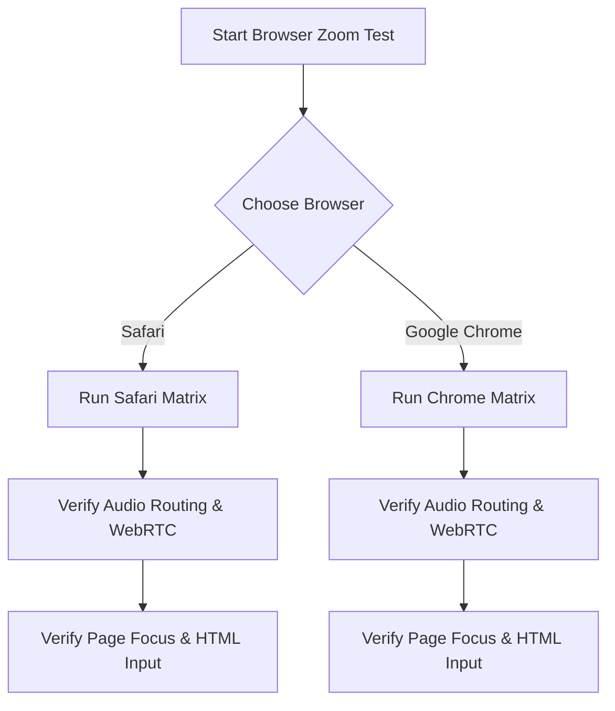

# Browser Zoom Compatibility Validation Protocol — DexDictate

This document specifies the official validation protocol to verify DexDictate's target-focus, audio capture, and recovery systems when the **Zoom Web / Browser-based Zoom Client** is actively running in standard macOS browsers.

> [!IMPORTANT]
> **COMPATIBILITY CLAIM STATUS:** Browser Zoom compatibility is **NOT** claimed until the manual verification matrix defined in this protocol is completed and fully signed off in both Safari and Google Chrome.
>
> **NOT IN SCOPE:** The native Zoom desktop application (`us.zoom.xos`), native floating controls, and native desktop app-specific routing are out of scope for this validation target.

---

## Baseline Stabilization Infrastructure (Commits Pushed)
All testing must assume the presence of the following pushed commits:
1. **`415ec654`**: Pre-paste frontmost target activation and revalidation to prevent clipboard clobbering if the focus transitions during the injection window.
2. **`3f36b14d`**: SURFACING CoreAudio device stall diagnostics (NSError code `-10868` / `kAudioOutputUnitErr_InvalidDevice`) with manual recovery instruction in UI notices and diagnostics logs.
3. **`470c9e9c`**: Testability infrastructure providing microphonic-permission-free mock Float sample buffer ingestion paths (`injectMockSamples`).

---

## Validation Framing: Confirmed vs. Hypothesis

### CONFIRMED (Pushed Stabilization Baseline)
* DexDictate includes pre-paste target application and window revalidation.
* CoreAudio device stalls (error `-10868`) surface explicit troubleshooting and logging instructions.
* In-memory mock Float sample buffer injection facilitates Permission-free test runs.

### HYPOTHESIS (To Be Evaluated)
* Browser-based Zoom client active meetings might interfere with DexDictate via browser WebRTC microphone capture/exclusive locks.
* Page-level browser focus shifts, browser permission popups, active tab swapping, or iframe/Shadow DOM input contexts might disrupt text insertion.
* Screen-sharing permissions in-browser or macOS Mic Mode adjustments (Voice Isolation/Wide Spectrum) might interact with DexDictate's audio capture.

### NOT TARGETED
* Zoom native desktop app bundle (`us.zoom.xos`) event handling.
* Native Zoom app floating controls or native Zoom client menu components.

---

## Define Pass/Fail Criteria

### "Browser Zoom Compatible" means:
1. **Uninterrupted Ingestion**: DexDictate successfully captures dictation audio while a Browser Zoom meeting is active, or clearly reports failure/diagnostics. It never silently stalls.
2. **Target-Safe Insertion**: DexDictate inserts text strictly into the active text field. If browser tabs, windows, or app focus shifts before insertion completes, DexDictate safely aborts insertion to prevent text leaks.
3. **Clipboard Integrity**: Standard clipboard history is preserved, and secure/password fields are rejected.
4. **CoreAudio Resilience**: CoreAudio stalls surface specific guidance rather than hanging.

### "Not Browser Zoom Compatible" means:
1. **Silent Stalls**: DexDictate silently stops recording or fails to transcribe without diagnostic feedback.
2. **Target Mismatch**: Text is pasted into the wrong tab, background browser window, or incorrect input box.
3. **Clipboard Corruption**: Original clipboard contents are lost or overwritten permanently.
4. **Unregulated Insertion**: Sensitive secure inputs allow direct synthetic paste.

---

## Exact Evidence to Collect
1. **Browser**: Browser name (Safari / Chrome) and Version.
2. **URL Context**: Generic Zoom Web URL (e.g. `zoom.us/wc/join/...`) without logging private meeting IDs.
3. **Browser Permission**: Whether the browser has native macOS Microphone access.
4. **Web Client Computer Audio Status**: Whether the Zoom web meeting has successfully "Joined Computer Audio".
5. **Frontmost Focus State**: Active browser tab/window layout (frontmost or background).
6. **Target Input Context**: Zoom web chat box, search bar, external text editor (TextEdit/Notes), or standard HTML input element.
7. **Paste Aborted**: Whether pre-paste validation triggered an insertion abort.
8. **Clipboard Restored**: Yes/No.
9. **CoreAudio -10868**: Yes/No.
10. **Screen Sharing Active**: Yes/No.

---

## Browser Verification Matrix

The validation matrix must be executed across both **Safari** and **Google Chrome**.

### 1. Safari Verification Suite

#### Test Case S1: Safari + Zoom Web Meeting Not Joined to Audio
* **Focused Field**: External App (TextEdit) or Safari non-meeting tab search field.
* **Zoom Web State**: Active web meeting tab, "Join Audio" prompt is visible but computer audio has *not* been joined.
* **DexDictate Mode**: Auto-Paste enabled.
* **Expected Pass**: Audio captures successfully. Text inserts without errors.

#### Test Case S2: Safari + Zoom Web Meeting Joined to Computer Audio
* **Focused Field**: External App (TextEdit).
* **Zoom Web State**: Active web meeting tab, successfully joined computer audio using browser mic stream.
* **DexDictate Mode**: Auto-Paste enabled.
* **Expected Pass**: DexDictate captures audio concurrently with Safari's active mic stream without stalling. Text is typed cleanly into TextEdit.

#### Test Case S3: Safari + Zoom Web Meeting Muted
* **Focused Field**: External App (TextEdit).
* **Zoom Web State**: Muted inside the web client meeting controls.
* **Expected Pass**: Audio captures normally.

#### Test Case S4: Safari + Zoom Web Meeting Unmuted
* **Focused Field**: External App (TextEdit).
* **Zoom Web State**: Unmuted inside the web client meeting controls.
* **Expected Pass**: Audio captures normally.

#### Test Case S5: Safari + Zoom Web Chat Focused
* **Focused Field**: Chat text input box inside the web meeting frame.
* **Zoom Web State**: Active Web Meeting, Chat pane open.
* **Expected Pass**: Direct insertion or clipboard paste succeeds into the browser-hosted chat box.

#### Test Case S6: Safari + Non-Zoom Text Field Focused while Meeting runs in Background Tab
* **Focused Field**: Input text field in another open browser tab.
* **Zoom Web State**: Zoom web meeting runs actively in a background tab.
* **Expected Pass**: Text goes safely into the focused browser tab. If you click away to the background meeting tab, DexDictate aborts target paste.

---

### 2. Google Chrome Verification Suite

#### Test Case C1: Chrome + Zoom Web Meeting Not Joined to Audio
* **Focused Field**: External App (TextEdit) or Chrome non-meeting tab search field.
* **Zoom Web State**: Active web meeting tab, "Join Audio" prompt is visible but computer audio has *not* been joined.
* **Expected Pass**: Clean capture and text insertion.

#### Test Case C2: Chrome + Zoom Web Meeting Joined to Computer Audio
* **Focused Field**: External App (TextEdit).
* **Zoom Web State**: Active web meeting tab, successfully joined computer audio using Chrome's WebRTC mic stream.
* **Expected Pass**: Concurrent audio ingestion passes without silent failures.

#### Test Case C3: Chrome + Zoom Web Meeting Muted
* **Focused Field**: External App (TextEdit).
* **Zoom Web State**: Muted inside the Web Zoom client.
* **Expected Pass**: Audio captures normally.

#### Test Case C4: Chrome + Zoom Web Meeting Unmuted
* **Focused Field**: External App (TextEdit).
* **Zoom Web State**: Unmuted inside the Web Zoom client.
* **Expected Pass**: Ingestion and transcription insert normally.

#### Test Case C5: Chrome + Zoom Web Chat Focused
* **Focused Field**: Chat text input box inside the Chrome Web Meeting frame.
* **Expected Pass**: Direct insertion or fallback clipboard paste types text directly into browser Chat pane.

#### Test Case C6: Chrome + Non-Zoom Text Field Focused while Meeting runs in Background Tab
* **Focused Field**: Input text field in another open Chrome tab.
* **Zoom Web State**: Zoom web meeting runs actively in a background Chrome tab.
* **Expected Pass**: Text delivers only to the active focused tab; aborts safely if tab focus shifts.

---

### 3. Cross-Browser Focus and System Transition Suites

#### Test Case CB1: Browser Permission Prompt Visible
* **Focused Field**: Browser-based HTML input.
* **Action**: Trigger dictation while a browser permission request modal (e.g. "Allow zoom.us to use your microphone?") is currently active on screen.
* **Expected Pass**: DexDictate handles the focus overlap gracefully. If focus shifts to the system permission modal, paste aborts or copies safely without breaking.

#### Test Case CB2: Browser Tab Loses Focus During Dictation
* **Focused Field**: Standard text input inside Safari/Chrome.
* **Action**: Focus browser input -> Start dictation -> Switch active tab or close browser window -> End dictation.
* **Expected Pass**: DexDictate detects the tab/window focus mismatch and aborts paste to prevent text leakage.

#### Test Case CB3: Zoom Web Meeting in Separate Browser Window
* **Focused Field**: Standard TextEdit editor.
* **Zoom Web State**: Web meeting runs actively in a completely separate Safari or Chrome window.
* **Expected Pass**: Dictation captures and pastes into TextEdit.

#### Test Case CB4: Browser Screen Sharing Active (If Available)
* **Focused Field**: TextEdit.
* **Zoom Web State**: Web client screen sharing is active in Chrome/Safari.
* **Expected Pass**: Ingestion and target focus validation work seamlessly during screen-sharing streams.

#### Test Case CB5: macOS Mic Mode Interaction
* **Focused Field**: TextEdit.
* **macOS State**: Standard / Voice Isolation / Wide Spectrum toggled in the system Control Center.
* **Expected Pass**: System-level DSP changes do not freeze DexDictate's AVAudioEngine tap pipeline.

#### Test Case CB6: Switch Microphone while Browser Zoom Meeting is Active
* **Action**: Connect a Bluetooth/USB headset during an active browser meeting, routing the web meeting and DexDictate to the new hardware.
* **Expected Pass**: CoreAudio configuration change recovery succeeds dynamically.

#### Test Case CB7: Secure / Password Field Focused in Browser
* **Focused Field**: HTML `<input type="password">` inside Safari/Chrome.
* **Zoom Web State**: Active web meeting in background.
* **Expected Pass**: Sensitive input is detected. Keystroke simulation is blocked. Fallback secure clipboard copy is used instead.

#### Test Case CB8: Long Dictation into Browser Text Fields
* **Focused Field**: Rich-text textarea in Safari/Chrome.
* **Action**: Continuously dictate for 30+ seconds.
* **Expected Pass**: Continuous buffer ingestion does not stall or buffer-overflow.

#### Test Case CB9: Long Dictation into TextEdit while Zoom Web Meeting Runs
* **Focused Field**: TextEdit.
* **Expected Pass**: Continuous ingestion remains highly stable.

---

## Sign-off Matrix

| Test ID | Browser & Version | Mic Route | Paste Aborted? | CoreAudio -10868? | Status (Pass / Fail) | Tester & Date |
| :--- | :--- | :--- | :--- | :--- | :--- | :--- |
| **S1** | | | | | | |
| **S2** | | | | | | |
| **S3** | | | | | | |
| **S4** | | | | | | |
| **S5** | | | | | | |
| **S6** | | | | | | |
| **C1** | | | | | | |
| **C2** | | | | | | |
| **C3** | | | | | | |
| **C4** | | | | | | |
| **C5** | | | | | | |
| **C6** | | | | | | |
| **CB1**| | | | | | |
| **CB2**| | | | | | |
| **CB3**| | | | | | |
| **CB4**| | | | | | |
| **CB5**| | | | | | |
| **CB6**| | | | | | |
| **CB7**| | | | | | |
| **CB8**| | | | | | |
| **CB9**| | | | | | |
